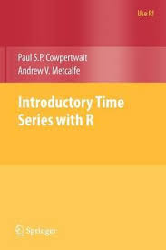
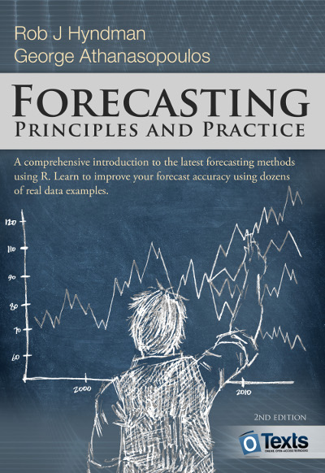
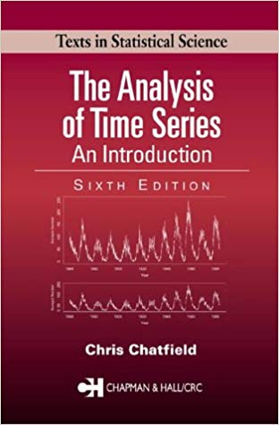

<!DOCTYPE html>
<html lang="en">
  <head>
    <meta charset="utf-8">
  <link rel="dns-prefetch" href="https://github.githubassets.com">
  <link rel="dns-prefetch" href="https://avatars0.githubusercontent.com">
  <link rel="dns-prefetch" href="https://avatars1.githubusercontent.com">
  <link rel="dns-prefetch" href="https://avatars2.githubusercontent.com">
  <link rel="dns-prefetch" href="https://avatars3.githubusercontent.com">
  <link rel="dns-prefetch" href="https://github-cloud.s3.amazonaws.com">
  <link rel="dns-prefetch" href="https://user-images.githubusercontent.com/">


  <link crossorigin="anonymous" media="all" integrity="sha512-pWLt6abkYhNeAHaDrPVG0yXCtIGRuCkwSUqQpsyN6smAIpIt+Iuq2IZKmoH9l3Cy/9ZnjvVrFZnvFFjGiqE3EA==" rel="stylesheet" href="https://github.githubassets.com/assets/frameworks-a3b8a10d4a9e37a78f033ef4a4f525f5.css" />
  <link crossorigin="anonymous" media="all" integrity="sha512-2PFlrbxeLLXRfrOPSS0oTXJGnnaCdDq7Ry3S+NcBPI8AprqUwCdnQK/7r4GAGf29cXbjURnUutP58V9O0/xE7w==" rel="stylesheet" href="https://github.githubassets.com/assets/github-507d3a1815bf6d6fbda5797e4a2be57a.css" />
  
  
  
  
  

  <meta name="viewport" content="width=device-width">
  
  <title>data_workshops/worksheet_timeseries.Rmd at master · kaybenleroll/data_workshops</title>
    <meta name="description" content="This repository contains all the files for the various workshops created as part of Dublin R - kaybenleroll/data_workshops">
    <link rel="search" type="application/opensearchdescription+xml" href="/opensearch.xml" title="GitHub">
  <link rel="fluid-icon" href="https://github.com/fluidicon.png" title="GitHub">
  <meta property="fb:app_id" content="1401488693436528">

    
    <meta property="og:image" content="https://avatars0.githubusercontent.com/u/842296?s=400&amp;v=4" /><meta property="og:site_name" content="GitHub" /><meta property="og:type" content="object" /><meta property="og:title" content="kaybenleroll/data_workshops" /><meta property="og:url" content="https://github.com/kaybenleroll/data_workshops" /><meta property="og:description" content="This repository contains all the files for the various workshops created as part of Dublin R - kaybenleroll/data_workshops" />

  <link rel="assets" href="https://github.githubassets.com/">
  <link rel="web-socket" href="wss://live.github.com/_sockets/VjI6MzE5NjE2OTE0OjcwNGM4YmQzYjcyNWEwNTA4MDYyY2Q2NmRiMTE1NjNjZjllM2M2Njg2NWY1MDhiNWM2MGQ5NDM4NzVjNGU4ZWE=--8ad4f27cf4c5cd3a13b38608ee897c4b9fab4b02">
  <meta name="pjax-timeout" content="1000">
  <link rel="sudo-modal" href="/sessions/sudo_modal">
  <meta name="request-id" content="29FC:12887:2242F9:35FC2D:5C63692C" data-pjax-transient>


  

  <meta name="selected-link" value="repo_source" data-pjax-transient>

      <meta name="google-site-verification" content="KT5gs8h0wvaagLKAVWq8bbeNwnZZK1r1XQysX3xurLU">
    <meta name="google-site-verification" content="ZzhVyEFwb7w3e0-uOTltm8Jsck2F5StVihD0exw2fsA">
    <meta name="google-site-verification" content="GXs5KoUUkNCoaAZn7wPN-t01Pywp9M3sEjnt_3_ZWPc">

  <meta name="octolytics-host" content="collector.githubapp.com" /><meta name="octolytics-app-id" content="github" /><meta name="octolytics-event-url" content="https://collector.githubapp.com/github-external/browser_event" /><meta name="octolytics-dimension-request_id" content="29FC:12887:2242F9:35FC2D:5C63692C" /><meta name="octolytics-dimension-region_edge" content="ams" /><meta name="octolytics-dimension-region_render" content="iad" /><meta name="octolytics-actor-id" content="19614289" /><meta name="octolytics-actor-login" content="yashkarle" /><meta name="octolytics-actor-hash" content="2478e9b316f8eda0b41edb3b6fb2336485fbe82a8ad1ef7a3fc2f8c9009d5482" />
<meta name="analytics-location" content="/&lt;user-name&gt;/&lt;repo-name&gt;/blob/show" data-pjax-transient="true" />


    <meta name="google-analytics" content="UA-3769691-2">

  <meta class="js-ga-set" name="userId" content="98640b77008b7b902d8ada1d823b45ab">

<meta class="js-ga-set" name="dimension1" content="Logged In">


  

      <meta name="hostname" content="github.com">
    <meta name="user-login" content="yashkarle">

      <meta name="expected-hostname" content="github.com">
    <meta name="js-proxy-site-detection-payload" content="ZmMwMDgxYjVmNTYzMzJiMmE5NzU0YTJiN2RkZjAxNmU1OWM3MWUwZGJmMjg0ODRlNmZkNmU1NWFjMjlhMjdjNHx7InJlbW90ZV9hZGRyZXNzIjoiMzcuMjI4LjI0My4yNDMiLCJyZXF1ZXN0X2lkIjoiMjlGQzoxMjg4NzoyMjQyRjk6MzVGQzJEOjVDNjM2OTJDIiwidGltZXN0YW1wIjoxNTUwMDE4ODY1LCJob3N0IjoiZ2l0aHViLmNvbSJ9">

    <meta name="enabled-features" content="UNIVERSE_BANNER,MARKETPLACE_PLAN_RESTRICTION_EDITOR,NOTIFY_ON_BLOCK,RELATED_ISSUES,MARKETPLACE_BROWSING_V2,MARKETPLACE_INSIGHTS_V2">

  <meta name="html-safe-nonce" content="1f3aeeb6b79cb0eaa0a2bdc6a12709af874130bc">

  <meta http-equiv="x-pjax-version" content="4e740a23a1b8077dcd7c2d0eda41d4e0">
  

      <link href="https://github.com/kaybenleroll/data_workshops/commits/master.atom" rel="alternate" title="Recent Commits to data_workshops:master" type="application/atom+xml">

  <meta name="go-import" content="github.com/kaybenleroll/data_workshops git https://github.com/kaybenleroll/data_workshops.git">

  <meta name="octolytics-dimension-user_id" content="842296" /><meta name="octolytics-dimension-user_login" content="kaybenleroll" /><meta name="octolytics-dimension-repository_id" content="13498448" /><meta name="octolytics-dimension-repository_nwo" content="kaybenleroll/data_workshops" /><meta name="octolytics-dimension-repository_public" content="true" /><meta name="octolytics-dimension-repository_is_fork" content="false" /><meta name="octolytics-dimension-repository_network_root_id" content="13498448" /><meta name="octolytics-dimension-repository_network_root_nwo" content="kaybenleroll/data_workshops" /><meta name="octolytics-dimension-repository_explore_github_marketplace_ci_cta_shown" content="false" />


    <link rel="canonical" href="https://github.com/kaybenleroll/data_workshops/blob/master/ws_timeseries_201901/worksheet_timeseries.Rmd" data-pjax-transient>


  <meta name="browser-stats-url" content="https://api.github.com/_private/browser/stats">

  <meta name="browser-errors-url" content="https://api.github.com/_private/browser/errors">

  <link rel="mask-icon" href="https://github.githubassets.com/pinned-octocat.svg" color="#000000">
  <link rel="icon" type="image/x-icon" class="js-site-favicon" href="https://github.githubassets.com/favicon.ico">

<meta name="theme-color" content="#1e2327">


  <meta name="u2f-support" content="true">

  <link rel="manifest" href="/manifest.json" crossOrigin="use-credentials">

  </head>

  <body class="logged-in env-production emoji-size-boost page-blob">
    

  <div class="position-relative js-header-wrapper ">
    <a href="#start-of-content" tabindex="1" class="p-3 bg-blue text-white show-on-focus js-skip-to-content">Skip to content</a>
    <div id="js-pjax-loader-bar" class="pjax-loader-bar"><div class="progress"></div></div>

    
    
    


        
<header class="Header  f5" role="banner">
  <div class="d-flex flex-justify-between px-3 ">
    <div class="d-flex flex-justify-between ">
      <div class="">
        <a class="header-logo-invertocat" href="https://github.com/" data-hotkey="g d" aria-label="Homepage" data-ga-click="Header, go to dashboard, icon:logo">
  <svg height="32" class="octicon octicon-mark-github" viewBox="0 0 16 16" version="1.1" width="32" aria-hidden="true"><path fill-rule="evenodd" d="M8 0C3.58 0 0 3.58 0 8c0 3.54 2.29 6.53 5.47 7.59.4.07.55-.17.55-.38 0-.19-.01-.82-.01-1.49-2.01.37-2.53-.49-2.69-.94-.09-.23-.48-.94-.82-1.13-.28-.15-.68-.52-.01-.53.63-.01 1.08.58 1.23.82.72 1.21 1.87.87 2.33.66.07-.52.28-.87.51-1.07-1.78-.2-3.64-.89-3.64-3.95 0-.87.31-1.59.82-2.15-.08-.2-.36-1.02.08-2.12 0 0 .67-.21 2.2.82.64-.18 1.32-.27 2-.27.68 0 1.36.09 2 .27 1.53-1.04 2.2-.82 2.2-.82.44 1.1.16 1.92.08 2.12.51.56.82 1.27.82 2.15 0 3.07-1.87 3.75-3.65 3.95.29.25.54.73.54 1.48 0 1.07-.01 1.93-.01 2.2 0 .21.15.46.55.38A8.013 8.013 0 0 0 16 8c0-4.42-3.58-8-8-8z"/></svg>
</a>

      </div>

    </div>

    <div class="HeaderMenu d-flex flex-justify-between flex-auto">
      <nav class="d-flex" aria-label="Global">
            <div class="">
              <div class="header-search scoped-search site-scoped-search js-site-search position-relative js-jump-to"
  role="combobox"
  aria-owns="jump-to-results"
  aria-label="Search or jump to"
  aria-haspopup="listbox"
  aria-expanded="false"
>
  <div class="position-relative">
    <!-- '"` --><!-- </textarea></xmp> --></option></form><form class="js-site-search-form" data-scope-type="Repository" data-scope-id="13498448" data-scoped-search-url="/kaybenleroll/data_workshops/search" data-unscoped-search-url="/search" action="/kaybenleroll/data_workshops/search" accept-charset="UTF-8" method="get"><input name="utf8" type="hidden" value="&#x2713;" />
      <label class="form-control header-search-wrapper header-search-wrapper-jump-to position-relative d-flex flex-justify-between flex-items-center js-chromeless-input-container">
        <input type="text"
          class="form-control header-search-input jump-to-field js-jump-to-field js-site-search-focus js-site-search-field is-clearable"
          data-hotkey="s,/"
          name="q"
          value=""
          placeholder="Search or jump to…"
          data-unscoped-placeholder="Search or jump to…"
          data-scoped-placeholder="Search or jump to…"
          autocapitalize="off"
          aria-autocomplete="list"
          aria-controls="jump-to-results"
          aria-label="Search or jump to…"
          data-jump-to-suggestions-path="/_graphql/GetSuggestedNavigationDestinations#csrf-token=nHcQcnL7qCzu9P+1C39VXvv8kTWeYaRgXgEANXbK+g6suhpCjBWlyCfuy6CsBmtTsqVu5UFCt5n3RHPzq4EIAA=="
          spellcheck="false"
          autocomplete="off"
          >
          <input type="hidden" class="js-site-search-type-field" name="type" >
            

            <div class="Box position-absolute overflow-hidden d-none jump-to-suggestions js-jump-to-suggestions-container">
              
<ul class="d-none js-jump-to-suggestions-template-container">
  

<li class="d-flex flex-justify-start flex-items-center p-0 f5 navigation-item js-navigation-item js-jump-to-suggestion" role="option">
  <a tabindex="-1" class="no-underline d-flex flex-auto flex-items-center jump-to-suggestions-path js-jump-to-suggestion-path js-navigation-open p-2" href="">
    <div class="jump-to-octicon js-jump-to-octicon flex-shrink-0 mr-2 text-center d-none">
      <svg height="16" width="16" class="octicon octicon-repo flex-shrink-0 js-jump-to-octicon-repo d-none" title="Repository" aria-label="Repository" viewBox="0 0 12 16" version="1.1" role="img"><path fill-rule="evenodd" d="M4 9H3V8h1v1zm0-3H3v1h1V6zm0-2H3v1h1V4zm0-2H3v1h1V2zm8-1v12c0 .55-.45 1-1 1H6v2l-1.5-1.5L3 16v-2H1c-.55 0-1-.45-1-1V1c0-.55.45-1 1-1h10c.55 0 1 .45 1 1zm-1 10H1v2h2v-1h3v1h5v-2zm0-10H2v9h9V1z"/></svg>
      <svg height="16" width="16" class="octicon octicon-project flex-shrink-0 js-jump-to-octicon-project d-none" title="Project" aria-label="Project" viewBox="0 0 15 16" version="1.1" role="img"><path fill-rule="evenodd" d="M10 12h3V2h-3v10zm-4-2h3V2H6v8zm-4 4h3V2H2v12zm-1 1h13V1H1v14zM14 0H1a1 1 0 0 0-1 1v14a1 1 0 0 0 1 1h13a1 1 0 0 0 1-1V1a1 1 0 0 0-1-1z"/></svg>
      <svg height="16" width="16" class="octicon octicon-search flex-shrink-0 js-jump-to-octicon-search d-none" title="Search" aria-label="Search" viewBox="0 0 16 16" version="1.1" role="img"><path fill-rule="evenodd" d="M15.7 13.3l-3.81-3.83A5.93 5.93 0 0 0 13 6c0-3.31-2.69-6-6-6S1 2.69 1 6s2.69 6 6 6c1.3 0 2.48-.41 3.47-1.11l3.83 3.81c.19.2.45.3.7.3.25 0 .52-.09.7-.3a.996.996 0 0 0 0-1.41v.01zM7 10.7c-2.59 0-4.7-2.11-4.7-4.7 0-2.59 2.11-4.7 4.7-4.7 2.59 0 4.7 2.11 4.7 4.7 0 2.59-2.11 4.7-4.7 4.7z"/></svg>
    </div>

    

    <div class="jump-to-suggestion-name js-jump-to-suggestion-name flex-auto overflow-hidden text-left no-wrap css-truncate css-truncate-target">
    </div>

    <div class="border rounded-1 flex-shrink-0 bg-gray px-1 text-gray-light ml-1 f6 d-none js-jump-to-badge-search">
      <span class="js-jump-to-badge-search-text-default d-none" aria-label="in this repository">
        In this repository
      </span>
      <span class="js-jump-to-badge-search-text-global d-none" aria-label="in all of GitHub">
        All GitHub
      </span>
      <span aria-hidden="true" class="d-inline-block ml-1 v-align-middle">↵</span>
    </div>

    <div aria-hidden="true" class="border rounded-1 flex-shrink-0 bg-gray px-1 text-gray-light ml-1 f6 d-none d-on-nav-focus js-jump-to-badge-jump">
      Jump to
      <span class="d-inline-block ml-1 v-align-middle">↵</span>
    </div>
  </a>
</li>

</ul>

<ul class="d-none js-jump-to-no-results-template-container">
  <li class="d-flex flex-justify-center flex-items-center f5 d-none js-jump-to-suggestion p-2">
    <span class="text-gray">No suggested jump to results</span>
  </li>
</ul>

<ul id="jump-to-results" role="listbox" class="p-0 m-0 js-navigation-container jump-to-suggestions-results-container js-jump-to-suggestions-results-container">
  

<li class="d-flex flex-justify-start flex-items-center p-0 f5 navigation-item js-navigation-item js-jump-to-scoped-search d-none" role="option">
  <a tabindex="-1" class="no-underline d-flex flex-auto flex-items-center jump-to-suggestions-path js-jump-to-suggestion-path js-navigation-open p-2" href="">
    <div class="jump-to-octicon js-jump-to-octicon flex-shrink-0 mr-2 text-center d-none">
      <svg height="16" width="16" class="octicon octicon-repo flex-shrink-0 js-jump-to-octicon-repo d-none" title="Repository" aria-label="Repository" viewBox="0 0 12 16" version="1.1" role="img"><path fill-rule="evenodd" d="M4 9H3V8h1v1zm0-3H3v1h1V6zm0-2H3v1h1V4zm0-2H3v1h1V2zm8-1v12c0 .55-.45 1-1 1H6v2l-1.5-1.5L3 16v-2H1c-.55 0-1-.45-1-1V1c0-.55.45-1 1-1h10c.55 0 1 .45 1 1zm-1 10H1v2h2v-1h3v1h5v-2zm0-10H2v9h9V1z"/></svg>
      <svg height="16" width="16" class="octicon octicon-project flex-shrink-0 js-jump-to-octicon-project d-none" title="Project" aria-label="Project" viewBox="0 0 15 16" version="1.1" role="img"><path fill-rule="evenodd" d="M10 12h3V2h-3v10zm-4-2h3V2H6v8zm-4 4h3V2H2v12zm-1 1h13V1H1v14zM14 0H1a1 1 0 0 0-1 1v14a1 1 0 0 0 1 1h13a1 1 0 0 0 1-1V1a1 1 0 0 0-1-1z"/></svg>
      <svg height="16" width="16" class="octicon octicon-search flex-shrink-0 js-jump-to-octicon-search d-none" title="Search" aria-label="Search" viewBox="0 0 16 16" version="1.1" role="img"><path fill-rule="evenodd" d="M15.7 13.3l-3.81-3.83A5.93 5.93 0 0 0 13 6c0-3.31-2.69-6-6-6S1 2.69 1 6s2.69 6 6 6c1.3 0 2.48-.41 3.47-1.11l3.83 3.81c.19.2.45.3.7.3.25 0 .52-.09.7-.3a.996.996 0 0 0 0-1.41v.01zM7 10.7c-2.59 0-4.7-2.11-4.7-4.7 0-2.59 2.11-4.7 4.7-4.7 2.59 0 4.7 2.11 4.7 4.7 0 2.59-2.11 4.7-4.7 4.7z"/></svg>
    </div>

    

    <div class="jump-to-suggestion-name js-jump-to-suggestion-name flex-auto overflow-hidden text-left no-wrap css-truncate css-truncate-target">
    </div>

    <div class="border rounded-1 flex-shrink-0 bg-gray px-1 text-gray-light ml-1 f6 d-none js-jump-to-badge-search">
      <span class="js-jump-to-badge-search-text-default d-none" aria-label="in this repository">
        In this repository
      </span>
      <span class="js-jump-to-badge-search-text-global d-none" aria-label="in all of GitHub">
        All GitHub
      </span>
      <span aria-hidden="true" class="d-inline-block ml-1 v-align-middle">↵</span>
    </div>

    <div aria-hidden="true" class="border rounded-1 flex-shrink-0 bg-gray px-1 text-gray-light ml-1 f6 d-none d-on-nav-focus js-jump-to-badge-jump">
      Jump to
      <span class="d-inline-block ml-1 v-align-middle">↵</span>
    </div>
  </a>
</li>

  

<li class="d-flex flex-justify-start flex-items-center p-0 f5 navigation-item js-navigation-item js-jump-to-global-search d-none" role="option">
  <a tabindex="-1" class="no-underline d-flex flex-auto flex-items-center jump-to-suggestions-path js-jump-to-suggestion-path js-navigation-open p-2" href="">
    <div class="jump-to-octicon js-jump-to-octicon flex-shrink-0 mr-2 text-center d-none">
      <svg height="16" width="16" class="octicon octicon-repo flex-shrink-0 js-jump-to-octicon-repo d-none" title="Repository" aria-label="Repository" viewBox="0 0 12 16" version="1.1" role="img"><path fill-rule="evenodd" d="M4 9H3V8h1v1zm0-3H3v1h1V6zm0-2H3v1h1V4zm0-2H3v1h1V2zm8-1v12c0 .55-.45 1-1 1H6v2l-1.5-1.5L3 16v-2H1c-.55 0-1-.45-1-1V1c0-.55.45-1 1-1h10c.55 0 1 .45 1 1zm-1 10H1v2h2v-1h3v1h5v-2zm0-10H2v9h9V1z"/></svg>
      <svg height="16" width="16" class="octicon octicon-project flex-shrink-0 js-jump-to-octicon-project d-none" title="Project" aria-label="Project" viewBox="0 0 15 16" version="1.1" role="img"><path fill-rule="evenodd" d="M10 12h3V2h-3v10zm-4-2h3V2H6v8zm-4 4h3V2H2v12zm-1 1h13V1H1v14zM14 0H1a1 1 0 0 0-1 1v14a1 1 0 0 0 1 1h13a1 1 0 0 0 1-1V1a1 1 0 0 0-1-1z"/></svg>
      <svg height="16" width="16" class="octicon octicon-search flex-shrink-0 js-jump-to-octicon-search d-none" title="Search" aria-label="Search" viewBox="0 0 16 16" version="1.1" role="img"><path fill-rule="evenodd" d="M15.7 13.3l-3.81-3.83A5.93 5.93 0 0 0 13 6c0-3.31-2.69-6-6-6S1 2.69 1 6s2.69 6 6 6c1.3 0 2.48-.41 3.47-1.11l3.83 3.81c.19.2.45.3.7.3.25 0 .52-.09.7-.3a.996.996 0 0 0 0-1.41v.01zM7 10.7c-2.59 0-4.7-2.11-4.7-4.7 0-2.59 2.11-4.7 4.7-4.7 2.59 0 4.7 2.11 4.7 4.7 0 2.59-2.11 4.7-4.7 4.7z"/></svg>
    </div>

    

    <div class="jump-to-suggestion-name js-jump-to-suggestion-name flex-auto overflow-hidden text-left no-wrap css-truncate css-truncate-target">
    </div>

    <div class="border rounded-1 flex-shrink-0 bg-gray px-1 text-gray-light ml-1 f6 d-none js-jump-to-badge-search">
      <span class="js-jump-to-badge-search-text-default d-none" aria-label="in this repository">
        In this repository
      </span>
      <span class="js-jump-to-badge-search-text-global d-none" aria-label="in all of GitHub">
        All GitHub
      </span>
      <span aria-hidden="true" class="d-inline-block ml-1 v-align-middle">↵</span>
    </div>

    <div aria-hidden="true" class="border rounded-1 flex-shrink-0 bg-gray px-1 text-gray-light ml-1 f6 d-none d-on-nav-focus js-jump-to-badge-jump">
      Jump to
      <span class="d-inline-block ml-1 v-align-middle">↵</span>
    </div>
  </a>
</li>


    <li class="d-flex flex-justify-center flex-items-center p-0 f5 js-jump-to-suggestion">
      
    </li>
</ul>

            </div>
      </label>
</form>  </div>
</div>

            </div>

          <ul class="d-flex pl-2 flex-items-center text-bold list-style-none">
            <li>
              <a class="js-selected-navigation-item HeaderNavlink px-2" data-hotkey="g p" data-ga-click="Header, click, Nav menu - item:pulls context:user" aria-label="Pull requests you created" data-selected-links="/pulls /pulls/assigned /pulls/mentioned /pulls" href="/pulls">
                Pull requests
</a>            </li>
            <li>
              <a class="js-selected-navigation-item HeaderNavlink px-2" data-hotkey="g i" data-ga-click="Header, click, Nav menu - item:issues context:user" aria-label="Issues you created" data-selected-links="/issues /issues/assigned /issues/mentioned /issues" href="/issues">
                Issues
</a>            </li>
              <li class="position-relative">
                <a class="js-selected-navigation-item HeaderNavlink px-2" data-ga-click="Header, click, Nav menu - item:marketplace context:user" data-octo-click="marketplace_click" data-octo-dimensions="location:nav_bar" data-selected-links=" /marketplace" href="/marketplace">
                   Marketplace
</a>                  
              </li>
            <li>
              <a class="js-selected-navigation-item HeaderNavlink px-2" data-ga-click="Header, click, Nav menu - item:explore" data-selected-links="/explore /trending /trending/developers /integrations /integrations/feature/code /integrations/feature/collaborate /integrations/feature/ship showcases showcases_search showcases_landing /explore" href="/explore">
                Explore
</a>            </li>
          </ul>
      </nav>

      <div class="d-flex">
        
<ul class="user-nav d-flex flex-items-center list-style-none" id="user-links">
  <li class="dropdown">
    <span class="d-inline-block  px-2">
      
    <a aria-label="You have no unread notifications" class="notification-indicator tooltipped tooltipped-s  js-socket-channel js-notification-indicator" data-hotkey="g n" data-ga-click="Header, go to notifications, icon:read" data-channel="notification-changed:19614289" href="/notifications">
        <span class="mail-status "></span>
        <svg class="octicon octicon-bell" viewBox="0 0 14 16" version="1.1" width="14" height="16" aria-hidden="true"><path fill-rule="evenodd" d="M14 12v1H0v-1l.73-.58c.77-.77.81-2.55 1.19-4.42C2.69 3.23 6 2 6 2c0-.55.45-1 1-1s1 .45 1 1c0 0 3.39 1.23 4.16 5 .38 1.88.42 3.66 1.19 4.42l.66.58H14zm-7 4c1.11 0 2-.89 2-2H5c0 1.11.89 2 2 2z"/></svg>
</a>
    </span>
  </li>

  <li class="dropdown">
    <details class="details-overlay details-reset d-flex px-2 flex-items-center">
      <summary class="HeaderNavlink"
         aria-label="Create new…"
         data-ga-click="Header, create new, icon:add">
        <svg class="octicon octicon-plus float-left mr-1 mt-1" viewBox="0 0 12 16" version="1.1" width="12" height="16" aria-hidden="true"><path fill-rule="evenodd" d="M12 9H7v5H5V9H0V7h5V2h2v5h5v2z"/></svg>
        <span class="dropdown-caret mt-1"></span>
      </summary>
      <details-menu class="dropdown-menu dropdown-menu-sw">
        
<a role="menuitem" class="dropdown-item" href="/new" data-ga-click="Header, create new repository">
  New repository
</a>

  <a role="menuitem" class="dropdown-item" href="/new/import" data-ga-click="Header, import a repository">
    Import repository
  </a>

<a role="menuitem" class="dropdown-item" href="https://gist.github.com/" data-ga-click="Header, create new gist">
  New gist
</a>

  <a role="menuitem" class="dropdown-item" href="/organizations/new" data-ga-click="Header, create new organization">
    New organization
  </a>


  <div class="dropdown-divider"></div>
  <div class="dropdown-header">
    <span title="kaybenleroll/data_workshops">This repository</span>
  </div>
    <a role="menuitem" class="dropdown-item" href="/kaybenleroll/data_workshops/issues/new" data-ga-click="Header, create new issue">
      New issue
    </a>


      </details-menu>
    </details>
  </li>

  <li class="dropdown">

    <details class="details-overlay details-reset d-flex pl-2 flex-items-center">
      <summary class="HeaderNavlink name mt-1"
        aria-label="View profile and more"
        data-ga-click="Header, show menu, icon:avatar">
        
        <span class="dropdown-caret"></span>
      </summary>
      <details-menu class="dropdown-menu dropdown-menu-sw">
        <div class="header-nav-current-user css-truncate"><a role="menuitem" class="no-underline user-profile-link px-3 pt-2 pb-2 mb-n2 mt-n1 d-block" href="/yashkarle" data-ga-click="Header, go to profile, text:Signed in as">Signed in as <strong class="css-truncate-target">yashkarle</strong></a></div>
        <div role="none" class="dropdown-divider"></div>

        <div class="px-3 f6 user-status-container js-user-status-context pb-1" data-url="/users/status?compact=1&amp;link_mentions=0&amp;truncate=1">
          
<div class="js-user-status-container user-status-compact" data-team-hovercards-enabled>
  <details class="js-user-status-details details-reset details-overlay details-overlay-dark">
    <summary class="btn-link no-underline js-toggle-user-status-edit toggle-user-status-edit width-full" aria-haspopup="dialog" role="menuitem" data-hydro-click="{&quot;event_type&quot;:&quot;user_profile.click&quot;,&quot;payload&quot;:{&quot;profile_user_id&quot;:842296,&quot;target&quot;:&quot;EDIT_USER_STATUS&quot;,&quot;user_id&quot;:19614289,&quot;client_id&quot;:&quot;1421145531.1536311381&quot;,&quot;originating_request_id&quot;:&quot;29FC:12887:2242F9:35FC2D:5C63692C&quot;,&quot;originating_url&quot;:&quot;https://github.com/kaybenleroll/data_workshops/blob/master/ws_timeseries_201901/worksheet_timeseries.Rmd&quot;}}" data-hydro-click-hmac="8be3877db7f4b67f0b4ee8ce250cdc5967ef4fff3a0445e846d725eda4408427">
      <div class="f6 d-inline-block v-align-middle  user-status-emoji-only-header  circle lh-condensed user-status-header " style="max-width: 29px">
        <div class="user-status-emoji-container flex-shrink-0 mr-1">
          <div><g-emoji class="g-emoji" alias="house" fallback-src="https://github.githubassets.com/images/icons/emoji/unicode/1f3e0.png">🏠</g-emoji></div>
        </div>
      </div>
      <div class="d-inline-block v-align-middle user-status-message-wrapper f6 lh-condensed ws-normal pt-1">
            Working from home
      </div>
</summary>    <details-dialog class="details-dialog rounded-1 anim-fade-in fast Box Box--overlay" role="dialog" tabindex="-1">
      <!-- '"` --><!-- </textarea></xmp> --></option></form><form class="position-relative flex-auto js-user-status-form" action="/users/status?compact=1&amp;link_mentions=0&amp;truncate=1" accept-charset="UTF-8" method="post"><input name="utf8" type="hidden" value="&#x2713;" /><input type="hidden" name="_method" value="put" /><input type="hidden" name="authenticity_token" value="UsXIKJ4zENBvAGsajElGLQ9zm/1pvxnkTfzAJcJAvPO3Y1GpNGwxizoN7PIDEjd9xxjkG3EPOEqvzEqjJILkZQ==" />
        <div class="Box-header bg-gray border-bottom p-3">
          <button class="Box-btn-octicon js-toggle-user-status-edit btn-octicon float-right" type="reset" aria-label="Close dialog" data-close-dialog>
            <svg class="octicon octicon-x" viewBox="0 0 12 16" version="1.1" width="12" height="16" aria-hidden="true"><path fill-rule="evenodd" d="M7.48 8l3.75 3.75-1.48 1.48L6 9.48l-3.75 3.75-1.48-1.48L4.52 8 .77 4.25l1.48-1.48L6 6.52l3.75-3.75 1.48 1.48L7.48 8z"/></svg>
          </button>
          <h3 class="Box-title f5 text-bold text-gray-dark">Edit status</h3>
        </div>
        <input type="hidden" name="emoji" class="js-user-status-emoji-field" value=":house:">
        <input type="hidden" name="organization_id" class="js-user-status-org-id-field" value="">
        <div class="px-3 py-2 text-gray-dark">
          <div class="js-characters-remaining-container js-suggester-container position-relative mt-2">
            <div class="input-group d-table form-group my-0 js-user-status-form-group">
              <span class="input-group-button d-table-cell v-align-middle" style="width: 1%">
                <button type="button" aria-label="Choose an emoji" class="btn-outline btn js-toggle-user-status-emoji-picker bg-white btn-open-emoji-picker">
                  <span class="js-user-status-original-emoji" hidden><div><g-emoji class="g-emoji" alias="house" fallback-src="https://github.githubassets.com/images/icons/emoji/unicode/1f3e0.png">🏠</g-emoji></div></span>
                  <span class="js-user-status-custom-emoji"><div><g-emoji class="g-emoji" alias="house" fallback-src="https://github.githubassets.com/images/icons/emoji/unicode/1f3e0.png">🏠</g-emoji></div></span>
                  <span class="js-user-status-no-emoji-icon" hidden>
                    <svg class="octicon octicon-smiley" viewBox="0 0 16 16" version="1.1" width="16" height="16" aria-hidden="true"><path fill-rule="evenodd" d="M8 0C3.58 0 0 3.58 0 8s3.58 8 8 8 8-3.58 8-8-3.58-8-8-8zm4.81 12.81a6.72 6.72 0 0 1-2.17 1.45c-.83.36-1.72.53-2.64.53-.92 0-1.81-.17-2.64-.53-.81-.34-1.55-.83-2.17-1.45a6.773 6.773 0 0 1-1.45-2.17A6.59 6.59 0 0 1 1.21 8c0-.92.17-1.81.53-2.64.34-.81.83-1.55 1.45-2.17.62-.62 1.36-1.11 2.17-1.45A6.59 6.59 0 0 1 8 1.21c.92 0 1.81.17 2.64.53.81.34 1.55.83 2.17 1.45.62.62 1.11 1.36 1.45 2.17.36.83.53 1.72.53 2.64 0 .92-.17 1.81-.53 2.64-.34.81-.83 1.55-1.45 2.17zM4 6.8v-.59c0-.66.53-1.19 1.2-1.19h.59c.66 0 1.19.53 1.19 1.19v.59c0 .67-.53 1.2-1.19 1.2H5.2C4.53 8 4 7.47 4 6.8zm5 0v-.59c0-.66.53-1.19 1.2-1.19h.59c.66 0 1.19.53 1.19 1.19v.59c0 .67-.53 1.2-1.19 1.2h-.59C9.53 8 9 7.47 9 6.8zm4 3.2c-.72 1.88-2.91 3-5 3s-4.28-1.13-5-3c-.14-.39.23-1 .66-1h8.59c.41 0 .89.61.75 1z"/></svg>
                  </span>
                </button>
              </span>
              <input type="text" autocomplete="off" autofocus data-maxlength="80" class="js-suggester-field d-table-cell width-full form-control js-user-status-message-field js-characters-remaining-field" placeholder="What's happening?" name="message" required value="Working from home" aria-label="What is your current status?">
              <div class="error">Could not update your status, please try again.</div>
            </div>
            <div class="suggester-container">
              <div class="suggester js-suggester js-navigation-container" data-url="/autocomplete/user-suggestions" data-no-org-url="/autocomplete/user-suggestions" data-org-url="/suggestions" hidden>
              </div>
            </div>
            <div style="margin-left: 53px" class="my-1 text-small label-characters-remaining js-characters-remaining" data-suffix="remaining" hidden>
              80 remaining
            </div>
          </div>
          <include-fragment class="js-user-status-emoji-picker" data-url="/users/status/emoji"></include-fragment>
          <div class="overflow-auto" style="max-height: 33vh">
            <div class="user-status-suggestions js-user-status-suggestions" hidden>
              <h4 class="f6 text-normal my-3">Suggestions:</h4>
              <div class="mx-3 mt-2 clearfix">
                  <div class="float-left col-6">
                      <button type="button" value=":palm_tree:" class="d-flex flex-items-baseline flex-items-stretch lh-condensed f6 btn-link link-gray no-underline js-predefined-user-status mb-1">
                        <div class="emoji-status-width mr-2 v-align-middle js-predefined-user-status-emoji">
                          <g-emoji alias="palm_tree" fallback-src="https://github.githubassets.com/images/icons/emoji/unicode/1f334.png">🌴</g-emoji>
                        </div>
                        <div class="d-flex flex-items-center no-underline js-predefined-user-status-message" style="border-left: 1px solid transparent">
                          On vacation
                        </div>
                      </button>
                      <button type="button" value=":face_with_thermometer:" class="d-flex flex-items-baseline flex-items-stretch lh-condensed f6 btn-link link-gray no-underline js-predefined-user-status mb-1">
                        <div class="emoji-status-width mr-2 v-align-middle js-predefined-user-status-emoji">
                          <g-emoji alias="face_with_thermometer" fallback-src="https://github.githubassets.com/images/icons/emoji/unicode/1f912.png">🤒</g-emoji>
                        </div>
                        <div class="d-flex flex-items-center no-underline js-predefined-user-status-message" style="border-left: 1px solid transparent">
                          Out sick
                        </div>
                      </button>
                  </div>
                  <div class="float-left col-6">
                      <button type="button" value=":house:" class="d-flex flex-items-baseline flex-items-stretch lh-condensed f6 btn-link link-gray no-underline js-predefined-user-status mb-1">
                        <div class="emoji-status-width mr-2 v-align-middle js-predefined-user-status-emoji">
                          <g-emoji alias="house" fallback-src="https://github.githubassets.com/images/icons/emoji/unicode/1f3e0.png">🏠</g-emoji>
                        </div>
                        <div class="d-flex flex-items-center no-underline js-predefined-user-status-message" style="border-left: 1px solid transparent">
                          Working from home
                        </div>
                      </button>
                      <button type="button" value=":dart:" class="d-flex flex-items-baseline flex-items-stretch lh-condensed f6 btn-link link-gray no-underline js-predefined-user-status mb-1">
                        <div class="emoji-status-width mr-2 v-align-middle js-predefined-user-status-emoji">
                          <g-emoji alias="dart" fallback-src="https://github.githubassets.com/images/icons/emoji/unicode/1f3af.png">🎯</g-emoji>
                        </div>
                        <div class="d-flex flex-items-center no-underline js-predefined-user-status-message" style="border-left: 1px solid transparent">
                          Focusing
                        </div>
                      </button>
                  </div>
              </div>
            </div>
            <div class="user-status-limited-availability-container">
              <div class="form-checkbox my-0">
                <input type="checkbox" name="limited_availability" value="1" class="js-user-status-limited-availability-checkbox" data-default-message="I may be slow to respond." aria-describedby="limited-availability-help-text-truncate-true" id="limited-availability-truncate-true">
                <label class="d-block f5 text-gray-dark mb-1" for="limited-availability-truncate-true">
                  Busy
                </label>
                <p class="note" id="limited-availability-help-text-truncate-true">
                  When others mention you, assign you, or request your review,
                  GitHub will let them know that you have limited availability.
                </p>
              </div>
            </div>
          </div>
          <include-fragment class="js-user-status-org-picker" data-url="/users/status/organizations"></include-fragment>
        </div>
        <div class="d-flex flex-items-center flex-justify-between p-3 border-top">
          <button type="submit"  class="width-full btn btn-primary mr-2 js-user-status-submit">
            Set status
          </button>
          <button type="button"  class="width-full js-clear-user-status-button btn ml-2 js-user-status-exists">
            Clear status
          </button>
        </div>
</form>    </details-dialog>
  </details>
</div>

        </div>
        <div role="none" class="dropdown-divider"></div>

        <a role="menuitem" class="dropdown-item" href="/yashkarle" data-ga-click="Header, go to profile, text:your profile">Your profile</a>
        <a role="menuitem" class="dropdown-item" href="/yashkarle?tab=repositories" data-ga-click="Header, go to repositories, text:your repositories">Your repositories</a>

        <a role="menuitem" class="dropdown-item" href="/yashkarle?tab=projects" data-ga-click="Header, go to projects, text:your projects">Your projects</a>

        <a role="menuitem" class="dropdown-item" href="/yashkarle?tab=stars" data-ga-click="Header, go to starred repos, text:your stars">Your stars</a>
          <a role="menuitem" class="dropdown-item" href="https://gist.github.com/" data-ga-click="Header, your gists, text:your gists">Your gists</a>

        <div role="none" class="dropdown-divider"></div>
        <a role="menuitem" class="dropdown-item" href="https://help.github.com" data-ga-click="Header, go to help, text:help">Help</a>
        <a role="menuitem" class="dropdown-item" href="/settings/profile" data-ga-click="Header, go to settings, icon:settings">Settings</a>
        <!-- '"` --><!-- </textarea></xmp> --></option></form><form class="logout-form" action="/logout" accept-charset="UTF-8" method="post"><input name="utf8" type="hidden" value="&#x2713;" /><input type="hidden" name="authenticity_token" value="qdsJGVyVUdXPp5t4/eMPuuQi9IIDVKafqfhaMwsfj1c/hygEVwELpw1sXTu/dUS9F73KqpnCwiVrvyP5YPpSaw==" />
          
          <button type="submit" class="dropdown-item dropdown-signout" data-ga-click="Header, sign out, icon:logout" role="menuitem">
            Sign out
          </button>
</form>      </details-menu>
    </details>
  </li>
</ul>


        <!-- '"` --><!-- </textarea></xmp> --></option></form><form class="sr-only right-0" action="/logout" accept-charset="UTF-8" method="post"><input name="utf8" type="hidden" value="&#x2713;" /><input type="hidden" name="authenticity_token" value="AI5gHL8FF7lhuxHPrB2wXkylow5WBpi+UfxWYC9bRdiW0kEBtJFNy6Nw14zui/tZvzqdJsyQ/ASTuy+qRL6Y5A==" />
          <button type="submit" class="dropdown-item dropdown-signout" data-ga-click="Header, sign out, icon:logout">
            Sign out
          </button>
</form>      </div>
    </div>
  </div>
</header>

      

  </div>

  <div id="start-of-content" class="show-on-focus"></div>

    <div id="js-flash-container">

</div>


  <div role="main" class="application-main " data-commit-hovercards-enabled>
        <div itemscope itemtype="http://schema.org/SoftwareSourceCode" class="">
    <div id="js-repo-pjax-container" data-pjax-container >
      


  


  <div class="pagehead repohead instapaper_ignore readability-menu experiment-repo-nav  ">
    <div class="repohead-details-container clearfix container">

      <ul class="pagehead-actions">

  <li>
        <!-- '"` --><!-- </textarea></xmp> --></option></form><form data-remote="true" class="js-social-form js-social-container" action="/notifications/subscribe" accept-charset="UTF-8" method="post"><input name="utf8" type="hidden" value="&#x2713;" /><input type="hidden" name="authenticity_token" value="uSxQcRwZLa7UbqXy4quufOmxQowNf7LVhBh4FMnOMbMhPPOArixHYDG/xxqpb5oJ2tigRJJf68h6plXU8wKIEQ==" />      <input type="hidden" name="repository_id" id="repository_id" value="13498448" class="form-control" />

      <details class="details-reset details-overlay select-menu float-left">
        <summary class="btn btn-sm btn-with-count select-menu-button" data-ga-click="Repository, click Watch settings, action:blob#show">
          <span data-menu-button>
              <svg class="octicon octicon-eye v-align-text-bottom" viewBox="0 0 16 16" version="1.1" width="16" height="16" aria-hidden="true"><path fill-rule="evenodd" d="M8.06 2C3 2 0 8 0 8s3 6 8.06 6C13 14 16 8 16 8s-3-6-7.94-6zM8 12c-2.2 0-4-1.78-4-4 0-2.2 1.8-4 4-4 2.22 0 4 1.8 4 4 0 2.22-1.78 4-4 4zm2-4c0 1.11-.89 2-2 2-1.11 0-2-.89-2-2 0-1.11.89-2 2-2 1.11 0 2 .89 2 2z"/></svg>
              Watch
          </span>
        </summary>
        <details-menu class="select-menu-modal position-absolute mt-5" style="z-index: 99;">
          <div class="select-menu-header">
            <span class="select-menu-title">Notifications</span>
          </div>
          <div class="select-menu-list">
            <button type="submit" name="do" value="included" class="select-menu-item width-full" aria-checked="true" role="menuitemradio">
              <svg class="octicon octicon-check select-menu-item-icon" viewBox="0 0 12 16" version="1.1" width="12" height="16" aria-hidden="true"><path fill-rule="evenodd" d="M12 5l-8 8-4-4 1.5-1.5L4 10l6.5-6.5L12 5z"/></svg>
              <div class="select-menu-item-text">
                <span class="select-menu-item-heading">Not watching</span>
                <span class="description">Be notified only when participating or @mentioned.</span>
                <span class="hidden-select-button-text" data-menu-button-contents>
                  <svg class="octicon octicon-eye v-align-text-bottom" viewBox="0 0 16 16" version="1.1" width="16" height="16" aria-hidden="true"><path fill-rule="evenodd" d="M8.06 2C3 2 0 8 0 8s3 6 8.06 6C13 14 16 8 16 8s-3-6-7.94-6zM8 12c-2.2 0-4-1.78-4-4 0-2.2 1.8-4 4-4 2.22 0 4 1.8 4 4 0 2.22-1.78 4-4 4zm2-4c0 1.11-.89 2-2 2-1.11 0-2-.89-2-2 0-1.11.89-2 2-2 1.11 0 2 .89 2 2z"/></svg>
                  Watch
                </span>
              </div>
            </button>

            <button type="submit" name="do" value="release_only" class="select-menu-item width-full" aria-checked="false" role="menuitemradio">
              <svg class="octicon octicon-check select-menu-item-icon" viewBox="0 0 12 16" version="1.1" width="12" height="16" aria-hidden="true"><path fill-rule="evenodd" d="M12 5l-8 8-4-4 1.5-1.5L4 10l6.5-6.5L12 5z"/></svg>
              <div class="select-menu-item-text">
                <span class="select-menu-item-heading">Releases only</span>
                <span class="description">Be notified of new releases, and when participating or @mentioned.</span>
                <span class="hidden-select-button-text" data-menu-button-contents>
                  <svg class="octicon octicon-eye v-align-text-bottom" viewBox="0 0 16 16" version="1.1" width="16" height="16" aria-hidden="true"><path fill-rule="evenodd" d="M8.06 2C3 2 0 8 0 8s3 6 8.06 6C13 14 16 8 16 8s-3-6-7.94-6zM8 12c-2.2 0-4-1.78-4-4 0-2.2 1.8-4 4-4 2.22 0 4 1.8 4 4 0 2.22-1.78 4-4 4zm2-4c0 1.11-.89 2-2 2-1.11 0-2-.89-2-2 0-1.11.89-2 2-2 1.11 0 2 .89 2 2z"/></svg>
                  Unwatch releases
                </span>
              </div>
            </button>

            <button type="submit" name="do" value="subscribed" class="select-menu-item width-full" aria-checked="false" role="menuitemradio">
              <svg class="octicon octicon-check select-menu-item-icon" viewBox="0 0 12 16" version="1.1" width="12" height="16" aria-hidden="true"><path fill-rule="evenodd" d="M12 5l-8 8-4-4 1.5-1.5L4 10l6.5-6.5L12 5z"/></svg>
              <div class="select-menu-item-text">
                <span class="select-menu-item-heading">Watching</span>
                <span class="description">Be notified of all conversations.</span>
                <span class="hidden-select-button-text" data-menu-button-contents>
                  <svg class="octicon octicon-eye v-align-text-bottom" viewBox="0 0 16 16" version="1.1" width="16" height="16" aria-hidden="true"><path fill-rule="evenodd" d="M8.06 2C3 2 0 8 0 8s3 6 8.06 6C13 14 16 8 16 8s-3-6-7.94-6zM8 12c-2.2 0-4-1.78-4-4 0-2.2 1.8-4 4-4 2.22 0 4 1.8 4 4 0 2.22-1.78 4-4 4zm2-4c0 1.11-.89 2-2 2-1.11 0-2-.89-2-2 0-1.11.89-2 2-2 1.11 0 2 .89 2 2z"/></svg>
                  Unwatch
                </span>
              </div>
            </button>

            <button type="submit" name="do" value="ignore" class="select-menu-item width-full" aria-checked="false" role="menuitemradio">
              <svg class="octicon octicon-check select-menu-item-icon" viewBox="0 0 12 16" version="1.1" width="12" height="16" aria-hidden="true"><path fill-rule="evenodd" d="M12 5l-8 8-4-4 1.5-1.5L4 10l6.5-6.5L12 5z"/></svg>
              <div class="select-menu-item-text">
                <span class="select-menu-item-heading">Ignoring</span>
                <span class="description">Never be notified.</span>
                <span class="hidden-select-button-text" data-menu-button-contents>
                  <svg class="octicon octicon-mute v-align-text-bottom" viewBox="0 0 16 16" version="1.1" width="16" height="16" aria-hidden="true"><path fill-rule="evenodd" d="M8 2.81v10.38c0 .67-.81 1-1.28.53L3 10H1c-.55 0-1-.45-1-1V7c0-.55.45-1 1-1h2l3.72-3.72C7.19 1.81 8 2.14 8 2.81zm7.53 3.22l-1.06-1.06-1.97 1.97-1.97-1.97-1.06 1.06L11.44 8 9.47 9.97l1.06 1.06 1.97-1.97 1.97 1.97 1.06-1.06L13.56 8l1.97-1.97z"/></svg>
                  Stop ignoring
                </span>
              </div>
            </button>
          </div>
        </details-menu>
      </details>
      <a class="social-count js-social-count"
        href="/kaybenleroll/data_workshops/watchers"
        aria-label="11 users are watching this repository">
        11
      </a>
</form>
  </li>

  <li>
      <div class="js-toggler-container js-social-container starring-container ">
    <!-- '"` --><!-- </textarea></xmp> --></option></form><form class="starred js-social-form" action="/kaybenleroll/data_workshops/unstar" accept-charset="UTF-8" method="post"><input name="utf8" type="hidden" value="&#x2713;" /><input type="hidden" name="authenticity_token" value="XcmJlxqRuIBwZVgnrtN8RlDVvi+dl1g0DmPDu6xjtE2pba4eRuRnMiEVMRyKKAgkffTkUnOjcgMoADvXOrfB6Q==" />
      <input type="hidden" name="context" value="repository"></input>
      <button
        type="submit"
        class="btn btn-sm btn-with-count js-toggler-target"
        aria-label="Unstar this repository" title="Unstar kaybenleroll/data_workshops"
        data-ga-click="Repository, click unstar button, action:blob#show; text:Unstar">
        <svg class="octicon octicon-star v-align-text-bottom" viewBox="0 0 14 16" version="1.1" width="14" height="16" aria-hidden="true"><path fill-rule="evenodd" d="M14 6l-4.9-.64L7 1 4.9 5.36 0 6l3.6 3.26L2.67 14 7 11.67 11.33 14l-.93-4.74L14 6z"/></svg>
        Unstar
      </button>
        <a class="social-count js-social-count" href="/kaybenleroll/data_workshops/stargazers"
           aria-label="33 users starred this repository">
          33
        </a>
</form>
    <!-- '"` --><!-- </textarea></xmp> --></option></form><form class="unstarred js-social-form" action="/kaybenleroll/data_workshops/star" accept-charset="UTF-8" method="post"><input name="utf8" type="hidden" value="&#x2713;" /><input type="hidden" name="authenticity_token" value="xO4i45QcUw5cyTU1Ii90HLIXvho+65sjJIIDYM4Pa6lacRCyZq20WfRnDHUDjmEyNplT9+1cmWPdtBprQvEk4Q==" />
      <input type="hidden" name="context" value="repository"></input>
      <button
        type="submit"
        class="btn btn-sm btn-with-count js-toggler-target"
        aria-label="Star this repository" title="Star kaybenleroll/data_workshops"
        data-ga-click="Repository, click star button, action:blob#show; text:Star">
        <svg class="octicon octicon-star v-align-text-bottom" viewBox="0 0 14 16" version="1.1" width="14" height="16" aria-hidden="true"><path fill-rule="evenodd" d="M14 6l-4.9-.64L7 1 4.9 5.36 0 6l3.6 3.26L2.67 14 7 11.67 11.33 14l-.93-4.74L14 6z"/></svg>
        Star
      </button>
        <a class="social-count js-social-count" href="/kaybenleroll/data_workshops/stargazers"
           aria-label="33 users starred this repository">
          33
        </a>
</form>  </div>

  </li>

  <li>
          <!-- '"` --><!-- </textarea></xmp> --></option></form><form class="btn-with-count" action="/kaybenleroll/data_workshops/fork" accept-charset="UTF-8" method="post"><input name="utf8" type="hidden" value="&#x2713;" /><input type="hidden" name="authenticity_token" value="6/fiC/a8+32s3obpUMC70PcUm59N9J7K2uGZLYL36/s8ivXjfbHT9uRfLOfNWPsElhUl1MOapTc8sxMS6u1foQ==" />
            <button
                type="submit"
                class="btn btn-sm btn-with-count"
                data-ga-click="Repository, show fork modal, action:blob#show; text:Fork"
                title="Fork your own copy of kaybenleroll/data_workshops to your account"
                aria-label="Fork your own copy of kaybenleroll/data_workshops to your account">
              <svg class="octicon octicon-repo-forked v-align-text-bottom" viewBox="0 0 10 16" version="1.1" width="10" height="16" aria-hidden="true"><path fill-rule="evenodd" d="M8 1a1.993 1.993 0 0 0-1 3.72V6L5 8 3 6V4.72A1.993 1.993 0 0 0 2 1a1.993 1.993 0 0 0-1 3.72V6.5l3 3v1.78A1.993 1.993 0 0 0 5 15a1.993 1.993 0 0 0 1-3.72V9.5l3-3V4.72A1.993 1.993 0 0 0 8 1zM2 4.2C1.34 4.2.8 3.65.8 3c0-.65.55-1.2 1.2-1.2.65 0 1.2.55 1.2 1.2 0 .65-.55 1.2-1.2 1.2zm3 10c-.66 0-1.2-.55-1.2-1.2 0-.65.55-1.2 1.2-1.2.65 0 1.2.55 1.2 1.2 0 .65-.55 1.2-1.2 1.2zm3-10c-.66 0-1.2-.55-1.2-1.2 0-.65.55-1.2 1.2-1.2.65 0 1.2.55 1.2 1.2 0 .65-.55 1.2-1.2 1.2z"/></svg>
              Fork
            </button>
</form>
    <a href="/kaybenleroll/data_workshops/network/members" class="social-count"
       aria-label="20 users forked this repository">
      20
    </a>
  </li>
</ul>

      <h1 class="public ">
  <svg class="octicon octicon-repo" viewBox="0 0 12 16" version="1.1" width="12" height="16" aria-hidden="true"><path fill-rule="evenodd" d="M4 9H3V8h1v1zm0-3H3v1h1V6zm0-2H3v1h1V4zm0-2H3v1h1V2zm8-1v12c0 .55-.45 1-1 1H6v2l-1.5-1.5L3 16v-2H1c-.55 0-1-.45-1-1V1c0-.55.45-1 1-1h10c.55 0 1 .45 1 1zm-1 10H1v2h2v-1h3v1h5v-2zm0-10H2v9h9V1z"/></svg>
  <span class="author" itemprop="author"><a class="url fn" rel="author" data-hovercard-type="user" data-hovercard-url="/hovercards?user_id=842296" data-octo-click="hovercard-link-click" data-octo-dimensions="link_type:self" href="/kaybenleroll">kaybenleroll</a></span><!--
--><span class="path-divider">/</span><!--
--><strong itemprop="name"><a data-pjax="#js-repo-pjax-container" href="/kaybenleroll/data_workshops">data_workshops</a></strong>

</h1>

    </div>
    
<nav class="reponav js-repo-nav js-sidenav-container-pjax container"
     itemscope
     itemtype="http://schema.org/BreadcrumbList"
    aria-label="Repository"
     data-pjax="#js-repo-pjax-container">

  <span itemscope itemtype="http://schema.org/ListItem" itemprop="itemListElement">
    <a class="js-selected-navigation-item selected reponav-item" itemprop="url" data-hotkey="g c" aria-current="page" data-selected-links="repo_source repo_downloads repo_commits repo_releases repo_tags repo_branches repo_packages /kaybenleroll/data_workshops" href="/kaybenleroll/data_workshops">
      <svg class="octicon octicon-code" viewBox="0 0 14 16" version="1.1" width="14" height="16" aria-hidden="true"><path fill-rule="evenodd" d="M9.5 3L8 4.5 11.5 8 8 11.5 9.5 13 14 8 9.5 3zm-5 0L0 8l4.5 5L6 11.5 2.5 8 6 4.5 4.5 3z"/></svg>
      <span itemprop="name">Code</span>
      <meta itemprop="position" content="1">
</a>  </span>

    <span itemscope itemtype="http://schema.org/ListItem" itemprop="itemListElement">
      <a itemprop="url" data-hotkey="g i" class="js-selected-navigation-item reponav-item" data-selected-links="repo_issues repo_labels repo_milestones /kaybenleroll/data_workshops/issues" href="/kaybenleroll/data_workshops/issues">
        <svg class="octicon octicon-issue-opened" viewBox="0 0 14 16" version="1.1" width="14" height="16" aria-hidden="true"><path fill-rule="evenodd" d="M7 2.3c3.14 0 5.7 2.56 5.7 5.7s-2.56 5.7-5.7 5.7A5.71 5.71 0 0 1 1.3 8c0-3.14 2.56-5.7 5.7-5.7zM7 1C3.14 1 0 4.14 0 8s3.14 7 7 7 7-3.14 7-7-3.14-7-7-7zm1 3H6v5h2V4zm0 6H6v2h2v-2z"/></svg>
        <span itemprop="name">Issues</span>
        <span class="Counter">0</span>
        <meta itemprop="position" content="2">
</a>    </span>

  <span itemscope itemtype="http://schema.org/ListItem" itemprop="itemListElement">
    <a data-hotkey="g p" itemprop="url" class="js-selected-navigation-item reponav-item" data-selected-links="repo_pulls checks /kaybenleroll/data_workshops/pulls" href="/kaybenleroll/data_workshops/pulls">
      <svg class="octicon octicon-git-pull-request" viewBox="0 0 12 16" version="1.1" width="12" height="16" aria-hidden="true"><path fill-rule="evenodd" d="M11 11.28V5c-.03-.78-.34-1.47-.94-2.06C9.46 2.35 8.78 2.03 8 2H7V0L4 3l3 3V4h1c.27.02.48.11.69.31.21.2.3.42.31.69v6.28A1.993 1.993 0 0 0 10 15a1.993 1.993 0 0 0 1-3.72zm-1 2.92c-.66 0-1.2-.55-1.2-1.2 0-.65.55-1.2 1.2-1.2.65 0 1.2.55 1.2 1.2 0 .65-.55 1.2-1.2 1.2zM4 3c0-1.11-.89-2-2-2a1.993 1.993 0 0 0-1 3.72v6.56A1.993 1.993 0 0 0 2 15a1.993 1.993 0 0 0 1-3.72V4.72c.59-.34 1-.98 1-1.72zm-.8 10c0 .66-.55 1.2-1.2 1.2-.65 0-1.2-.55-1.2-1.2 0-.65.55-1.2 1.2-1.2.65 0 1.2.55 1.2 1.2zM2 4.2C1.34 4.2.8 3.65.8 3c0-.65.55-1.2 1.2-1.2.65 0 1.2.55 1.2 1.2 0 .65-.55 1.2-1.2 1.2z"/></svg>
      <span itemprop="name">Pull requests</span>
      <span class="Counter">1</span>
      <meta itemprop="position" content="3">
</a>  </span>


    <a data-hotkey="g b" class="js-selected-navigation-item reponav-item" data-selected-links="repo_projects new_repo_project repo_project /kaybenleroll/data_workshops/projects" href="/kaybenleroll/data_workshops/projects">
      <svg class="octicon octicon-project" viewBox="0 0 15 16" version="1.1" width="15" height="16" aria-hidden="true"><path fill-rule="evenodd" d="M10 12h3V2h-3v10zm-4-2h3V2H6v8zm-4 4h3V2H2v12zm-1 1h13V1H1v14zM14 0H1a1 1 0 0 0-1 1v14a1 1 0 0 0 1 1h13a1 1 0 0 0 1-1V1a1 1 0 0 0-1-1z"/></svg>
      Projects
      <span class="Counter" >0</span>
</a>

    <a class="js-selected-navigation-item reponav-item" data-hotkey="g w" data-selected-links="repo_wiki /kaybenleroll/data_workshops/wiki" href="/kaybenleroll/data_workshops/wiki">
      <svg class="octicon octicon-book" viewBox="0 0 16 16" version="1.1" width="16" height="16" aria-hidden="true"><path fill-rule="evenodd" d="M3 5h4v1H3V5zm0 3h4V7H3v1zm0 2h4V9H3v1zm11-5h-4v1h4V5zm0 2h-4v1h4V7zm0 2h-4v1h4V9zm2-6v9c0 .55-.45 1-1 1H9.5l-1 1-1-1H2c-.55 0-1-.45-1-1V3c0-.55.45-1 1-1h5.5l1 1 1-1H15c.55 0 1 .45 1 1zm-8 .5L7.5 3H2v9h6V3.5zm7-.5H9.5l-.5.5V12h6V3z"/></svg>
      Wiki
</a>
    <a class="js-selected-navigation-item reponav-item" data-selected-links="repo_graphs repo_contributors dependency_graph pulse alerts security people /kaybenleroll/data_workshops/pulse" href="/kaybenleroll/data_workshops/pulse">
      <svg class="octicon octicon-graph" viewBox="0 0 16 16" version="1.1" width="16" height="16" aria-hidden="true"><path fill-rule="evenodd" d="M16 14v1H0V0h1v14h15zM5 13H3V8h2v5zm4 0H7V3h2v10zm4 0h-2V6h2v7z"/></svg>
      Insights
</a>

</nav>


  </div>
<div class="container new-discussion-timeline experiment-repo-nav  ">
  <div class="repository-content ">

    
    


  
    <a class="d-none js-permalink-shortcut" data-hotkey="y" href="/kaybenleroll/data_workshops/blob/c62cb72f79c3e9004e384133804801c20cfa507b/ws_timeseries_201901/worksheet_timeseries.Rmd">Permalink</a>

    <!-- blob contrib key: blob_contributors:v21:ae2d33aeb40cd16ac4e4909eb6d5c90d -->

    

    <div class="file-navigation">
      
<details class="details-reset details-overlay select-menu branch-select-menu float-left">
  <summary class="btn btn-sm select-menu-button css-truncate"
           data-hotkey="w"
           
           title="Switch branches or tags">
    <i>Branch:</i>
    <span class="css-truncate-target">master</span>
  </summary>

  <details-menu class="select-menu-modal position-absolute" style="z-index: 99;" src="/kaybenleroll/data_workshops/ref-list/master/ws_timeseries_201901/worksheet_timeseries.Rmd?source_action=show&amp;source_controller=blob" preload>
    <include-fragment class="select-menu-loading-overlay anim-pulse">
      <svg height="32" class="octicon octicon-octoface" viewBox="0 0 16 16" version="1.1" width="32" aria-hidden="true"><path fill-rule="evenodd" d="M14.7 5.34c.13-.32.55-1.59-.13-3.31 0 0-1.05-.33-3.44 1.3-1-.28-2.07-.32-3.13-.32s-2.13.04-3.13.32c-2.39-1.64-3.44-1.3-3.44-1.3-.68 1.72-.26 2.99-.13 3.31C.49 6.21 0 7.33 0 8.69 0 13.84 3.33 15 7.98 15S16 13.84 16 8.69c0-1.36-.49-2.48-1.3-3.35zM8 14.02c-3.3 0-5.98-.15-5.98-3.35 0-.76.38-1.48 1.02-2.07 1.07-.98 2.9-.46 4.96-.46 2.07 0 3.88-.52 4.96.46.65.59 1.02 1.3 1.02 2.07 0 3.19-2.68 3.35-5.98 3.35zM5.49 9.01c-.66 0-1.2.8-1.2 1.78s.54 1.79 1.2 1.79c.66 0 1.2-.8 1.2-1.79s-.54-1.78-1.2-1.78zm5.02 0c-.66 0-1.2.79-1.2 1.78s.54 1.79 1.2 1.79c.66 0 1.2-.8 1.2-1.79s-.53-1.78-1.2-1.78z"/></svg>
    </include-fragment>
  </details-menu>
</details>

      <div class="BtnGroup float-right">
        <a href="/kaybenleroll/data_workshops/find/master"
              class="js-pjax-capture-input btn btn-sm BtnGroup-item"
              data-pjax
              data-hotkey="t">
          Find file
        </a>
        <clipboard-copy for="blob-path" class="btn btn-sm BtnGroup-item">
          Copy path
        </clipboard-copy>
      </div>
      <div id="blob-path" class="breadcrumb">
        <span class="repo-root js-repo-root"><span class="js-path-segment"><a data-pjax="true" href="/kaybenleroll/data_workshops"><span>data_workshops</span></a></span></span><span class="separator">/</span><span class="js-path-segment"><a data-pjax="true" href="/kaybenleroll/data_workshops/tree/master/ws_timeseries_201901"><span>ws_timeseries_201901</span></a></span><span class="separator">/</span><strong class="final-path">worksheet_timeseries.Rmd</strong>
      </div>
    </div>


    
  <div class="commit-tease">
      <span class="float-right">
        <a class="commit-tease-sha" href="/kaybenleroll/data_workshops/commit/fe151df764a3817b18ac00e486413f9ce7762b22" data-pjax>
          fe151df
        </a>
        <relative-time datetime="2019-02-04T14:28:09Z">Feb 4, 2019</relative-time>
      </span>
      <div>
        <a rel="author" data-skip-pjax="true" data-hovercard-type="user" data-hovercard-url="/hovercards?user_id=842296" data-octo-click="hovercard-link-click" data-octo-dimensions="link_type:self" href="/kaybenleroll"></a>
        <a class="user-mention" rel="author" data-hovercard-type="user" data-hovercard-url="/hovercards?user_id=842296" data-octo-click="hovercard-link-click" data-octo-dimensions="link_type:self" href="/kaybenleroll">kaybenleroll</a>
          <a data-pjax="true" title="Updated the worksheet for the time-series workshop - working on covariance and correlation" class="message" href="/kaybenleroll/data_workshops/commit/fe151df764a3817b18ac00e486413f9ce7762b22">Updated the worksheet for the time-series workshop - working on covar…</a>
      </div>

    <div class="commit-tease-contributors">
      
<details class="details-reset details-overlay details-overlay-dark lh-default text-gray-dark float-left mr-2" id="blob_contributors_box">
  <summary
      class="btn-link"
      aria-haspopup="dialog"
      
      
      >
    
    <span><strong>1</strong> contributor</span>
  </summary>
  <details-dialog class="Box Box--overlay d-flex flex-column anim-fade-in fast " aria-label="Users who have contributed to this file">
    <div class="Box-header">
      <button class="Box-btn-octicon btn-octicon float-right" type="button" aria-label="Close dialog" data-close-dialog>
        <svg class="octicon octicon-x" viewBox="0 0 12 16" version="1.1" width="12" height="16" aria-hidden="true"><path fill-rule="evenodd" d="M7.48 8l3.75 3.75-1.48 1.48L6 9.48l-3.75 3.75-1.48-1.48L4.52 8 .77 4.25l1.48-1.48L6 6.52l3.75-3.75 1.48 1.48L7.48 8z"/></svg>
      </button>
      <h3 class="Box-title">Users who have contributed to this file</h3>
    </div>
    
        <ul class="list-style-none overflow-auto">
            <li class="Box-row">
              <a class="link-gray-dark no-underline" href="/kaybenleroll">
                
                kaybenleroll
</a>            </li>
        </ul>

  </details-dialog>
</details>
      
    </div>
  </div>


    <div class="file ">
      
<div class="file-header">

  <div class="file-actions">


    <div class="BtnGroup">
      <a id="raw-url" class="btn btn-sm BtnGroup-item" href="/kaybenleroll/data_workshops/raw/master/ws_timeseries_201901/worksheet_timeseries.Rmd">Raw</a>
        <a class="btn btn-sm js-update-url-with-hash BtnGroup-item" data-hotkey="b" href="/kaybenleroll/data_workshops/blame/master/ws_timeseries_201901/worksheet_timeseries.Rmd">Blame</a>
      <a rel="nofollow" class="btn btn-sm BtnGroup-item" href="/kaybenleroll/data_workshops/commits/master/ws_timeseries_201901/worksheet_timeseries.Rmd">History</a>
    </div>


        <a class="btn-octicon tooltipped tooltipped-nw"
           href="https://desktop.github.com"
           aria-label="Open this file in GitHub Desktop"
           data-ga-click="Repository, open with desktop, type:mac">
            <svg class="octicon octicon-device-desktop" viewBox="0 0 16 16" version="1.1" width="16" height="16" aria-hidden="true"><path fill-rule="evenodd" d="M15 2H1c-.55 0-1 .45-1 1v9c0 .55.45 1 1 1h5.34c-.25.61-.86 1.39-2.34 2h8c-1.48-.61-2.09-1.39-2.34-2H15c.55 0 1-.45 1-1V3c0-.55-.45-1-1-1zm0 9H1V3h14v8z"/></svg>
        </a>

          <!-- '"` --><!-- </textarea></xmp> --></option></form><form class="inline-form js-update-url-with-hash" action="/kaybenleroll/data_workshops/edit/master/ws_timeseries_201901/worksheet_timeseries.Rmd" accept-charset="UTF-8" method="post"><input name="utf8" type="hidden" value="&#x2713;" /><input type="hidden" name="authenticity_token" value="MzUvVfoxlz6+yuQMN312o/sv5b2nv5uoPm8aLgmYVum8wdlO/PAzyO1cbFAEU4X7Iqsg3IJ8zIRuVtGCZxfdYA==" />
            <button class="btn-octicon tooltipped tooltipped-nw" type="submit"
              aria-label="Fork this project and edit the file" data-hotkey="e" data-disable-with>
              <svg class="octicon octicon-pencil" viewBox="0 0 14 16" version="1.1" width="14" height="16" aria-hidden="true"><path fill-rule="evenodd" d="M0 12v3h3l8-8-3-3-8 8zm3 2H1v-2h1v1h1v1zm10.3-9.3L12 6 9 3l1.3-1.3a.996.996 0 0 1 1.41 0l1.59 1.59c.39.39.39 1.02 0 1.41z"/></svg>
            </button>
</form>
        <!-- '"` --><!-- </textarea></xmp> --></option></form><form class="inline-form" action="/kaybenleroll/data_workshops/delete/master/ws_timeseries_201901/worksheet_timeseries.Rmd" accept-charset="UTF-8" method="post"><input name="utf8" type="hidden" value="&#x2713;" /><input type="hidden" name="authenticity_token" value="kw5cOq9ekIg6Xemwk/HNaLwZG9UODVTjZPrtel4DXKqQQjnnGAiLHUdkKQkhTAyc8ByPCBnYGCTjhkMQMhhezA==" />
          <button class="btn-octicon btn-octicon-danger tooltipped tooltipped-nw" type="submit"
            aria-label="Fork this project and delete the file" data-disable-with>
            <svg class="octicon octicon-trashcan" viewBox="0 0 12 16" version="1.1" width="12" height="16" aria-hidden="true"><path fill-rule="evenodd" d="M11 2H9c0-.55-.45-1-1-1H5c-.55 0-1 .45-1 1H2c-.55 0-1 .45-1 1v1c0 .55.45 1 1 1v9c0 .55.45 1 1 1h7c.55 0 1-.45 1-1V5c.55 0 1-.45 1-1V3c0-.55-.45-1-1-1zm-1 12H3V5h1v8h1V5h1v8h1V5h1v8h1V5h1v9zm1-10H2V3h9v1z"/></svg>
          </button>
</form>  </div>

  <div class="file-info">
      2052 lines (1467 sloc)
      <span class="file-info-divider"></span>
    61.1 KB
  </div>
</div>

      

  <div itemprop="text" class="blob-wrapper data type-rmarkdown ">
      
<table class="highlight tab-size js-file-line-container" data-tab-size="8">
      <tr>
        <td id="L1" class="blob-num js-line-number" data-line-number="1"></td>
        <td id="LC1" class="blob-code blob-code-inner js-file-line"><span class="pl-c">---</span></td>
      </tr>
      <tr>
        <td id="L2" class="blob-num js-line-number" data-line-number="2"></td>
        <td id="LC2" class="blob-code blob-code-inner js-file-line"><span class="pl-ent">title</span>: <span class="pl-s"><span class="pl-pds">&quot;</span>Dublin Data Science Workshop on Time Series Analysis<span class="pl-pds">&quot;</span></span></td>
      </tr>
      <tr>
        <td id="L3" class="blob-num js-line-number" data-line-number="3"></td>
        <td id="LC3" class="blob-code blob-code-inner js-file-line"><span class="pl-ent">author</span>: <span class="pl-s"><span class="pl-pds">&quot;</span>Mick Cooney &lt;mickcooney@gmail.com&gt;<span class="pl-pds">&quot;</span></span></td>
      </tr>
      <tr>
        <td id="L4" class="blob-num js-line-number" data-line-number="4"></td>
        <td id="LC4" class="blob-code blob-code-inner js-file-line"><span class="pl-ent">date</span>: <span class="pl-s"><span class="pl-pds">&quot;</span>Monday, 21 January 2019<span class="pl-pds">&quot;</span></span></td>
      </tr>
      <tr>
        <td id="L5" class="blob-num js-line-number" data-line-number="5"></td>
        <td id="LC5" class="blob-code blob-code-inner js-file-line"><span class="pl-ent">output</span>:</td>
      </tr>
      <tr>
        <td id="L6" class="blob-num js-line-number" data-line-number="6"></td>
        <td id="LC6" class="blob-code blob-code-inner js-file-line">  <span class="pl-ent">html_document</span>:</td>
      </tr>
      <tr>
        <td id="L7" class="blob-num js-line-number" data-line-number="7"></td>
        <td id="LC7" class="blob-code blob-code-inner js-file-line">    <span class="pl-ent">fig_caption</span>: <span class="pl-s">yes</span></td>
      </tr>
      <tr>
        <td id="L8" class="blob-num js-line-number" data-line-number="8"></td>
        <td id="LC8" class="blob-code blob-code-inner js-file-line">    <span class="pl-ent">number_sections</span>: <span class="pl-s">yes</span></td>
      </tr>
      <tr>
        <td id="L9" class="blob-num js-line-number" data-line-number="9"></td>
        <td id="LC9" class="blob-code blob-code-inner js-file-line">    <span class="pl-ent">theme</span>: <span class="pl-s">cerulean</span></td>
      </tr>
      <tr>
        <td id="L10" class="blob-num js-line-number" data-line-number="10"></td>
        <td id="LC10" class="blob-code blob-code-inner js-file-line">    <span class="pl-ent">toc</span>: <span class="pl-s">yes</span></td>
      </tr>
      <tr>
        <td id="L11" class="blob-num js-line-number" data-line-number="11"></td>
        <td id="LC11" class="blob-code blob-code-inner js-file-line">    <span class="pl-ent">toc_depth</span>: <span class="pl-c1">3</span></td>
      </tr>
      <tr>
        <td id="L12" class="blob-num js-line-number" data-line-number="12"></td>
        <td id="LC12" class="blob-code blob-code-inner js-file-line">    <span class="pl-ent">toc_float</span>:</td>
      </tr>
      <tr>
        <td id="L13" class="blob-num js-line-number" data-line-number="13"></td>
        <td id="LC13" class="blob-code blob-code-inner js-file-line">      <span class="pl-ent">smooth_scroll</span>: <span class="pl-c1">FALSE</span></td>
      </tr>
      <tr>
        <td id="L14" class="blob-num js-line-number" data-line-number="14"></td>
        <td id="LC14" class="blob-code blob-code-inner js-file-line">  <span class="pl-ent">pdf_document</span>: <span class="pl-s">default</span></td>
      </tr>
      <tr>
        <td id="L15" class="blob-num js-line-number" data-line-number="15"></td>
        <td id="LC15" class="blob-code blob-code-inner js-file-line"><span class="pl-c">---</span></td>
      </tr>
      <tr>
        <td id="L16" class="blob-num js-line-number" data-line-number="16"></td>
        <td id="LC16" class="blob-code blob-code-inner js-file-line">
</td>
      </tr>
      <tr>
        <td id="L17" class="blob-num js-line-number" data-line-number="17"></td>
        <td id="LC17" class="blob-code blob-code-inner js-file-line">
</td>
      </tr>
      <tr>
        <td id="L18" class="blob-num js-line-number" data-line-number="18"></td>
        <td id="LC18" class="blob-code blob-code-inner js-file-line"><span class="pl-c1">```{r knit_opts, include = FALSE}</span><span class="pl-s1"></span></td>
      </tr>
      <tr>
        <td id="L19" class="blob-num js-line-number" data-line-number="19"></td>
        <td id="LC19" class="blob-code blob-code-inner js-file-line"><span class="pl-s1">rm(<span class="pl-v">list</span> <span class="pl-k">=</span> ls()); gc()</span></td>
      </tr>
      <tr>
        <td id="L20" class="blob-num js-line-number" data-line-number="20"></td>
        <td id="LC20" class="blob-code blob-code-inner js-file-line"><span class="pl-s1"></span></td>
      </tr>
      <tr>
        <td id="L21" class="blob-num js-line-number" data-line-number="21"></td>
        <td id="LC21" class="blob-code blob-code-inner js-file-line"><span class="pl-s1"><span class="pl-e">knitr</span><span class="pl-k">::</span><span class="pl-smi">opts_chunk</span><span class="pl-k">$</span>set(<span class="pl-v">tidy</span>  <span class="pl-k">=</span> <span class="pl-c1">FALSE</span></span></td>
      </tr>
      <tr>
        <td id="L22" class="blob-num js-line-number" data-line-number="22"></td>
        <td id="LC22" class="blob-code blob-code-inner js-file-line"><span class="pl-s1">                     ,<span class="pl-v">cache</span> <span class="pl-k">=</span> <span class="pl-c1">FALSE</span></span></td>
      </tr>
      <tr>
        <td id="L23" class="blob-num js-line-number" data-line-number="23"></td>
        <td id="LC23" class="blob-code blob-code-inner js-file-line"><span class="pl-s1">                     ,<span class="pl-v">message</span> <span class="pl-k">=</span> <span class="pl-c1">FALSE</span></span></td>
      </tr>
      <tr>
        <td id="L24" class="blob-num js-line-number" data-line-number="24"></td>
        <td id="LC24" class="blob-code blob-code-inner js-file-line"><span class="pl-s1">                     ,<span class="pl-v">warning</span> <span class="pl-k">=</span> <span class="pl-c1">FALSE</span></span></td>
      </tr>
      <tr>
        <td id="L25" class="blob-num js-line-number" data-line-number="25"></td>
        <td id="LC25" class="blob-code blob-code-inner js-file-line"><span class="pl-s1">                     ,<span class="pl-v">fig.height</span> <span class="pl-k">=</span>  <span class="pl-c1">8</span></span></td>
      </tr>
      <tr>
        <td id="L26" class="blob-num js-line-number" data-line-number="26"></td>
        <td id="LC26" class="blob-code blob-code-inner js-file-line"><span class="pl-s1">                     ,<span class="pl-v">fig.width</span>  <span class="pl-k">=</span> <span class="pl-c1">11</span>)</span></td>
      </tr>
      <tr>
        <td id="L27" class="blob-num js-line-number" data-line-number="27"></td>
        <td id="LC27" class="blob-code blob-code-inner js-file-line"><span class="pl-s1"></span></td>
      </tr>
      <tr>
        <td id="L28" class="blob-num js-line-number" data-line-number="28"></td>
        <td id="LC28" class="blob-code blob-code-inner js-file-line"><span class="pl-s1">library(<span class="pl-smi">tidyverse</span>)</span></td>
      </tr>
      <tr>
        <td id="L29" class="blob-num js-line-number" data-line-number="29"></td>
        <td id="LC29" class="blob-code blob-code-inner js-file-line"><span class="pl-s1">library(<span class="pl-smi">tidyquant</span>)</span></td>
      </tr>
      <tr>
        <td id="L30" class="blob-num js-line-number" data-line-number="30"></td>
        <td id="LC30" class="blob-code blob-code-inner js-file-line"><span class="pl-s1">library(<span class="pl-smi">scales</span>)</span></td>
      </tr>
      <tr>
        <td id="L31" class="blob-num js-line-number" data-line-number="31"></td>
        <td id="LC31" class="blob-code blob-code-inner js-file-line"><span class="pl-s1">library(<span class="pl-smi">cowplot</span>)</span></td>
      </tr>
      <tr>
        <td id="L32" class="blob-num js-line-number" data-line-number="32"></td>
        <td id="LC32" class="blob-code blob-code-inner js-file-line"><span class="pl-s1">library(<span class="pl-smi">cranlogs</span>)</span></td>
      </tr>
      <tr>
        <td id="L33" class="blob-num js-line-number" data-line-number="33"></td>
        <td id="LC33" class="blob-code blob-code-inner js-file-line"><span class="pl-s1">library(<span class="pl-smi">timetk</span>)</span></td>
      </tr>
      <tr>
        <td id="L34" class="blob-num js-line-number" data-line-number="34"></td>
        <td id="LC34" class="blob-code blob-code-inner js-file-line"><span class="pl-s1">library(<span class="pl-smi">sweep</span>)</span></td>
      </tr>
      <tr>
        <td id="L35" class="blob-num js-line-number" data-line-number="35"></td>
        <td id="LC35" class="blob-code blob-code-inner js-file-line"><span class="pl-s1">library(<span class="pl-smi">seasonal</span>)</span></td>
      </tr>
      <tr>
        <td id="L36" class="blob-num js-line-number" data-line-number="36"></td>
        <td id="LC36" class="blob-code blob-code-inner js-file-line"><span class="pl-s1">library(<span class="pl-smi">forecast</span>)</span></td>
      </tr>
      <tr>
        <td id="L37" class="blob-num js-line-number" data-line-number="37"></td>
        <td id="LC37" class="blob-code blob-code-inner js-file-line"><span class="pl-s1"></span></td>
      </tr>
      <tr>
        <td id="L38" class="blob-num js-line-number" data-line-number="38"></td>
        <td id="LC38" class="blob-code blob-code-inner js-file-line"><span class="pl-s1"></span></td>
      </tr>
      <tr>
        <td id="L39" class="blob-num js-line-number" data-line-number="39"></td>
        <td id="LC39" class="blob-code blob-code-inner js-file-line"><span class="pl-s1">options(<span class="pl-v">width</span> <span class="pl-k">=</span> <span class="pl-c1">80L</span></span></td>
      </tr>
      <tr>
        <td id="L40" class="blob-num js-line-number" data-line-number="40"></td>
        <td id="LC40" class="blob-code blob-code-inner js-file-line"><span class="pl-s1">       ,<span class="pl-v">warn</span>  <span class="pl-k">=</span> <span class="pl-c1">1</span></span></td>
      </tr>
      <tr>
        <td id="L41" class="blob-num js-line-number" data-line-number="41"></td>
        <td id="LC41" class="blob-code blob-code-inner js-file-line"><span class="pl-s1">        )</span></td>
      </tr>
      <tr>
        <td id="L42" class="blob-num js-line-number" data-line-number="42"></td>
        <td id="LC42" class="blob-code blob-code-inner js-file-line"><span class="pl-s1"></span></td>
      </tr>
      <tr>
        <td id="L43" class="blob-num js-line-number" data-line-number="43"></td>
        <td id="LC43" class="blob-code blob-code-inner js-file-line"><span class="pl-s1">set.seed(<span class="pl-c1">42</span>)</span></td>
      </tr>
      <tr>
        <td id="L44" class="blob-num js-line-number" data-line-number="44"></td>
        <td id="LC44" class="blob-code blob-code-inner js-file-line"><span class="pl-s1"></span></td>
      </tr>
      <tr>
        <td id="L45" class="blob-num js-line-number" data-line-number="45"></td>
        <td id="LC45" class="blob-code blob-code-inner js-file-line"><span class="pl-s1">theme_set(theme_cowplot())</span></td>
      </tr>
      <tr>
        <td id="L46" class="blob-num js-line-number" data-line-number="46"></td>
        <td id="LC46" class="blob-code blob-code-inner js-file-line"><span class="pl-s1"></span></td>
      </tr>
      <tr>
        <td id="L47" class="blob-num js-line-number" data-line-number="47"></td>
        <td id="LC47" class="blob-code blob-code-inner js-file-line"><span class="pl-s1"></span></td>
      </tr>
      <tr>
        <td id="L48" class="blob-num js-line-number" data-line-number="48"></td>
        <td id="LC48" class="blob-code blob-code-inner js-file-line"><span class="pl-s1">source(<span class="pl-s"><span class="pl-pds">&#39;</span>custom_functions.R<span class="pl-pds">&#39;</span></span>)</span></td>
      </tr>
      <tr>
        <td id="L49" class="blob-num js-line-number" data-line-number="49"></td>
        <td id="LC49" class="blob-code blob-code-inner js-file-line"><span class="pl-s1"></span><span class="pl-c1">```</span></td>
      </tr>
      <tr>
        <td id="L50" class="blob-num js-line-number" data-line-number="50"></td>
        <td id="LC50" class="blob-code blob-code-inner js-file-line">
</td>
      </tr>
      <tr>
        <td id="L51" class="blob-num js-line-number" data-line-number="51"></td>
        <td id="LC51" class="blob-code blob-code-inner js-file-line">
</td>
      </tr>
      <tr>
        <td id="L52" class="blob-num js-line-number" data-line-number="52"></td>
        <td id="LC52" class="blob-code blob-code-inner js-file-line">
</td>
      </tr>
      <tr>
        <td id="L53" class="blob-num js-line-number" data-line-number="53"></td>
        <td id="LC53" class="blob-code blob-code-inner js-file-line"><span class="pl-mh"><span class="pl-mh">#</span><span class="pl-mh"> </span>Introduction</span></td>
      </tr>
      <tr>
        <td id="L54" class="blob-num js-line-number" data-line-number="54"></td>
        <td id="LC54" class="blob-code blob-code-inner js-file-line">
</td>
      </tr>
      <tr>
        <td id="L55" class="blob-num js-line-number" data-line-number="55"></td>
        <td id="LC55" class="blob-code blob-code-inner js-file-line">Time series occur in most fields of study that produce quantitative data.</td>
      </tr>
      <tr>
        <td id="L56" class="blob-num js-line-number" data-line-number="56"></td>
        <td id="LC56" class="blob-code blob-code-inner js-file-line">Whenever quantities are measured over time, those measurements form a</td>
      </tr>
      <tr>
        <td id="L57" class="blob-num js-line-number" data-line-number="57"></td>
        <td id="LC57" class="blob-code blob-code-inner js-file-line">time-series, or more formally, a discrete-time stochastic process.</td>
      </tr>
      <tr>
        <td id="L58" class="blob-num js-line-number" data-line-number="58"></td>
        <td id="LC58" class="blob-code blob-code-inner js-file-line">
</td>
      </tr>
      <tr>
        <td id="L59" class="blob-num js-line-number" data-line-number="59"></td>
        <td id="LC59" class="blob-code blob-code-inner js-file-line"><span class="pl-mh"><span class="pl-mh">##</span><span class="pl-mh"> </span>Workshop Materials</span></td>
      </tr>
      <tr>
        <td id="L60" class="blob-num js-line-number" data-line-number="60"></td>
        <td id="LC60" class="blob-code blob-code-inner js-file-line">
</td>
      </tr>
      <tr>
        <td id="L61" class="blob-num js-line-number" data-line-number="61"></td>
        <td id="LC61" class="blob-code blob-code-inner js-file-line">All materials for this workshop is available in my standard GitHub repo:</td>
      </tr>
      <tr>
        <td id="L62" class="blob-num js-line-number" data-line-number="62"></td>
        <td id="LC62" class="blob-code blob-code-inner js-file-line">
</td>
      </tr>
      <tr>
        <td id="L63" class="blob-num js-line-number" data-line-number="63"></td>
        <td id="LC63" class="blob-code blob-code-inner js-file-line">https://github.com/kaybenleroll/data_workshops</td>
      </tr>
      <tr>
        <td id="L64" class="blob-num js-line-number" data-line-number="64"></td>
        <td id="LC64" class="blob-code blob-code-inner js-file-line">
</td>
      </tr>
      <tr>
        <td id="L65" class="blob-num js-line-number" data-line-number="65"></td>
        <td id="LC65" class="blob-code blob-code-inner js-file-line">
</td>
      </tr>
      <tr>
        <td id="L66" class="blob-num js-line-number" data-line-number="66"></td>
        <td id="LC66" class="blob-code blob-code-inner js-file-line">
</td>
      </tr>
      <tr>
        <td id="L67" class="blob-num js-line-number" data-line-number="67"></td>
        <td id="LC67" class="blob-code blob-code-inner js-file-line">The content of this workshop is partly based on the book &quot;Introductory Time</td>
      </tr>
      <tr>
        <td id="L68" class="blob-num js-line-number" data-line-number="68"></td>
        <td id="LC68" class="blob-code blob-code-inner js-file-line">Series with R&quot; by Paul Cowpertwait and Andrew Metcalfe. The data from this book</td>
      </tr>
      <tr>
        <td id="L69" class="blob-num js-line-number" data-line-number="69"></td>
        <td id="LC69" class="blob-code blob-code-inner js-file-line">is available from the website:</td>
      </tr>
      <tr>
        <td id="L70" class="blob-num js-line-number" data-line-number="70"></td>
        <td id="LC70" class="blob-code blob-code-inner js-file-line">
</td>
      </tr>
      <tr>
        <td id="L71" class="blob-num js-line-number" data-line-number="71"></td>
        <td id="LC71" class="blob-code blob-code-inner js-file-line">http://www.maths.adelaide.edu.au/emac2009/</td>
      </tr>
      <tr>
        <td id="L72" class="blob-num js-line-number" data-line-number="72"></td>
        <td id="LC72" class="blob-code blob-code-inner js-file-line">
</td>
      </tr>
      <tr>
        <td id="L73" class="blob-num js-line-number" data-line-number="73"></td>
        <td id="LC73" class="blob-code blob-code-inner js-file-line">
</td>
      </tr>
      <tr>
        <td id="L74" class="blob-num js-line-number" data-line-number="74"></td>
        <td id="LC74" class="blob-code blob-code-inner js-file-line"></td>
      </tr>
      <tr>
        <td id="L75" class="blob-num js-line-number" data-line-number="75"></td>
        <td id="LC75" class="blob-code blob-code-inner js-file-line">
</td>
      </tr>
      <tr>
        <td id="L76" class="blob-num js-line-number" data-line-number="76"></td>
        <td id="LC76" class="blob-code blob-code-inner js-file-line">
</td>
      </tr>
      <tr>
        <td id="L77" class="blob-num js-line-number" data-line-number="77"></td>
        <td id="LC77" class="blob-code blob-code-inner js-file-line">
</td>
      </tr>
      <tr>
        <td id="L78" class="blob-num js-line-number" data-line-number="78"></td>
        <td id="LC78" class="blob-code blob-code-inner js-file-line">For further resources, anyone with an interest in this topic should take a</td>
      </tr>
      <tr>
        <td id="L79" class="blob-num js-line-number" data-line-number="79"></td>
        <td id="LC79" class="blob-code blob-code-inner js-file-line">look at the book &quot;Forecasting: Principles and Practice&quot; by Rob J Hyndman and</td>
      </tr>
      <tr>
        <td id="L80" class="blob-num js-line-number" data-line-number="80"></td>
        <td id="LC80" class="blob-code blob-code-inner js-file-line">George Athanasopoulos</td>
      </tr>
      <tr>
        <td id="L81" class="blob-num js-line-number" data-line-number="81"></td>
        <td id="LC81" class="blob-code blob-code-inner js-file-line">
</td>
      </tr>
      <tr>
        <td id="L82" class="blob-num js-line-number" data-line-number="82"></td>
        <td id="LC82" class="blob-code blob-code-inner js-file-line"></td>
      </tr>
      <tr>
        <td id="L83" class="blob-num js-line-number" data-line-number="83"></td>
        <td id="LC83" class="blob-code blob-code-inner js-file-line">
</td>
      </tr>
      <tr>
        <td id="L84" class="blob-num js-line-number" data-line-number="84"></td>
        <td id="LC84" class="blob-code blob-code-inner js-file-line">While available as in dead-tree form, the full text is available online:</td>
      </tr>
      <tr>
        <td id="L85" class="blob-num js-line-number" data-line-number="85"></td>
        <td id="LC85" class="blob-code blob-code-inner js-file-line">
</td>
      </tr>
      <tr>
        <td id="L86" class="blob-num js-line-number" data-line-number="86"></td>
        <td id="LC86" class="blob-code blob-code-inner js-file-line">https://otexts.com/fpp2/</td>
      </tr>
      <tr>
        <td id="L87" class="blob-num js-line-number" data-line-number="87"></td>
        <td id="LC87" class="blob-code blob-code-inner js-file-line">
</td>
      </tr>
      <tr>
        <td id="L88" class="blob-num js-line-number" data-line-number="88"></td>
        <td id="LC88" class="blob-code blob-code-inner js-file-line">
</td>
      </tr>
      <tr>
        <td id="L89" class="blob-num js-line-number" data-line-number="89"></td>
        <td id="LC89" class="blob-code blob-code-inner js-file-line">One final recommendation is the book &quot;The Analysis of Time Series&quot; by</td>
      </tr>
      <tr>
        <td id="L90" class="blob-num js-line-number" data-line-number="90"></td>
        <td id="LC90" class="blob-code blob-code-inner js-file-line">Christopher Chatfield. This is a principles and theory-based book on the</td>
      </tr>
      <tr>
        <td id="L91" class="blob-num js-line-number" data-line-number="91"></td>
        <td id="LC91" class="blob-code blob-code-inner js-file-line">underlying statistical concepts around time-series analysis and does not</td>
      </tr>
      <tr>
        <td id="L92" class="blob-num js-line-number" data-line-number="92"></td>
        <td id="LC92" class="blob-code blob-code-inner js-file-line">contain much in the way of code, but is still highly recommended.</td>
      </tr>
      <tr>
        <td id="L93" class="blob-num js-line-number" data-line-number="93"></td>
        <td id="LC93" class="blob-code blob-code-inner js-file-line">
</td>
      </tr>
      <tr>
        <td id="L94" class="blob-num js-line-number" data-line-number="94"></td>
        <td id="LC94" class="blob-code blob-code-inner js-file-line"></td>
      </tr>
      <tr>
        <td id="L95" class="blob-num js-line-number" data-line-number="95"></td>
        <td id="LC95" class="blob-code blob-code-inner js-file-line">
</td>
      </tr>
      <tr>
        <td id="L96" class="blob-num js-line-number" data-line-number="96"></td>
        <td id="LC96" class="blob-code blob-code-inner js-file-line">
</td>
      </tr>
      <tr>
        <td id="L97" class="blob-num js-line-number" data-line-number="97"></td>
        <td id="LC97" class="blob-code blob-code-inner js-file-line">
</td>
      </tr>
      <tr>
        <td id="L98" class="blob-num js-line-number" data-line-number="98"></td>
        <td id="LC98" class="blob-code blob-code-inner js-file-line">
</td>
      </tr>
      <tr>
        <td id="L99" class="blob-num js-line-number" data-line-number="99"></td>
        <td id="LC99" class="blob-code blob-code-inner js-file-line"><span class="pl-mh"><span class="pl-mh">###</span><span class="pl-mh"> </span>R Packages</span></td>
      </tr>
      <tr>
        <td id="L100" class="blob-num js-line-number" data-line-number="100"></td>
        <td id="LC100" class="blob-code blob-code-inner js-file-line">
</td>
      </tr>
      <tr>
        <td id="L101" class="blob-num js-line-number" data-line-number="101"></td>
        <td id="LC101" class="blob-code blob-code-inner js-file-line">In this workshop we focus on the use of &#39;tidy&#39;-style tools in the analysis of</td>
      </tr>
      <tr>
        <td id="L102" class="blob-num js-line-number" data-line-number="102"></td>
        <td id="LC102" class="blob-code blob-code-inner js-file-line">time-series. In particular we look at packages such as <span class="pl-c1">`tidyquant`</span> that enable</td>
      </tr>
      <tr>
        <td id="L103" class="blob-num js-line-number" data-line-number="103"></td>
        <td id="LC103" class="blob-code blob-code-inner js-file-line">and simplify this approach to time-series analysis.</td>
      </tr>
      <tr>
        <td id="L104" class="blob-num js-line-number" data-line-number="104"></td>
        <td id="LC104" class="blob-code blob-code-inner js-file-line">
</td>
      </tr>
      <tr>
        <td id="L105" class="blob-num js-line-number" data-line-number="105"></td>
        <td id="LC105" class="blob-code blob-code-inner js-file-line">
</td>
      </tr>
      <tr>
        <td id="L106" class="blob-num js-line-number" data-line-number="106"></td>
        <td id="LC106" class="blob-code blob-code-inner js-file-line"><span class="pl-mh"><span class="pl-mh">##</span><span class="pl-mh"> </span>Basic Concepts</span></td>
      </tr>
      <tr>
        <td id="L107" class="blob-num js-line-number" data-line-number="107"></td>
        <td id="LC107" class="blob-code blob-code-inner js-file-line">
</td>
      </tr>
      <tr>
        <td id="L108" class="blob-num js-line-number" data-line-number="108"></td>
        <td id="LC108" class="blob-code blob-code-inner js-file-line">A famous example of a time-series is count of airline passengers in the US,</td>
      </tr>
      <tr>
        <td id="L109" class="blob-num js-line-number" data-line-number="109"></td>
        <td id="LC109" class="blob-code blob-code-inner js-file-line">as shown in the figure below. This is a simple univariate time-series, with</td>
      </tr>
      <tr>
        <td id="L110" class="blob-num js-line-number" data-line-number="110"></td>
        <td id="LC110" class="blob-code blob-code-inner js-file-line">measurements taken on a monthly basis over a number of years, each datum</td>
      </tr>
      <tr>
        <td id="L111" class="blob-num js-line-number" data-line-number="111"></td>
        <td id="LC111" class="blob-code blob-code-inner js-file-line">consisting of a single number - the number of passengers travelling via</td>
      </tr>
      <tr>
        <td id="L112" class="blob-num js-line-number" data-line-number="112"></td>
        <td id="LC112" class="blob-code blob-code-inner js-file-line">a commercial flight that month.</td>
      </tr>
      <tr>
        <td id="L113" class="blob-num js-line-number" data-line-number="113"></td>
        <td id="LC113" class="blob-code blob-code-inner js-file-line">
</td>
      </tr>
      <tr>
        <td id="L114" class="blob-num js-line-number" data-line-number="114"></td>
        <td id="LC114" class="blob-code blob-code-inner js-file-line"><span class="pl-c1">```{r plot_air_passenger_timeseries, echo=TRUE}</span><span class="pl-s1"></span></td>
      </tr>
      <tr>
        <td id="L115" class="blob-num js-line-number" data-line-number="115"></td>
        <td id="LC115" class="blob-code blob-code-inner js-file-line"><span class="pl-s1">plot(<span class="pl-smi">AirPassengers</span>)</span></td>
      </tr>
      <tr>
        <td id="L116" class="blob-num js-line-number" data-line-number="116"></td>
        <td id="LC116" class="blob-code blob-code-inner js-file-line"><span class="pl-s1"></span><span class="pl-c1">```</span></td>
      </tr>
      <tr>
        <td id="L117" class="blob-num js-line-number" data-line-number="117"></td>
        <td id="LC117" class="blob-code blob-code-inner js-file-line">
</td>
      </tr>
      <tr>
        <td id="L118" class="blob-num js-line-number" data-line-number="118"></td>
        <td id="LC118" class="blob-code blob-code-inner js-file-line">Before we begin analysing such data, we first need to create a mathematical</td>
      </tr>
      <tr>
        <td id="L119" class="blob-num js-line-number" data-line-number="119"></td>
        <td id="LC119" class="blob-code blob-code-inner js-file-line">framework to work in. Fortunately, we do not need anything too</td>
      </tr>
      <tr>
        <td id="L120" class="blob-num js-line-number" data-line-number="120"></td>
        <td id="LC120" class="blob-code blob-code-inner js-file-line">complicated, and for a finite time-series of length $N$, we model the time</td>
      </tr>
      <tr>
        <td id="L121" class="blob-num js-line-number" data-line-number="121"></td>
        <td id="LC121" class="blob-code blob-code-inner js-file-line">series as a sequence of $N$ random variables, $X_i$, with $i = 1, 2, ..., N$.</td>
      </tr>
      <tr>
        <td id="L122" class="blob-num js-line-number" data-line-number="122"></td>
        <td id="LC122" class="blob-code blob-code-inner js-file-line">
</td>
      </tr>
      <tr>
        <td id="L123" class="blob-num js-line-number" data-line-number="123"></td>
        <td id="LC123" class="blob-code blob-code-inner js-file-line">Note that each individual $X_i$ is a wholly separate random variable: we only</td>
      </tr>
      <tr>
        <td id="L124" class="blob-num js-line-number" data-line-number="124"></td>
        <td id="LC124" class="blob-code blob-code-inner js-file-line">ever have a single measurement from each random variable. In many cases we</td>
      </tr>
      <tr>
        <td id="L125" class="blob-num js-line-number" data-line-number="125"></td>
        <td id="LC125" class="blob-code blob-code-inner js-file-line">simplify this, but it is important to understand and appreciate that such</td>
      </tr>
      <tr>
        <td id="L126" class="blob-num js-line-number" data-line-number="126"></td>
        <td id="LC126" class="blob-code blob-code-inner js-file-line">simplifications are just that. Time series are difficult to analyse.</td>
      </tr>
      <tr>
        <td id="L127" class="blob-num js-line-number" data-line-number="127"></td>
        <td id="LC127" class="blob-code blob-code-inner js-file-line">
</td>
      </tr>
      <tr>
        <td id="L128" class="blob-num js-line-number" data-line-number="128"></td>
        <td id="LC128" class="blob-code blob-code-inner js-file-line">Before we get to any of that though, and before we try to build any kind of</td>
      </tr>
      <tr>
        <td id="L129" class="blob-num js-line-number" data-line-number="129"></td>
        <td id="LC129" class="blob-code blob-code-inner js-file-line">models for the data, we always start with visualising the data. Often, a simple</td>
      </tr>
      <tr>
        <td id="L130" class="blob-num js-line-number" data-line-number="130"></td>
        <td id="LC130" class="blob-code blob-code-inner js-file-line">plot of the data helps use pick out aspects to analyse and incorporate into the</td>
      </tr>
      <tr>
        <td id="L131" class="blob-num js-line-number" data-line-number="131"></td>
        <td id="LC131" class="blob-code blob-code-inner js-file-line">models. For time series, one of the first things to do is the <span class="pl-mi">*time plot*</span>, a</td>
      </tr>
      <tr>
        <td id="L132" class="blob-num js-line-number" data-line-number="132"></td>
        <td id="LC132" class="blob-code blob-code-inner js-file-line">simple plot of the data over time.</td>
      </tr>
      <tr>
        <td id="L133" class="blob-num js-line-number" data-line-number="133"></td>
        <td id="LC133" class="blob-code blob-code-inner js-file-line">
</td>
      </tr>
      <tr>
        <td id="L134" class="blob-num js-line-number" data-line-number="134"></td>
        <td id="LC134" class="blob-code blob-code-inner js-file-line">For the passenger data, a few aspects stand out that are very common in time</td>
      </tr>
      <tr>
        <td id="L135" class="blob-num js-line-number" data-line-number="135"></td>
        <td id="LC135" class="blob-code blob-code-inner js-file-line">series. It is apparent that the numbers increase over time, and this systematic</td>
      </tr>
      <tr>
        <td id="L136" class="blob-num js-line-number" data-line-number="136"></td>
        <td id="LC136" class="blob-code blob-code-inner js-file-line">change in the data is called the <span class="pl-mi">*trend*</span>. Often, approximating the trend as a</td>
      </tr>
      <tr>
        <td id="L137" class="blob-num js-line-number" data-line-number="137"></td>
        <td id="LC137" class="blob-code blob-code-inner js-file-line">linear function of time is adequate for many data sets.</td>
      </tr>
      <tr>
        <td id="L138" class="blob-num js-line-number" data-line-number="138"></td>
        <td id="LC138" class="blob-code blob-code-inner js-file-line">
</td>
      </tr>
      <tr>
        <td id="L139" class="blob-num js-line-number" data-line-number="139"></td>
        <td id="LC139" class="blob-code blob-code-inner js-file-line">A repeating pattern in the data that occurs over the period of the data (in</td>
      </tr>
      <tr>
        <td id="L140" class="blob-num js-line-number" data-line-number="140"></td>
        <td id="LC140" class="blob-code blob-code-inner js-file-line">this case, each year), is called the <span class="pl-mi">*seasonal variation*</span>, though a more</td>
      </tr>
      <tr>
        <td id="L141" class="blob-num js-line-number" data-line-number="141"></td>
        <td id="LC141" class="blob-code blob-code-inner js-file-line">general concept of &#39;season&#39; is implied --- it often will not coincide with the</td>
      </tr>
      <tr>
        <td id="L142" class="blob-num js-line-number" data-line-number="142"></td>
        <td id="LC142" class="blob-code blob-code-inner js-file-line">seasons of the calendar.</td>
      </tr>
      <tr>
        <td id="L143" class="blob-num js-line-number" data-line-number="143"></td>
        <td id="LC143" class="blob-code blob-code-inner js-file-line">
</td>
      </tr>
      <tr>
        <td id="L144" class="blob-num js-line-number" data-line-number="144"></td>
        <td id="LC144" class="blob-code blob-code-inner js-file-line">A slightly more generalised concept from the seasonality is that of <span class="pl-mi">*cycles*</span>,</td>
      </tr>
      <tr>
        <td id="L145" class="blob-num js-line-number" data-line-number="145"></td>
        <td id="LC145" class="blob-code blob-code-inner js-file-line">repeating patterns in the data that do not correspond to the natural fixed</td>
      </tr>
      <tr>
        <td id="L146" class="blob-num js-line-number" data-line-number="146"></td>
        <td id="LC146" class="blob-code blob-code-inner js-file-line">periods of the model. None of these are apparent in the air passenger data, and</td>
      </tr>
      <tr>
        <td id="L147" class="blob-num js-line-number" data-line-number="147"></td>
        <td id="LC147" class="blob-code blob-code-inner js-file-line">accounting for them are beyond the scope of this introductory tutorial.</td>
      </tr>
      <tr>
        <td id="L148" class="blob-num js-line-number" data-line-number="148"></td>
        <td id="LC148" class="blob-code blob-code-inner js-file-line">
</td>
      </tr>
      <tr>
        <td id="L149" class="blob-num js-line-number" data-line-number="149"></td>
        <td id="LC149" class="blob-code blob-code-inner js-file-line">Finally, another important benefit of visualising the data is that it helps</td>
      </tr>
      <tr>
        <td id="L150" class="blob-num js-line-number" data-line-number="150"></td>
        <td id="LC150" class="blob-code blob-code-inner js-file-line">identify possible <span class="pl-mi">*outliers*</span> and <span class="pl-mi">*erroneous*</span> data.</td>
      </tr>
      <tr>
        <td id="L151" class="blob-num js-line-number" data-line-number="151"></td>
        <td id="LC151" class="blob-code blob-code-inner js-file-line">
</td>
      </tr>
      <tr>
        <td id="L152" class="blob-num js-line-number" data-line-number="152"></td>
        <td id="LC152" class="blob-code blob-code-inner js-file-line">In many cases, we will also be dealing with time series that have multiple</td>
      </tr>
      <tr>
        <td id="L153" class="blob-num js-line-number" data-line-number="153"></td>
        <td id="LC153" class="blob-code blob-code-inner js-file-line">values at all, many or some of the points in time.</td>
      </tr>
      <tr>
        <td id="L154" class="blob-num js-line-number" data-line-number="154"></td>
        <td id="LC154" class="blob-code blob-code-inner js-file-line">
</td>
      </tr>
      <tr>
        <td id="L155" class="blob-num js-line-number" data-line-number="155"></td>
        <td id="LC155" class="blob-code blob-code-inner js-file-line">Often, these values will be related in some ways, and we will want to analyse</td>
      </tr>
      <tr>
        <td id="L156" class="blob-num js-line-number" data-line-number="156"></td>
        <td id="LC156" class="blob-code blob-code-inner js-file-line">those relationships also. In fact, one of the most efficient methods of</td>
      </tr>
      <tr>
        <td id="L157" class="blob-num js-line-number" data-line-number="157"></td>
        <td id="LC157" class="blob-code blob-code-inner js-file-line">prediction is to find <span class="pl-mi">*leading indicators*</span> for the value or values you wish to</td>
      </tr>
      <tr>
        <td id="L158" class="blob-num js-line-number" data-line-number="158"></td>
        <td id="LC158" class="blob-code blob-code-inner js-file-line">predict --- you can often use the current values of the leading indicators to</td>
      </tr>
      <tr>
        <td id="L159" class="blob-num js-line-number" data-line-number="159"></td>
        <td id="LC159" class="blob-code blob-code-inner js-file-line">make inference on future values of the related quantities.</td>
      </tr>
      <tr>
        <td id="L160" class="blob-num js-line-number" data-line-number="160"></td>
        <td id="LC160" class="blob-code blob-code-inner js-file-line">
</td>
      </tr>
      <tr>
        <td id="L161" class="blob-num js-line-number" data-line-number="161"></td>
        <td id="LC161" class="blob-code blob-code-inner js-file-line">The fact that this is one of the best methods in time series analysis says a</td>
      </tr>
      <tr>
        <td id="L162" class="blob-num js-line-number" data-line-number="162"></td>
        <td id="LC162" class="blob-code blob-code-inner js-file-line">lot about the difficulty of prediction (Yogi Berra, a US baseball player noted</td>
      </tr>
      <tr>
        <td id="L163" class="blob-num js-line-number" data-line-number="163"></td>
        <td id="LC163" class="blob-code blob-code-inner js-file-line">for his pithy statements, once said &quot;Prediction is difficult, especially about</td>
      </tr>
      <tr>
        <td id="L164" class="blob-num js-line-number" data-line-number="164"></td>
        <td id="LC164" class="blob-code blob-code-inner js-file-line">the future&quot;).</td>
      </tr>
      <tr>
        <td id="L165" class="blob-num js-line-number" data-line-number="165"></td>
        <td id="LC165" class="blob-code blob-code-inner js-file-line">
</td>
      </tr>
      <tr>
        <td id="L166" class="blob-num js-line-number" data-line-number="166"></td>
        <td id="LC166" class="blob-code blob-code-inner js-file-line">
</td>
      </tr>
      <tr>
        <td id="L167" class="blob-num js-line-number" data-line-number="167"></td>
        <td id="LC167" class="blob-code blob-code-inner js-file-line"><span class="pl-mh"><span class="pl-mh">##</span><span class="pl-mh"> </span>Example Timeseries</span></td>
      </tr>
      <tr>
        <td id="L168" class="blob-num js-line-number" data-line-number="168"></td>
        <td id="LC168" class="blob-code blob-code-inner js-file-line">
</td>
      </tr>
      <tr>
        <td id="L169" class="blob-num js-line-number" data-line-number="169"></td>
        <td id="LC169" class="blob-code blob-code-inner js-file-line">In this workshop we will look at a number of different time-series, discussed</td>
      </tr>
      <tr>
        <td id="L170" class="blob-num js-line-number" data-line-number="170"></td>
        <td id="LC170" class="blob-code blob-code-inner js-file-line">here.</td>
      </tr>
      <tr>
        <td id="L171" class="blob-num js-line-number" data-line-number="171"></td>
        <td id="LC171" class="blob-code blob-code-inner js-file-line">
</td>
      </tr>
      <tr>
        <td id="L172" class="blob-num js-line-number" data-line-number="172"></td>
        <td id="LC172" class="blob-code blob-code-inner js-file-line">This data comes in a few different format, and this workshop discusses methods</td>
      </tr>
      <tr>
        <td id="L173" class="blob-num js-line-number" data-line-number="173"></td>
        <td id="LC173" class="blob-code blob-code-inner js-file-line">for analysing this data in a common format.</td>
      </tr>
      <tr>
        <td id="L174" class="blob-num js-line-number" data-line-number="174"></td>
        <td id="LC174" class="blob-code blob-code-inner js-file-line">
</td>
      </tr>
      <tr>
        <td id="L175" class="blob-num js-line-number" data-line-number="175"></td>
        <td id="LC175" class="blob-code blob-code-inner js-file-line">
</td>
      </tr>
      <tr>
        <td id="L176" class="blob-num js-line-number" data-line-number="176"></td>
        <td id="LC176" class="blob-code blob-code-inner js-file-line"><span class="pl-mh"><span class="pl-mh">###</span><span class="pl-mh"> </span>Air Passenger Data</span></td>
      </tr>
      <tr>
        <td id="L177" class="blob-num js-line-number" data-line-number="177"></td>
        <td id="LC177" class="blob-code blob-code-inner js-file-line">
</td>
      </tr>
      <tr>
        <td id="L178" class="blob-num js-line-number" data-line-number="178"></td>
        <td id="LC178" class="blob-code blob-code-inner js-file-line">As mentioned previously, a canonical time-series is the airline passenger</td>
      </tr>
      <tr>
        <td id="L179" class="blob-num js-line-number" data-line-number="179"></td>
        <td id="LC179" class="blob-code blob-code-inner js-file-line">dataset, and this is the first dataset we look at.</td>
      </tr>
      <tr>
        <td id="L180" class="blob-num js-line-number" data-line-number="180"></td>
        <td id="LC180" class="blob-code blob-code-inner js-file-line">
</td>
      </tr>
      <tr>
        <td id="L181" class="blob-num js-line-number" data-line-number="181"></td>
        <td id="LC181" class="blob-code blob-code-inner js-file-line"><span class="pl-c1">```{r show_airline_passengers}</span><span class="pl-s1"></span></td>
      </tr>
      <tr>
        <td id="L182" class="blob-num js-line-number" data-line-number="182"></td>
        <td id="LC182" class="blob-code blob-code-inner js-file-line"><span class="pl-s1"><span class="pl-smi">AirPassengers</span> %<span class="pl-k">&gt;</span>% print()</span></td>
      </tr>
      <tr>
        <td id="L183" class="blob-num js-line-number" data-line-number="183"></td>
        <td id="LC183" class="blob-code blob-code-inner js-file-line"><span class="pl-s1"></span></td>
      </tr>
      <tr>
        <td id="L184" class="blob-num js-line-number" data-line-number="184"></td>
        <td id="LC184" class="blob-code blob-code-inner js-file-line"><span class="pl-s1"><span class="pl-smi">AirPassengers</span> %<span class="pl-k">&gt;</span>% plot()</span></td>
      </tr>
      <tr>
        <td id="L185" class="blob-num js-line-number" data-line-number="185"></td>
        <td id="LC185" class="blob-code blob-code-inner js-file-line"><span class="pl-s1"></span><span class="pl-c1">```</span></td>
      </tr>
      <tr>
        <td id="L186" class="blob-num js-line-number" data-line-number="186"></td>
        <td id="LC186" class="blob-code blob-code-inner js-file-line">
</td>
      </tr>
      <tr>
        <td id="L187" class="blob-num js-line-number" data-line-number="187"></td>
        <td id="LC187" class="blob-code blob-code-inner js-file-line">In this workshop we will convert all time series into the tibbles: the package</td>
      </tr>
      <tr>
        <td id="L188" class="blob-num js-line-number" data-line-number="188"></td>
        <td id="LC188" class="blob-code blob-code-inner js-file-line"><span class="pl-c1">`timetk`</span> allows us to do this.</td>
      </tr>
      <tr>
        <td id="L189" class="blob-num js-line-number" data-line-number="189"></td>
        <td id="LC189" class="blob-code blob-code-inner js-file-line">
</td>
      </tr>
      <tr>
        <td id="L190" class="blob-num js-line-number" data-line-number="190"></td>
        <td id="LC190" class="blob-code blob-code-inner js-file-line"><span class="pl-c1">```{r convert_airpassengers_tibble, echo=TRUE}</span><span class="pl-s1"></span></td>
      </tr>
      <tr>
        <td id="L191" class="blob-num js-line-number" data-line-number="191"></td>
        <td id="LC191" class="blob-code blob-code-inner js-file-line"><span class="pl-s1"><span class="pl-smi">airpassengers_tbl</span> <span class="pl-k">&lt;-</span> <span class="pl-smi">AirPassengers</span> %<span class="pl-k">&gt;</span>% tk_tbl(<span class="pl-v">rename_index</span> <span class="pl-k">=</span> <span class="pl-s"><span class="pl-pds">&#39;</span>month<span class="pl-pds">&#39;</span></span>)</span></td>
      </tr>
      <tr>
        <td id="L192" class="blob-num js-line-number" data-line-number="192"></td>
        <td id="LC192" class="blob-code blob-code-inner js-file-line"><span class="pl-s1"></span></td>
      </tr>
      <tr>
        <td id="L193" class="blob-num js-line-number" data-line-number="193"></td>
        <td id="LC193" class="blob-code blob-code-inner js-file-line"><span class="pl-s1"><span class="pl-smi">airpassengers_tbl</span> %<span class="pl-k">&gt;</span>% print()</span></td>
      </tr>
      <tr>
        <td id="L194" class="blob-num js-line-number" data-line-number="194"></td>
        <td id="LC194" class="blob-code blob-code-inner js-file-line"><span class="pl-s1"></span></td>
      </tr>
      <tr>
        <td id="L195" class="blob-num js-line-number" data-line-number="195"></td>
        <td id="LC195" class="blob-code blob-code-inner js-file-line"><span class="pl-s1"></span></td>
      </tr>
      <tr>
        <td id="L196" class="blob-num js-line-number" data-line-number="196"></td>
        <td id="LC196" class="blob-code blob-code-inner js-file-line"><span class="pl-s1">ggplot(<span class="pl-smi">airpassengers_tbl</span>) <span class="pl-k">+</span></span></td>
      </tr>
      <tr>
        <td id="L197" class="blob-num js-line-number" data-line-number="197"></td>
        <td id="LC197" class="blob-code blob-code-inner js-file-line"><span class="pl-s1">    geom_line(aes(<span class="pl-v">x</span> <span class="pl-k">=</span> <span class="pl-smi">month</span>, <span class="pl-v">y</span> <span class="pl-k">=</span> <span class="pl-smi">value</span>)) <span class="pl-k">+</span></span></td>
      </tr>
      <tr>
        <td id="L198" class="blob-num js-line-number" data-line-number="198"></td>
        <td id="LC198" class="blob-code blob-code-inner js-file-line"><span class="pl-s1">    xlab(<span class="pl-s"><span class="pl-pds">&#39;</span>Date<span class="pl-pds">&#39;</span></span>) <span class="pl-k">+</span></span></td>
      </tr>
      <tr>
        <td id="L199" class="blob-num js-line-number" data-line-number="199"></td>
        <td id="LC199" class="blob-code blob-code-inner js-file-line"><span class="pl-s1">    ylab(<span class="pl-s"><span class="pl-pds">&#39;</span>Passenger Count<span class="pl-pds">&#39;</span></span>) <span class="pl-k">+</span></span></td>
      </tr>
      <tr>
        <td id="L200" class="blob-num js-line-number" data-line-number="200"></td>
        <td id="LC200" class="blob-code blob-code-inner js-file-line"><span class="pl-s1">    expand_limits(<span class="pl-v">y</span> <span class="pl-k">=</span> <span class="pl-c1">0</span>) <span class="pl-k">+</span></span></td>
      </tr>
      <tr>
        <td id="L201" class="blob-num js-line-number" data-line-number="201"></td>
        <td id="LC201" class="blob-code blob-code-inner js-file-line"><span class="pl-s1">    ggtitle(<span class="pl-s"><span class="pl-pds">&#39;</span>Plot of Air Passenger Time Series<span class="pl-pds">&#39;</span></span>)</span></td>
      </tr>
      <tr>
        <td id="L202" class="blob-num js-line-number" data-line-number="202"></td>
        <td id="LC202" class="blob-code blob-code-inner js-file-line"><span class="pl-s1"></span><span class="pl-c1">```</span></td>
      </tr>
      <tr>
        <td id="L203" class="blob-num js-line-number" data-line-number="203"></td>
        <td id="LC203" class="blob-code blob-code-inner js-file-line">
</td>
      </tr>
      <tr>
        <td id="L204" class="blob-num js-line-number" data-line-number="204"></td>
        <td id="LC204" class="blob-code blob-code-inner js-file-line">
</td>
      </tr>
      <tr>
        <td id="L205" class="blob-num js-line-number" data-line-number="205"></td>
        <td id="LC205" class="blob-code blob-code-inner js-file-line"><span class="pl-mh"><span class="pl-mh">###</span><span class="pl-mh"> </span>Maine Unemployment Data</span></td>
      </tr>
      <tr>
        <td id="L206" class="blob-num js-line-number" data-line-number="206"></td>
        <td id="LC206" class="blob-code blob-code-inner js-file-line">
</td>
      </tr>
      <tr>
        <td id="L207" class="blob-num js-line-number" data-line-number="207"></td>
        <td id="LC207" class="blob-code blob-code-inner js-file-line">Time series are very common in econometrics, and a dataset provided in the</td>
      </tr>
      <tr>
        <td id="L208" class="blob-num js-line-number" data-line-number="208"></td>
        <td id="LC208" class="blob-code blob-code-inner js-file-line">text is that of monthly unemployment statistics in Maine from 1996 on. I have</td>
      </tr>
      <tr>
        <td id="L209" class="blob-num js-line-number" data-line-number="209"></td>
        <td id="LC209" class="blob-code blob-code-inner js-file-line">included the datafile in this workshop.</td>
      </tr>
      <tr>
        <td id="L210" class="blob-num js-line-number" data-line-number="210"></td>
        <td id="LC210" class="blob-code blob-code-inner js-file-line">
</td>
      </tr>
      <tr>
        <td id="L211" class="blob-num js-line-number" data-line-number="211"></td>
        <td id="LC211" class="blob-code blob-code-inner js-file-line"><span class="pl-c1">```{r load_maine_unemployment, echo=TRUE}</span><span class="pl-s1"></span></td>
      </tr>
      <tr>
        <td id="L212" class="blob-num js-line-number" data-line-number="212"></td>
        <td id="LC212" class="blob-code blob-code-inner js-file-line"><span class="pl-s1"><span class="pl-smi">maine_ts</span> <span class="pl-k">&lt;-</span> scan(<span class="pl-s"><span class="pl-pds">&#39;</span>data/Maine.dat<span class="pl-pds">&#39;</span></span>, <span class="pl-v">skip</span> <span class="pl-k">=</span> <span class="pl-c1">1</span>) %<span class="pl-k">&gt;</span>%</span></td>
      </tr>
      <tr>
        <td id="L213" class="blob-num js-line-number" data-line-number="213"></td>
        <td id="LC213" class="blob-code blob-code-inner js-file-line"><span class="pl-s1">    ts(<span class="pl-v">start</span> <span class="pl-k">=</span> <span class="pl-c1">1996</span>, <span class="pl-v">frequency</span> <span class="pl-k">=</span> <span class="pl-c1">12</span>)</span></td>
      </tr>
      <tr>
        <td id="L214" class="blob-num js-line-number" data-line-number="214"></td>
        <td id="LC214" class="blob-code blob-code-inner js-file-line"><span class="pl-s1"></span></td>
      </tr>
      <tr>
        <td id="L215" class="blob-num js-line-number" data-line-number="215"></td>
        <td id="LC215" class="blob-code blob-code-inner js-file-line"><span class="pl-s1"><span class="pl-smi">maine_ts</span> %<span class="pl-k">&gt;</span>% print()</span></td>
      </tr>
      <tr>
        <td id="L216" class="blob-num js-line-number" data-line-number="216"></td>
        <td id="LC216" class="blob-code blob-code-inner js-file-line"><span class="pl-s1"><span class="pl-smi">maine_ts</span> %<span class="pl-k">&gt;</span>% plot()</span></td>
      </tr>
      <tr>
        <td id="L217" class="blob-num js-line-number" data-line-number="217"></td>
        <td id="LC217" class="blob-code blob-code-inner js-file-line"><span class="pl-s1"></span><span class="pl-c1">```</span></td>
      </tr>
      <tr>
        <td id="L218" class="blob-num js-line-number" data-line-number="218"></td>
        <td id="LC218" class="blob-code blob-code-inner js-file-line">
</td>
      </tr>
      <tr>
        <td id="L219" class="blob-num js-line-number" data-line-number="219"></td>
        <td id="LC219" class="blob-code blob-code-inner js-file-line">As before, we convert this data into a tibble and recreate the plot using</td>
      </tr>
      <tr>
        <td id="L220" class="blob-num js-line-number" data-line-number="220"></td>
        <td id="LC220" class="blob-code blob-code-inner js-file-line"><span class="pl-c1">`ggplot2`</span>.</td>
      </tr>
      <tr>
        <td id="L221" class="blob-num js-line-number" data-line-number="221"></td>
        <td id="LC221" class="blob-code blob-code-inner js-file-line">
</td>
      </tr>
      <tr>
        <td id="L222" class="blob-num js-line-number" data-line-number="222"></td>
        <td id="LC222" class="blob-code blob-code-inner js-file-line"><span class="pl-c1">```{r maine_unemployment_tibble, echo=TRUE}</span><span class="pl-s1"></span></td>
      </tr>
      <tr>
        <td id="L223" class="blob-num js-line-number" data-line-number="223"></td>
        <td id="LC223" class="blob-code blob-code-inner js-file-line"><span class="pl-s1"><span class="pl-smi">maine_tbl</span> <span class="pl-k">&lt;-</span> <span class="pl-smi">maine_ts</span> %<span class="pl-k">&gt;</span>% tk_tbl(<span class="pl-v">rename_index</span> <span class="pl-k">=</span> <span class="pl-s"><span class="pl-pds">&#39;</span>month<span class="pl-pds">&#39;</span></span>)</span></td>
      </tr>
      <tr>
        <td id="L224" class="blob-num js-line-number" data-line-number="224"></td>
        <td id="LC224" class="blob-code blob-code-inner js-file-line"><span class="pl-s1"></span></td>
      </tr>
      <tr>
        <td id="L225" class="blob-num js-line-number" data-line-number="225"></td>
        <td id="LC225" class="blob-code blob-code-inner js-file-line"><span class="pl-s1"><span class="pl-smi">maine_tbl</span> %<span class="pl-k">&gt;</span>% print()</span></td>
      </tr>
      <tr>
        <td id="L226" class="blob-num js-line-number" data-line-number="226"></td>
        <td id="LC226" class="blob-code blob-code-inner js-file-line"><span class="pl-s1"></span></td>
      </tr>
      <tr>
        <td id="L227" class="blob-num js-line-number" data-line-number="227"></td>
        <td id="LC227" class="blob-code blob-code-inner js-file-line"><span class="pl-s1"></span></td>
      </tr>
      <tr>
        <td id="L228" class="blob-num js-line-number" data-line-number="228"></td>
        <td id="LC228" class="blob-code blob-code-inner js-file-line"><span class="pl-s1">ggplot(<span class="pl-smi">maine_tbl</span>) <span class="pl-k">+</span></span></td>
      </tr>
      <tr>
        <td id="L229" class="blob-num js-line-number" data-line-number="229"></td>
        <td id="LC229" class="blob-code blob-code-inner js-file-line"><span class="pl-s1">    geom_line(aes(<span class="pl-v">x</span> <span class="pl-k">=</span> <span class="pl-smi">month</span>, <span class="pl-v">y</span> <span class="pl-k">=</span> <span class="pl-smi">value</span>)) <span class="pl-k">+</span></span></td>
      </tr>
      <tr>
        <td id="L230" class="blob-num js-line-number" data-line-number="230"></td>
        <td id="LC230" class="blob-code blob-code-inner js-file-line"><span class="pl-s1">    xlab(<span class="pl-s"><span class="pl-pds">&#39;</span>Date<span class="pl-pds">&#39;</span></span>) <span class="pl-k">+</span></span></td>
      </tr>
      <tr>
        <td id="L231" class="blob-num js-line-number" data-line-number="231"></td>
        <td id="LC231" class="blob-code blob-code-inner js-file-line"><span class="pl-s1">    ylab(<span class="pl-s"><span class="pl-pds">&#39;</span>Unemployment Numbers<span class="pl-pds">&#39;</span></span>) <span class="pl-k">+</span></span></td>
      </tr>
      <tr>
        <td id="L232" class="blob-num js-line-number" data-line-number="232"></td>
        <td id="LC232" class="blob-code blob-code-inner js-file-line"><span class="pl-s1">    expand_limits(<span class="pl-v">y</span> <span class="pl-k">=</span> <span class="pl-c1">0</span>) <span class="pl-k">+</span></span></td>
      </tr>
      <tr>
        <td id="L233" class="blob-num js-line-number" data-line-number="233"></td>
        <td id="LC233" class="blob-code blob-code-inner js-file-line"><span class="pl-s1">    ggtitle(<span class="pl-s"><span class="pl-pds">&#39;</span>Plot of Maine Unemployment Time Series<span class="pl-pds">&#39;</span></span>)</span></td>
      </tr>
      <tr>
        <td id="L234" class="blob-num js-line-number" data-line-number="234"></td>
        <td id="LC234" class="blob-code blob-code-inner js-file-line"><span class="pl-s1"></span><span class="pl-c1">```</span></td>
      </tr>
      <tr>
        <td id="L235" class="blob-num js-line-number" data-line-number="235"></td>
        <td id="LC235" class="blob-code blob-code-inner js-file-line">
</td>
      </tr>
      <tr>
        <td id="L236" class="blob-num js-line-number" data-line-number="236"></td>
        <td id="LC236" class="blob-code blob-code-inner js-file-line">
</td>
      </tr>
      <tr>
        <td id="L237" class="blob-num js-line-number" data-line-number="237"></td>
        <td id="LC237" class="blob-code blob-code-inner js-file-line"><span class="pl-mh"><span class="pl-mh">###</span><span class="pl-mh"> </span>Australian Consumption Statistics (CBE)</span></td>
      </tr>
      <tr>
        <td id="L238" class="blob-num js-line-number" data-line-number="238"></td>
        <td id="LC238" class="blob-code blob-code-inner js-file-line">
</td>
      </tr>
      <tr>
        <td id="L239" class="blob-num js-line-number" data-line-number="239"></td>
        <td id="LC239" class="blob-code blob-code-inner js-file-line">Governments produce regular data on consumption numbers for their economy. One</td>
      </tr>
      <tr>
        <td id="L240" class="blob-num js-line-number" data-line-number="240"></td>
        <td id="LC240" class="blob-code blob-code-inner js-file-line">such dataset is contained in the file <span class="pl-c1">`cbe.dat`</span>, containing data of chocolate,</td>
      </tr>
      <tr>
        <td id="L241" class="blob-num js-line-number" data-line-number="241"></td>
        <td id="LC241" class="blob-code blob-code-inner js-file-line">beer and energy production on a monthly basis.</td>
      </tr>
      <tr>
        <td id="L242" class="blob-num js-line-number" data-line-number="242"></td>
        <td id="LC242" class="blob-code blob-code-inner js-file-line">
</td>
      </tr>
      <tr>
        <td id="L243" class="blob-num js-line-number" data-line-number="243"></td>
        <td id="LC243" class="blob-code blob-code-inner js-file-line"><span class="pl-c1">```{r load_australian_cbe_data, echo=TRUE}</span><span class="pl-s1"></span></td>
      </tr>
      <tr>
        <td id="L244" class="blob-num js-line-number" data-line-number="244"></td>
        <td id="LC244" class="blob-code blob-code-inner js-file-line"><span class="pl-s1"><span class="pl-smi">cbe_raw_tbl</span> <span class="pl-k">&lt;-</span> read_tsv(<span class="pl-s"><span class="pl-pds">&#39;</span>data/cbe.dat<span class="pl-pds">&#39;</span></span>)</span></td>
      </tr>
      <tr>
        <td id="L245" class="blob-num js-line-number" data-line-number="245"></td>
        <td id="LC245" class="blob-code blob-code-inner js-file-line"><span class="pl-s1"></span></td>
      </tr>
      <tr>
        <td id="L246" class="blob-num js-line-number" data-line-number="246"></td>
        <td id="LC246" class="blob-code blob-code-inner js-file-line"><span class="pl-s1"><span class="pl-smi">cbe_raw_tbl</span> %<span class="pl-k">&gt;</span>% glimpse()</span></td>
      </tr>
      <tr>
        <td id="L247" class="blob-num js-line-number" data-line-number="247"></td>
        <td id="LC247" class="blob-code blob-code-inner js-file-line"><span class="pl-s1"></span><span class="pl-c1">```</span></td>
      </tr>
      <tr>
        <td id="L248" class="blob-num js-line-number" data-line-number="248"></td>
        <td id="LC248" class="blob-code blob-code-inner js-file-line">
</td>
      </tr>
      <tr>
        <td id="L249" class="blob-num js-line-number" data-line-number="249"></td>
        <td id="LC249" class="blob-code blob-code-inner js-file-line">Similar to the Maine file, this data does not contain time indices for the</td>
      </tr>
      <tr>
        <td id="L250" class="blob-num js-line-number" data-line-number="250"></td>
        <td id="LC250" class="blob-code blob-code-inner js-file-line">data. For the sake of completeness, we use the same approach as before and</td>
      </tr>
      <tr>
        <td id="L251" class="blob-num js-line-number" data-line-number="251"></td>
        <td id="LC251" class="blob-code blob-code-inner js-file-line">convert to a tibble, but we will also show how to construct the time index</td>
      </tr>
      <tr>
        <td id="L252" class="blob-num js-line-number" data-line-number="252"></td>
        <td id="LC252" class="blob-code blob-code-inner js-file-line">without having to do intermediate conversions.</td>
      </tr>
      <tr>
        <td id="L253" class="blob-num js-line-number" data-line-number="253"></td>
        <td id="LC253" class="blob-code blob-code-inner js-file-line">
</td>
      </tr>
      <tr>
        <td id="L254" class="blob-num js-line-number" data-line-number="254"></td>
        <td id="LC254" class="blob-code blob-code-inner js-file-line">First we add time indices via <span class="pl-c1">`ts`</span> conversions.</td>
      </tr>
      <tr>
        <td id="L255" class="blob-num js-line-number" data-line-number="255"></td>
        <td id="LC255" class="blob-code blob-code-inner js-file-line">
</td>
      </tr>
      <tr>
        <td id="L256" class="blob-num js-line-number" data-line-number="256"></td>
        <td id="LC256" class="blob-code blob-code-inner js-file-line">
</td>
      </tr>
      <tr>
        <td id="L257" class="blob-num js-line-number" data-line-number="257"></td>
        <td id="LC257" class="blob-code blob-code-inner js-file-line"><span class="pl-c1">```{r construct_cbe_timeseries, echo=TRUE}</span><span class="pl-s1"></span></td>
      </tr>
      <tr>
        <td id="L258" class="blob-num js-line-number" data-line-number="258"></td>
        <td id="LC258" class="blob-code blob-code-inner js-file-line"><span class="pl-s1"><span class="pl-smi">cbe_ts</span> <span class="pl-k">&lt;-</span> <span class="pl-smi">cbe_raw_tbl</span> %<span class="pl-k">&gt;</span>%</span></td>
      </tr>
      <tr>
        <td id="L259" class="blob-num js-line-number" data-line-number="259"></td>
        <td id="LC259" class="blob-code blob-code-inner js-file-line"><span class="pl-s1">    as.matrix() %<span class="pl-k">&gt;</span>%</span></td>
      </tr>
      <tr>
        <td id="L260" class="blob-num js-line-number" data-line-number="260"></td>
        <td id="LC260" class="blob-code blob-code-inner js-file-line"><span class="pl-s1">    ts(<span class="pl-v">start</span> <span class="pl-k">=</span> <span class="pl-c1">1958</span>, <span class="pl-v">frequency</span> <span class="pl-k">=</span> <span class="pl-c1">12</span>)</span></td>
      </tr>
      <tr>
        <td id="L261" class="blob-num js-line-number" data-line-number="261"></td>
        <td id="LC261" class="blob-code blob-code-inner js-file-line"><span class="pl-s1"></span></td>
      </tr>
      <tr>
        <td id="L262" class="blob-num js-line-number" data-line-number="262"></td>
        <td id="LC262" class="blob-code blob-code-inner js-file-line"><span class="pl-s1"><span class="pl-smi">cbe_ts</span> %<span class="pl-k">&gt;</span>% head(<span class="pl-c1">10</span>)</span></td>
      </tr>
      <tr>
        <td id="L263" class="blob-num js-line-number" data-line-number="263"></td>
        <td id="LC263" class="blob-code blob-code-inner js-file-line"><span class="pl-s1"><span class="pl-smi">cbe_ts</span> %<span class="pl-k">&gt;</span>% plot()</span></td>
      </tr>
      <tr>
        <td id="L264" class="blob-num js-line-number" data-line-number="264"></td>
        <td id="LC264" class="blob-code blob-code-inner js-file-line"><span class="pl-s1"></span><span class="pl-c1">```</span></td>
      </tr>
      <tr>
        <td id="L265" class="blob-num js-line-number" data-line-number="265"></td>
        <td id="LC265" class="blob-code blob-code-inner js-file-line">
</td>
      </tr>
      <tr>
        <td id="L266" class="blob-num js-line-number" data-line-number="266"></td>
        <td id="LC266" class="blob-code blob-code-inner js-file-line">An alternative approach is to add the time index directly.</td>
      </tr>
      <tr>
        <td id="L267" class="blob-num js-line-number" data-line-number="267"></td>
        <td id="LC267" class="blob-code blob-code-inner js-file-line">
</td>
      </tr>
      <tr>
        <td id="L268" class="blob-num js-line-number" data-line-number="268"></td>
        <td id="LC268" class="blob-code blob-code-inner js-file-line"><span class="pl-c1">```{r australian_cbe_add_time, echo=TRUE}</span><span class="pl-s1"></span></td>
      </tr>
      <tr>
        <td id="L269" class="blob-num js-line-number" data-line-number="269"></td>
        <td id="LC269" class="blob-code blob-code-inner js-file-line"><span class="pl-s1"><span class="pl-smi">n_data</span> <span class="pl-k">&lt;-</span> <span class="pl-smi">cbe_raw_tbl</span> %<span class="pl-k">&gt;</span>% nrow()</span></td>
      </tr>
      <tr>
        <td id="L270" class="blob-num js-line-number" data-line-number="270"></td>
        <td id="LC270" class="blob-code blob-code-inner js-file-line"><span class="pl-s1"></span></td>
      </tr>
      <tr>
        <td id="L271" class="blob-num js-line-number" data-line-number="271"></td>
        <td id="LC271" class="blob-code blob-code-inner js-file-line"><span class="pl-s1"><span class="pl-smi">cbe_tbl</span> <span class="pl-k">&lt;-</span> <span class="pl-smi">cbe_raw_tbl</span> %<span class="pl-k">&gt;</span>%</span></td>
      </tr>
      <tr>
        <td id="L272" class="blob-num js-line-number" data-line-number="272"></td>
        <td id="LC272" class="blob-code blob-code-inner js-file-line"><span class="pl-s1">    add_column(<span class="pl-v">month</span> <span class="pl-k">=</span> (<span class="pl-c1">1958</span> <span class="pl-k">+</span> (<span class="pl-c1">0</span><span class="pl-k">:</span>(<span class="pl-smi">n_data</span><span class="pl-k">-</span><span class="pl-c1">1</span>)<span class="pl-k">/</span><span class="pl-c1">12</span>)) %<span class="pl-k">&gt;</span>% <span class="pl-smi">yearmon</span>, <span class="pl-v">.before</span> <span class="pl-k">=</span> <span class="pl-c1">1</span>)</span></td>
      </tr>
      <tr>
        <td id="L273" class="blob-num js-line-number" data-line-number="273"></td>
        <td id="LC273" class="blob-code blob-code-inner js-file-line"><span class="pl-s1"></span></td>
      </tr>
      <tr>
        <td id="L274" class="blob-num js-line-number" data-line-number="274"></td>
        <td id="LC274" class="blob-code blob-code-inner js-file-line"><span class="pl-s1"></span></td>
      </tr>
      <tr>
        <td id="L275" class="blob-num js-line-number" data-line-number="275"></td>
        <td id="LC275" class="blob-code blob-code-inner js-file-line"><span class="pl-s1"><span class="pl-smi">cbe_tbl</span> %<span class="pl-k">&gt;</span>% glimpse()</span></td>
      </tr>
      <tr>
        <td id="L276" class="blob-num js-line-number" data-line-number="276"></td>
        <td id="LC276" class="blob-code blob-code-inner js-file-line"><span class="pl-s1"><span class="pl-smi">cbe_tbl</span> %<span class="pl-k">&gt;</span>% print()</span></td>
      </tr>
      <tr>
        <td id="L277" class="blob-num js-line-number" data-line-number="277"></td>
        <td id="LC277" class="blob-code blob-code-inner js-file-line"><span class="pl-s1"></span><span class="pl-c1">```</span></td>
      </tr>
      <tr>
        <td id="L278" class="blob-num js-line-number" data-line-number="278"></td>
        <td id="LC278" class="blob-code blob-code-inner js-file-line">
</td>
      </tr>
      <tr>
        <td id="L279" class="blob-num js-line-number" data-line-number="279"></td>
        <td id="LC279" class="blob-code blob-code-inner js-file-line">Having constructed the tibble, we now construct these time series plots using</td>
      </tr>
      <tr>
        <td id="L280" class="blob-num js-line-number" data-line-number="280"></td>
        <td id="LC280" class="blob-code blob-code-inner js-file-line"><span class="pl-c1">`ggplot2`</span>.</td>
      </tr>
      <tr>
        <td id="L281" class="blob-num js-line-number" data-line-number="281"></td>
        <td id="LC281" class="blob-code blob-code-inner js-file-line">
</td>
      </tr>
      <tr>
        <td id="L282" class="blob-num js-line-number" data-line-number="282"></td>
        <td id="LC282" class="blob-code blob-code-inner js-file-line"><span class="pl-c1">```{r construct_cbe_plots, echo=TRUE}</span><span class="pl-s1"></span></td>
      </tr>
      <tr>
        <td id="L283" class="blob-num js-line-number" data-line-number="283"></td>
        <td id="LC283" class="blob-code blob-code-inner js-file-line"><span class="pl-s1"><span class="pl-smi">plot_tbl</span> <span class="pl-k">&lt;-</span> <span class="pl-smi">cbe_tbl</span> %<span class="pl-k">&gt;</span>%</span></td>
      </tr>
      <tr>
        <td id="L284" class="blob-num js-line-number" data-line-number="284"></td>
        <td id="LC284" class="blob-code blob-code-inner js-file-line"><span class="pl-s1">    gather(<span class="pl-s"><span class="pl-pds">&#39;</span>product<span class="pl-pds">&#39;</span></span>, <span class="pl-s"><span class="pl-pds">&#39;</span>value<span class="pl-pds">&#39;</span></span>, <span class="pl-k">-</span><span class="pl-smi">month</span>)</span></td>
      </tr>
      <tr>
        <td id="L285" class="blob-num js-line-number" data-line-number="285"></td>
        <td id="LC285" class="blob-code blob-code-inner js-file-line"><span class="pl-s1"></span></td>
      </tr>
      <tr>
        <td id="L286" class="blob-num js-line-number" data-line-number="286"></td>
        <td id="LC286" class="blob-code blob-code-inner js-file-line"><span class="pl-s1">ggplot(<span class="pl-smi">plot_tbl</span>) <span class="pl-k">+</span></span></td>
      </tr>
      <tr>
        <td id="L287" class="blob-num js-line-number" data-line-number="287"></td>
        <td id="LC287" class="blob-code blob-code-inner js-file-line"><span class="pl-s1">    geom_line(aes(<span class="pl-v">x</span> <span class="pl-k">=</span> <span class="pl-smi">month</span>, <span class="pl-v">y</span> <span class="pl-k">=</span> <span class="pl-smi">value</span>, <span class="pl-v">colour</span> <span class="pl-k">=</span> <span class="pl-smi">product</span>)) <span class="pl-k">+</span></span></td>
      </tr>
      <tr>
        <td id="L288" class="blob-num js-line-number" data-line-number="288"></td>
        <td id="LC288" class="blob-code blob-code-inner js-file-line"><span class="pl-s1">    expand_limits(<span class="pl-v">y</span> <span class="pl-k">=</span> <span class="pl-c1">0</span>) <span class="pl-k">+</span></span></td>
      </tr>
      <tr>
        <td id="L289" class="blob-num js-line-number" data-line-number="289"></td>
        <td id="LC289" class="blob-code blob-code-inner js-file-line"><span class="pl-s1">    xlab(<span class="pl-s"><span class="pl-pds">&quot;</span>Date<span class="pl-pds">&quot;</span></span>) <span class="pl-k">+</span></span></td>
      </tr>
      <tr>
        <td id="L290" class="blob-num js-line-number" data-line-number="290"></td>
        <td id="LC290" class="blob-code blob-code-inner js-file-line"><span class="pl-s1">    ylab(<span class="pl-s"><span class="pl-pds">&quot;</span>Production Amount<span class="pl-pds">&quot;</span></span>) <span class="pl-k">+</span></span></td>
      </tr>
      <tr>
        <td id="L291" class="blob-num js-line-number" data-line-number="291"></td>
        <td id="LC291" class="blob-code blob-code-inner js-file-line"><span class="pl-s1">    scale_y_continuous(<span class="pl-v">labels</span> <span class="pl-k">=</span> <span class="pl-smi">comma</span>) <span class="pl-k">+</span></span></td>
      </tr>
      <tr>
        <td id="L292" class="blob-num js-line-number" data-line-number="292"></td>
        <td id="LC292" class="blob-code blob-code-inner js-file-line"><span class="pl-s1">    ggtitle(<span class="pl-s"><span class="pl-pds">&#39;</span>Production Data from Australian Government<span class="pl-pds">&#39;</span></span>)</span></td>
      </tr>
      <tr>
        <td id="L293" class="blob-num js-line-number" data-line-number="293"></td>
        <td id="LC293" class="blob-code blob-code-inner js-file-line"><span class="pl-s1"></span><span class="pl-c1">```</span></td>
      </tr>
      <tr>
        <td id="L294" class="blob-num js-line-number" data-line-number="294"></td>
        <td id="LC294" class="blob-code blob-code-inner js-file-line">
</td>
      </tr>
      <tr>
        <td id="L295" class="blob-num js-line-number" data-line-number="295"></td>
        <td id="LC295" class="blob-code blob-code-inner js-file-line">
</td>
      </tr>
      <tr>
        <td id="L296" class="blob-num js-line-number" data-line-number="296"></td>
        <td id="LC296" class="blob-code blob-code-inner js-file-line">Due to the different scales, it might be more useful to use a faceted plot for</td>
      </tr>
      <tr>
        <td id="L297" class="blob-num js-line-number" data-line-number="297"></td>
        <td id="LC297" class="blob-code blob-code-inner js-file-line">each product:</td>
      </tr>
      <tr>
        <td id="L298" class="blob-num js-line-number" data-line-number="298"></td>
        <td id="LC298" class="blob-code blob-code-inner js-file-line">
</td>
      </tr>
      <tr>
        <td id="L299" class="blob-num js-line-number" data-line-number="299"></td>
        <td id="LC299" class="blob-code blob-code-inner js-file-line"><span class="pl-c1">```{r plot_cbe_facetted_data, echo=TRUE}</span><span class="pl-s1"></span></td>
      </tr>
      <tr>
        <td id="L300" class="blob-num js-line-number" data-line-number="300"></td>
        <td id="LC300" class="blob-code blob-code-inner js-file-line"><span class="pl-s1"><span class="pl-smi">plot_tbl</span> <span class="pl-k">&lt;-</span> <span class="pl-smi">cbe_tbl</span> %<span class="pl-k">&gt;</span>%</span></td>
      </tr>
      <tr>
        <td id="L301" class="blob-num js-line-number" data-line-number="301"></td>
        <td id="LC301" class="blob-code blob-code-inner js-file-line"><span class="pl-s1">    gather(<span class="pl-s"><span class="pl-pds">&#39;</span>product<span class="pl-pds">&#39;</span></span>, <span class="pl-s"><span class="pl-pds">&#39;</span>value<span class="pl-pds">&#39;</span></span>, <span class="pl-k">-</span><span class="pl-smi">month</span>)</span></td>
      </tr>
      <tr>
        <td id="L302" class="blob-num js-line-number" data-line-number="302"></td>
        <td id="LC302" class="blob-code blob-code-inner js-file-line"><span class="pl-s1"></span></td>
      </tr>
      <tr>
        <td id="L303" class="blob-num js-line-number" data-line-number="303"></td>
        <td id="LC303" class="blob-code blob-code-inner js-file-line"><span class="pl-s1">ggplot(<span class="pl-smi">plot_tbl</span>) <span class="pl-k">+</span></span></td>
      </tr>
      <tr>
        <td id="L304" class="blob-num js-line-number" data-line-number="304"></td>
        <td id="LC304" class="blob-code blob-code-inner js-file-line"><span class="pl-s1">    geom_line(aes(<span class="pl-v">x</span> <span class="pl-k">=</span> <span class="pl-smi">month</span>, <span class="pl-v">y</span> <span class="pl-k">=</span> <span class="pl-smi">value</span>)) <span class="pl-k">+</span></span></td>
      </tr>
      <tr>
        <td id="L305" class="blob-num js-line-number" data-line-number="305"></td>
        <td id="LC305" class="blob-code blob-code-inner js-file-line"><span class="pl-s1">    facet_grid(<span class="pl-v">rows</span> <span class="pl-k">=</span> vars(<span class="pl-smi">product</span>), <span class="pl-v">scales</span> <span class="pl-k">=</span> <span class="pl-s"><span class="pl-pds">&#39;</span>free_y<span class="pl-pds">&#39;</span></span>) <span class="pl-k">+</span></span></td>
      </tr>
      <tr>
        <td id="L306" class="blob-num js-line-number" data-line-number="306"></td>
        <td id="LC306" class="blob-code blob-code-inner js-file-line"><span class="pl-s1">    expand_limits(<span class="pl-v">y</span> <span class="pl-k">=</span> <span class="pl-c1">0</span>) <span class="pl-k">+</span></span></td>
      </tr>
      <tr>
        <td id="L307" class="blob-num js-line-number" data-line-number="307"></td>
        <td id="LC307" class="blob-code blob-code-inner js-file-line"><span class="pl-s1">    xlab(<span class="pl-s"><span class="pl-pds">&quot;</span>Date<span class="pl-pds">&quot;</span></span>) <span class="pl-k">+</span></span></td>
      </tr>
      <tr>
        <td id="L308" class="blob-num js-line-number" data-line-number="308"></td>
        <td id="LC308" class="blob-code blob-code-inner js-file-line"><span class="pl-s1">    ylab(<span class="pl-s"><span class="pl-pds">&quot;</span>Production Amount<span class="pl-pds">&quot;</span></span>) <span class="pl-k">+</span></span></td>
      </tr>
      <tr>
        <td id="L309" class="blob-num js-line-number" data-line-number="309"></td>
        <td id="LC309" class="blob-code blob-code-inner js-file-line"><span class="pl-s1">    scale_y_continuous(<span class="pl-v">labels</span> <span class="pl-k">=</span> <span class="pl-smi">comma</span>) <span class="pl-k">+</span></span></td>
      </tr>
      <tr>
        <td id="L310" class="blob-num js-line-number" data-line-number="310"></td>
        <td id="LC310" class="blob-code blob-code-inner js-file-line"><span class="pl-s1">    ggtitle(<span class="pl-s"><span class="pl-pds">&#39;</span>Production Data from Australian Government<span class="pl-pds">&#39;</span></span>)</span></td>
      </tr>
      <tr>
        <td id="L311" class="blob-num js-line-number" data-line-number="311"></td>
        <td id="LC311" class="blob-code blob-code-inner js-file-line"><span class="pl-s1"></span><span class="pl-c1">```</span></td>
      </tr>
      <tr>
        <td id="L312" class="blob-num js-line-number" data-line-number="312"></td>
        <td id="LC312" class="blob-code blob-code-inner js-file-line">
</td>
      </tr>
      <tr>
        <td id="L313" class="blob-num js-line-number" data-line-number="313"></td>
        <td id="LC313" class="blob-code blob-code-inner js-file-line">
</td>
      </tr>
      <tr>
        <td id="L314" class="blob-num js-line-number" data-line-number="314"></td>
        <td id="LC314" class="blob-code blob-code-inner js-file-line"><span class="pl-mh"><span class="pl-mh">###</span><span class="pl-mh"> </span>CRAN Package Downloads Data</span></td>
      </tr>
      <tr>
        <td id="L315" class="blob-num js-line-number" data-line-number="315"></td>
        <td id="LC315" class="blob-code blob-code-inner js-file-line">
</td>
      </tr>
      <tr>
        <td id="L316" class="blob-num js-line-number" data-line-number="316"></td>
        <td id="LC316" class="blob-code blob-code-inner js-file-line">An interesting dataset is the daily count of package downloads from CRAN. This</td>
      </tr>
      <tr>
        <td id="L317" class="blob-num js-line-number" data-line-number="317"></td>
        <td id="LC317" class="blob-code blob-code-inner js-file-line">data is easy to obtain via use of the package <span class="pl-c1">`cranlogs`</span>, which gives us use</td>
      </tr>
      <tr>
        <td id="L318" class="blob-num js-line-number" data-line-number="318"></td>
        <td id="LC318" class="blob-code blob-code-inner js-file-line">of the <span class="pl-c1">`cran_downloads()`</span> function.</td>
      </tr>
      <tr>
        <td id="L319" class="blob-num js-line-number" data-line-number="319"></td>
        <td id="LC319" class="blob-code blob-code-inner js-file-line">
</td>
      </tr>
      <tr>
        <td id="L320" class="blob-num js-line-number" data-line-number="320"></td>
        <td id="LC320" class="blob-code blob-code-inner js-file-line">For this workshop, we will look at some of the main packages that comprise</td>
      </tr>
      <tr>
        <td id="L321" class="blob-num js-line-number" data-line-number="321"></td>
        <td id="LC321" class="blob-code blob-code-inner js-file-line">the &#39;tidyverse&#39;, as well as the total number of downloads from CRAN.</td>
      </tr>
      <tr>
        <td id="L322" class="blob-num js-line-number" data-line-number="322"></td>
        <td id="LC322" class="blob-code blob-code-inner js-file-line">
</td>
      </tr>
      <tr>
        <td id="L323" class="blob-num js-line-number" data-line-number="323"></td>
        <td id="LC323" class="blob-code blob-code-inner js-file-line"><span class="pl-c1">```{r download_cran_data, echo=TRUE}</span><span class="pl-s1"></span></td>
      </tr>
      <tr>
        <td id="L324" class="blob-num js-line-number" data-line-number="324"></td>
        <td id="LC324" class="blob-code blob-code-inner js-file-line"><span class="pl-s1"><span class="pl-smi">cran_data_file</span> <span class="pl-k">&lt;-</span> <span class="pl-s"><span class="pl-pds">&#39;</span>data/cran_download_data.csv<span class="pl-pds">&#39;</span></span></span></td>
      </tr>
      <tr>
        <td id="L325" class="blob-num js-line-number" data-line-number="325"></td>
        <td id="LC325" class="blob-code blob-code-inner js-file-line"><span class="pl-s1"></span></td>
      </tr>
      <tr>
        <td id="L326" class="blob-num js-line-number" data-line-number="326"></td>
        <td id="LC326" class="blob-code blob-code-inner js-file-line"><span class="pl-s1"><span class="pl-k">if</span>(file.exists(<span class="pl-smi">cran_data_file</span>)) {</span></td>
      </tr>
      <tr>
        <td id="L327" class="blob-num js-line-number" data-line-number="327"></td>
        <td id="LC327" class="blob-code blob-code-inner js-file-line"><span class="pl-s1">    <span class="pl-smi">cran_data_tbl</span> <span class="pl-k">&lt;-</span> read_csv(<span class="pl-smi">cran_data_file</span>)</span></td>
      </tr>
      <tr>
        <td id="L328" class="blob-num js-line-number" data-line-number="328"></td>
        <td id="LC328" class="blob-code blob-code-inner js-file-line"><span class="pl-s1">} <span class="pl-k">else</span> {</span></td>
      </tr>
      <tr>
        <td id="L329" class="blob-num js-line-number" data-line-number="329"></td>
        <td id="LC329" class="blob-code blob-code-inner js-file-line"><span class="pl-s1">    <span class="pl-smi">cran_pkgs</span> <span class="pl-k">&lt;-</span> c(<span class="pl-s"><span class="pl-pds">&#39;</span>dplyr<span class="pl-pds">&#39;</span></span>, <span class="pl-s"><span class="pl-pds">&#39;</span>tidyr<span class="pl-pds">&#39;</span></span>, <span class="pl-s"><span class="pl-pds">&#39;</span>ggplot2<span class="pl-pds">&#39;</span></span>, <span class="pl-s"><span class="pl-pds">&#39;</span>lubridate<span class="pl-pds">&#39;</span></span>, <span class="pl-s"><span class="pl-pds">&#39;</span>stringr<span class="pl-pds">&#39;</span></span>, <span class="pl-s"><span class="pl-pds">&#39;</span>tibble<span class="pl-pds">&#39;</span></span></span></td>
      </tr>
      <tr>
        <td id="L330" class="blob-num js-line-number" data-line-number="330"></td>
        <td id="LC330" class="blob-code blob-code-inner js-file-line"><span class="pl-s1">                  ,<span class="pl-s"><span class="pl-pds">&#39;</span>broom<span class="pl-pds">&#39;</span></span>, <span class="pl-s"><span class="pl-pds">&#39;</span>jsonlite<span class="pl-pds">&#39;</span></span>, <span class="pl-s"><span class="pl-pds">&#39;</span>purrr<span class="pl-pds">&#39;</span></span>, <span class="pl-s"><span class="pl-pds">&#39;</span>readr<span class="pl-pds">&#39;</span></span>, <span class="pl-s"><span class="pl-pds">&#39;</span>tidyquant<span class="pl-pds">&#39;</span></span>)</span></td>
      </tr>
      <tr>
        <td id="L331" class="blob-num js-line-number" data-line-number="331"></td>
        <td id="LC331" class="blob-code blob-code-inner js-file-line"><span class="pl-s1">      </span></td>
      </tr>
      <tr>
        <td id="L332" class="blob-num js-line-number" data-line-number="332"></td>
        <td id="LC332" class="blob-code blob-code-inner js-file-line"><span class="pl-s1"></span></td>
      </tr>
      <tr>
        <td id="L333" class="blob-num js-line-number" data-line-number="333"></td>
        <td id="LC333" class="blob-code blob-code-inner js-file-line"><span class="pl-s1">    <span class="pl-smi">cran_data_tbl</span> <span class="pl-k">&lt;-</span> retrieve_cran_download_data(<span class="pl-smi">cran_pkgs</span>, <span class="pl-s"><span class="pl-pds">&#39;</span>2014-01-01<span class="pl-pds">&#39;</span></span>, <span class="pl-s"><span class="pl-pds">&#39;</span>2018-12-31<span class="pl-pds">&#39;</span></span>)</span></td>
      </tr>
      <tr>
        <td id="L334" class="blob-num js-line-number" data-line-number="334"></td>
        <td id="LC334" class="blob-code blob-code-inner js-file-line"><span class="pl-s1">    </span></td>
      </tr>
      <tr>
        <td id="L335" class="blob-num js-line-number" data-line-number="335"></td>
        <td id="LC335" class="blob-code blob-code-inner js-file-line"><span class="pl-s1">    write_csv(<span class="pl-smi">cran_data_tbl</span>, <span class="pl-v">path</span> <span class="pl-k">=</span> <span class="pl-smi">cran_data_file</span>)</span></td>
      </tr>
      <tr>
        <td id="L336" class="blob-num js-line-number" data-line-number="336"></td>
        <td id="LC336" class="blob-code blob-code-inner js-file-line"><span class="pl-s1">}</span></td>
      </tr>
      <tr>
        <td id="L337" class="blob-num js-line-number" data-line-number="337"></td>
        <td id="LC337" class="blob-code blob-code-inner js-file-line"><span class="pl-s1"></span></td>
      </tr>
      <tr>
        <td id="L338" class="blob-num js-line-number" data-line-number="338"></td>
        <td id="LC338" class="blob-code blob-code-inner js-file-line"><span class="pl-s1"></span></td>
      </tr>
      <tr>
        <td id="L339" class="blob-num js-line-number" data-line-number="339"></td>
        <td id="LC339" class="blob-code blob-code-inner js-file-line"><span class="pl-s1"><span class="pl-smi">cran_data_tbl</span> %<span class="pl-k">&gt;</span>% glimpse()</span></td>
      </tr>
      <tr>
        <td id="L340" class="blob-num js-line-number" data-line-number="340"></td>
        <td id="LC340" class="blob-code blob-code-inner js-file-line"><span class="pl-s1"><span class="pl-smi">cran_data_tbl</span> %<span class="pl-k">&gt;</span>% print()</span></td>
      </tr>
      <tr>
        <td id="L341" class="blob-num js-line-number" data-line-number="341"></td>
        <td id="LC341" class="blob-code blob-code-inner js-file-line"><span class="pl-s1"></span><span class="pl-c1">```</span></td>
      </tr>
      <tr>
        <td id="L342" class="blob-num js-line-number" data-line-number="342"></td>
        <td id="LC342" class="blob-code blob-code-inner js-file-line">
</td>
      </tr>
      <tr>
        <td id="L343" class="blob-num js-line-number" data-line-number="343"></td>
        <td id="LC343" class="blob-code blob-code-inner js-file-line">First we construct a simple line plot of the download counts, facetted by</td>
      </tr>
      <tr>
        <td id="L344" class="blob-num js-line-number" data-line-number="344"></td>
        <td id="LC344" class="blob-code blob-code-inner js-file-line">package.</td>
      </tr>
      <tr>
        <td id="L345" class="blob-num js-line-number" data-line-number="345"></td>
        <td id="LC345" class="blob-code blob-code-inner js-file-line">
</td>
      </tr>
      <tr>
        <td id="L346" class="blob-num js-line-number" data-line-number="346"></td>
        <td id="LC346" class="blob-code blob-code-inner js-file-line"><span class="pl-c1">```{r plot_cran_downloads, echo=TRUE}</span><span class="pl-s1"></span></td>
      </tr>
      <tr>
        <td id="L347" class="blob-num js-line-number" data-line-number="347"></td>
        <td id="LC347" class="blob-code blob-code-inner js-file-line"><span class="pl-s1">ggplot(<span class="pl-smi">cran_data_tbl</span>) <span class="pl-k">+</span></span></td>
      </tr>
      <tr>
        <td id="L348" class="blob-num js-line-number" data-line-number="348"></td>
        <td id="LC348" class="blob-code blob-code-inner js-file-line"><span class="pl-s1">    geom_line(aes(<span class="pl-v">x</span> <span class="pl-k">=</span> <span class="pl-smi">date</span>, <span class="pl-v">y</span> <span class="pl-k">=</span> <span class="pl-smi">count</span>)) <span class="pl-k">+</span></span></td>
      </tr>
      <tr>
        <td id="L349" class="blob-num js-line-number" data-line-number="349"></td>
        <td id="LC349" class="blob-code blob-code-inner js-file-line"><span class="pl-s1">    facet_wrap(vars(<span class="pl-smi">package</span>), <span class="pl-v">scales</span> <span class="pl-k">=</span> <span class="pl-s"><span class="pl-pds">&#39;</span>free_y<span class="pl-pds">&#39;</span></span>) <span class="pl-k">+</span></span></td>
      </tr>
      <tr>
        <td id="L350" class="blob-num js-line-number" data-line-number="350"></td>
        <td id="LC350" class="blob-code blob-code-inner js-file-line"><span class="pl-s1">    expand_limits(<span class="pl-v">y</span> <span class="pl-k">=</span> <span class="pl-c1">0</span>) <span class="pl-k">+</span></span></td>
      </tr>
      <tr>
        <td id="L351" class="blob-num js-line-number" data-line-number="351"></td>
        <td id="LC351" class="blob-code blob-code-inner js-file-line"><span class="pl-s1">    scale_y_continuous(<span class="pl-v">labels</span> <span class="pl-k">=</span> <span class="pl-smi">comma</span>) <span class="pl-k">+</span></span></td>
      </tr>
      <tr>
        <td id="L352" class="blob-num js-line-number" data-line-number="352"></td>
        <td id="LC352" class="blob-code blob-code-inner js-file-line"><span class="pl-s1">    ggtitle(<span class="pl-s"><span class="pl-pds">&#39;</span>Facetted Lineplots of CRAN Daily Downloads<span class="pl-pds">&#39;</span></span>)</span></td>
      </tr>
      <tr>
        <td id="L353" class="blob-num js-line-number" data-line-number="353"></td>
        <td id="LC353" class="blob-code blob-code-inner js-file-line"><span class="pl-s1"></span><span class="pl-c1">```</span></td>
      </tr>
      <tr>
        <td id="L354" class="blob-num js-line-number" data-line-number="354"></td>
        <td id="LC354" class="blob-code blob-code-inner js-file-line">
</td>
      </tr>
      <tr>
        <td id="L355" class="blob-num js-line-number" data-line-number="355"></td>
        <td id="LC355" class="blob-code blob-code-inner js-file-line">Not all packages have download data as some packages were created after the</td>
      </tr>
      <tr>
        <td id="L356" class="blob-num js-line-number" data-line-number="356"></td>
        <td id="LC356" class="blob-code blob-code-inner js-file-line">start of our observation period. This manifests as zero counts for that</td>
      </tr>
      <tr>
        <td id="L357" class="blob-num js-line-number" data-line-number="357"></td>
        <td id="LC357" class="blob-code blob-code-inner js-file-line">package. We discuss these issues later on in the workshop.</td>
      </tr>
      <tr>
        <td id="L358" class="blob-num js-line-number" data-line-number="358"></td>
        <td id="LC358" class="blob-code blob-code-inner js-file-line">
</td>
      </tr>
      <tr>
        <td id="L359" class="blob-num js-line-number" data-line-number="359"></td>
        <td id="LC359" class="blob-code blob-code-inner js-file-line">
</td>
      </tr>
      <tr>
        <td id="L360" class="blob-num js-line-number" data-line-number="360"></td>
        <td id="LC360" class="blob-code blob-code-inner js-file-line"><span class="pl-mh"><span class="pl-mh">##</span><span class="pl-mh"> </span>Combining Time Series</span></td>
      </tr>
      <tr>
        <td id="L361" class="blob-num js-line-number" data-line-number="361"></td>
        <td id="LC361" class="blob-code blob-code-inner js-file-line">
</td>
      </tr>
      <tr>
        <td id="L362" class="blob-num js-line-number" data-line-number="362"></td>
        <td id="LC362" class="blob-code blob-code-inner js-file-line">Useful insights are often gained from combining different datasets together.</td>
      </tr>
      <tr>
        <td id="L363" class="blob-num js-line-number" data-line-number="363"></td>
        <td id="LC363" class="blob-code blob-code-inner js-file-line">
</td>
      </tr>
      <tr>
        <td id="L364" class="blob-num js-line-number" data-line-number="364"></td>
        <td id="LC364" class="blob-code blob-code-inner js-file-line">Looking at our datasets, one possible interesting relationship is that between</td>
      </tr>
      <tr>
        <td id="L365" class="blob-num js-line-number" data-line-number="365"></td>
        <td id="LC365" class="blob-code blob-code-inner js-file-line">energy production and airline passengers -- it is reasonable to expect that</td>
      </tr>
      <tr>
        <td id="L366" class="blob-num js-line-number" data-line-number="366"></td>
        <td id="LC366" class="blob-code blob-code-inner js-file-line">both of these quantities will be related as they are related to the overall</td>
      </tr>
      <tr>
        <td id="L367" class="blob-num js-line-number" data-line-number="367"></td>
        <td id="LC367" class="blob-code blob-code-inner js-file-line">health and size of the economy.</td>
      </tr>
      <tr>
        <td id="L368" class="blob-num js-line-number" data-line-number="368"></td>
        <td id="LC368" class="blob-code blob-code-inner js-file-line">
</td>
      </tr>
      <tr>
        <td id="L369" class="blob-num js-line-number" data-line-number="369"></td>
        <td id="LC369" class="blob-code blob-code-inner js-file-line">A major benefit of using tidy tools for time series is to make such data</td>
      </tr>
      <tr>
        <td id="L370" class="blob-num js-line-number" data-line-number="370"></td>
        <td id="LC370" class="blob-code blob-code-inner js-file-line">manipulation and arrangement simple: combining datasets is simply a matter</td>
      </tr>
      <tr>
        <td id="L371" class="blob-num js-line-number" data-line-number="371"></td>
        <td id="LC371" class="blob-code blob-code-inner js-file-line">of using the two-table joins.</td>
      </tr>
      <tr>
        <td id="L372" class="blob-num js-line-number" data-line-number="372"></td>
        <td id="LC372" class="blob-code blob-code-inner js-file-line">
</td>
      </tr>
      <tr>
        <td id="L373" class="blob-num js-line-number" data-line-number="373"></td>
        <td id="LC373" class="blob-code blob-code-inner js-file-line">To illustrate, we combine the Air Passenger data with the Australian economic</td>
      </tr>
      <tr>
        <td id="L374" class="blob-num js-line-number" data-line-number="374"></td>
        <td id="LC374" class="blob-code blob-code-inner js-file-line">data, using the following code. Note that we rename the air passenger data</td>
      </tr>
      <tr>
        <td id="L375" class="blob-num js-line-number" data-line-number="375"></td>
        <td id="LC375" class="blob-code blob-code-inner js-file-line">at the end to make it more meaningful and useful.</td>
      </tr>
      <tr>
        <td id="L376" class="blob-num js-line-number" data-line-number="376"></td>
        <td id="LC376" class="blob-code blob-code-inner js-file-line">
</td>
      </tr>
      <tr>
        <td id="L377" class="blob-num js-line-number" data-line-number="377"></td>
        <td id="LC377" class="blob-code blob-code-inner js-file-line">
</td>
      </tr>
      <tr>
        <td id="L378" class="blob-num js-line-number" data-line-number="378"></td>
        <td id="LC378" class="blob-code blob-code-inner js-file-line"><span class="pl-c1">```{r combining_airpassengers_australia_data, echo=TRUE}</span><span class="pl-s1"></span></td>
      </tr>
      <tr>
        <td id="L379" class="blob-num js-line-number" data-line-number="379"></td>
        <td id="LC379" class="blob-code blob-code-inner js-file-line"><span class="pl-s1"><span class="pl-smi">ap_econ_combined_tbl</span> <span class="pl-k">&lt;-</span> <span class="pl-smi">airpassengers_tbl</span> %<span class="pl-k">&gt;</span>%</span></td>
      </tr>
      <tr>
        <td id="L380" class="blob-num js-line-number" data-line-number="380"></td>
        <td id="LC380" class="blob-code blob-code-inner js-file-line"><span class="pl-s1">    left_join(<span class="pl-smi">cbe_tbl</span>, <span class="pl-v">by</span> <span class="pl-k">=</span> <span class="pl-s"><span class="pl-pds">&#39;</span>month<span class="pl-pds">&#39;</span></span>) %<span class="pl-k">&gt;</span>%</span></td>
      </tr>
      <tr>
        <td id="L381" class="blob-num js-line-number" data-line-number="381"></td>
        <td id="LC381" class="blob-code blob-code-inner js-file-line"><span class="pl-s1">    filter(complete.cases(.)) %<span class="pl-k">&gt;</span>%</span></td>
      </tr>
      <tr>
        <td id="L382" class="blob-num js-line-number" data-line-number="382"></td>
        <td id="LC382" class="blob-code blob-code-inner js-file-line"><span class="pl-s1">    rename(<span class="pl-v">air</span> <span class="pl-k">=</span> <span class="pl-smi">value</span>)</span></td>
      </tr>
      <tr>
        <td id="L383" class="blob-num js-line-number" data-line-number="383"></td>
        <td id="LC383" class="blob-code blob-code-inner js-file-line"><span class="pl-s1"></span></td>
      </tr>
      <tr>
        <td id="L384" class="blob-num js-line-number" data-line-number="384"></td>
        <td id="LC384" class="blob-code blob-code-inner js-file-line"><span class="pl-s1"></span></td>
      </tr>
      <tr>
        <td id="L385" class="blob-num js-line-number" data-line-number="385"></td>
        <td id="LC385" class="blob-code blob-code-inner js-file-line"><span class="pl-s1"><span class="pl-smi">ap_econ_combined_tbl</span> %<span class="pl-k">&gt;</span>% glimpse()</span></td>
      </tr>
      <tr>
        <td id="L386" class="blob-num js-line-number" data-line-number="386"></td>
        <td id="LC386" class="blob-code blob-code-inner js-file-line"><span class="pl-s1"><span class="pl-smi">ap_econ_combined_tbl</span> %<span class="pl-k">&gt;</span>% print()</span></td>
      </tr>
      <tr>
        <td id="L387" class="blob-num js-line-number" data-line-number="387"></td>
        <td id="LC387" class="blob-code blob-code-inner js-file-line"><span class="pl-s1"></span><span class="pl-c1">```</span></td>
      </tr>
      <tr>
        <td id="L388" class="blob-num js-line-number" data-line-number="388"></td>
        <td id="LC388" class="blob-code blob-code-inner js-file-line">
</td>
      </tr>
      <tr>
        <td id="L389" class="blob-num js-line-number" data-line-number="389"></td>
        <td id="LC389" class="blob-code blob-code-inner js-file-line">We return to this dataset later in the workshop.</td>
      </tr>
      <tr>
        <td id="L390" class="blob-num js-line-number" data-line-number="390"></td>
        <td id="LC390" class="blob-code blob-code-inner js-file-line">
</td>
      </tr>
      <tr>
        <td id="L391" class="blob-num js-line-number" data-line-number="391"></td>
        <td id="LC391" class="blob-code blob-code-inner js-file-line">
</td>
      </tr>
      <tr>
        <td id="L392" class="blob-num js-line-number" data-line-number="392"></td>
        <td id="LC392" class="blob-code blob-code-inner js-file-line"><span class="pl-mh"><span class="pl-mh">#</span><span class="pl-mh"> </span>Manipulation of Time Series Data</span></td>
      </tr>
      <tr>
        <td id="L393" class="blob-num js-line-number" data-line-number="393"></td>
        <td id="LC393" class="blob-code blob-code-inner js-file-line">
</td>
      </tr>
      <tr>
        <td id="L394" class="blob-num js-line-number" data-line-number="394"></td>
        <td id="LC394" class="blob-code blob-code-inner js-file-line">Much like all data, it is rate to get time-series exactly in the format we</td>
      </tr>
      <tr>
        <td id="L395" class="blob-num js-line-number" data-line-number="395"></td>
        <td id="LC395" class="blob-code blob-code-inner js-file-line">want for analysis. For various reasons, we may want to analyse transformations</td>
      </tr>
      <tr>
        <td id="L396" class="blob-num js-line-number" data-line-number="396"></td>
        <td id="LC396" class="blob-code blob-code-inner js-file-line">or aggregations of this data.</td>
      </tr>
      <tr>
        <td id="L397" class="blob-num js-line-number" data-line-number="397"></td>
        <td id="LC397" class="blob-code blob-code-inner js-file-line">
</td>
      </tr>
      <tr>
        <td id="L398" class="blob-num js-line-number" data-line-number="398"></td>
        <td id="LC398" class="blob-code blob-code-inner js-file-line">Much like feature engineering and variable selection, this process can be</td>
      </tr>
      <tr>
        <td id="L399" class="blob-num js-line-number" data-line-number="399"></td>
        <td id="LC399" class="blob-code blob-code-inner js-file-line">more art than science - there are no hard and fast rules, merely principles</td>
      </tr>
      <tr>
        <td id="L400" class="blob-num js-line-number" data-line-number="400"></td>
        <td id="LC400" class="blob-code blob-code-inner js-file-line">and rules-of-thumb.</td>
      </tr>
      <tr>
        <td id="L401" class="blob-num js-line-number" data-line-number="401"></td>
        <td id="LC401" class="blob-code blob-code-inner js-file-line">
</td>
      </tr>
      <tr>
        <td id="L402" class="blob-num js-line-number" data-line-number="402"></td>
        <td id="LC402" class="blob-code blob-code-inner js-file-line">The last few years in particular have seen the development of a number of</td>
      </tr>
      <tr>
        <td id="L403" class="blob-num js-line-number" data-line-number="403"></td>
        <td id="LC403" class="blob-code blob-code-inner js-file-line">tools to aid us with the analysis of time series along &#39;tidy&#39; principles. In</td>
      </tr>
      <tr>
        <td id="L404" class="blob-num js-line-number" data-line-number="404"></td>
        <td id="LC404" class="blob-code blob-code-inner js-file-line">particular, we will focus on the use of <span class="pl-c1">`tidyquant`</span> - a package aimed at</td>
      </tr>
      <tr>
        <td id="L405" class="blob-num js-line-number" data-line-number="405"></td>
        <td id="LC405" class="blob-code blob-code-inner js-file-line">analysing financial data, but which is also very useful for time series.</td>
      </tr>
      <tr>
        <td id="L406" class="blob-num js-line-number" data-line-number="406"></td>
        <td id="LC406" class="blob-code blob-code-inner js-file-line">
</td>
      </tr>
      <tr>
        <td id="L407" class="blob-num js-line-number" data-line-number="407"></td>
        <td id="LC407" class="blob-code blob-code-inner js-file-line">
</td>
      </tr>
      <tr>
        <td id="L408" class="blob-num js-line-number" data-line-number="408"></td>
        <td id="LC408" class="blob-code blob-code-inner js-file-line"><span class="pl-mh"><span class="pl-mh">##</span><span class="pl-mh"> </span>Aggregating Data</span></td>
      </tr>
      <tr>
        <td id="L409" class="blob-num js-line-number" data-line-number="409"></td>
        <td id="LC409" class="blob-code blob-code-inner js-file-line">
</td>
      </tr>
      <tr>
        <td id="L410" class="blob-num js-line-number" data-line-number="410"></td>
        <td id="LC410" class="blob-code blob-code-inner js-file-line">From a conceptual point of view, aggregating time series is the most</td>
      </tr>
      <tr>
        <td id="L411" class="blob-num js-line-number" data-line-number="411"></td>
        <td id="LC411" class="blob-code blob-code-inner js-file-line">straightforward - we group the data by longer periods of time and aggregate</td>
      </tr>
      <tr>
        <td id="L412" class="blob-num js-line-number" data-line-number="412"></td>
        <td id="LC412" class="blob-code blob-code-inner js-file-line">each individual &#39;bucket&#39; of data as desired or required.</td>
      </tr>
      <tr>
        <td id="L413" class="blob-num js-line-number" data-line-number="413"></td>
        <td id="LC413" class="blob-code blob-code-inner js-file-line">
</td>
      </tr>
      <tr>
        <td id="L414" class="blob-num js-line-number" data-line-number="414"></td>
        <td id="LC414" class="blob-code blob-code-inner js-file-line">
</td>
      </tr>
      <tr>
        <td id="L415" class="blob-num js-line-number" data-line-number="415"></td>
        <td id="LC415" class="blob-code blob-code-inner js-file-line"><span class="pl-mh"><span class="pl-mh">###</span><span class="pl-mh"> </span>Single Statistics</span></td>
      </tr>
      <tr>
        <td id="L416" class="blob-num js-line-number" data-line-number="416"></td>
        <td id="LC416" class="blob-code blob-code-inner js-file-line">
</td>
      </tr>
      <tr>
        <td id="L417" class="blob-num js-line-number" data-line-number="417"></td>
        <td id="LC417" class="blob-code blob-code-inner js-file-line">As an example of this, suppose we wish to look at the air passenger data as an</td>
      </tr>
      <tr>
        <td id="L418" class="blob-num js-line-number" data-line-number="418"></td>
        <td id="LC418" class="blob-code blob-code-inner js-file-line">annual sum for each year. Our data is monthly, so we need to aggregate this</td>
      </tr>
      <tr>
        <td id="L419" class="blob-num js-line-number" data-line-number="419"></td>
        <td id="LC419" class="blob-code blob-code-inner js-file-line">data into annual numbers.</td>
      </tr>
      <tr>
        <td id="L420" class="blob-num js-line-number" data-line-number="420"></td>
        <td id="LC420" class="blob-code blob-code-inner js-file-line">
</td>
      </tr>
      <tr>
        <td id="L421" class="blob-num js-line-number" data-line-number="421"></td>
        <td id="LC421" class="blob-code blob-code-inner js-file-line"><span class="pl-c1">```{r aggregate_ap_data_annual, echo=TRUE}</span><span class="pl-s1"></span></td>
      </tr>
      <tr>
        <td id="L422" class="blob-num js-line-number" data-line-number="422"></td>
        <td id="LC422" class="blob-code blob-code-inner js-file-line"><span class="pl-s1"><span class="pl-smi">ap_yearly_dplyr_tbl</span> <span class="pl-k">&lt;-</span> <span class="pl-smi">airpassengers_tbl</span> %<span class="pl-k">&gt;</span>%</span></td>
      </tr>
      <tr>
        <td id="L423" class="blob-num js-line-number" data-line-number="423"></td>
        <td id="LC423" class="blob-code blob-code-inner js-file-line"><span class="pl-s1">    group_by(<span class="pl-v">year</span> <span class="pl-k">=</span> <span class="pl-smi">month</span> %<span class="pl-k">&gt;</span>% format(<span class="pl-s"><span class="pl-pds">&#39;</span>%Y<span class="pl-pds">&#39;</span></span>) %<span class="pl-k">&gt;</span>% as.numeric()) %<span class="pl-k">&gt;</span>%</span></td>
      </tr>
      <tr>
        <td id="L424" class="blob-num js-line-number" data-line-number="424"></td>
        <td id="LC424" class="blob-code blob-code-inner js-file-line"><span class="pl-s1">    summarise(<span class="pl-v">ann_total</span> <span class="pl-k">=</span> sum(<span class="pl-smi">value</span>))</span></td>
      </tr>
      <tr>
        <td id="L425" class="blob-num js-line-number" data-line-number="425"></td>
        <td id="LC425" class="blob-code blob-code-inner js-file-line"><span class="pl-s1"></span></td>
      </tr>
      <tr>
        <td id="L426" class="blob-num js-line-number" data-line-number="426"></td>
        <td id="LC426" class="blob-code blob-code-inner js-file-line"><span class="pl-s1"></span></td>
      </tr>
      <tr>
        <td id="L427" class="blob-num js-line-number" data-line-number="427"></td>
        <td id="LC427" class="blob-code blob-code-inner js-file-line"><span class="pl-s1"><span class="pl-smi">ap_yearly_dplyr_tbl</span> %<span class="pl-k">&gt;</span>% glimpse()</span></td>
      </tr>
      <tr>
        <td id="L428" class="blob-num js-line-number" data-line-number="428"></td>
        <td id="LC428" class="blob-code blob-code-inner js-file-line"><span class="pl-s1"><span class="pl-smi">ap_yearly_dplyr_tbl</span> %<span class="pl-k">&gt;</span>% print()</span></td>
      </tr>
      <tr>
        <td id="L429" class="blob-num js-line-number" data-line-number="429"></td>
        <td id="LC429" class="blob-code blob-code-inner js-file-line"><span class="pl-s1"></span><span class="pl-c1">```</span></td>
      </tr>
      <tr>
        <td id="L430" class="blob-num js-line-number" data-line-number="430"></td>
        <td id="LC430" class="blob-code blob-code-inner js-file-line">
</td>
      </tr>
      <tr>
        <td id="L431" class="blob-num js-line-number" data-line-number="431"></td>
        <td id="LC431" class="blob-code blob-code-inner js-file-line">The above transformation was straightforward using existing <span class="pl-c1">`dplyr`</span></td>
      </tr>
      <tr>
        <td id="L432" class="blob-num js-line-number" data-line-number="432"></td>
        <td id="LC432" class="blob-code blob-code-inner js-file-line">functionality, but we can also use routines provided for by <span class="pl-c1">`tidyquant`</span> and its</td>
      </tr>
      <tr>
        <td id="L433" class="blob-num js-line-number" data-line-number="433"></td>
        <td id="LC433" class="blob-code blob-code-inner js-file-line">function <span class="pl-c1">`tq_transmute`</span>:</td>
      </tr>
      <tr>
        <td id="L434" class="blob-num js-line-number" data-line-number="434"></td>
        <td id="LC434" class="blob-code blob-code-inner js-file-line">
</td>
      </tr>
      <tr>
        <td id="L435" class="blob-num js-line-number" data-line-number="435"></td>
        <td id="LC435" class="blob-code blob-code-inner js-file-line">
</td>
      </tr>
      <tr>
        <td id="L436" class="blob-num js-line-number" data-line-number="436"></td>
        <td id="LC436" class="blob-code blob-code-inner js-file-line"><span class="pl-c1">```{r aggregate_ap_annual_transmute, echo=TRUE}</span><span class="pl-s1"></span></td>
      </tr>
      <tr>
        <td id="L437" class="blob-num js-line-number" data-line-number="437"></td>
        <td id="LC437" class="blob-code blob-code-inner js-file-line"><span class="pl-s1"><span class="pl-smi">ap_yearly_tidyquant_tbl</span> <span class="pl-k">&lt;-</span> <span class="pl-smi">airpassengers_tbl</span> %<span class="pl-k">&gt;</span>%</span></td>
      </tr>
      <tr>
        <td id="L438" class="blob-num js-line-number" data-line-number="438"></td>
        <td id="LC438" class="blob-code blob-code-inner js-file-line"><span class="pl-s1">    tq_transmute(</span></td>
      </tr>
      <tr>
        <td id="L439" class="blob-num js-line-number" data-line-number="439"></td>
        <td id="LC439" class="blob-code blob-code-inner js-file-line"><span class="pl-s1">        <span class="pl-v">select</span>     <span class="pl-k">=</span> <span class="pl-smi">value</span></span></td>
      </tr>
      <tr>
        <td id="L440" class="blob-num js-line-number" data-line-number="440"></td>
        <td id="LC440" class="blob-code blob-code-inner js-file-line"><span class="pl-s1">       ,<span class="pl-v">mutate_fun</span> <span class="pl-k">=</span> <span class="pl-smi">apply.yearly</span></span></td>
      </tr>
      <tr>
        <td id="L441" class="blob-num js-line-number" data-line-number="441"></td>
        <td id="LC441" class="blob-code blob-code-inner js-file-line"><span class="pl-s1">       ,<span class="pl-v">FUN</span>        <span class="pl-k">=</span> <span class="pl-smi">sum</span></span></td>
      </tr>
      <tr>
        <td id="L442" class="blob-num js-line-number" data-line-number="442"></td>
        <td id="LC442" class="blob-code blob-code-inner js-file-line"><span class="pl-s1">       ,<span class="pl-v">na.rm</span>      <span class="pl-k">=</span> <span class="pl-c1">TRUE</span></span></td>
      </tr>
      <tr>
        <td id="L443" class="blob-num js-line-number" data-line-number="443"></td>
        <td id="LC443" class="blob-code blob-code-inner js-file-line"><span class="pl-s1">       ,<span class="pl-v">col_rename</span> <span class="pl-k">=</span> <span class="pl-s"><span class="pl-pds">&#39;</span>ann_total<span class="pl-pds">&#39;</span></span></span></td>
      </tr>
      <tr>
        <td id="L444" class="blob-num js-line-number" data-line-number="444"></td>
        <td id="LC444" class="blob-code blob-code-inner js-file-line"><span class="pl-s1">    ) %<span class="pl-k">&gt;</span>%</span></td>
      </tr>
      <tr>
        <td id="L445" class="blob-num js-line-number" data-line-number="445"></td>
        <td id="LC445" class="blob-code blob-code-inner js-file-line"><span class="pl-s1">    mutate(<span class="pl-v">year</span> <span class="pl-k">=</span> <span class="pl-smi">month</span> %<span class="pl-k">&gt;</span>% format(<span class="pl-s"><span class="pl-pds">&#39;</span>%Y<span class="pl-pds">&#39;</span></span>) %<span class="pl-k">&gt;</span>% as.numeric())</span></td>
      </tr>
      <tr>
        <td id="L446" class="blob-num js-line-number" data-line-number="446"></td>
        <td id="LC446" class="blob-code blob-code-inner js-file-line"><span class="pl-s1"></span></td>
      </tr>
      <tr>
        <td id="L447" class="blob-num js-line-number" data-line-number="447"></td>
        <td id="LC447" class="blob-code blob-code-inner js-file-line"><span class="pl-s1"></span></td>
      </tr>
      <tr>
        <td id="L448" class="blob-num js-line-number" data-line-number="448"></td>
        <td id="LC448" class="blob-code blob-code-inner js-file-line"><span class="pl-s1"><span class="pl-smi">ap_yearly_tidyquant_tbl</span> %<span class="pl-k">&gt;</span>% glimpse()</span></td>
      </tr>
      <tr>
        <td id="L449" class="blob-num js-line-number" data-line-number="449"></td>
        <td id="LC449" class="blob-code blob-code-inner js-file-line"><span class="pl-s1"><span class="pl-smi">ap_yearly_tidyquant_tbl</span> %<span class="pl-k">&gt;</span>% print()</span></td>
      </tr>
      <tr>
        <td id="L450" class="blob-num js-line-number" data-line-number="450"></td>
        <td id="LC450" class="blob-code blob-code-inner js-file-line"><span class="pl-s1"></span><span class="pl-c1">```</span></td>
      </tr>
      <tr>
        <td id="L451" class="blob-num js-line-number" data-line-number="451"></td>
        <td id="LC451" class="blob-code blob-code-inner js-file-line">
</td>
      </tr>
      <tr>
        <td id="L452" class="blob-num js-line-number" data-line-number="452"></td>
        <td id="LC452" class="blob-code blob-code-inner js-file-line">We can now look at a lineplot for this new time-series of annual totals. This</td>
      </tr>
      <tr>
        <td id="L453" class="blob-num js-line-number" data-line-number="453"></td>
        <td id="LC453" class="blob-code blob-code-inner js-file-line">gives us an idea of the overall trend in the data.</td>
      </tr>
      <tr>
        <td id="L454" class="blob-num js-line-number" data-line-number="454"></td>
        <td id="LC454" class="blob-code blob-code-inner js-file-line">
</td>
      </tr>
      <tr>
        <td id="L455" class="blob-num js-line-number" data-line-number="455"></td>
        <td id="LC455" class="blob-code blob-code-inner js-file-line">
</td>
      </tr>
      <tr>
        <td id="L456" class="blob-num js-line-number" data-line-number="456"></td>
        <td id="LC456" class="blob-code blob-code-inner js-file-line"><span class="pl-c1">```{r aggregate_ap_data_annual_lineplot, echo=TRUE}</span><span class="pl-s1"></span></td>
      </tr>
      <tr>
        <td id="L457" class="blob-num js-line-number" data-line-number="457"></td>
        <td id="LC457" class="blob-code blob-code-inner js-file-line"><span class="pl-s1">ggplot(<span class="pl-smi">ap_yearly_tidyquant_tbl</span>) <span class="pl-k">+</span></span></td>
      </tr>
      <tr>
        <td id="L458" class="blob-num js-line-number" data-line-number="458"></td>
        <td id="LC458" class="blob-code blob-code-inner js-file-line"><span class="pl-s1">    geom_line(aes(<span class="pl-v">x</span> <span class="pl-k">=</span> <span class="pl-smi">year</span>, <span class="pl-v">y</span> <span class="pl-k">=</span> <span class="pl-smi">ann_total</span>)) <span class="pl-k">+</span></span></td>
      </tr>
      <tr>
        <td id="L459" class="blob-num js-line-number" data-line-number="459"></td>
        <td id="LC459" class="blob-code blob-code-inner js-file-line"><span class="pl-s1">    expand_limits(<span class="pl-v">y</span> <span class="pl-k">=</span> <span class="pl-c1">0</span>) <span class="pl-k">+</span></span></td>
      </tr>
      <tr>
        <td id="L460" class="blob-num js-line-number" data-line-number="460"></td>
        <td id="LC460" class="blob-code blob-code-inner js-file-line"><span class="pl-s1">    scale_y_continuous(<span class="pl-v">labels</span> <span class="pl-k">=</span> <span class="pl-smi">comma</span>) <span class="pl-k">+</span></span></td>
      </tr>
      <tr>
        <td id="L461" class="blob-num js-line-number" data-line-number="461"></td>
        <td id="LC461" class="blob-code blob-code-inner js-file-line"><span class="pl-s1">    ggtitle(<span class="pl-s"><span class="pl-pds">&#39;</span>Lineplot of the Annual Air Passenger Totals<span class="pl-pds">&#39;</span></span>)</span></td>
      </tr>
      <tr>
        <td id="L462" class="blob-num js-line-number" data-line-number="462"></td>
        <td id="LC462" class="blob-code blob-code-inner js-file-line"><span class="pl-s1"></span><span class="pl-c1">```</span></td>
      </tr>
      <tr>
        <td id="L463" class="blob-num js-line-number" data-line-number="463"></td>
        <td id="LC463" class="blob-code blob-code-inner js-file-line">
</td>
      </tr>
      <tr>
        <td id="L464" class="blob-num js-line-number" data-line-number="464"></td>
        <td id="LC464" class="blob-code blob-code-inner js-file-line"><span class="pl-mh"><span class="pl-mh">####</span><span class="pl-mh"> </span>Exercises</span></td>
      </tr>
      <tr>
        <td id="L465" class="blob-num js-line-number" data-line-number="465"></td>
        <td id="LC465" class="blob-code blob-code-inner js-file-line">
</td>
      </tr>
      <tr>
        <td id="L466" class="blob-num js-line-number" data-line-number="466"></td>
        <td id="LC466" class="blob-code blob-code-inner js-file-line">  <span class="pl-v">1.</span> Aggregate the Maine unemployment data into yearly totals.</td>
      </tr>
      <tr>
        <td id="L467" class="blob-num js-line-number" data-line-number="467"></td>
        <td id="LC467" class="blob-code blob-code-inner js-file-line">  <span class="pl-v">1.</span> Create the relevant lineplots to check this data for trends and patterns.</td>
      </tr>
      <tr>
        <td id="L468" class="blob-num js-line-number" data-line-number="468"></td>
        <td id="LC468" class="blob-code blob-code-inner js-file-line">  <span class="pl-v">1.</span> Aggregate the CBE data into yearly totals.</td>
      </tr>
      <tr>
        <td id="L469" class="blob-num js-line-number" data-line-number="469"></td>
        <td id="LC469" class="blob-code blob-code-inner js-file-line">  <span class="pl-v">1.</span> Create plots of this data to check for trends.</td>
      </tr>
      <tr>
        <td id="L470" class="blob-num js-line-number" data-line-number="470"></td>
        <td id="LC470" class="blob-code blob-code-inner js-file-line">
</td>
      </tr>
      <tr>
        <td id="L471" class="blob-num js-line-number" data-line-number="471"></td>
        <td id="LC471" class="blob-code blob-code-inner js-file-line">
</td>
      </tr>
      <tr>
        <td id="L472" class="blob-num js-line-number" data-line-number="472"></td>
        <td id="LC472" class="blob-code blob-code-inner js-file-line"><span class="pl-mh"><span class="pl-mh">###</span><span class="pl-mh"> </span>Multiple Statistics</span></td>
      </tr>
      <tr>
        <td id="L473" class="blob-num js-line-number" data-line-number="473"></td>
        <td id="LC473" class="blob-code blob-code-inner js-file-line">
</td>
      </tr>
      <tr>
        <td id="L474" class="blob-num js-line-number" data-line-number="474"></td>
        <td id="LC474" class="blob-code blob-code-inner js-file-line">Should we need multiple statistics in our output, we implement this by</td>
      </tr>
      <tr>
        <td id="L475" class="blob-num js-line-number" data-line-number="475"></td>
        <td id="LC475" class="blob-code blob-code-inner js-file-line">writing a custom function that outputs the statistics we require.</td>
      </tr>
      <tr>
        <td id="L476" class="blob-num js-line-number" data-line-number="476"></td>
        <td id="LC476" class="blob-code blob-code-inner js-file-line">
</td>
      </tr>
      <tr>
        <td id="L477" class="blob-num js-line-number" data-line-number="477"></td>
        <td id="LC477" class="blob-code blob-code-inner js-file-line"><span class="pl-c1">```{r aggregate_ap_annual_transmute_custom, echo=TRUE}</span><span class="pl-s1"></span></td>
      </tr>
      <tr>
        <td id="L478" class="blob-num js-line-number" data-line-number="478"></td>
        <td id="LC478" class="blob-code blob-code-inner js-file-line"><span class="pl-s1"><span class="pl-en">custom_stats_func</span> <span class="pl-k">&lt;-</span> <span class="pl-k">function</span>(<span class="pl-smi">x</span>, <span class="pl-v">na.rm</span> <span class="pl-k">=</span> <span class="pl-c1">TRUE</span>, <span class="pl-k">...</span>) {</span></td>
      </tr>
      <tr>
        <td id="L479" class="blob-num js-line-number" data-line-number="479"></td>
        <td id="LC479" class="blob-code blob-code-inner js-file-line"><span class="pl-s1">    c(</span></td>
      </tr>
      <tr>
        <td id="L480" class="blob-num js-line-number" data-line-number="480"></td>
        <td id="LC480" class="blob-code blob-code-inner js-file-line"><span class="pl-s1">          <span class="pl-v">sum</span>    <span class="pl-k">=</span> sum(<span class="pl-smi">x</span>, <span class="pl-v">na.rm</span> <span class="pl-k">=</span> <span class="pl-smi">na.rm</span>)</span></td>
      </tr>
      <tr>
        <td id="L481" class="blob-num js-line-number" data-line-number="481"></td>
        <td id="LC481" class="blob-code blob-code-inner js-file-line"><span class="pl-s1">         ,<span class="pl-v">mean</span>   <span class="pl-k">=</span> mean(<span class="pl-smi">x</span>, <span class="pl-v">na.rm</span> <span class="pl-k">=</span> <span class="pl-smi">na.rm</span>)</span></td>
      </tr>
      <tr>
        <td id="L482" class="blob-num js-line-number" data-line-number="482"></td>
        <td id="LC482" class="blob-code blob-code-inner js-file-line"><span class="pl-s1">         ,<span class="pl-v">sd</span>     <span class="pl-k">=</span> sd(<span class="pl-smi">x</span>, <span class="pl-v">na.rm</span> <span class="pl-k">=</span> <span class="pl-smi">na.rm</span>)</span></td>
      </tr>
      <tr>
        <td id="L483" class="blob-num js-line-number" data-line-number="483"></td>
        <td id="LC483" class="blob-code blob-code-inner js-file-line"><span class="pl-s1">         ,<span class="pl-v">median</span> <span class="pl-k">=</span> median(<span class="pl-smi">x</span>, <span class="pl-v">na.rm</span> <span class="pl-k">=</span> <span class="pl-smi">na.rm</span>)</span></td>
      </tr>
      <tr>
        <td id="L484" class="blob-num js-line-number" data-line-number="484"></td>
        <td id="LC484" class="blob-code blob-code-inner js-file-line"><span class="pl-s1">         ,<span class="pl-v">q25</span>    <span class="pl-k">=</span> quantile(<span class="pl-smi">x</span>, <span class="pl-v">na.rm</span> <span class="pl-k">=</span> <span class="pl-smi">na.rm</span>, <span class="pl-v">probs</span> <span class="pl-k">=</span> <span class="pl-c1">0.25</span>, <span class="pl-v">names</span> <span class="pl-k">=</span> <span class="pl-c1">FALSE</span>)</span></td>
      </tr>
      <tr>
        <td id="L485" class="blob-num js-line-number" data-line-number="485"></td>
        <td id="LC485" class="blob-code blob-code-inner js-file-line"><span class="pl-s1">         ,<span class="pl-v">q75</span>    <span class="pl-k">=</span> quantile(<span class="pl-smi">x</span>, <span class="pl-v">na.rm</span> <span class="pl-k">=</span> <span class="pl-smi">na.rm</span>, <span class="pl-v">probs</span> <span class="pl-k">=</span> <span class="pl-c1">0.75</span>, <span class="pl-v">names</span> <span class="pl-k">=</span> <span class="pl-c1">FALSE</span>)</span></td>
      </tr>
      <tr>
        <td id="L486" class="blob-num js-line-number" data-line-number="486"></td>
        <td id="LC486" class="blob-code blob-code-inner js-file-line"><span class="pl-s1">    )</span></td>
      </tr>
      <tr>
        <td id="L487" class="blob-num js-line-number" data-line-number="487"></td>
        <td id="LC487" class="blob-code blob-code-inner js-file-line"><span class="pl-s1">}</span></td>
      </tr>
      <tr>
        <td id="L488" class="blob-num js-line-number" data-line-number="488"></td>
        <td id="LC488" class="blob-code blob-code-inner js-file-line"><span class="pl-s1"></span></td>
      </tr>
      <tr>
        <td id="L489" class="blob-num js-line-number" data-line-number="489"></td>
        <td id="LC489" class="blob-code blob-code-inner js-file-line"><span class="pl-s1"></span></td>
      </tr>
      <tr>
        <td id="L490" class="blob-num js-line-number" data-line-number="490"></td>
        <td id="LC490" class="blob-code blob-code-inner js-file-line"><span class="pl-s1"><span class="pl-smi">ap_yearly_tidyquant_custom_tbl</span> <span class="pl-k">&lt;-</span> <span class="pl-smi">airpassengers_tbl</span> %<span class="pl-k">&gt;</span>%</span></td>
      </tr>
      <tr>
        <td id="L491" class="blob-num js-line-number" data-line-number="491"></td>
        <td id="LC491" class="blob-code blob-code-inner js-file-line"><span class="pl-s1">    tq_transmute(</span></td>
      </tr>
      <tr>
        <td id="L492" class="blob-num js-line-number" data-line-number="492"></td>
        <td id="LC492" class="blob-code blob-code-inner js-file-line"><span class="pl-s1">        <span class="pl-v">select</span>     <span class="pl-k">=</span> <span class="pl-smi">value</span></span></td>
      </tr>
      <tr>
        <td id="L493" class="blob-num js-line-number" data-line-number="493"></td>
        <td id="LC493" class="blob-code blob-code-inner js-file-line"><span class="pl-s1">       ,<span class="pl-v">mutate_fun</span> <span class="pl-k">=</span> <span class="pl-smi">apply.yearly</span></span></td>
      </tr>
      <tr>
        <td id="L494" class="blob-num js-line-number" data-line-number="494"></td>
        <td id="LC494" class="blob-code blob-code-inner js-file-line"><span class="pl-s1">       ,<span class="pl-v">FUN</span>        <span class="pl-k">=</span> <span class="pl-smi">custom_stats_func</span></span></td>
      </tr>
      <tr>
        <td id="L495" class="blob-num js-line-number" data-line-number="495"></td>
        <td id="LC495" class="blob-code blob-code-inner js-file-line"><span class="pl-s1">       ,<span class="pl-v">na.rm</span>      <span class="pl-k">=</span> <span class="pl-c1">TRUE</span></span></td>
      </tr>
      <tr>
        <td id="L496" class="blob-num js-line-number" data-line-number="496"></td>
        <td id="LC496" class="blob-code blob-code-inner js-file-line"><span class="pl-s1">    ) %<span class="pl-k">&gt;</span>%</span></td>
      </tr>
      <tr>
        <td id="L497" class="blob-num js-line-number" data-line-number="497"></td>
        <td id="LC497" class="blob-code blob-code-inner js-file-line"><span class="pl-s1">    mutate(<span class="pl-v">year</span> <span class="pl-k">=</span> <span class="pl-smi">month</span> %<span class="pl-k">&gt;</span>% format(<span class="pl-s"><span class="pl-pds">&#39;</span>%Y<span class="pl-pds">&#39;</span></span>) %<span class="pl-k">&gt;</span>% as.numeric())</span></td>
      </tr>
      <tr>
        <td id="L498" class="blob-num js-line-number" data-line-number="498"></td>
        <td id="LC498" class="blob-code blob-code-inner js-file-line"><span class="pl-s1"></span></td>
      </tr>
      <tr>
        <td id="L499" class="blob-num js-line-number" data-line-number="499"></td>
        <td id="LC499" class="blob-code blob-code-inner js-file-line"><span class="pl-s1"></span></td>
      </tr>
      <tr>
        <td id="L500" class="blob-num js-line-number" data-line-number="500"></td>
        <td id="LC500" class="blob-code blob-code-inner js-file-line"><span class="pl-s1"><span class="pl-smi">ap_yearly_tidyquant_custom_tbl</span> %<span class="pl-k">&gt;</span>% glimpse()</span></td>
      </tr>
      <tr>
        <td id="L501" class="blob-num js-line-number" data-line-number="501"></td>
        <td id="LC501" class="blob-code blob-code-inner js-file-line"><span class="pl-s1"><span class="pl-smi">ap_yearly_tidyquant_custom_tbl</span> %<span class="pl-k">&gt;</span>% print()</span></td>
      </tr>
      <tr>
        <td id="L502" class="blob-num js-line-number" data-line-number="502"></td>
        <td id="LC502" class="blob-code blob-code-inner js-file-line"><span class="pl-s1"></span><span class="pl-c1">```</span></td>
      </tr>
      <tr>
        <td id="L503" class="blob-num js-line-number" data-line-number="503"></td>
        <td id="LC503" class="blob-code blob-code-inner js-file-line">
</td>
      </tr>
      <tr>
        <td id="L504" class="blob-num js-line-number" data-line-number="504"></td>
        <td id="LC504" class="blob-code blob-code-inner js-file-line">
</td>
      </tr>
      <tr>
        <td id="L505" class="blob-num js-line-number" data-line-number="505"></td>
        <td id="LC505" class="blob-code blob-code-inner js-file-line"><span class="pl-mh"><span class="pl-mh">####</span><span class="pl-mh"> </span>Exercises</span></td>
      </tr>
      <tr>
        <td id="L506" class="blob-num js-line-number" data-line-number="506"></td>
        <td id="LC506" class="blob-code blob-code-inner js-file-line">
</td>
      </tr>
      <tr>
        <td id="L507" class="blob-num js-line-number" data-line-number="507"></td>
        <td id="LC507" class="blob-code blob-code-inner js-file-line">  <span class="pl-v">1.</span> Repeat the aggregation shown using the Maine unemployment data</td>
      </tr>
      <tr>
        <td id="L508" class="blob-num js-line-number" data-line-number="508"></td>
        <td id="LC508" class="blob-code blob-code-inner js-file-line">  <span class="pl-v">1.</span> Repeat the aggregation shown using the CBE data.</td>
      </tr>
      <tr>
        <td id="L509" class="blob-num js-line-number" data-line-number="509"></td>
        <td id="LC509" class="blob-code blob-code-inner js-file-line">  <span class="pl-v">1.</span> Create a custom function to calculate mean, sd, skew and kurtosis</td>
      </tr>
      <tr>
        <td id="L510" class="blob-num js-line-number" data-line-number="510"></td>
        <td id="LC510" class="blob-code blob-code-inner js-file-line">
</td>
      </tr>
      <tr>
        <td id="L511" class="blob-num js-line-number" data-line-number="511"></td>
        <td id="LC511" class="blob-code blob-code-inner js-file-line">
</td>
      </tr>
      <tr>
        <td id="L512" class="blob-num js-line-number" data-line-number="512"></td>
        <td id="LC512" class="blob-code blob-code-inner js-file-line"><span class="pl-mh"><span class="pl-mh">##</span><span class="pl-mh"> </span>Rolling Functions</span></td>
      </tr>
      <tr>
        <td id="L513" class="blob-num js-line-number" data-line-number="513"></td>
        <td id="LC513" class="blob-code blob-code-inner js-file-line">
</td>
      </tr>
      <tr>
        <td id="L514" class="blob-num js-line-number" data-line-number="514"></td>
        <td id="LC514" class="blob-code blob-code-inner js-file-line">Another common transformation of time-series is to apply a function over a</td>
      </tr>
      <tr>
        <td id="L515" class="blob-num js-line-number" data-line-number="515"></td>
        <td id="LC515" class="blob-code blob-code-inner js-file-line">fixed rolling window of data.</td>
      </tr>
      <tr>
        <td id="L516" class="blob-num js-line-number" data-line-number="516"></td>
        <td id="LC516" class="blob-code blob-code-inner js-file-line">
</td>
      </tr>
      <tr>
        <td id="L517" class="blob-num js-line-number" data-line-number="517"></td>
        <td id="LC517" class="blob-code blob-code-inner js-file-line">Note that rolling functions different conceptually from aggregates as they</td>
      </tr>
      <tr>
        <td id="L518" class="blob-num js-line-number" data-line-number="518"></td>
        <td id="LC518" class="blob-code blob-code-inner js-file-line">are not calculated over disjoint subsets of the data: the output is at the</td>
      </tr>
      <tr>
        <td id="L519" class="blob-num js-line-number" data-line-number="519"></td>
        <td id="LC519" class="blob-code blob-code-inner js-file-line">same time period as the original data.</td>
      </tr>
      <tr>
        <td id="L520" class="blob-num js-line-number" data-line-number="520"></td>
        <td id="LC520" class="blob-code blob-code-inner js-file-line">
</td>
      </tr>
      <tr>
        <td id="L521" class="blob-num js-line-number" data-line-number="521"></td>
        <td id="LC521" class="blob-code blob-code-inner js-file-line">Because of this difference we use a different function from <span class="pl-c1">`tidyquant`</span> to</td>
      </tr>
      <tr>
        <td id="L522" class="blob-num js-line-number" data-line-number="522"></td>
        <td id="LC522" class="blob-code blob-code-inner js-file-line">execute this calculation: <span class="pl-c1">`tq_mutate()`</span>:</td>
      </tr>
      <tr>
        <td id="L523" class="blob-num js-line-number" data-line-number="523"></td>
        <td id="LC523" class="blob-code blob-code-inner js-file-line">
</td>
      </tr>
      <tr>
        <td id="L524" class="blob-num js-line-number" data-line-number="524"></td>
        <td id="LC524" class="blob-code blob-code-inner js-file-line">
</td>
      </tr>
      <tr>
        <td id="L525" class="blob-num js-line-number" data-line-number="525"></td>
        <td id="LC525" class="blob-code blob-code-inner js-file-line"><span class="pl-mh"><span class="pl-mh">###</span><span class="pl-mh"> </span>Moving Averages</span></td>
      </tr>
      <tr>
        <td id="L526" class="blob-num js-line-number" data-line-number="526"></td>
        <td id="LC526" class="blob-code blob-code-inner js-file-line">
</td>
      </tr>
      <tr>
        <td id="L527" class="blob-num js-line-number" data-line-number="527"></td>
        <td id="LC527" class="blob-code blob-code-inner js-file-line">A common rolling function is the <span class="pl-mi">*moving average*</span>: we calculate the average</td>
      </tr>
      <tr>
        <td id="L528" class="blob-num js-line-number" data-line-number="528"></td>
        <td id="LC528" class="blob-code blob-code-inner js-file-line">value of the time series over a fixed window of data.</td>
      </tr>
      <tr>
        <td id="L529" class="blob-num js-line-number" data-line-number="529"></td>
        <td id="LC529" class="blob-code blob-code-inner js-file-line">
</td>
      </tr>
      <tr>
        <td id="L530" class="blob-num js-line-number" data-line-number="530"></td>
        <td id="LC530" class="blob-code blob-code-inner js-file-line"><span class="pl-c1">```{r rolling_ap_sixmonth_mutate, echo=TRUE}</span><span class="pl-s1"></span></td>
      </tr>
      <tr>
        <td id="L531" class="blob-num js-line-number" data-line-number="531"></td>
        <td id="LC531" class="blob-code blob-code-inner js-file-line"><span class="pl-s1"><span class="pl-smi">ap_rollmean_sixmonth_tbl</span> <span class="pl-k">&lt;-</span> <span class="pl-smi">airpassengers_tbl</span> %<span class="pl-k">&gt;</span>%</span></td>
      </tr>
      <tr>
        <td id="L532" class="blob-num js-line-number" data-line-number="532"></td>
        <td id="LC532" class="blob-code blob-code-inner js-file-line"><span class="pl-s1">    tq_mutate(</span></td>
      </tr>
      <tr>
        <td id="L533" class="blob-num js-line-number" data-line-number="533"></td>
        <td id="LC533" class="blob-code blob-code-inner js-file-line"><span class="pl-s1">        <span class="pl-c"><span class="pl-c">#</span> tq_mutate args</span></span></td>
      </tr>
      <tr>
        <td id="L534" class="blob-num js-line-number" data-line-number="534"></td>
        <td id="LC534" class="blob-code blob-code-inner js-file-line"><span class="pl-s1">        <span class="pl-v">select</span>     <span class="pl-k">=</span> <span class="pl-smi">value</span></span></td>
      </tr>
      <tr>
        <td id="L535" class="blob-num js-line-number" data-line-number="535"></td>
        <td id="LC535" class="blob-code blob-code-inner js-file-line"><span class="pl-s1">       ,<span class="pl-v">mutate_fun</span> <span class="pl-k">=</span> <span class="pl-smi">rollapply</span> </span></td>
      </tr>
      <tr>
        <td id="L536" class="blob-num js-line-number" data-line-number="536"></td>
        <td id="LC536" class="blob-code blob-code-inner js-file-line"><span class="pl-s1">        <span class="pl-c"><span class="pl-c">#</span> rollapply args</span></span></td>
      </tr>
      <tr>
        <td id="L537" class="blob-num js-line-number" data-line-number="537"></td>
        <td id="LC537" class="blob-code blob-code-inner js-file-line"><span class="pl-s1">       ,<span class="pl-v">width</span>      <span class="pl-k">=</span> <span class="pl-c1">6</span></span></td>
      </tr>
      <tr>
        <td id="L538" class="blob-num js-line-number" data-line-number="538"></td>
        <td id="LC538" class="blob-code blob-code-inner js-file-line"><span class="pl-s1">       ,<span class="pl-v">align</span>      <span class="pl-k">=</span> <span class="pl-s"><span class="pl-pds">&quot;</span>right<span class="pl-pds">&quot;</span></span></span></td>
      </tr>
      <tr>
        <td id="L539" class="blob-num js-line-number" data-line-number="539"></td>
        <td id="LC539" class="blob-code blob-code-inner js-file-line"><span class="pl-s1">       ,<span class="pl-v">FUN</span>        <span class="pl-k">=</span> <span class="pl-smi">mean</span></span></td>
      </tr>
      <tr>
        <td id="L540" class="blob-num js-line-number" data-line-number="540"></td>
        <td id="LC540" class="blob-code blob-code-inner js-file-line"><span class="pl-s1">        <span class="pl-c"><span class="pl-c">#</span> mean args</span></span></td>
      </tr>
      <tr>
        <td id="L541" class="blob-num js-line-number" data-line-number="541"></td>
        <td id="LC541" class="blob-code blob-code-inner js-file-line"><span class="pl-s1">       ,<span class="pl-v">na.rm</span>      <span class="pl-k">=</span> <span class="pl-c1">TRUE</span></span></td>
      </tr>
      <tr>
        <td id="L542" class="blob-num js-line-number" data-line-number="542"></td>
        <td id="LC542" class="blob-code blob-code-inner js-file-line"><span class="pl-s1">        <span class="pl-c"><span class="pl-c">#</span> tq_mutate args</span></span></td>
      </tr>
      <tr>
        <td id="L543" class="blob-num js-line-number" data-line-number="543"></td>
        <td id="LC543" class="blob-code blob-code-inner js-file-line"><span class="pl-s1">       ,<span class="pl-v">col_rename</span> <span class="pl-k">=</span> <span class="pl-s"><span class="pl-pds">&quot;</span>mean_6m<span class="pl-pds">&quot;</span></span></span></td>
      </tr>
      <tr>
        <td id="L544" class="blob-num js-line-number" data-line-number="544"></td>
        <td id="LC544" class="blob-code blob-code-inner js-file-line"><span class="pl-s1">    )</span></td>
      </tr>
      <tr>
        <td id="L545" class="blob-num js-line-number" data-line-number="545"></td>
        <td id="LC545" class="blob-code blob-code-inner js-file-line"><span class="pl-s1"></span></td>
      </tr>
      <tr>
        <td id="L546" class="blob-num js-line-number" data-line-number="546"></td>
        <td id="LC546" class="blob-code blob-code-inner js-file-line"><span class="pl-s1"></span></td>
      </tr>
      <tr>
        <td id="L547" class="blob-num js-line-number" data-line-number="547"></td>
        <td id="LC547" class="blob-code blob-code-inner js-file-line"><span class="pl-s1"><span class="pl-smi">ap_rollmean_sixmonth_tbl</span> %<span class="pl-k">&gt;</span>% glimpse()</span></td>
      </tr>
      <tr>
        <td id="L548" class="blob-num js-line-number" data-line-number="548"></td>
        <td id="LC548" class="blob-code blob-code-inner js-file-line"><span class="pl-s1"><span class="pl-smi">ap_rollmean_sixmonth_tbl</span> %<span class="pl-k">&gt;</span>% print()</span></td>
      </tr>
      <tr>
        <td id="L549" class="blob-num js-line-number" data-line-number="549"></td>
        <td id="LC549" class="blob-code blob-code-inner js-file-line"><span class="pl-s1"></span><span class="pl-c1">```</span></td>
      </tr>
      <tr>
        <td id="L550" class="blob-num js-line-number" data-line-number="550"></td>
        <td id="LC550" class="blob-code blob-code-inner js-file-line">
</td>
      </tr>
      <tr>
        <td id="L551" class="blob-num js-line-number" data-line-number="551"></td>
        <td id="LC551" class="blob-code blob-code-inner js-file-line">We compare the two values by plotting the original time series against its</td>
      </tr>
      <tr>
        <td id="L552" class="blob-num js-line-number" data-line-number="552"></td>
        <td id="LC552" class="blob-code blob-code-inner js-file-line">moving average.</td>
      </tr>
      <tr>
        <td id="L553" class="blob-num js-line-number" data-line-number="553"></td>
        <td id="LC553" class="blob-code blob-code-inner js-file-line">
</td>
      </tr>
      <tr>
        <td id="L554" class="blob-num js-line-number" data-line-number="554"></td>
        <td id="LC554" class="blob-code blob-code-inner js-file-line">
</td>
      </tr>
      <tr>
        <td id="L555" class="blob-num js-line-number" data-line-number="555"></td>
        <td id="LC555" class="blob-code blob-code-inner js-file-line"><span class="pl-c1">```{r rolling_ap_sixmonth_plot, echo=TRUE}</span><span class="pl-s1"></span></td>
      </tr>
      <tr>
        <td id="L556" class="blob-num js-line-number" data-line-number="556"></td>
        <td id="LC556" class="blob-code blob-code-inner js-file-line"><span class="pl-s1"><span class="pl-smi">plot_tbl</span> <span class="pl-k">&lt;-</span> <span class="pl-smi">ap_rollmean_sixmonth_tbl</span> %<span class="pl-k">&gt;</span>%</span></td>
      </tr>
      <tr>
        <td id="L557" class="blob-num js-line-number" data-line-number="557"></td>
        <td id="LC557" class="blob-code blob-code-inner js-file-line"><span class="pl-s1">    rename(<span class="pl-v">orig</span> <span class="pl-k">=</span> <span class="pl-smi">value</span>) %<span class="pl-k">&gt;</span>%</span></td>
      </tr>
      <tr>
        <td id="L558" class="blob-num js-line-number" data-line-number="558"></td>
        <td id="LC558" class="blob-code blob-code-inner js-file-line"><span class="pl-s1">    gather(<span class="pl-s"><span class="pl-pds">&#39;</span>label<span class="pl-pds">&#39;</span></span>, <span class="pl-s"><span class="pl-pds">&#39;</span>value<span class="pl-pds">&#39;</span></span>, <span class="pl-k">-</span><span class="pl-smi">month</span>)</span></td>
      </tr>
      <tr>
        <td id="L559" class="blob-num js-line-number" data-line-number="559"></td>
        <td id="LC559" class="blob-code blob-code-inner js-file-line"><span class="pl-s1"></span></td>
      </tr>
      <tr>
        <td id="L560" class="blob-num js-line-number" data-line-number="560"></td>
        <td id="LC560" class="blob-code blob-code-inner js-file-line"><span class="pl-s1"></span></td>
      </tr>
      <tr>
        <td id="L561" class="blob-num js-line-number" data-line-number="561"></td>
        <td id="LC561" class="blob-code blob-code-inner js-file-line"><span class="pl-s1">ggplot(<span class="pl-smi">plot_tbl</span>) <span class="pl-k">+</span></span></td>
      </tr>
      <tr>
        <td id="L562" class="blob-num js-line-number" data-line-number="562"></td>
        <td id="LC562" class="blob-code blob-code-inner js-file-line"><span class="pl-s1">    geom_line(aes(<span class="pl-v">x</span> <span class="pl-k">=</span> <span class="pl-smi">month</span>, <span class="pl-v">y</span> <span class="pl-k">=</span> <span class="pl-smi">value</span>, <span class="pl-v">colour</span> <span class="pl-k">=</span> <span class="pl-smi">label</span>)) <span class="pl-k">+</span></span></td>
      </tr>
      <tr>
        <td id="L563" class="blob-num js-line-number" data-line-number="563"></td>
        <td id="LC563" class="blob-code blob-code-inner js-file-line"><span class="pl-s1">    expand_limits(<span class="pl-v">y</span> <span class="pl-k">=</span> <span class="pl-c1">0</span>) <span class="pl-k">+</span></span></td>
      </tr>
      <tr>
        <td id="L564" class="blob-num js-line-number" data-line-number="564"></td>
        <td id="LC564" class="blob-code blob-code-inner js-file-line"><span class="pl-s1">    scale_y_continuous(<span class="pl-v">labels</span> <span class="pl-k">=</span> <span class="pl-smi">comma</span>) <span class="pl-k">+</span></span></td>
      </tr>
      <tr>
        <td id="L565" class="blob-num js-line-number" data-line-number="565"></td>
        <td id="LC565" class="blob-code blob-code-inner js-file-line"><span class="pl-s1">    xlab(<span class="pl-s"><span class="pl-pds">&#39;</span>Month<span class="pl-pds">&#39;</span></span>) <span class="pl-k">+</span></span></td>
      </tr>
      <tr>
        <td id="L566" class="blob-num js-line-number" data-line-number="566"></td>
        <td id="LC566" class="blob-code blob-code-inner js-file-line"><span class="pl-s1">    ylab(<span class="pl-s"><span class="pl-pds">&#39;</span>Passenger Total<span class="pl-pds">&#39;</span></span>) <span class="pl-k">+</span></span></td>
      </tr>
      <tr>
        <td id="L567" class="blob-num js-line-number" data-line-number="567"></td>
        <td id="LC567" class="blob-code blob-code-inner js-file-line"><span class="pl-s1">    ggtitle(<span class="pl-s"><span class="pl-pds">&#39;</span>Comparison Plot of the Air Passenger Counts<span class="pl-pds">&#39;</span></span>)</span></td>
      </tr>
      <tr>
        <td id="L568" class="blob-num js-line-number" data-line-number="568"></td>
        <td id="LC568" class="blob-code blob-code-inner js-file-line"><span class="pl-s1"></span><span class="pl-c1">```</span></td>
      </tr>
      <tr>
        <td id="L569" class="blob-num js-line-number" data-line-number="569"></td>
        <td id="LC569" class="blob-code blob-code-inner js-file-line">
</td>
      </tr>
      <tr>
        <td id="L570" class="blob-num js-line-number" data-line-number="570"></td>
        <td id="LC570" class="blob-code blob-code-inner js-file-line">Note that the moving-average series does not start at the same timestamp as</td>
      </tr>
      <tr>
        <td id="L571" class="blob-num js-line-number" data-line-number="571"></td>
        <td id="LC571" class="blob-code blob-code-inner js-file-line">the original dataset size is reduced by the windowing function.</td>
      </tr>
      <tr>
        <td id="L572" class="blob-num js-line-number" data-line-number="572"></td>
        <td id="LC572" class="blob-code blob-code-inner js-file-line">
</td>
      </tr>
      <tr>
        <td id="L573" class="blob-num js-line-number" data-line-number="573"></td>
        <td id="LC573" class="blob-code blob-code-inner js-file-line">We can add multiple moving averages to a time series by chaining a series of</td>
      </tr>
      <tr>
        <td id="L574" class="blob-num js-line-number" data-line-number="574"></td>
        <td id="LC574" class="blob-code blob-code-inner js-file-line"><span class="pl-c1">`tq_mutate()`</span> calls together.</td>
      </tr>
      <tr>
        <td id="L575" class="blob-num js-line-number" data-line-number="575"></td>
        <td id="LC575" class="blob-code blob-code-inner js-file-line">
</td>
      </tr>
      <tr>
        <td id="L576" class="blob-num js-line-number" data-line-number="576"></td>
        <td id="LC576" class="blob-code blob-code-inner js-file-line">
</td>
      </tr>
      <tr>
        <td id="L577" class="blob-num js-line-number" data-line-number="577"></td>
        <td id="LC577" class="blob-code blob-code-inner js-file-line"><span class="pl-c1">```{r rolling_ap_multiwindow, echo=TRUE}</span><span class="pl-s1"></span></td>
      </tr>
      <tr>
        <td id="L578" class="blob-num js-line-number" data-line-number="578"></td>
        <td id="LC578" class="blob-code blob-code-inner js-file-line"><span class="pl-s1"><span class="pl-smi">ap_rollmean_multi_tbl</span> <span class="pl-k">&lt;-</span> <span class="pl-smi">airpassengers_tbl</span> %<span class="pl-k">&gt;</span>%</span></td>
      </tr>
      <tr>
        <td id="L579" class="blob-num js-line-number" data-line-number="579"></td>
        <td id="LC579" class="blob-code blob-code-inner js-file-line"><span class="pl-s1">    tq_mutate(</span></td>
      </tr>
      <tr>
        <td id="L580" class="blob-num js-line-number" data-line-number="580"></td>
        <td id="LC580" class="blob-code blob-code-inner js-file-line"><span class="pl-s1">        <span class="pl-c"><span class="pl-c">#</span> tq_mutate args</span></span></td>
      </tr>
      <tr>
        <td id="L581" class="blob-num js-line-number" data-line-number="581"></td>
        <td id="LC581" class="blob-code blob-code-inner js-file-line"><span class="pl-s1">        <span class="pl-v">select</span>     <span class="pl-k">=</span> <span class="pl-smi">value</span></span></td>
      </tr>
      <tr>
        <td id="L582" class="blob-num js-line-number" data-line-number="582"></td>
        <td id="LC582" class="blob-code blob-code-inner js-file-line"><span class="pl-s1">       ,<span class="pl-v">mutate_fun</span> <span class="pl-k">=</span> <span class="pl-smi">rollapply</span></span></td>
      </tr>
      <tr>
        <td id="L583" class="blob-num js-line-number" data-line-number="583"></td>
        <td id="LC583" class="blob-code blob-code-inner js-file-line"><span class="pl-s1">        <span class="pl-c"><span class="pl-c">#</span> rollapply args</span></span></td>
      </tr>
      <tr>
        <td id="L584" class="blob-num js-line-number" data-line-number="584"></td>
        <td id="LC584" class="blob-code blob-code-inner js-file-line"><span class="pl-s1">       ,<span class="pl-v">width</span>      <span class="pl-k">=</span> <span class="pl-c1">6</span></span></td>
      </tr>
      <tr>
        <td id="L585" class="blob-num js-line-number" data-line-number="585"></td>
        <td id="LC585" class="blob-code blob-code-inner js-file-line"><span class="pl-s1">       ,<span class="pl-v">align</span>      <span class="pl-k">=</span> <span class="pl-s"><span class="pl-pds">&quot;</span>right<span class="pl-pds">&quot;</span></span></span></td>
      </tr>
      <tr>
        <td id="L586" class="blob-num js-line-number" data-line-number="586"></td>
        <td id="LC586" class="blob-code blob-code-inner js-file-line"><span class="pl-s1">       ,<span class="pl-v">FUN</span>        <span class="pl-k">=</span> <span class="pl-smi">mean</span></span></td>
      </tr>
      <tr>
        <td id="L587" class="blob-num js-line-number" data-line-number="587"></td>
        <td id="LC587" class="blob-code blob-code-inner js-file-line"><span class="pl-s1">        <span class="pl-c"><span class="pl-c">#</span> mean args</span></span></td>
      </tr>
      <tr>
        <td id="L588" class="blob-num js-line-number" data-line-number="588"></td>
        <td id="LC588" class="blob-code blob-code-inner js-file-line"><span class="pl-s1">       ,<span class="pl-v">na.rm</span>      <span class="pl-k">=</span> <span class="pl-c1">TRUE</span></span></td>
      </tr>
      <tr>
        <td id="L589" class="blob-num js-line-number" data-line-number="589"></td>
        <td id="LC589" class="blob-code blob-code-inner js-file-line"><span class="pl-s1">        <span class="pl-c"><span class="pl-c">#</span> tq_mutate args</span></span></td>
      </tr>
      <tr>
        <td id="L590" class="blob-num js-line-number" data-line-number="590"></td>
        <td id="LC590" class="blob-code blob-code-inner js-file-line"><span class="pl-s1">       ,<span class="pl-v">col_rename</span> <span class="pl-k">=</span> <span class="pl-s"><span class="pl-pds">&quot;</span>mean_6m<span class="pl-pds">&quot;</span></span></span></td>
      </tr>
      <tr>
        <td id="L591" class="blob-num js-line-number" data-line-number="591"></td>
        <td id="LC591" class="blob-code blob-code-inner js-file-line"><span class="pl-s1">    ) %<span class="pl-k">&gt;</span>%</span></td>
      </tr>
      <tr>
        <td id="L592" class="blob-num js-line-number" data-line-number="592"></td>
        <td id="LC592" class="blob-code blob-code-inner js-file-line"><span class="pl-s1">    tq_mutate(</span></td>
      </tr>
      <tr>
        <td id="L593" class="blob-num js-line-number" data-line-number="593"></td>
        <td id="LC593" class="blob-code blob-code-inner js-file-line"><span class="pl-s1">        <span class="pl-c"><span class="pl-c">#</span> tq_mutate args</span></span></td>
      </tr>
      <tr>
        <td id="L594" class="blob-num js-line-number" data-line-number="594"></td>
        <td id="LC594" class="blob-code blob-code-inner js-file-line"><span class="pl-s1">        <span class="pl-v">select</span>     <span class="pl-k">=</span> <span class="pl-smi">value</span></span></td>
      </tr>
      <tr>
        <td id="L595" class="blob-num js-line-number" data-line-number="595"></td>
        <td id="LC595" class="blob-code blob-code-inner js-file-line"><span class="pl-s1">       ,<span class="pl-v">mutate_fun</span> <span class="pl-k">=</span> <span class="pl-smi">rollapply</span> </span></td>
      </tr>
      <tr>
        <td id="L596" class="blob-num js-line-number" data-line-number="596"></td>
        <td id="LC596" class="blob-code blob-code-inner js-file-line"><span class="pl-s1">        <span class="pl-c"><span class="pl-c">#</span> rollapply args</span></span></td>
      </tr>
      <tr>
        <td id="L597" class="blob-num js-line-number" data-line-number="597"></td>
        <td id="LC597" class="blob-code blob-code-inner js-file-line"><span class="pl-s1">       ,<span class="pl-v">width</span>      <span class="pl-k">=</span> <span class="pl-c1">12</span></span></td>
      </tr>
      <tr>
        <td id="L598" class="blob-num js-line-number" data-line-number="598"></td>
        <td id="LC598" class="blob-code blob-code-inner js-file-line"><span class="pl-s1">       ,<span class="pl-v">align</span>      <span class="pl-k">=</span> <span class="pl-s"><span class="pl-pds">&quot;</span>right<span class="pl-pds">&quot;</span></span></span></td>
      </tr>
      <tr>
        <td id="L599" class="blob-num js-line-number" data-line-number="599"></td>
        <td id="LC599" class="blob-code blob-code-inner js-file-line"><span class="pl-s1">       ,<span class="pl-v">FUN</span>        <span class="pl-k">=</span> <span class="pl-smi">mean</span></span></td>
      </tr>
      <tr>
        <td id="L600" class="blob-num js-line-number" data-line-number="600"></td>
        <td id="LC600" class="blob-code blob-code-inner js-file-line"><span class="pl-s1">        <span class="pl-c"><span class="pl-c">#</span> mean args</span></span></td>
      </tr>
      <tr>
        <td id="L601" class="blob-num js-line-number" data-line-number="601"></td>
        <td id="LC601" class="blob-code blob-code-inner js-file-line"><span class="pl-s1">       ,<span class="pl-v">na.rm</span>      <span class="pl-k">=</span> <span class="pl-c1">TRUE</span></span></td>
      </tr>
      <tr>
        <td id="L602" class="blob-num js-line-number" data-line-number="602"></td>
        <td id="LC602" class="blob-code blob-code-inner js-file-line"><span class="pl-s1">        <span class="pl-c"><span class="pl-c">#</span> tq_mutate args</span></span></td>
      </tr>
      <tr>
        <td id="L603" class="blob-num js-line-number" data-line-number="603"></td>
        <td id="LC603" class="blob-code blob-code-inner js-file-line"><span class="pl-s1">       ,<span class="pl-v">col_rename</span> <span class="pl-k">=</span> <span class="pl-s"><span class="pl-pds">&quot;</span>mean_12m<span class="pl-pds">&quot;</span></span></span></td>
      </tr>
      <tr>
        <td id="L604" class="blob-num js-line-number" data-line-number="604"></td>
        <td id="LC604" class="blob-code blob-code-inner js-file-line"><span class="pl-s1">    )</span></td>
      </tr>
      <tr>
        <td id="L605" class="blob-num js-line-number" data-line-number="605"></td>
        <td id="LC605" class="blob-code blob-code-inner js-file-line"><span class="pl-s1">  </span></td>
      </tr>
      <tr>
        <td id="L606" class="blob-num js-line-number" data-line-number="606"></td>
        <td id="LC606" class="blob-code blob-code-inner js-file-line"><span class="pl-s1"></span></td>
      </tr>
      <tr>
        <td id="L607" class="blob-num js-line-number" data-line-number="607"></td>
        <td id="LC607" class="blob-code blob-code-inner js-file-line"><span class="pl-s1"><span class="pl-smi">ap_rollmean_multi_tbl</span> %<span class="pl-k">&gt;</span>% glimpse()</span></td>
      </tr>
      <tr>
        <td id="L608" class="blob-num js-line-number" data-line-number="608"></td>
        <td id="LC608" class="blob-code blob-code-inner js-file-line"><span class="pl-s1"><span class="pl-smi">ap_rollmean_multi_tbl</span> %<span class="pl-k">&gt;</span>% print()</span></td>
      </tr>
      <tr>
        <td id="L609" class="blob-num js-line-number" data-line-number="609"></td>
        <td id="LC609" class="blob-code blob-code-inner js-file-line"><span class="pl-s1"></span><span class="pl-c1">```</span></td>
      </tr>
      <tr>
        <td id="L610" class="blob-num js-line-number" data-line-number="610"></td>
        <td id="LC610" class="blob-code blob-code-inner js-file-line">
</td>
      </tr>
      <tr>
        <td id="L611" class="blob-num js-line-number" data-line-number="611"></td>
        <td id="LC611" class="blob-code blob-code-inner js-file-line">As before, we now create a lineplot of the three values to show the effect of</td>
      </tr>
      <tr>
        <td id="L612" class="blob-num js-line-number" data-line-number="612"></td>
        <td id="LC612" class="blob-code blob-code-inner js-file-line">the different window sizes.</td>
      </tr>
      <tr>
        <td id="L613" class="blob-num js-line-number" data-line-number="613"></td>
        <td id="LC613" class="blob-code blob-code-inner js-file-line">
</td>
      </tr>
      <tr>
        <td id="L614" class="blob-num js-line-number" data-line-number="614"></td>
        <td id="LC614" class="blob-code blob-code-inner js-file-line"><span class="pl-c1">```{r rolling_ap_multi_plot, echo=TRUE}</span><span class="pl-s1"></span></td>
      </tr>
      <tr>
        <td id="L615" class="blob-num js-line-number" data-line-number="615"></td>
        <td id="LC615" class="blob-code blob-code-inner js-file-line"><span class="pl-s1"><span class="pl-smi">plot_tbl</span> <span class="pl-k">&lt;-</span> <span class="pl-smi">ap_rollmean_multi_tbl</span> %<span class="pl-k">&gt;</span>%</span></td>
      </tr>
      <tr>
        <td id="L616" class="blob-num js-line-number" data-line-number="616"></td>
        <td id="LC616" class="blob-code blob-code-inner js-file-line"><span class="pl-s1">    rename(<span class="pl-v">orig</span> <span class="pl-k">=</span> <span class="pl-smi">value</span>) %<span class="pl-k">&gt;</span>%</span></td>
      </tr>
      <tr>
        <td id="L617" class="blob-num js-line-number" data-line-number="617"></td>
        <td id="LC617" class="blob-code blob-code-inner js-file-line"><span class="pl-s1">    gather(<span class="pl-s"><span class="pl-pds">&#39;</span>label<span class="pl-pds">&#39;</span></span>, <span class="pl-s"><span class="pl-pds">&#39;</span>value<span class="pl-pds">&#39;</span></span>, <span class="pl-k">-</span><span class="pl-smi">month</span>)</span></td>
      </tr>
      <tr>
        <td id="L618" class="blob-num js-line-number" data-line-number="618"></td>
        <td id="LC618" class="blob-code blob-code-inner js-file-line"><span class="pl-s1"></span></td>
      </tr>
      <tr>
        <td id="L619" class="blob-num js-line-number" data-line-number="619"></td>
        <td id="LC619" class="blob-code blob-code-inner js-file-line"><span class="pl-s1"></span></td>
      </tr>
      <tr>
        <td id="L620" class="blob-num js-line-number" data-line-number="620"></td>
        <td id="LC620" class="blob-code blob-code-inner js-file-line"><span class="pl-s1">ggplot(<span class="pl-smi">plot_tbl</span>) <span class="pl-k">+</span></span></td>
      </tr>
      <tr>
        <td id="L621" class="blob-num js-line-number" data-line-number="621"></td>
        <td id="LC621" class="blob-code blob-code-inner js-file-line"><span class="pl-s1">    geom_line(aes(<span class="pl-v">x</span> <span class="pl-k">=</span> <span class="pl-smi">month</span>, <span class="pl-v">y</span> <span class="pl-k">=</span> <span class="pl-smi">value</span>, <span class="pl-v">colour</span> <span class="pl-k">=</span> <span class="pl-smi">label</span>)) <span class="pl-k">+</span></span></td>
      </tr>
      <tr>
        <td id="L622" class="blob-num js-line-number" data-line-number="622"></td>
        <td id="LC622" class="blob-code blob-code-inner js-file-line"><span class="pl-s1">    expand_limits(<span class="pl-v">y</span> <span class="pl-k">=</span> <span class="pl-c1">0</span>) <span class="pl-k">+</span></span></td>
      </tr>
      <tr>
        <td id="L623" class="blob-num js-line-number" data-line-number="623"></td>
        <td id="LC623" class="blob-code blob-code-inner js-file-line"><span class="pl-s1">    scale_y_continuous(<span class="pl-v">labels</span> <span class="pl-k">=</span> <span class="pl-smi">comma</span>) <span class="pl-k">+</span></span></td>
      </tr>
      <tr>
        <td id="L624" class="blob-num js-line-number" data-line-number="624"></td>
        <td id="LC624" class="blob-code blob-code-inner js-file-line"><span class="pl-s1">    xlab(<span class="pl-s"><span class="pl-pds">&#39;</span>Month<span class="pl-pds">&#39;</span></span>) <span class="pl-k">+</span></span></td>
      </tr>
      <tr>
        <td id="L625" class="blob-num js-line-number" data-line-number="625"></td>
        <td id="LC625" class="blob-code blob-code-inner js-file-line"><span class="pl-s1">    ylab(<span class="pl-s"><span class="pl-pds">&#39;</span>Passenger Total<span class="pl-pds">&#39;</span></span>) <span class="pl-k">+</span></span></td>
      </tr>
      <tr>
        <td id="L626" class="blob-num js-line-number" data-line-number="626"></td>
        <td id="LC626" class="blob-code blob-code-inner js-file-line"><span class="pl-s1">    ggtitle(<span class="pl-s"><span class="pl-pds">&#39;</span>Comparison Plot of the Air Passenger Counts<span class="pl-pds">&#39;</span></span>)</span></td>
      </tr>
      <tr>
        <td id="L627" class="blob-num js-line-number" data-line-number="627"></td>
        <td id="LC627" class="blob-code blob-code-inner js-file-line"><span class="pl-s1"></span><span class="pl-c1">```</span></td>
      </tr>
      <tr>
        <td id="L628" class="blob-num js-line-number" data-line-number="628"></td>
        <td id="LC628" class="blob-code blob-code-inner js-file-line">
</td>
      </tr>
      <tr>
        <td id="L629" class="blob-num js-line-number" data-line-number="629"></td>
        <td id="LC629" class="blob-code blob-code-inner js-file-line">The twelve month time series is shorter than the six month series as it has</td>
      </tr>
      <tr>
        <td id="L630" class="blob-num js-line-number" data-line-number="630"></td>
        <td id="LC630" class="blob-code blob-code-inner js-file-line">a wider calculation window.</td>
      </tr>
      <tr>
        <td id="L631" class="blob-num js-line-number" data-line-number="631"></td>
        <td id="LC631" class="blob-code blob-code-inner js-file-line">
</td>
      </tr>
      <tr>
        <td id="L632" class="blob-num js-line-number" data-line-number="632"></td>
        <td id="LC632" class="blob-code blob-code-inner js-file-line">Any sort of other windowing functions can be applied, including the standard</td>
      </tr>
      <tr>
        <td id="L633" class="blob-num js-line-number" data-line-number="633"></td>
        <td id="LC633" class="blob-code blob-code-inner js-file-line">deviation, allowing us to include a range of possible values.</td>
      </tr>
      <tr>
        <td id="L634" class="blob-num js-line-number" data-line-number="634"></td>
        <td id="LC634" class="blob-code blob-code-inner js-file-line">
</td>
      </tr>
      <tr>
        <td id="L635" class="blob-num js-line-number" data-line-number="635"></td>
        <td id="LC635" class="blob-code blob-code-inner js-file-line">
</td>
      </tr>
      <tr>
        <td id="L636" class="blob-num js-line-number" data-line-number="636"></td>
        <td id="LC636" class="blob-code blob-code-inner js-file-line"><span class="pl-c1">```{r rolling_ap_ribbon, echo=TRUE}</span><span class="pl-s1"></span></td>
      </tr>
      <tr>
        <td id="L637" class="blob-num js-line-number" data-line-number="637"></td>
        <td id="LC637" class="blob-code blob-code-inner js-file-line"><span class="pl-s1"><span class="pl-en">ribbon_func</span> <span class="pl-k">&lt;-</span> <span class="pl-k">function</span>(<span class="pl-smi">x</span>, <span class="pl-v">na.rm</span> <span class="pl-k">=</span> <span class="pl-c1">TRUE</span>, <span class="pl-k">...</span>) {</span></td>
      </tr>
      <tr>
        <td id="L638" class="blob-num js-line-number" data-line-number="638"></td>
        <td id="LC638" class="blob-code blob-code-inner js-file-line"><span class="pl-s1">    <span class="pl-smi">mu</span>    <span class="pl-k">&lt;-</span> mean(<span class="pl-smi">x</span>, <span class="pl-v">na.rm</span> <span class="pl-k">=</span> <span class="pl-smi">na.rm</span>)</span></td>
      </tr>
      <tr>
        <td id="L639" class="blob-num js-line-number" data-line-number="639"></td>
        <td id="LC639" class="blob-code blob-code-inner js-file-line"><span class="pl-s1">    <span class="pl-smi">sigma</span> <span class="pl-k">&lt;-</span> sd(<span class="pl-smi">x</span>, <span class="pl-v">na.rm</span> <span class="pl-k">=</span> <span class="pl-smi">na.rm</span>)</span></td>
      </tr>
      <tr>
        <td id="L640" class="blob-num js-line-number" data-line-number="640"></td>
        <td id="LC640" class="blob-code blob-code-inner js-file-line"><span class="pl-s1">    </span></td>
      </tr>
      <tr>
        <td id="L641" class="blob-num js-line-number" data-line-number="641"></td>
        <td id="LC641" class="blob-code blob-code-inner js-file-line"><span class="pl-s1">    <span class="pl-smi">lower</span> <span class="pl-k">&lt;-</span> <span class="pl-smi">mu</span> <span class="pl-k">-</span> <span class="pl-c1">2</span> <span class="pl-k">*</span> <span class="pl-smi">sigma</span></span></td>
      </tr>
      <tr>
        <td id="L642" class="blob-num js-line-number" data-line-number="642"></td>
        <td id="LC642" class="blob-code blob-code-inner js-file-line"><span class="pl-s1">    <span class="pl-smi">upper</span> <span class="pl-k">&lt;-</span> <span class="pl-smi">mu</span> <span class="pl-k">+</span> <span class="pl-c1">2</span> <span class="pl-k">*</span> <span class="pl-smi">sigma</span></span></td>
      </tr>
      <tr>
        <td id="L643" class="blob-num js-line-number" data-line-number="643"></td>
        <td id="LC643" class="blob-code blob-code-inner js-file-line"><span class="pl-s1">    </span></td>
      </tr>
      <tr>
        <td id="L644" class="blob-num js-line-number" data-line-number="644"></td>
        <td id="LC644" class="blob-code blob-code-inner js-file-line"><span class="pl-s1">    <span class="pl-k">return</span>(c(<span class="pl-v">mu</span> <span class="pl-k">=</span> <span class="pl-smi">mu</span>, <span class="pl-v">l2sd</span> <span class="pl-k">=</span> <span class="pl-smi">lower</span>, <span class="pl-v">u2sd</span> <span class="pl-k">=</span> <span class="pl-smi">upper</span>))</span></td>
      </tr>
      <tr>
        <td id="L645" class="blob-num js-line-number" data-line-number="645"></td>
        <td id="LC645" class="blob-code blob-code-inner js-file-line"><span class="pl-s1">}</span></td>
      </tr>
      <tr>
        <td id="L646" class="blob-num js-line-number" data-line-number="646"></td>
        <td id="LC646" class="blob-code blob-code-inner js-file-line"><span class="pl-s1"></span></td>
      </tr>
      <tr>
        <td id="L647" class="blob-num js-line-number" data-line-number="647"></td>
        <td id="LC647" class="blob-code blob-code-inner js-file-line"><span class="pl-s1"></span></td>
      </tr>
      <tr>
        <td id="L648" class="blob-num js-line-number" data-line-number="648"></td>
        <td id="LC648" class="blob-code blob-code-inner js-file-line"><span class="pl-s1"><span class="pl-smi">ap_roll_ribbon_tbl</span> <span class="pl-k">&lt;-</span> <span class="pl-smi">airpassengers_tbl</span> %<span class="pl-k">&gt;</span>%</span></td>
      </tr>
      <tr>
        <td id="L649" class="blob-num js-line-number" data-line-number="649"></td>
        <td id="LC649" class="blob-code blob-code-inner js-file-line"><span class="pl-s1">    tq_mutate(</span></td>
      </tr>
      <tr>
        <td id="L650" class="blob-num js-line-number" data-line-number="650"></td>
        <td id="LC650" class="blob-code blob-code-inner js-file-line"><span class="pl-s1">        <span class="pl-c"><span class="pl-c">#</span> tq_mutate args</span></span></td>
      </tr>
      <tr>
        <td id="L651" class="blob-num js-line-number" data-line-number="651"></td>
        <td id="LC651" class="blob-code blob-code-inner js-file-line"><span class="pl-s1">        <span class="pl-v">select</span>     <span class="pl-k">=</span> <span class="pl-smi">value</span></span></td>
      </tr>
      <tr>
        <td id="L652" class="blob-num js-line-number" data-line-number="652"></td>
        <td id="LC652" class="blob-code blob-code-inner js-file-line"><span class="pl-s1">       ,<span class="pl-v">mutate_fun</span> <span class="pl-k">=</span> <span class="pl-smi">rollapply</span> </span></td>
      </tr>
      <tr>
        <td id="L653" class="blob-num js-line-number" data-line-number="653"></td>
        <td id="LC653" class="blob-code blob-code-inner js-file-line"><span class="pl-s1">        <span class="pl-c"><span class="pl-c">#</span> rollapply args</span></span></td>
      </tr>
      <tr>
        <td id="L654" class="blob-num js-line-number" data-line-number="654"></td>
        <td id="LC654" class="blob-code blob-code-inner js-file-line"><span class="pl-s1">       ,<span class="pl-v">width</span>      <span class="pl-k">=</span> <span class="pl-c1">6</span></span></td>
      </tr>
      <tr>
        <td id="L655" class="blob-num js-line-number" data-line-number="655"></td>
        <td id="LC655" class="blob-code blob-code-inner js-file-line"><span class="pl-s1">       ,<span class="pl-v">align</span>      <span class="pl-k">=</span> <span class="pl-s"><span class="pl-pds">&quot;</span>right<span class="pl-pds">&quot;</span></span></span></td>
      </tr>
      <tr>
        <td id="L656" class="blob-num js-line-number" data-line-number="656"></td>
        <td id="LC656" class="blob-code blob-code-inner js-file-line"><span class="pl-s1">       ,<span class="pl-v">by.column</span>  <span class="pl-k">=</span> <span class="pl-c1">FALSE</span></span></td>
      </tr>
      <tr>
        <td id="L657" class="blob-num js-line-number" data-line-number="657"></td>
        <td id="LC657" class="blob-code blob-code-inner js-file-line"><span class="pl-s1">       ,<span class="pl-v">FUN</span>        <span class="pl-k">=</span> <span class="pl-smi">ribbon_func</span></span></td>
      </tr>
      <tr>
        <td id="L658" class="blob-num js-line-number" data-line-number="658"></td>
        <td id="LC658" class="blob-code blob-code-inner js-file-line"><span class="pl-s1">        <span class="pl-c"><span class="pl-c">#</span> mean args</span></span></td>
      </tr>
      <tr>
        <td id="L659" class="blob-num js-line-number" data-line-number="659"></td>
        <td id="LC659" class="blob-code blob-code-inner js-file-line"><span class="pl-s1">       ,<span class="pl-v">na.rm</span>      <span class="pl-k">=</span> <span class="pl-c1">TRUE</span></span></td>
      </tr>
      <tr>
        <td id="L660" class="blob-num js-line-number" data-line-number="660"></td>
        <td id="LC660" class="blob-code blob-code-inner js-file-line"><span class="pl-s1">    )</span></td>
      </tr>
      <tr>
        <td id="L661" class="blob-num js-line-number" data-line-number="661"></td>
        <td id="LC661" class="blob-code blob-code-inner js-file-line"><span class="pl-s1">  </span></td>
      </tr>
      <tr>
        <td id="L662" class="blob-num js-line-number" data-line-number="662"></td>
        <td id="LC662" class="blob-code blob-code-inner js-file-line"><span class="pl-s1"></span></td>
      </tr>
      <tr>
        <td id="L663" class="blob-num js-line-number" data-line-number="663"></td>
        <td id="LC663" class="blob-code blob-code-inner js-file-line"><span class="pl-s1"><span class="pl-smi">ap_roll_ribbon_tbl</span> %<span class="pl-k">&gt;</span>% glimpse()</span></td>
      </tr>
      <tr>
        <td id="L664" class="blob-num js-line-number" data-line-number="664"></td>
        <td id="LC664" class="blob-code blob-code-inner js-file-line"><span class="pl-s1"><span class="pl-smi">ap_roll_ribbon_tbl</span> %<span class="pl-k">&gt;</span>% print()</span></td>
      </tr>
      <tr>
        <td id="L665" class="blob-num js-line-number" data-line-number="665"></td>
        <td id="LC665" class="blob-code blob-code-inner js-file-line"><span class="pl-s1"></span><span class="pl-c1">```</span></td>
      </tr>
      <tr>
        <td id="L666" class="blob-num js-line-number" data-line-number="666"></td>
        <td id="LC666" class="blob-code blob-code-inner js-file-line">
</td>
      </tr>
      <tr>
        <td id="L667" class="blob-num js-line-number" data-line-number="667"></td>
        <td id="LC667" class="blob-code blob-code-inner js-file-line">We now plot the original data against the moving average and the mean.</td>
      </tr>
      <tr>
        <td id="L668" class="blob-num js-line-number" data-line-number="668"></td>
        <td id="LC668" class="blob-code blob-code-inner js-file-line">
</td>
      </tr>
      <tr>
        <td id="L669" class="blob-num js-line-number" data-line-number="669"></td>
        <td id="LC669" class="blob-code blob-code-inner js-file-line">
</td>
      </tr>
      <tr>
        <td id="L670" class="blob-num js-line-number" data-line-number="670"></td>
        <td id="LC670" class="blob-code blob-code-inner js-file-line"><span class="pl-c1">```{r plot_ap_6m_ribbon_data, echo=TRUE}</span><span class="pl-s1"></span></td>
      </tr>
      <tr>
        <td id="L671" class="blob-num js-line-number" data-line-number="671"></td>
        <td id="LC671" class="blob-code blob-code-inner js-file-line"><span class="pl-s1">ggplot(<span class="pl-smi">ap_roll_ribbon_tbl</span>) <span class="pl-k">+</span></span></td>
      </tr>
      <tr>
        <td id="L672" class="blob-num js-line-number" data-line-number="672"></td>
        <td id="LC672" class="blob-code blob-code-inner js-file-line"><span class="pl-s1">    geom_line(aes(<span class="pl-v">x</span> <span class="pl-k">=</span> <span class="pl-smi">month</span>, <span class="pl-v">y</span> <span class="pl-k">=</span> <span class="pl-smi">value</span>)) <span class="pl-k">+</span></span></td>
      </tr>
      <tr>
        <td id="L673" class="blob-num js-line-number" data-line-number="673"></td>
        <td id="LC673" class="blob-code blob-code-inner js-file-line"><span class="pl-s1">    geom_line(aes(<span class="pl-v">x</span> <span class="pl-k">=</span> <span class="pl-smi">month</span>, <span class="pl-v">y</span> <span class="pl-k">=</span> <span class="pl-smi">mu</span>), <span class="pl-v">colour</span> <span class="pl-k">=</span> <span class="pl-s"><span class="pl-pds">&#39;</span>red<span class="pl-pds">&#39;</span></span>) <span class="pl-k">+</span></span></td>
      </tr>
      <tr>
        <td id="L674" class="blob-num js-line-number" data-line-number="674"></td>
        <td id="LC674" class="blob-code blob-code-inner js-file-line"><span class="pl-s1">    geom_ribbon(aes(<span class="pl-v">x</span> <span class="pl-k">=</span> <span class="pl-smi">month</span>, <span class="pl-v">ymin</span> <span class="pl-k">=</span> <span class="pl-smi">l2sd</span>, <span class="pl-v">ymax</span> <span class="pl-k">=</span> <span class="pl-smi">u2sd</span>)</span></td>
      </tr>
      <tr>
        <td id="L675" class="blob-num js-line-number" data-line-number="675"></td>
        <td id="LC675" class="blob-code blob-code-inner js-file-line"><span class="pl-s1">               ,<span class="pl-v">colour</span> <span class="pl-k">=</span> <span class="pl-s"><span class="pl-pds">&#39;</span>grey<span class="pl-pds">&#39;</span></span>, <span class="pl-v">alpha</span> <span class="pl-k">=</span> <span class="pl-c1">0.25</span>) <span class="pl-k">+</span></span></td>
      </tr>
      <tr>
        <td id="L676" class="blob-num js-line-number" data-line-number="676"></td>
        <td id="LC676" class="blob-code blob-code-inner js-file-line"><span class="pl-s1">    expand_limits(<span class="pl-v">y</span> <span class="pl-k">=</span> <span class="pl-c1">0</span>) <span class="pl-k">+</span></span></td>
      </tr>
      <tr>
        <td id="L677" class="blob-num js-line-number" data-line-number="677"></td>
        <td id="LC677" class="blob-code blob-code-inner js-file-line"><span class="pl-s1">    scale_y_continuous(<span class="pl-v">labels</span> <span class="pl-k">=</span> <span class="pl-smi">comma</span>) <span class="pl-k">+</span></span></td>
      </tr>
      <tr>
        <td id="L678" class="blob-num js-line-number" data-line-number="678"></td>
        <td id="LC678" class="blob-code blob-code-inner js-file-line"><span class="pl-s1">    xlab(<span class="pl-s"><span class="pl-pds">&#39;</span>Month<span class="pl-pds">&#39;</span></span>) <span class="pl-k">+</span></span></td>
      </tr>
      <tr>
        <td id="L679" class="blob-num js-line-number" data-line-number="679"></td>
        <td id="LC679" class="blob-code blob-code-inner js-file-line"><span class="pl-s1">    ylab(<span class="pl-s"><span class="pl-pds">&#39;</span>Passenger Total<span class="pl-pds">&#39;</span></span>) <span class="pl-k">+</span></span></td>
      </tr>
      <tr>
        <td id="L680" class="blob-num js-line-number" data-line-number="680"></td>
        <td id="LC680" class="blob-code blob-code-inner js-file-line"><span class="pl-s1">    ggtitle(<span class="pl-s"><span class="pl-pds">&#39;</span>Ribbon Plot of the Air Passenger Counts (6 month window)<span class="pl-pds">&#39;</span></span>)</span></td>
      </tr>
      <tr>
        <td id="L681" class="blob-num js-line-number" data-line-number="681"></td>
        <td id="LC681" class="blob-code blob-code-inner js-file-line"><span class="pl-s1"></span><span class="pl-c1">```</span></td>
      </tr>
      <tr>
        <td id="L682" class="blob-num js-line-number" data-line-number="682"></td>
        <td id="LC682" class="blob-code blob-code-inner js-file-line">
</td>
      </tr>
      <tr>
        <td id="L683" class="blob-num js-line-number" data-line-number="683"></td>
        <td id="LC683" class="blob-code blob-code-inner js-file-line">
</td>
      </tr>
      <tr>
        <td id="L684" class="blob-num js-line-number" data-line-number="684"></td>
        <td id="LC684" class="blob-code blob-code-inner js-file-line">We now repeat this process with using a twelve-month window for the data.</td>
      </tr>
      <tr>
        <td id="L685" class="blob-num js-line-number" data-line-number="685"></td>
        <td id="LC685" class="blob-code blob-code-inner js-file-line">
</td>
      </tr>
      <tr>
        <td id="L686" class="blob-num js-line-number" data-line-number="686"></td>
        <td id="LC686" class="blob-code blob-code-inner js-file-line"><span class="pl-c1">```{r rolling_ap_12m_ribbon, echo=TRUE}</span><span class="pl-s1"></span></td>
      </tr>
      <tr>
        <td id="L687" class="blob-num js-line-number" data-line-number="687"></td>
        <td id="LC687" class="blob-code blob-code-inner js-file-line"><span class="pl-s1"><span class="pl-smi">ap_roll_12m_ribbon_tbl</span> <span class="pl-k">&lt;-</span> <span class="pl-smi">airpassengers_tbl</span> %<span class="pl-k">&gt;</span>%</span></td>
      </tr>
      <tr>
        <td id="L688" class="blob-num js-line-number" data-line-number="688"></td>
        <td id="LC688" class="blob-code blob-code-inner js-file-line"><span class="pl-s1">    tq_mutate(</span></td>
      </tr>
      <tr>
        <td id="L689" class="blob-num js-line-number" data-line-number="689"></td>
        <td id="LC689" class="blob-code blob-code-inner js-file-line"><span class="pl-s1">        <span class="pl-c"><span class="pl-c">#</span> tq_mutate args</span></span></td>
      </tr>
      <tr>
        <td id="L690" class="blob-num js-line-number" data-line-number="690"></td>
        <td id="LC690" class="blob-code blob-code-inner js-file-line"><span class="pl-s1">        <span class="pl-v">select</span>     <span class="pl-k">=</span> <span class="pl-smi">value</span></span></td>
      </tr>
      <tr>
        <td id="L691" class="blob-num js-line-number" data-line-number="691"></td>
        <td id="LC691" class="blob-code blob-code-inner js-file-line"><span class="pl-s1">       ,<span class="pl-v">mutate_fun</span> <span class="pl-k">=</span> <span class="pl-smi">rollapply</span> </span></td>
      </tr>
      <tr>
        <td id="L692" class="blob-num js-line-number" data-line-number="692"></td>
        <td id="LC692" class="blob-code blob-code-inner js-file-line"><span class="pl-s1">        <span class="pl-c"><span class="pl-c">#</span> rollapply args</span></span></td>
      </tr>
      <tr>
        <td id="L693" class="blob-num js-line-number" data-line-number="693"></td>
        <td id="LC693" class="blob-code blob-code-inner js-file-line"><span class="pl-s1">       ,<span class="pl-v">width</span>      <span class="pl-k">=</span> <span class="pl-c1">12</span></span></td>
      </tr>
      <tr>
        <td id="L694" class="blob-num js-line-number" data-line-number="694"></td>
        <td id="LC694" class="blob-code blob-code-inner js-file-line"><span class="pl-s1">       ,<span class="pl-v">align</span>      <span class="pl-k">=</span> <span class="pl-s"><span class="pl-pds">&quot;</span>right<span class="pl-pds">&quot;</span></span></span></td>
      </tr>
      <tr>
        <td id="L695" class="blob-num js-line-number" data-line-number="695"></td>
        <td id="LC695" class="blob-code blob-code-inner js-file-line"><span class="pl-s1">       ,<span class="pl-v">by.column</span>  <span class="pl-k">=</span> <span class="pl-c1">FALSE</span></span></td>
      </tr>
      <tr>
        <td id="L696" class="blob-num js-line-number" data-line-number="696"></td>
        <td id="LC696" class="blob-code blob-code-inner js-file-line"><span class="pl-s1">       ,<span class="pl-v">FUN</span>        <span class="pl-k">=</span> <span class="pl-smi">ribbon_func</span></span></td>
      </tr>
      <tr>
        <td id="L697" class="blob-num js-line-number" data-line-number="697"></td>
        <td id="LC697" class="blob-code blob-code-inner js-file-line"><span class="pl-s1">        <span class="pl-c"><span class="pl-c">#</span> mean args</span></span></td>
      </tr>
      <tr>
        <td id="L698" class="blob-num js-line-number" data-line-number="698"></td>
        <td id="LC698" class="blob-code blob-code-inner js-file-line"><span class="pl-s1">       ,<span class="pl-v">na.rm</span>      <span class="pl-k">=</span> <span class="pl-c1">TRUE</span></span></td>
      </tr>
      <tr>
        <td id="L699" class="blob-num js-line-number" data-line-number="699"></td>
        <td id="LC699" class="blob-code blob-code-inner js-file-line"><span class="pl-s1">    )</span></td>
      </tr>
      <tr>
        <td id="L700" class="blob-num js-line-number" data-line-number="700"></td>
        <td id="LC700" class="blob-code blob-code-inner js-file-line"><span class="pl-s1">  </span></td>
      </tr>
      <tr>
        <td id="L701" class="blob-num js-line-number" data-line-number="701"></td>
        <td id="LC701" class="blob-code blob-code-inner js-file-line"><span class="pl-s1"></span></td>
      </tr>
      <tr>
        <td id="L702" class="blob-num js-line-number" data-line-number="702"></td>
        <td id="LC702" class="blob-code blob-code-inner js-file-line"><span class="pl-s1"><span class="pl-smi">ap_roll_12m_ribbon_tbl</span> %<span class="pl-k">&gt;</span>% glimpse()</span></td>
      </tr>
      <tr>
        <td id="L703" class="blob-num js-line-number" data-line-number="703"></td>
        <td id="LC703" class="blob-code blob-code-inner js-file-line"><span class="pl-s1"><span class="pl-smi">ap_roll_12m_ribbon_tbl</span> %<span class="pl-k">&gt;</span>% print()</span></td>
      </tr>
      <tr>
        <td id="L704" class="blob-num js-line-number" data-line-number="704"></td>
        <td id="LC704" class="blob-code blob-code-inner js-file-line"><span class="pl-s1"></span><span class="pl-c1">```</span></td>
      </tr>
      <tr>
        <td id="L705" class="blob-num js-line-number" data-line-number="705"></td>
        <td id="LC705" class="blob-code blob-code-inner js-file-line">
</td>
      </tr>
      <tr>
        <td id="L706" class="blob-num js-line-number" data-line-number="706"></td>
        <td id="LC706" class="blob-code blob-code-inner js-file-line">Having constructed the data, we once again create a ribbon plot with these</td>
      </tr>
      <tr>
        <td id="L707" class="blob-num js-line-number" data-line-number="707"></td>
        <td id="LC707" class="blob-code blob-code-inner js-file-line">quantities.</td>
      </tr>
      <tr>
        <td id="L708" class="blob-num js-line-number" data-line-number="708"></td>
        <td id="LC708" class="blob-code blob-code-inner js-file-line">
</td>
      </tr>
      <tr>
        <td id="L709" class="blob-num js-line-number" data-line-number="709"></td>
        <td id="LC709" class="blob-code blob-code-inner js-file-line"><span class="pl-c1">```{r plot_ap_12m_ribbon_data, echo=TRUE}</span><span class="pl-s1"></span></td>
      </tr>
      <tr>
        <td id="L710" class="blob-num js-line-number" data-line-number="710"></td>
        <td id="LC710" class="blob-code blob-code-inner js-file-line"><span class="pl-s1">ggplot(<span class="pl-smi">ap_roll_12m_ribbon_tbl</span>) <span class="pl-k">+</span></span></td>
      </tr>
      <tr>
        <td id="L711" class="blob-num js-line-number" data-line-number="711"></td>
        <td id="LC711" class="blob-code blob-code-inner js-file-line"><span class="pl-s1">    geom_line(aes(<span class="pl-v">x</span> <span class="pl-k">=</span> <span class="pl-smi">month</span>, <span class="pl-v">y</span> <span class="pl-k">=</span> <span class="pl-smi">value</span>)) <span class="pl-k">+</span></span></td>
      </tr>
      <tr>
        <td id="L712" class="blob-num js-line-number" data-line-number="712"></td>
        <td id="LC712" class="blob-code blob-code-inner js-file-line"><span class="pl-s1">    geom_line(aes(<span class="pl-v">x</span> <span class="pl-k">=</span> <span class="pl-smi">month</span>, <span class="pl-v">y</span> <span class="pl-k">=</span> <span class="pl-smi">mu</span>), <span class="pl-v">colour</span> <span class="pl-k">=</span> <span class="pl-s"><span class="pl-pds">&#39;</span>red<span class="pl-pds">&#39;</span></span>) <span class="pl-k">+</span></span></td>
      </tr>
      <tr>
        <td id="L713" class="blob-num js-line-number" data-line-number="713"></td>
        <td id="LC713" class="blob-code blob-code-inner js-file-line"><span class="pl-s1">    geom_ribbon(aes(<span class="pl-v">x</span> <span class="pl-k">=</span> <span class="pl-smi">month</span>, <span class="pl-v">ymin</span> <span class="pl-k">=</span> <span class="pl-smi">l2sd</span>, <span class="pl-v">ymax</span> <span class="pl-k">=</span> <span class="pl-smi">u2sd</span>)</span></td>
      </tr>
      <tr>
        <td id="L714" class="blob-num js-line-number" data-line-number="714"></td>
        <td id="LC714" class="blob-code blob-code-inner js-file-line"><span class="pl-s1">               ,<span class="pl-v">colour</span> <span class="pl-k">=</span> <span class="pl-s"><span class="pl-pds">&#39;</span>grey<span class="pl-pds">&#39;</span></span>, <span class="pl-v">alpha</span> <span class="pl-k">=</span> <span class="pl-c1">0.25</span>) <span class="pl-k">+</span></span></td>
      </tr>
      <tr>
        <td id="L715" class="blob-num js-line-number" data-line-number="715"></td>
        <td id="LC715" class="blob-code blob-code-inner js-file-line"><span class="pl-s1">    expand_limits(<span class="pl-v">y</span> <span class="pl-k">=</span> <span class="pl-c1">0</span>) <span class="pl-k">+</span></span></td>
      </tr>
      <tr>
        <td id="L716" class="blob-num js-line-number" data-line-number="716"></td>
        <td id="LC716" class="blob-code blob-code-inner js-file-line"><span class="pl-s1">    scale_y_continuous(<span class="pl-v">labels</span> <span class="pl-k">=</span> <span class="pl-smi">comma</span>) <span class="pl-k">+</span></span></td>
      </tr>
      <tr>
        <td id="L717" class="blob-num js-line-number" data-line-number="717"></td>
        <td id="LC717" class="blob-code blob-code-inner js-file-line"><span class="pl-s1">    xlab(<span class="pl-s"><span class="pl-pds">&#39;</span>Month<span class="pl-pds">&#39;</span></span>) <span class="pl-k">+</span></span></td>
      </tr>
      <tr>
        <td id="L718" class="blob-num js-line-number" data-line-number="718"></td>
        <td id="LC718" class="blob-code blob-code-inner js-file-line"><span class="pl-s1">    ylab(<span class="pl-s"><span class="pl-pds">&#39;</span>Passenger Total<span class="pl-pds">&#39;</span></span>) <span class="pl-k">+</span></span></td>
      </tr>
      <tr>
        <td id="L719" class="blob-num js-line-number" data-line-number="719"></td>
        <td id="LC719" class="blob-code blob-code-inner js-file-line"><span class="pl-s1">    ggtitle(<span class="pl-s"><span class="pl-pds">&#39;</span>Ribbon Plot of the Air Passenger Counts (12 month window)<span class="pl-pds">&#39;</span></span>)</span></td>
      </tr>
      <tr>
        <td id="L720" class="blob-num js-line-number" data-line-number="720"></td>
        <td id="LC720" class="blob-code blob-code-inner js-file-line"><span class="pl-s1"></span><span class="pl-c1">```</span></td>
      </tr>
      <tr>
        <td id="L721" class="blob-num js-line-number" data-line-number="721"></td>
        <td id="LC721" class="blob-code blob-code-inner js-file-line">
</td>
      </tr>
      <tr>
        <td id="L722" class="blob-num js-line-number" data-line-number="722"></td>
        <td id="LC722" class="blob-code blob-code-inner js-file-line">
</td>
      </tr>
      <tr>
        <td id="L723" class="blob-num js-line-number" data-line-number="723"></td>
        <td id="LC723" class="blob-code blob-code-inner js-file-line"><span class="pl-mh"><span class="pl-mh">####</span><span class="pl-mh"> </span>Exercises</span></td>
      </tr>
      <tr>
        <td id="L724" class="blob-num js-line-number" data-line-number="724"></td>
        <td id="LC724" class="blob-code blob-code-inner js-file-line">
</td>
      </tr>
      <tr>
        <td id="L725" class="blob-num js-line-number" data-line-number="725"></td>
        <td id="LC725" class="blob-code blob-code-inner js-file-line">  <span class="pl-v">1.</span> Construct a 3 month moving average for the passenger data and compare it</td>
      </tr>
      <tr>
        <td id="L726" class="blob-num js-line-number" data-line-number="726"></td>
        <td id="LC726" class="blob-code blob-code-inner js-file-line">     to the 6 and 12 month values.</td>
      </tr>
      <tr>
        <td id="L727" class="blob-num js-line-number" data-line-number="727"></td>
        <td id="LC727" class="blob-code blob-code-inner js-file-line">  <span class="pl-v">1.</span> Calculate the 6 month and 12 month rolling average values for the Maine</td>
      </tr>
      <tr>
        <td id="L728" class="blob-num js-line-number" data-line-number="728"></td>
        <td id="LC728" class="blob-code blob-code-inner js-file-line">     unemployment data.</td>
      </tr>
      <tr>
        <td id="L729" class="blob-num js-line-number" data-line-number="729"></td>
        <td id="LC729" class="blob-code blob-code-inner js-file-line">  <span class="pl-v">1.</span> Construct the ribbon plot for the Maine unemployment data.</td>
      </tr>
      <tr>
        <td id="L730" class="blob-num js-line-number" data-line-number="730"></td>
        <td id="LC730" class="blob-code blob-code-inner js-file-line">  <span class="pl-v">1.</span> Construct moving average data for the CBE dataset. This process may be</td>
      </tr>
      <tr>
        <td id="L731" class="blob-num js-line-number" data-line-number="731"></td>
        <td id="LC731" class="blob-code blob-code-inner js-file-line">     made easier by reshaping the data.</td>
      </tr>
      <tr>
        <td id="L732" class="blob-num js-line-number" data-line-number="732"></td>
        <td id="LC732" class="blob-code blob-code-inner js-file-line">
</td>
      </tr>
      <tr>
        <td id="L733" class="blob-num js-line-number" data-line-number="733"></td>
        <td id="LC733" class="blob-code blob-code-inner js-file-line">
</td>
      </tr>
      <tr>
        <td id="L734" class="blob-num js-line-number" data-line-number="734"></td>
        <td id="LC734" class="blob-code blob-code-inner js-file-line"><span class="pl-mh"><span class="pl-mh">###</span><span class="pl-mh"> </span>Differences</span></td>
      </tr>
      <tr>
        <td id="L735" class="blob-num js-line-number" data-line-number="735"></td>
        <td id="LC735" class="blob-code blob-code-inner js-file-line">
</td>
      </tr>
      <tr>
        <td id="L736" class="blob-num js-line-number" data-line-number="736"></td>
        <td id="LC736" class="blob-code blob-code-inner js-file-line">Another common transformation of the data is to take the &#39;first differences&#39;</td>
      </tr>
      <tr>
        <td id="L737" class="blob-num js-line-number" data-line-number="737"></td>
        <td id="LC737" class="blob-code blob-code-inner js-file-line">of the values, i.e. we convert the time series of values into one of</td>
      </tr>
      <tr>
        <td id="L738" class="blob-num js-line-number" data-line-number="738"></td>
        <td id="LC738" class="blob-code blob-code-inner js-file-line">differences. We discuss the reasons for this later on -- for now we focus on</td>
      </tr>
      <tr>
        <td id="L739" class="blob-num js-line-number" data-line-number="739"></td>
        <td id="LC739" class="blob-code blob-code-inner js-file-line">the mechanics of creating first differences.</td>
      </tr>
      <tr>
        <td id="L740" class="blob-num js-line-number" data-line-number="740"></td>
        <td id="LC740" class="blob-code blob-code-inner js-file-line">
</td>
      </tr>
      <tr>
        <td id="L741" class="blob-num js-line-number" data-line-number="741"></td>
        <td id="LC741" class="blob-code blob-code-inner js-file-line">
</td>
      </tr>
      <tr>
        <td id="L742" class="blob-num js-line-number" data-line-number="742"></td>
        <td id="LC742" class="blob-code blob-code-inner js-file-line"><span class="pl-c1">```{r ap_firstdiff_mutate, echo=TRUE}</span><span class="pl-s1"></span></td>
      </tr>
      <tr>
        <td id="L743" class="blob-num js-line-number" data-line-number="743"></td>
        <td id="LC743" class="blob-code blob-code-inner js-file-line"><span class="pl-s1"><span class="pl-smi">ap_firstdiff_tbl</span> <span class="pl-k">&lt;-</span> <span class="pl-smi">airpassengers_tbl</span> %<span class="pl-k">&gt;</span>%</span></td>
      </tr>
      <tr>
        <td id="L744" class="blob-num js-line-number" data-line-number="744"></td>
        <td id="LC744" class="blob-code blob-code-inner js-file-line"><span class="pl-s1">    mutate(<span class="pl-v">diff</span> <span class="pl-k">=</span> <span class="pl-smi">value</span> <span class="pl-k">-</span> lag(<span class="pl-smi">value</span>, <span class="pl-v">n</span> <span class="pl-k">=</span> <span class="pl-c1">1</span>))</span></td>
      </tr>
      <tr>
        <td id="L745" class="blob-num js-line-number" data-line-number="745"></td>
        <td id="LC745" class="blob-code blob-code-inner js-file-line"><span class="pl-s1"></span></td>
      </tr>
      <tr>
        <td id="L746" class="blob-num js-line-number" data-line-number="746"></td>
        <td id="LC746" class="blob-code blob-code-inner js-file-line"><span class="pl-s1"></span></td>
      </tr>
      <tr>
        <td id="L747" class="blob-num js-line-number" data-line-number="747"></td>
        <td id="LC747" class="blob-code blob-code-inner js-file-line"><span class="pl-s1"><span class="pl-smi">ap_firstdiff_tbl</span> %<span class="pl-k">&gt;</span>% glimpse()</span></td>
      </tr>
      <tr>
        <td id="L748" class="blob-num js-line-number" data-line-number="748"></td>
        <td id="LC748" class="blob-code blob-code-inner js-file-line"><span class="pl-s1"><span class="pl-smi">ap_firstdiff_tbl</span> %<span class="pl-k">&gt;</span>% print()</span></td>
      </tr>
      <tr>
        <td id="L749" class="blob-num js-line-number" data-line-number="749"></td>
        <td id="LC749" class="blob-code blob-code-inner js-file-line"><span class="pl-s1"></span><span class="pl-c1">```</span></td>
      </tr>
      <tr>
        <td id="L750" class="blob-num js-line-number" data-line-number="750"></td>
        <td id="LC750" class="blob-code blob-code-inner js-file-line">
</td>
      </tr>
      <tr>
        <td id="L751" class="blob-num js-line-number" data-line-number="751"></td>
        <td id="LC751" class="blob-code blob-code-inner js-file-line">Having calculated the differences, we now produce a lineplot of those values.</td>
      </tr>
      <tr>
        <td id="L752" class="blob-num js-line-number" data-line-number="752"></td>
        <td id="LC752" class="blob-code blob-code-inner js-file-line">
</td>
      </tr>
      <tr>
        <td id="L753" class="blob-num js-line-number" data-line-number="753"></td>
        <td id="LC753" class="blob-code blob-code-inner js-file-line"><span class="pl-c1">```{r ap_firstdiff_plot, echo=TRUE}</span><span class="pl-s1"></span></td>
      </tr>
      <tr>
        <td id="L754" class="blob-num js-line-number" data-line-number="754"></td>
        <td id="LC754" class="blob-code blob-code-inner js-file-line"><span class="pl-s1"><span class="pl-smi">plot_tbl</span> <span class="pl-k">&lt;-</span> <span class="pl-smi">ap_firstdiff_tbl</span> %<span class="pl-k">&gt;</span>%</span></td>
      </tr>
      <tr>
        <td id="L755" class="blob-num js-line-number" data-line-number="755"></td>
        <td id="LC755" class="blob-code blob-code-inner js-file-line"><span class="pl-s1">    rename(<span class="pl-v">count</span> <span class="pl-k">=</span> <span class="pl-smi">value</span>) %<span class="pl-k">&gt;</span>%</span></td>
      </tr>
      <tr>
        <td id="L756" class="blob-num js-line-number" data-line-number="756"></td>
        <td id="LC756" class="blob-code blob-code-inner js-file-line"><span class="pl-s1">    gather(<span class="pl-s"><span class="pl-pds">&#39;</span>series<span class="pl-pds">&#39;</span></span>, <span class="pl-s"><span class="pl-pds">&#39;</span>value<span class="pl-pds">&#39;</span></span>, <span class="pl-k">-</span><span class="pl-smi">month</span>)</span></td>
      </tr>
      <tr>
        <td id="L757" class="blob-num js-line-number" data-line-number="757"></td>
        <td id="LC757" class="blob-code blob-code-inner js-file-line"><span class="pl-s1"></span></td>
      </tr>
      <tr>
        <td id="L758" class="blob-num js-line-number" data-line-number="758"></td>
        <td id="LC758" class="blob-code blob-code-inner js-file-line"><span class="pl-s1"></span></td>
      </tr>
      <tr>
        <td id="L759" class="blob-num js-line-number" data-line-number="759"></td>
        <td id="LC759" class="blob-code blob-code-inner js-file-line"><span class="pl-s1">ggplot(<span class="pl-smi">plot_tbl</span>) <span class="pl-k">+</span></span></td>
      </tr>
      <tr>
        <td id="L760" class="blob-num js-line-number" data-line-number="760"></td>
        <td id="LC760" class="blob-code blob-code-inner js-file-line"><span class="pl-s1">    geom_line(aes(<span class="pl-v">x</span> <span class="pl-k">=</span> <span class="pl-smi">month</span>, <span class="pl-v">y</span> <span class="pl-k">=</span> <span class="pl-smi">value</span>, <span class="pl-v">colour</span> <span class="pl-k">=</span> <span class="pl-smi">series</span>)) <span class="pl-k">+</span></span></td>
      </tr>
      <tr>
        <td id="L761" class="blob-num js-line-number" data-line-number="761"></td>
        <td id="LC761" class="blob-code blob-code-inner js-file-line"><span class="pl-s1">    scale_y_continuous(<span class="pl-v">labels</span> <span class="pl-k">=</span> <span class="pl-smi">comma</span>) <span class="pl-k">+</span></span></td>
      </tr>
      <tr>
        <td id="L762" class="blob-num js-line-number" data-line-number="762"></td>
        <td id="LC762" class="blob-code blob-code-inner js-file-line"><span class="pl-s1">    expand_limits(<span class="pl-v">y</span> <span class="pl-k">=</span> <span class="pl-c1">0</span>) <span class="pl-k">+</span></span></td>
      </tr>
      <tr>
        <td id="L763" class="blob-num js-line-number" data-line-number="763"></td>
        <td id="LC763" class="blob-code blob-code-inner js-file-line"><span class="pl-s1">    xlab(<span class="pl-s"><span class="pl-pds">&#39;</span>Month<span class="pl-pds">&#39;</span></span>) <span class="pl-k">+</span></span></td>
      </tr>
      <tr>
        <td id="L764" class="blob-num js-line-number" data-line-number="764"></td>
        <td id="LC764" class="blob-code blob-code-inner js-file-line"><span class="pl-s1">    ylab(<span class="pl-s"><span class="pl-pds">&#39;</span>Value<span class="pl-pds">&#39;</span></span>) <span class="pl-k">+</span></span></td>
      </tr>
      <tr>
        <td id="L765" class="blob-num js-line-number" data-line-number="765"></td>
        <td id="LC765" class="blob-code blob-code-inner js-file-line"><span class="pl-s1">    ggtitle(<span class="pl-s"><span class="pl-pds">&#39;</span>Plot of the Air Passenger Counts and First Differences<span class="pl-pds">&#39;</span></span>)</span></td>
      </tr>
      <tr>
        <td id="L766" class="blob-num js-line-number" data-line-number="766"></td>
        <td id="LC766" class="blob-code blob-code-inner js-file-line"><span class="pl-s1"></span><span class="pl-c1">```</span></td>
      </tr>
      <tr>
        <td id="L767" class="blob-num js-line-number" data-line-number="767"></td>
        <td id="LC767" class="blob-code blob-code-inner js-file-line">
</td>
      </tr>
      <tr>
        <td id="L768" class="blob-num js-line-number" data-line-number="768"></td>
        <td id="LC768" class="blob-code blob-code-inner js-file-line">As we see with this plot, the first differences of the passenger data does not</td>
      </tr>
      <tr>
        <td id="L769" class="blob-num js-line-number" data-line-number="769"></td>
        <td id="LC769" class="blob-code blob-code-inner js-file-line">contain a trend.</td>
      </tr>
      <tr>
        <td id="L770" class="blob-num js-line-number" data-line-number="770"></td>
        <td id="LC770" class="blob-code blob-code-inner js-file-line">
</td>
      </tr>
      <tr>
        <td id="L771" class="blob-num js-line-number" data-line-number="771"></td>
        <td id="LC771" class="blob-code blob-code-inner js-file-line">
</td>
      </tr>
      <tr>
        <td id="L772" class="blob-num js-line-number" data-line-number="772"></td>
        <td id="LC772" class="blob-code blob-code-inner js-file-line"><span class="pl-mh"><span class="pl-mh">####</span><span class="pl-mh"> </span>Exercises</span></td>
      </tr>
      <tr>
        <td id="L773" class="blob-num js-line-number" data-line-number="773"></td>
        <td id="LC773" class="blob-code blob-code-inner js-file-line">
</td>
      </tr>
      <tr>
        <td id="L774" class="blob-num js-line-number" data-line-number="774"></td>
        <td id="LC774" class="blob-code blob-code-inner js-file-line">  <span class="pl-v">1.</span> Calculate the first differences for the Maine unemployment data.</td>
      </tr>
      <tr>
        <td id="L775" class="blob-num js-line-number" data-line-number="775"></td>
        <td id="LC775" class="blob-code blob-code-inner js-file-line">  <span class="pl-v">1.</span> Create a lineplot of this data to check for its value.</td>
      </tr>
      <tr>
        <td id="L776" class="blob-num js-line-number" data-line-number="776"></td>
        <td id="LC776" class="blob-code blob-code-inner js-file-line">  <span class="pl-v">1.</span> Calculate the first differences for the CBE data.</td>
      </tr>
      <tr>
        <td id="L777" class="blob-num js-line-number" data-line-number="777"></td>
        <td id="LC777" class="blob-code blob-code-inner js-file-line">  <span class="pl-v">1.</span> Create lineplots for the CBE differences.</td>
      </tr>
      <tr>
        <td id="L778" class="blob-num js-line-number" data-line-number="778"></td>
        <td id="LC778" class="blob-code blob-code-inner js-file-line">  <span class="pl-v">1.</span> Using the <span class="pl-c1">`lag()`</span> function with the Air Passenger data, calculate the</td>
      </tr>
      <tr>
        <td id="L779" class="blob-num js-line-number" data-line-number="779"></td>
        <td id="LC779" class="blob-code blob-code-inner js-file-line">     percentage changes data instead of the arithmetic changes.</td>
      </tr>
      <tr>
        <td id="L780" class="blob-num js-line-number" data-line-number="780"></td>
        <td id="LC780" class="blob-code blob-code-inner js-file-line">  <span class="pl-v">1.</span> Construct the lineplot for the percentage change values.</td>
      </tr>
      <tr>
        <td id="L781" class="blob-num js-line-number" data-line-number="781"></td>
        <td id="LC781" class="blob-code blob-code-inner js-file-line">  </td>
      </tr>
      <tr>
        <td id="L782" class="blob-num js-line-number" data-line-number="782"></td>
        <td id="LC782" class="blob-code blob-code-inner js-file-line">  </td>
      </tr>
      <tr>
        <td id="L783" class="blob-num js-line-number" data-line-number="783"></td>
        <td id="LC783" class="blob-code blob-code-inner js-file-line">
</td>
      </tr>
      <tr>
        <td id="L784" class="blob-num js-line-number" data-line-number="784"></td>
        <td id="LC784" class="blob-code blob-code-inner js-file-line"><span class="pl-mh"><span class="pl-mh">#</span><span class="pl-mh"> </span>Exploratory Data Analysis of Time Series</span></td>
      </tr>
      <tr>
        <td id="L785" class="blob-num js-line-number" data-line-number="785"></td>
        <td id="LC785" class="blob-code blob-code-inner js-file-line">
</td>
      </tr>
      <tr>
        <td id="L786" class="blob-num js-line-number" data-line-number="786"></td>
        <td id="LC786" class="blob-code blob-code-inner js-file-line">The first step in all exploratory analysis is simple visualisation: simple</td>
      </tr>
      <tr>
        <td id="L787" class="blob-num js-line-number" data-line-number="787"></td>
        <td id="LC787" class="blob-code blob-code-inner js-file-line">lines plots such as those we have seen are our starting point. The human</td>
      </tr>
      <tr>
        <td id="L788" class="blob-num js-line-number" data-line-number="788"></td>
        <td id="LC788" class="blob-code blob-code-inner js-file-line">brain is excellent at pattern recognition, so a simple plot often guides our</td>
      </tr>
      <tr>
        <td id="L789" class="blob-num js-line-number" data-line-number="789"></td>
        <td id="LC789" class="blob-code blob-code-inner js-file-line">analysis more effectively than a suite of numerical diagnostics.</td>
      </tr>
      <tr>
        <td id="L790" class="blob-num js-line-number" data-line-number="790"></td>
        <td id="LC790" class="blob-code blob-code-inner js-file-line">
</td>
      </tr>
      <tr>
        <td id="L791" class="blob-num js-line-number" data-line-number="791"></td>
        <td id="LC791" class="blob-code blob-code-inner js-file-line">Rather than discuss different techniques, we will explore our sample data as a</td>
      </tr>
      <tr>
        <td id="L792" class="blob-num js-line-number" data-line-number="792"></td>
        <td id="LC792" class="blob-code blob-code-inner js-file-line">way to illustrate some ways of initially exploring the datasets.</td>
      </tr>
      <tr>
        <td id="L793" class="blob-num js-line-number" data-line-number="793"></td>
        <td id="LC793" class="blob-code blob-code-inner js-file-line">
</td>
      </tr>
      <tr>
        <td id="L794" class="blob-num js-line-number" data-line-number="794"></td>
        <td id="LC794" class="blob-code blob-code-inner js-file-line">
</td>
      </tr>
      <tr>
        <td id="L795" class="blob-num js-line-number" data-line-number="795"></td>
        <td id="LC795" class="blob-code blob-code-inner js-file-line"><span class="pl-mh"><span class="pl-mh">##</span><span class="pl-mh"> </span>Air Passenger</span></td>
      </tr>
      <tr>
        <td id="L796" class="blob-num js-line-number" data-line-number="796"></td>
        <td id="LC796" class="blob-code blob-code-inner js-file-line">
</td>
      </tr>
      <tr>
        <td id="L797" class="blob-num js-line-number" data-line-number="797"></td>
        <td id="LC797" class="blob-code blob-code-inner js-file-line">We start with the air passenger data, and remind ourselves of the basic</td>
      </tr>
      <tr>
        <td id="L798" class="blob-num js-line-number" data-line-number="798"></td>
        <td id="LC798" class="blob-code blob-code-inner js-file-line">structure of the data.</td>
      </tr>
      <tr>
        <td id="L799" class="blob-num js-line-number" data-line-number="799"></td>
        <td id="LC799" class="blob-code blob-code-inner js-file-line">
</td>
      </tr>
      <tr>
        <td id="L800" class="blob-num js-line-number" data-line-number="800"></td>
        <td id="LC800" class="blob-code blob-code-inner js-file-line"><span class="pl-c1">```{r airpassengers_explore_struct, echo=TRUE}</span><span class="pl-s1"></span></td>
      </tr>
      <tr>
        <td id="L801" class="blob-num js-line-number" data-line-number="801"></td>
        <td id="LC801" class="blob-code blob-code-inner js-file-line"><span class="pl-s1"><span class="pl-smi">airpassengers_tbl</span> %<span class="pl-k">&gt;</span>% glimpse()</span></td>
      </tr>
      <tr>
        <td id="L802" class="blob-num js-line-number" data-line-number="802"></td>
        <td id="LC802" class="blob-code blob-code-inner js-file-line"><span class="pl-s1"><span class="pl-smi">airpassengers_tbl</span> %<span class="pl-k">&gt;</span>% print()</span></td>
      </tr>
      <tr>
        <td id="L803" class="blob-num js-line-number" data-line-number="803"></td>
        <td id="LC803" class="blob-code blob-code-inner js-file-line"><span class="pl-s1"></span><span class="pl-c1">```</span></td>
      </tr>
      <tr>
        <td id="L804" class="blob-num js-line-number" data-line-number="804"></td>
        <td id="LC804" class="blob-code blob-code-inner js-file-line">
</td>
      </tr>
      <tr>
        <td id="L805" class="blob-num js-line-number" data-line-number="805"></td>
        <td id="LC805" class="blob-code blob-code-inner js-file-line">
</td>
      </tr>
      <tr>
        <td id="L806" class="blob-num js-line-number" data-line-number="806"></td>
        <td id="LC806" class="blob-code blob-code-inner js-file-line"><span class="pl-mh"><span class="pl-mh">###</span><span class="pl-mh"> </span>Raw Data</span></td>
      </tr>
      <tr>
        <td id="L807" class="blob-num js-line-number" data-line-number="807"></td>
        <td id="LC807" class="blob-code blob-code-inner js-file-line">
</td>
      </tr>
      <tr>
        <td id="L808" class="blob-num js-line-number" data-line-number="808"></td>
        <td id="LC808" class="blob-code blob-code-inner js-file-line">We remind ourselves of the lineplot of the raw data.</td>
      </tr>
      <tr>
        <td id="L809" class="blob-num js-line-number" data-line-number="809"></td>
        <td id="LC809" class="blob-code blob-code-inner js-file-line">
</td>
      </tr>
      <tr>
        <td id="L810" class="blob-num js-line-number" data-line-number="810"></td>
        <td id="LC810" class="blob-code blob-code-inner js-file-line"><span class="pl-c1">```{r plot_airpassenger_exploration, echo=TRUE}</span><span class="pl-s1"></span></td>
      </tr>
      <tr>
        <td id="L811" class="blob-num js-line-number" data-line-number="811"></td>
        <td id="LC811" class="blob-code blob-code-inner js-file-line"><span class="pl-s1">ggplot(<span class="pl-smi">airpassengers_tbl</span>) <span class="pl-k">+</span></span></td>
      </tr>
      <tr>
        <td id="L812" class="blob-num js-line-number" data-line-number="812"></td>
        <td id="LC812" class="blob-code blob-code-inner js-file-line"><span class="pl-s1">    geom_line(aes(<span class="pl-v">x</span> <span class="pl-k">=</span> <span class="pl-smi">month</span>, <span class="pl-v">y</span> <span class="pl-k">=</span> <span class="pl-smi">value</span>)) <span class="pl-k">+</span></span></td>
      </tr>
      <tr>
        <td id="L813" class="blob-num js-line-number" data-line-number="813"></td>
        <td id="LC813" class="blob-code blob-code-inner js-file-line"><span class="pl-s1">    xlab(<span class="pl-s"><span class="pl-pds">&#39;</span>Date<span class="pl-pds">&#39;</span></span>) <span class="pl-k">+</span></span></td>
      </tr>
      <tr>
        <td id="L814" class="blob-num js-line-number" data-line-number="814"></td>
        <td id="LC814" class="blob-code blob-code-inner js-file-line"><span class="pl-s1">    ylab(<span class="pl-s"><span class="pl-pds">&#39;</span>Passenger Count<span class="pl-pds">&#39;</span></span>) <span class="pl-k">+</span></span></td>
      </tr>
      <tr>
        <td id="L815" class="blob-num js-line-number" data-line-number="815"></td>
        <td id="LC815" class="blob-code blob-code-inner js-file-line"><span class="pl-s1">    expand_limits(<span class="pl-v">y</span> <span class="pl-k">=</span> <span class="pl-c1">0</span>) <span class="pl-k">+</span></span></td>
      </tr>
      <tr>
        <td id="L816" class="blob-num js-line-number" data-line-number="816"></td>
        <td id="LC816" class="blob-code blob-code-inner js-file-line"><span class="pl-s1">    ggtitle(<span class="pl-s"><span class="pl-pds">&#39;</span>Plot of Air Passenger Time Series<span class="pl-pds">&#39;</span></span>)</span></td>
      </tr>
      <tr>
        <td id="L817" class="blob-num js-line-number" data-line-number="817"></td>
        <td id="LC817" class="blob-code blob-code-inner js-file-line"><span class="pl-s1"></span><span class="pl-c1">```</span></td>
      </tr>
      <tr>
        <td id="L818" class="blob-num js-line-number" data-line-number="818"></td>
        <td id="LC818" class="blob-code blob-code-inner js-file-line">
</td>
      </tr>
      <tr>
        <td id="L819" class="blob-num js-line-number" data-line-number="819"></td>
        <td id="LC819" class="blob-code blob-code-inner js-file-line">This plot suggests a strong seasonal effect as well as a trend so this is the</td>
      </tr>
      <tr>
        <td id="L820" class="blob-num js-line-number" data-line-number="820"></td>
        <td id="LC820" class="blob-code blob-code-inner js-file-line">first thing to investigate.</td>
      </tr>
      <tr>
        <td id="L821" class="blob-num js-line-number" data-line-number="821"></td>
        <td id="LC821" class="blob-code blob-code-inner js-file-line">
</td>
      </tr>
      <tr>
        <td id="L822" class="blob-num js-line-number" data-line-number="822"></td>
        <td id="LC822" class="blob-code blob-code-inner js-file-line">It may help if we can add points to the plot to indicate the months, so we add</td>
      </tr>
      <tr>
        <td id="L823" class="blob-num js-line-number" data-line-number="823"></td>
        <td id="LC823" class="blob-code blob-code-inner js-file-line">points for the month of June to help us identify years.</td>
      </tr>
      <tr>
        <td id="L824" class="blob-num js-line-number" data-line-number="824"></td>
        <td id="LC824" class="blob-code blob-code-inner js-file-line">
</td>
      </tr>
      <tr>
        <td id="L825" class="blob-num js-line-number" data-line-number="825"></td>
        <td id="LC825" class="blob-code blob-code-inner js-file-line"><span class="pl-c1">```{r plot_airpassenger_exploration_dec_points, echo=TRUE}</span><span class="pl-s1"></span></td>
      </tr>
      <tr>
        <td id="L826" class="blob-num js-line-number" data-line-number="826"></td>
        <td id="LC826" class="blob-code blob-code-inner js-file-line"><span class="pl-s1"><span class="pl-smi">ap_jun_tbl</span> <span class="pl-k">&lt;-</span> <span class="pl-smi">airpassengers_tbl</span> %<span class="pl-k">&gt;</span>% filter(format(<span class="pl-smi">month</span>, <span class="pl-s"><span class="pl-pds">&#39;</span>%m<span class="pl-pds">&#39;</span></span>) <span class="pl-k">==</span> <span class="pl-s"><span class="pl-pds">&#39;</span>06<span class="pl-pds">&#39;</span></span>)</span></td>
      </tr>
      <tr>
        <td id="L827" class="blob-num js-line-number" data-line-number="827"></td>
        <td id="LC827" class="blob-code blob-code-inner js-file-line"><span class="pl-s1"></span></td>
      </tr>
      <tr>
        <td id="L828" class="blob-num js-line-number" data-line-number="828"></td>
        <td id="LC828" class="blob-code blob-code-inner js-file-line"><span class="pl-s1">ggplot(<span class="pl-smi">airpassengers_tbl</span>) <span class="pl-k">+</span></span></td>
      </tr>
      <tr>
        <td id="L829" class="blob-num js-line-number" data-line-number="829"></td>
        <td id="LC829" class="blob-code blob-code-inner js-file-line"><span class="pl-s1">    geom_line(aes(<span class="pl-v">x</span> <span class="pl-k">=</span> <span class="pl-smi">month</span>, <span class="pl-v">y</span> <span class="pl-k">=</span> <span class="pl-smi">value</span>)) <span class="pl-k">+</span></span></td>
      </tr>
      <tr>
        <td id="L830" class="blob-num js-line-number" data-line-number="830"></td>
        <td id="LC830" class="blob-code blob-code-inner js-file-line"><span class="pl-s1">    geom_point(aes(<span class="pl-v">x</span> <span class="pl-k">=</span> <span class="pl-smi">month</span>, <span class="pl-v">y</span> <span class="pl-k">=</span> <span class="pl-smi">value</span>), <span class="pl-v">data</span> <span class="pl-k">=</span> <span class="pl-smi">ap_jun_tbl</span>, <span class="pl-v">size</span> <span class="pl-k">=</span> <span class="pl-c1">2</span>) <span class="pl-k">+</span></span></td>
      </tr>
      <tr>
        <td id="L831" class="blob-num js-line-number" data-line-number="831"></td>
        <td id="LC831" class="blob-code blob-code-inner js-file-line"><span class="pl-s1">    xlab(<span class="pl-s"><span class="pl-pds">&#39;</span>Date<span class="pl-pds">&#39;</span></span>) <span class="pl-k">+</span></span></td>
      </tr>
      <tr>
        <td id="L832" class="blob-num js-line-number" data-line-number="832"></td>
        <td id="LC832" class="blob-code blob-code-inner js-file-line"><span class="pl-s1">    ylab(<span class="pl-s"><span class="pl-pds">&#39;</span>Passenger Count<span class="pl-pds">&#39;</span></span>) <span class="pl-k">+</span></span></td>
      </tr>
      <tr>
        <td id="L833" class="blob-num js-line-number" data-line-number="833"></td>
        <td id="LC833" class="blob-code blob-code-inner js-file-line"><span class="pl-s1">    expand_limits(<span class="pl-v">y</span> <span class="pl-k">=</span> <span class="pl-c1">0</span>) <span class="pl-k">+</span></span></td>
      </tr>
      <tr>
        <td id="L834" class="blob-num js-line-number" data-line-number="834"></td>
        <td id="LC834" class="blob-code blob-code-inner js-file-line"><span class="pl-s1">    ggtitle(<span class="pl-s"><span class="pl-pds">&#39;</span>Plot of Air Passenger Time Series<span class="pl-pds">&#39;</span></span>)</span></td>
      </tr>
      <tr>
        <td id="L835" class="blob-num js-line-number" data-line-number="835"></td>
        <td id="LC835" class="blob-code blob-code-inner js-file-line"><span class="pl-s1"></span><span class="pl-c1">```</span></td>
      </tr>
      <tr>
        <td id="L836" class="blob-num js-line-number" data-line-number="836"></td>
        <td id="LC836" class="blob-code blob-code-inner js-file-line">
</td>
      </tr>
      <tr>
        <td id="L837" class="blob-num js-line-number" data-line-number="837"></td>
        <td id="LC837" class="blob-code blob-code-inner js-file-line">
</td>
      </tr>
      <tr>
        <td id="L838" class="blob-num js-line-number" data-line-number="838"></td>
        <td id="LC838" class="blob-code blob-code-inner js-file-line">
</td>
      </tr>
      <tr>
        <td id="L839" class="blob-num js-line-number" data-line-number="839"></td>
        <td id="LC839" class="blob-code blob-code-inner js-file-line">To look into trends, we have a number of options: we could look at yearly</td>
      </tr>
      <tr>
        <td id="L840" class="blob-num js-line-number" data-line-number="840"></td>
        <td id="LC840" class="blob-code blob-code-inner js-file-line">sums or averages, or we could look at moving averages.</td>
      </tr>
      <tr>
        <td id="L841" class="blob-num js-line-number" data-line-number="841"></td>
        <td id="LC841" class="blob-code blob-code-inner js-file-line">
</td>
      </tr>
      <tr>
        <td id="L842" class="blob-num js-line-number" data-line-number="842"></td>
        <td id="LC842" class="blob-code blob-code-inner js-file-line"><span class="pl-c1">```{r plot_ap_yearly_totals, echo=TRUE}</span><span class="pl-s1"></span></td>
      </tr>
      <tr>
        <td id="L843" class="blob-num js-line-number" data-line-number="843"></td>
        <td id="LC843" class="blob-code blob-code-inner js-file-line"><span class="pl-s1">ggplot(<span class="pl-smi">ap_yearly_tidyquant_tbl</span>) <span class="pl-k">+</span></span></td>
      </tr>
      <tr>
        <td id="L844" class="blob-num js-line-number" data-line-number="844"></td>
        <td id="LC844" class="blob-code blob-code-inner js-file-line"><span class="pl-s1">    geom_line(aes(<span class="pl-v">x</span> <span class="pl-k">=</span> <span class="pl-smi">year</span>, <span class="pl-v">y</span> <span class="pl-k">=</span> <span class="pl-smi">ann_total</span>)) <span class="pl-k">+</span></span></td>
      </tr>
      <tr>
        <td id="L845" class="blob-num js-line-number" data-line-number="845"></td>
        <td id="LC845" class="blob-code blob-code-inner js-file-line"><span class="pl-s1">    expand_limits(<span class="pl-v">y</span> <span class="pl-k">=</span> <span class="pl-c1">0</span>) <span class="pl-k">+</span></span></td>
      </tr>
      <tr>
        <td id="L846" class="blob-num js-line-number" data-line-number="846"></td>
        <td id="LC846" class="blob-code blob-code-inner js-file-line"><span class="pl-s1">    scale_y_continuous(<span class="pl-v">labels</span> <span class="pl-k">=</span> <span class="pl-smi">comma</span>) <span class="pl-k">+</span></span></td>
      </tr>
      <tr>
        <td id="L847" class="blob-num js-line-number" data-line-number="847"></td>
        <td id="LC847" class="blob-code blob-code-inner js-file-line"><span class="pl-s1">    ggtitle(<span class="pl-s"><span class="pl-pds">&#39;</span>Lineplot of the Annual Air Passenger Totals<span class="pl-pds">&#39;</span></span>)</span></td>
      </tr>
      <tr>
        <td id="L848" class="blob-num js-line-number" data-line-number="848"></td>
        <td id="LC848" class="blob-code blob-code-inner js-file-line"><span class="pl-s1"></span><span class="pl-c1">```</span></td>
      </tr>
      <tr>
        <td id="L849" class="blob-num js-line-number" data-line-number="849"></td>
        <td id="LC849" class="blob-code blob-code-inner js-file-line">
</td>
      </tr>
      <tr>
        <td id="L850" class="blob-num js-line-number" data-line-number="850"></td>
        <td id="LC850" class="blob-code blob-code-inner js-file-line">
</td>
      </tr>
      <tr>
        <td id="L851" class="blob-num js-line-number" data-line-number="851"></td>
        <td id="LC851" class="blob-code blob-code-inner js-file-line">
</td>
      </tr>
      <tr>
        <td id="L852" class="blob-num js-line-number" data-line-number="852"></td>
        <td id="LC852" class="blob-code blob-code-inner js-file-line">
</td>
      </tr>
      <tr>
        <td id="L853" class="blob-num js-line-number" data-line-number="853"></td>
        <td id="LC853" class="blob-code blob-code-inner js-file-line">One way to investigate the seasonality in the dataset is to construct a boxplot</td>
      </tr>
      <tr>
        <td id="L854" class="blob-num js-line-number" data-line-number="854"></td>
        <td id="LC854" class="blob-code blob-code-inner js-file-line">of the passenger counts, grouping by month.</td>
      </tr>
      <tr>
        <td id="L855" class="blob-num js-line-number" data-line-number="855"></td>
        <td id="LC855" class="blob-code blob-code-inner js-file-line">
</td>
      </tr>
      <tr>
        <td id="L856" class="blob-num js-line-number" data-line-number="856"></td>
        <td id="LC856" class="blob-code blob-code-inner js-file-line"><span class="pl-c1">```{r plot_ap_monthly_boxplots, echo=TRUE}</span><span class="pl-s1"></span></td>
      </tr>
      <tr>
        <td id="L857" class="blob-num js-line-number" data-line-number="857"></td>
        <td id="LC857" class="blob-code blob-code-inner js-file-line"><span class="pl-s1"><span class="pl-smi">plot_tbl</span> <span class="pl-k">&lt;-</span> <span class="pl-smi">airpassengers_tbl</span> %<span class="pl-k">&gt;</span>%</span></td>
      </tr>
      <tr>
        <td id="L858" class="blob-num js-line-number" data-line-number="858"></td>
        <td id="LC858" class="blob-code blob-code-inner js-file-line"><span class="pl-s1">    mutate(<span class="pl-v">cal_month</span> <span class="pl-k">=</span> format(<span class="pl-smi">month</span>, <span class="pl-s"><span class="pl-pds">&#39;</span>%b<span class="pl-pds">&#39;</span></span>))</span></td>
      </tr>
      <tr>
        <td id="L859" class="blob-num js-line-number" data-line-number="859"></td>
        <td id="LC859" class="blob-code blob-code-inner js-file-line"><span class="pl-s1"></span></td>
      </tr>
      <tr>
        <td id="L860" class="blob-num js-line-number" data-line-number="860"></td>
        <td id="LC860" class="blob-code blob-code-inner js-file-line"><span class="pl-s1">ggplot(<span class="pl-smi">plot_tbl</span>) <span class="pl-k">+</span></span></td>
      </tr>
      <tr>
        <td id="L861" class="blob-num js-line-number" data-line-number="861"></td>
        <td id="LC861" class="blob-code blob-code-inner js-file-line"><span class="pl-s1">    geom_boxplot(aes(<span class="pl-v">x</span> <span class="pl-k">=</span> <span class="pl-smi">cal_month</span>, <span class="pl-v">y</span> <span class="pl-k">=</span> <span class="pl-smi">value</span>)) <span class="pl-k">+</span></span></td>
      </tr>
      <tr>
        <td id="L862" class="blob-num js-line-number" data-line-number="862"></td>
        <td id="LC862" class="blob-code blob-code-inner js-file-line"><span class="pl-s1">    scale_y_continuous(<span class="pl-v">labels</span> <span class="pl-k">=</span> <span class="pl-smi">comma</span>) <span class="pl-k">+</span></span></td>
      </tr>
      <tr>
        <td id="L863" class="blob-num js-line-number" data-line-number="863"></td>
        <td id="LC863" class="blob-code blob-code-inner js-file-line"><span class="pl-s1">    expand_limits(<span class="pl-v">y</span> <span class="pl-k">=</span> <span class="pl-c1">0</span>) <span class="pl-k">+</span></span></td>
      </tr>
      <tr>
        <td id="L864" class="blob-num js-line-number" data-line-number="864"></td>
        <td id="LC864" class="blob-code blob-code-inner js-file-line"><span class="pl-s1">    xlab(<span class="pl-s"><span class="pl-pds">&#39;</span>Month<span class="pl-pds">&#39;</span></span>) <span class="pl-k">+</span></span></td>
      </tr>
      <tr>
        <td id="L865" class="blob-num js-line-number" data-line-number="865"></td>
        <td id="LC865" class="blob-code blob-code-inner js-file-line"><span class="pl-s1">    ylab(<span class="pl-s"><span class="pl-pds">&#39;</span>Passenger Count<span class="pl-pds">&#39;</span></span>) <span class="pl-k">+</span></span></td>
      </tr>
      <tr>
        <td id="L866" class="blob-num js-line-number" data-line-number="866"></td>
        <td id="LC866" class="blob-code blob-code-inner js-file-line"><span class="pl-s1">    ggtitle(<span class="pl-s"><span class="pl-pds">&#39;</span>Boxplot of the Air Passenger Counts<span class="pl-pds">&#39;</span></span>)</span></td>
      </tr>
      <tr>
        <td id="L867" class="blob-num js-line-number" data-line-number="867"></td>
        <td id="LC867" class="blob-code blob-code-inner js-file-line"><span class="pl-s1"></span><span class="pl-c1">```</span></td>
      </tr>
      <tr>
        <td id="L868" class="blob-num js-line-number" data-line-number="868"></td>
        <td id="LC868" class="blob-code blob-code-inner js-file-line">
</td>
      </tr>
      <tr>
        <td id="L869" class="blob-num js-line-number" data-line-number="869"></td>
        <td id="LC869" class="blob-code blob-code-inner js-file-line">We can see some aspects of the data seasonality in this boxplot, but the</td>
      </tr>
      <tr>
        <td id="L870" class="blob-num js-line-number" data-line-number="870"></td>
        <td id="LC870" class="blob-code blob-code-inner js-file-line">multiplicative nature of the plots means the seasonal trends is obscured a</td>
      </tr>
      <tr>
        <td id="L871" class="blob-num js-line-number" data-line-number="871"></td>
        <td id="LC871" class="blob-code blob-code-inner js-file-line">little.</td>
      </tr>
      <tr>
        <td id="L872" class="blob-num js-line-number" data-line-number="872"></td>
        <td id="LC872" class="blob-code blob-code-inner js-file-line">
</td>
      </tr>
      <tr>
        <td id="L873" class="blob-num js-line-number" data-line-number="873"></td>
        <td id="LC873" class="blob-code blob-code-inner js-file-line"><span class="pl-mh"><span class="pl-mh">###</span><span class="pl-mh"> </span>First Differences</span></td>
      </tr>
      <tr>
        <td id="L874" class="blob-num js-line-number" data-line-number="874"></td>
        <td id="LC874" class="blob-code blob-code-inner js-file-line">
</td>
      </tr>
      <tr>
        <td id="L875" class="blob-num js-line-number" data-line-number="875"></td>
        <td id="LC875" class="blob-code blob-code-inner js-file-line">We also produce a similar boxplot, but this time looking at the first</td>
      </tr>
      <tr>
        <td id="L876" class="blob-num js-line-number" data-line-number="876"></td>
        <td id="LC876" class="blob-code blob-code-inner js-file-line">differences.</td>
      </tr>
      <tr>
        <td id="L877" class="blob-num js-line-number" data-line-number="877"></td>
        <td id="LC877" class="blob-code blob-code-inner js-file-line">
</td>
      </tr>
      <tr>
        <td id="L878" class="blob-num js-line-number" data-line-number="878"></td>
        <td id="LC878" class="blob-code blob-code-inner js-file-line"><span class="pl-c1">```{r plot_ap_diffs_monthly_boxplots, echo=TRUE}</span><span class="pl-s1"></span></td>
      </tr>
      <tr>
        <td id="L879" class="blob-num js-line-number" data-line-number="879"></td>
        <td id="LC879" class="blob-code blob-code-inner js-file-line"><span class="pl-s1"><span class="pl-smi">plot_tbl</span> <span class="pl-k">&lt;-</span> <span class="pl-smi">ap_firstdiff_tbl</span> %<span class="pl-k">&gt;</span>%</span></td>
      </tr>
      <tr>
        <td id="L880" class="blob-num js-line-number" data-line-number="880"></td>
        <td id="LC880" class="blob-code blob-code-inner js-file-line"><span class="pl-s1">    mutate(<span class="pl-v">cal_month</span> <span class="pl-k">=</span> format(<span class="pl-smi">month</span>, <span class="pl-s"><span class="pl-pds">&#39;</span>%m<span class="pl-pds">&#39;</span></span>))</span></td>
      </tr>
      <tr>
        <td id="L881" class="blob-num js-line-number" data-line-number="881"></td>
        <td id="LC881" class="blob-code blob-code-inner js-file-line"><span class="pl-s1"></span></td>
      </tr>
      <tr>
        <td id="L882" class="blob-num js-line-number" data-line-number="882"></td>
        <td id="LC882" class="blob-code blob-code-inner js-file-line"><span class="pl-s1">ggplot(<span class="pl-smi">plot_tbl</span>) <span class="pl-k">+</span></span></td>
      </tr>
      <tr>
        <td id="L883" class="blob-num js-line-number" data-line-number="883"></td>
        <td id="LC883" class="blob-code blob-code-inner js-file-line"><span class="pl-s1">    geom_boxplot(aes(<span class="pl-v">x</span> <span class="pl-k">=</span> <span class="pl-smi">cal_month</span>, <span class="pl-v">y</span> <span class="pl-k">=</span> <span class="pl-smi">diff</span>)) <span class="pl-k">+</span></span></td>
      </tr>
      <tr>
        <td id="L884" class="blob-num js-line-number" data-line-number="884"></td>
        <td id="LC884" class="blob-code blob-code-inner js-file-line"><span class="pl-s1">    expand_limits(<span class="pl-v">y</span> <span class="pl-k">=</span> <span class="pl-c1">0</span>) <span class="pl-k">+</span></span></td>
      </tr>
      <tr>
        <td id="L885" class="blob-num js-line-number" data-line-number="885"></td>
        <td id="LC885" class="blob-code blob-code-inner js-file-line"><span class="pl-s1">    scale_y_continuous(<span class="pl-v">labels</span> <span class="pl-k">=</span> <span class="pl-smi">comma</span>) <span class="pl-k">+</span></span></td>
      </tr>
      <tr>
        <td id="L886" class="blob-num js-line-number" data-line-number="886"></td>
        <td id="LC886" class="blob-code blob-code-inner js-file-line"><span class="pl-s1">    xlab(<span class="pl-s"><span class="pl-pds">&#39;</span>Month<span class="pl-pds">&#39;</span></span>) <span class="pl-k">+</span></span></td>
      </tr>
      <tr>
        <td id="L887" class="blob-num js-line-number" data-line-number="887"></td>
        <td id="LC887" class="blob-code blob-code-inner js-file-line"><span class="pl-s1">    ylab(<span class="pl-s"><span class="pl-pds">&#39;</span>Passenger Count Changes<span class="pl-pds">&#39;</span></span>) <span class="pl-k">+</span></span></td>
      </tr>
      <tr>
        <td id="L888" class="blob-num js-line-number" data-line-number="888"></td>
        <td id="LC888" class="blob-code blob-code-inner js-file-line"><span class="pl-s1">    ggtitle(<span class="pl-s"><span class="pl-pds">&#39;</span>Boxplot of the First Differences of the Air Passenger Counts<span class="pl-pds">&#39;</span></span>)</span></td>
      </tr>
      <tr>
        <td id="L889" class="blob-num js-line-number" data-line-number="889"></td>
        <td id="LC889" class="blob-code blob-code-inner js-file-line"><span class="pl-s1"></span><span class="pl-c1">```</span></td>
      </tr>
      <tr>
        <td id="L890" class="blob-num js-line-number" data-line-number="890"></td>
        <td id="LC890" class="blob-code blob-code-inner js-file-line">
</td>
      </tr>
      <tr>
        <td id="L891" class="blob-num js-line-number" data-line-number="891"></td>
        <td id="LC891" class="blob-code blob-code-inner js-file-line">The seasonality in the data comes through much stronger with this plot. We see</td>
      </tr>
      <tr>
        <td id="L892" class="blob-num js-line-number" data-line-number="892"></td>
        <td id="LC892" class="blob-code blob-code-inner js-file-line">much bigger monthly effects.</td>
      </tr>
      <tr>
        <td id="L893" class="blob-num js-line-number" data-line-number="893"></td>
        <td id="LC893" class="blob-code blob-code-inner js-file-line">
</td>
      </tr>
      <tr>
        <td id="L894" class="blob-num js-line-number" data-line-number="894"></td>
        <td id="LC894" class="blob-code blob-code-inner js-file-line">
</td>
      </tr>
      <tr>
        <td id="L895" class="blob-num js-line-number" data-line-number="895"></td>
        <td id="LC895" class="blob-code blob-code-inner js-file-line"><span class="pl-mh"><span class="pl-mh">###</span><span class="pl-mh"> </span>Percentage Changes</span></td>
      </tr>
      <tr>
        <td id="L896" class="blob-num js-line-number" data-line-number="896"></td>
        <td id="LC896" class="blob-code blob-code-inner js-file-line">
</td>
      </tr>
      <tr>
        <td id="L897" class="blob-num js-line-number" data-line-number="897"></td>
        <td id="LC897" class="blob-code blob-code-inner js-file-line">To look into multiplicative effects we check the percentage changes from month</td>
      </tr>
      <tr>
        <td id="L898" class="blob-num js-line-number" data-line-number="898"></td>
        <td id="LC898" class="blob-code blob-code-inner js-file-line">to month.</td>
      </tr>
      <tr>
        <td id="L899" class="blob-num js-line-number" data-line-number="899"></td>
        <td id="LC899" class="blob-code blob-code-inner js-file-line">
</td>
      </tr>
      <tr>
        <td id="L900" class="blob-num js-line-number" data-line-number="900"></td>
        <td id="LC900" class="blob-code blob-code-inner js-file-line">
</td>
      </tr>
      <tr>
        <td id="L901" class="blob-num js-line-number" data-line-number="901"></td>
        <td id="LC901" class="blob-code blob-code-inner js-file-line"><span class="pl-c1">```{r ap_perc_change_explore_struct, echo=TRUE}</span><span class="pl-s1"></span></td>
      </tr>
      <tr>
        <td id="L902" class="blob-num js-line-number" data-line-number="902"></td>
        <td id="LC902" class="blob-code blob-code-inner js-file-line"><span class="pl-s1"><span class="pl-smi">ap_perc_change_tbl</span> <span class="pl-k">&lt;-</span> <span class="pl-smi">airpassengers_tbl</span> %<span class="pl-k">&gt;</span>%</span></td>
      </tr>
      <tr>
        <td id="L903" class="blob-num js-line-number" data-line-number="903"></td>
        <td id="LC903" class="blob-code blob-code-inner js-file-line"><span class="pl-s1">    mutate(<span class="pl-v">cal_month</span>   <span class="pl-k">=</span> format(<span class="pl-smi">month</span>, <span class="pl-s"><span class="pl-pds">&#39;</span>%m<span class="pl-pds">&#39;</span></span>)</span></td>
      </tr>
      <tr>
        <td id="L904" class="blob-num js-line-number" data-line-number="904"></td>
        <td id="LC904" class="blob-code blob-code-inner js-file-line"><span class="pl-s1">          ,<span class="pl-v">perc_change</span> <span class="pl-k">=</span> <span class="pl-smi">value</span> <span class="pl-k">/</span> lag(<span class="pl-smi">value</span>, <span class="pl-v">n</span> <span class="pl-k">=</span> <span class="pl-c1">1</span>) <span class="pl-k">-</span> <span class="pl-c1">1</span>)</span></td>
      </tr>
      <tr>
        <td id="L905" class="blob-num js-line-number" data-line-number="905"></td>
        <td id="LC905" class="blob-code blob-code-inner js-file-line"><span class="pl-s1"></span></td>
      </tr>
      <tr>
        <td id="L906" class="blob-num js-line-number" data-line-number="906"></td>
        <td id="LC906" class="blob-code blob-code-inner js-file-line"><span class="pl-s1"></span></td>
      </tr>
      <tr>
        <td id="L907" class="blob-num js-line-number" data-line-number="907"></td>
        <td id="LC907" class="blob-code blob-code-inner js-file-line"><span class="pl-s1"><span class="pl-smi">ap_perc_change_tbl</span> %<span class="pl-k">&gt;</span>% glimpse()</span></td>
      </tr>
      <tr>
        <td id="L908" class="blob-num js-line-number" data-line-number="908"></td>
        <td id="LC908" class="blob-code blob-code-inner js-file-line"><span class="pl-s1"><span class="pl-smi">ap_perc_change_tbl</span> %<span class="pl-k">&gt;</span>% print()</span></td>
      </tr>
      <tr>
        <td id="L909" class="blob-num js-line-number" data-line-number="909"></td>
        <td id="LC909" class="blob-code blob-code-inner js-file-line"><span class="pl-s1"></span><span class="pl-c1">```</span></td>
      </tr>
      <tr>
        <td id="L910" class="blob-num js-line-number" data-line-number="910"></td>
        <td id="LC910" class="blob-code blob-code-inner js-file-line">
</td>
      </tr>
      <tr>
        <td id="L911" class="blob-num js-line-number" data-line-number="911"></td>
        <td id="LC911" class="blob-code blob-code-inner js-file-line">Having looked at the data and the column, we now look at some simple lineplots</td>
      </tr>
      <tr>
        <td id="L912" class="blob-num js-line-number" data-line-number="912"></td>
        <td id="LC912" class="blob-code blob-code-inner js-file-line">as before.</td>
      </tr>
      <tr>
        <td id="L913" class="blob-num js-line-number" data-line-number="913"></td>
        <td id="LC913" class="blob-code blob-code-inner js-file-line">
</td>
      </tr>
      <tr>
        <td id="L914" class="blob-num js-line-number" data-line-number="914"></td>
        <td id="LC914" class="blob-code blob-code-inner js-file-line"><span class="pl-c1">```{r plot_ap_perc_change_lineplot, echo=TRUE}</span><span class="pl-s1"></span></td>
      </tr>
      <tr>
        <td id="L915" class="blob-num js-line-number" data-line-number="915"></td>
        <td id="LC915" class="blob-code blob-code-inner js-file-line"><span class="pl-s1">ggplot(<span class="pl-smi">ap_perc_change_tbl</span>) <span class="pl-k">+</span></span></td>
      </tr>
      <tr>
        <td id="L916" class="blob-num js-line-number" data-line-number="916"></td>
        <td id="LC916" class="blob-code blob-code-inner js-file-line"><span class="pl-s1">    geom_line(aes(<span class="pl-v">x</span> <span class="pl-k">=</span> <span class="pl-smi">month</span>, <span class="pl-v">y</span> <span class="pl-k">=</span> <span class="pl-smi">perc_change</span>)) <span class="pl-k">+</span></span></td>
      </tr>
      <tr>
        <td id="L917" class="blob-num js-line-number" data-line-number="917"></td>
        <td id="LC917" class="blob-code blob-code-inner js-file-line"><span class="pl-s1">    expand_limits(<span class="pl-v">y</span> <span class="pl-k">=</span> <span class="pl-c1">0</span>) <span class="pl-k">+</span></span></td>
      </tr>
      <tr>
        <td id="L918" class="blob-num js-line-number" data-line-number="918"></td>
        <td id="LC918" class="blob-code blob-code-inner js-file-line"><span class="pl-s1">    xlab(<span class="pl-s"><span class="pl-pds">&#39;</span>Date<span class="pl-pds">&#39;</span></span>) <span class="pl-k">+</span></span></td>
      </tr>
      <tr>
        <td id="L919" class="blob-num js-line-number" data-line-number="919"></td>
        <td id="LC919" class="blob-code blob-code-inner js-file-line"><span class="pl-s1">    ylab(<span class="pl-s"><span class="pl-pds">&#39;</span>Percentage Change<span class="pl-pds">&#39;</span></span>) <span class="pl-k">+</span></span></td>
      </tr>
      <tr>
        <td id="L920" class="blob-num js-line-number" data-line-number="920"></td>
        <td id="LC920" class="blob-code blob-code-inner js-file-line"><span class="pl-s1">    ggtitle(<span class="pl-s"><span class="pl-pds">&#39;</span>Lineplot of the Percentage Changes of the Air Passenger Counts<span class="pl-pds">&#39;</span></span>)</span></td>
      </tr>
      <tr>
        <td id="L921" class="blob-num js-line-number" data-line-number="921"></td>
        <td id="LC921" class="blob-code blob-code-inner js-file-line"><span class="pl-s1"></span><span class="pl-c1">```</span></td>
      </tr>
      <tr>
        <td id="L922" class="blob-num js-line-number" data-line-number="922"></td>
        <td id="LC922" class="blob-code blob-code-inner js-file-line">
</td>
      </tr>
      <tr>
        <td id="L923" class="blob-num js-line-number" data-line-number="923"></td>
        <td id="LC923" class="blob-code blob-code-inner js-file-line">Much like the arithmetic differences, the percentage changes are centred around</td>
      </tr>
      <tr>
        <td id="L924" class="blob-num js-line-number" data-line-number="924"></td>
        <td id="LC924" class="blob-code blob-code-inner js-file-line">zero, so now we can look at a boxplot of them.</td>
      </tr>
      <tr>
        <td id="L925" class="blob-num js-line-number" data-line-number="925"></td>
        <td id="LC925" class="blob-code blob-code-inner js-file-line">
</td>
      </tr>
      <tr>
        <td id="L926" class="blob-num js-line-number" data-line-number="926"></td>
        <td id="LC926" class="blob-code blob-code-inner js-file-line"><span class="pl-c1">```{r plot_ap_perc_changes_monthly_boxplots, echo=TRUE}</span><span class="pl-s1"></span></td>
      </tr>
      <tr>
        <td id="L927" class="blob-num js-line-number" data-line-number="927"></td>
        <td id="LC927" class="blob-code blob-code-inner js-file-line"><span class="pl-s1">ggplot(<span class="pl-smi">ap_perc_change_tbl</span>) <span class="pl-k">+</span></span></td>
      </tr>
      <tr>
        <td id="L928" class="blob-num js-line-number" data-line-number="928"></td>
        <td id="LC928" class="blob-code blob-code-inner js-file-line"><span class="pl-s1">    geom_boxplot(aes(<span class="pl-v">x</span> <span class="pl-k">=</span> <span class="pl-smi">cal_month</span>, <span class="pl-v">y</span> <span class="pl-k">=</span> <span class="pl-smi">perc_change</span>)) <span class="pl-k">+</span></span></td>
      </tr>
      <tr>
        <td id="L929" class="blob-num js-line-number" data-line-number="929"></td>
        <td id="LC929" class="blob-code blob-code-inner js-file-line"><span class="pl-s1">    xlab(<span class="pl-s"><span class="pl-pds">&#39;</span>Month<span class="pl-pds">&#39;</span></span>) <span class="pl-k">+</span></span></td>
      </tr>
      <tr>
        <td id="L930" class="blob-num js-line-number" data-line-number="930"></td>
        <td id="LC930" class="blob-code blob-code-inner js-file-line"><span class="pl-s1">    ylab(<span class="pl-s"><span class="pl-pds">&#39;</span>Percentage Changes<span class="pl-pds">&#39;</span></span>) <span class="pl-k">+</span></span></td>
      </tr>
      <tr>
        <td id="L931" class="blob-num js-line-number" data-line-number="931"></td>
        <td id="LC931" class="blob-code blob-code-inner js-file-line"><span class="pl-s1">    ggtitle(<span class="pl-s"><span class="pl-pds">&#39;</span>Boxplot of the Percentage Changes of the Air Passenger Counts<span class="pl-pds">&#39;</span></span>)</span></td>
      </tr>
      <tr>
        <td id="L932" class="blob-num js-line-number" data-line-number="932"></td>
        <td id="LC932" class="blob-code blob-code-inner js-file-line"><span class="pl-s1"></span><span class="pl-c1">```</span></td>
      </tr>
      <tr>
        <td id="L933" class="blob-num js-line-number" data-line-number="933"></td>
        <td id="LC933" class="blob-code blob-code-inner js-file-line">
</td>
      </tr>
      <tr>
        <td id="L934" class="blob-num js-line-number" data-line-number="934"></td>
        <td id="LC934" class="blob-code blob-code-inner js-file-line">
</td>
      </tr>
      <tr>
        <td id="L935" class="blob-num js-line-number" data-line-number="935"></td>
        <td id="LC935" class="blob-code blob-code-inner js-file-line"><span class="pl-mh"><span class="pl-mh">##</span><span class="pl-mh"> </span>Maine Unemployment</span></td>
      </tr>
      <tr>
        <td id="L936" class="blob-num js-line-number" data-line-number="936"></td>
        <td id="LC936" class="blob-code blob-code-inner js-file-line">
</td>
      </tr>
      <tr>
        <td id="L937" class="blob-num js-line-number" data-line-number="937"></td>
        <td id="LC937" class="blob-code blob-code-inner js-file-line">We now explore the Maine unemployment data.</td>
      </tr>
      <tr>
        <td id="L938" class="blob-num js-line-number" data-line-number="938"></td>
        <td id="LC938" class="blob-code blob-code-inner js-file-line">
</td>
      </tr>
      <tr>
        <td id="L939" class="blob-num js-line-number" data-line-number="939"></td>
        <td id="LC939" class="blob-code blob-code-inner js-file-line">As before, we look at the raw data, the first differences and the percentage</td>
      </tr>
      <tr>
        <td id="L940" class="blob-num js-line-number" data-line-number="940"></td>
        <td id="LC940" class="blob-code blob-code-inner js-file-line">changes.</td>
      </tr>
      <tr>
        <td id="L941" class="blob-num js-line-number" data-line-number="941"></td>
        <td id="LC941" class="blob-code blob-code-inner js-file-line">
</td>
      </tr>
      <tr>
        <td id="L942" class="blob-num js-line-number" data-line-number="942"></td>
        <td id="LC942" class="blob-code blob-code-inner js-file-line"><span class="pl-c1">```{r maine_data_exploration, echo=TRUE}</span><span class="pl-s1"></span></td>
      </tr>
      <tr>
        <td id="L943" class="blob-num js-line-number" data-line-number="943"></td>
        <td id="LC943" class="blob-code blob-code-inner js-file-line"><span class="pl-s1"><span class="pl-smi">maine_explore_tbl</span> <span class="pl-k">&lt;-</span> <span class="pl-smi">maine_tbl</span> %<span class="pl-k">&gt;</span>%</span></td>
      </tr>
      <tr>
        <td id="L944" class="blob-num js-line-number" data-line-number="944"></td>
        <td id="LC944" class="blob-code blob-code-inner js-file-line"><span class="pl-s1">    mutate(<span class="pl-v">cal_month</span>   <span class="pl-k">=</span> format(<span class="pl-smi">month</span>, <span class="pl-s"><span class="pl-pds">&#39;</span>%m<span class="pl-pds">&#39;</span></span>)</span></td>
      </tr>
      <tr>
        <td id="L945" class="blob-num js-line-number" data-line-number="945"></td>
        <td id="LC945" class="blob-code blob-code-inner js-file-line"><span class="pl-s1">          ,<span class="pl-v">diff</span>        <span class="pl-k">=</span> <span class="pl-smi">value</span> <span class="pl-k">-</span> lag(<span class="pl-smi">value</span>, <span class="pl-v">n</span> <span class="pl-k">=</span> <span class="pl-c1">1</span>)</span></td>
      </tr>
      <tr>
        <td id="L946" class="blob-num js-line-number" data-line-number="946"></td>
        <td id="LC946" class="blob-code blob-code-inner js-file-line"><span class="pl-s1">          ,<span class="pl-v">perc_change</span> <span class="pl-k">=</span> <span class="pl-smi">value</span> <span class="pl-k">/</span> lag(<span class="pl-smi">value</span>, <span class="pl-v">n</span> <span class="pl-k">=</span> <span class="pl-c1">1</span>) <span class="pl-k">-</span> <span class="pl-c1">1</span></span></td>
      </tr>
      <tr>
        <td id="L947" class="blob-num js-line-number" data-line-number="947"></td>
        <td id="LC947" class="blob-code blob-code-inner js-file-line"><span class="pl-s1">           )</span></td>
      </tr>
      <tr>
        <td id="L948" class="blob-num js-line-number" data-line-number="948"></td>
        <td id="LC948" class="blob-code blob-code-inner js-file-line"><span class="pl-s1"></span></td>
      </tr>
      <tr>
        <td id="L949" class="blob-num js-line-number" data-line-number="949"></td>
        <td id="LC949" class="blob-code blob-code-inner js-file-line"><span class="pl-s1"></span></td>
      </tr>
      <tr>
        <td id="L950" class="blob-num js-line-number" data-line-number="950"></td>
        <td id="LC950" class="blob-code blob-code-inner js-file-line"><span class="pl-s1"><span class="pl-smi">maine_explore_tbl</span> %<span class="pl-k">&gt;</span>% glimpse()</span></td>
      </tr>
      <tr>
        <td id="L951" class="blob-num js-line-number" data-line-number="951"></td>
        <td id="LC951" class="blob-code blob-code-inner js-file-line"><span class="pl-s1"><span class="pl-smi">maine_explore_tbl</span> %<span class="pl-k">&gt;</span>% print()</span></td>
      </tr>
      <tr>
        <td id="L952" class="blob-num js-line-number" data-line-number="952"></td>
        <td id="LC952" class="blob-code blob-code-inner js-file-line"><span class="pl-s1"></span><span class="pl-c1">```</span></td>
      </tr>
      <tr>
        <td id="L953" class="blob-num js-line-number" data-line-number="953"></td>
        <td id="LC953" class="blob-code blob-code-inner js-file-line">
</td>
      </tr>
      <tr>
        <td id="L954" class="blob-num js-line-number" data-line-number="954"></td>
        <td id="LC954" class="blob-code blob-code-inner js-file-line">
</td>
      </tr>
      <tr>
        <td id="L955" class="blob-num js-line-number" data-line-number="955"></td>
        <td id="LC955" class="blob-code blob-code-inner js-file-line"><span class="pl-mh"><span class="pl-mh">###</span><span class="pl-mh"> </span>Raw Data</span></td>
      </tr>
      <tr>
        <td id="L956" class="blob-num js-line-number" data-line-number="956"></td>
        <td id="LC956" class="blob-code blob-code-inner js-file-line">
</td>
      </tr>
      <tr>
        <td id="L957" class="blob-num js-line-number" data-line-number="957"></td>
        <td id="LC957" class="blob-code blob-code-inner js-file-line">We start by the standard lineplot of the values.</td>
      </tr>
      <tr>
        <td id="L958" class="blob-num js-line-number" data-line-number="958"></td>
        <td id="LC958" class="blob-code blob-code-inner js-file-line">
</td>
      </tr>
      <tr>
        <td id="L959" class="blob-num js-line-number" data-line-number="959"></td>
        <td id="LC959" class="blob-code blob-code-inner js-file-line"><span class="pl-c1">```{r plot_maine_lineplot, echo=TRUE}</span><span class="pl-s1"></span></td>
      </tr>
      <tr>
        <td id="L960" class="blob-num js-line-number" data-line-number="960"></td>
        <td id="LC960" class="blob-code blob-code-inner js-file-line"><span class="pl-s1">ggplot(<span class="pl-smi">maine_explore_tbl</span>) <span class="pl-k">+</span></span></td>
      </tr>
      <tr>
        <td id="L961" class="blob-num js-line-number" data-line-number="961"></td>
        <td id="LC961" class="blob-code blob-code-inner js-file-line"><span class="pl-s1">    geom_line(aes(<span class="pl-v">x</span> <span class="pl-k">=</span> <span class="pl-smi">month</span>, <span class="pl-v">y</span> <span class="pl-k">=</span> <span class="pl-smi">value</span>)) <span class="pl-k">+</span></span></td>
      </tr>
      <tr>
        <td id="L962" class="blob-num js-line-number" data-line-number="962"></td>
        <td id="LC962" class="blob-code blob-code-inner js-file-line"><span class="pl-s1">    expand_limits(<span class="pl-v">y</span> <span class="pl-k">=</span> <span class="pl-c1">0</span>) <span class="pl-k">+</span></span></td>
      </tr>
      <tr>
        <td id="L963" class="blob-num js-line-number" data-line-number="963"></td>
        <td id="LC963" class="blob-code blob-code-inner js-file-line"><span class="pl-s1">    scale_y_continuous(<span class="pl-v">labels</span> <span class="pl-k">=</span> <span class="pl-smi">comma</span>) <span class="pl-k">+</span></span></td>
      </tr>
      <tr>
        <td id="L964" class="blob-num js-line-number" data-line-number="964"></td>
        <td id="LC964" class="blob-code blob-code-inner js-file-line"><span class="pl-s1">    xlab(<span class="pl-s"><span class="pl-pds">&#39;</span>Time<span class="pl-pds">&#39;</span></span>) <span class="pl-k">+</span></span></td>
      </tr>
      <tr>
        <td id="L965" class="blob-num js-line-number" data-line-number="965"></td>
        <td id="LC965" class="blob-code blob-code-inner js-file-line"><span class="pl-s1">    ylab(<span class="pl-s"><span class="pl-pds">&#39;</span>Maine Unemployment Count (thousands)<span class="pl-pds">&#39;</span></span>) <span class="pl-k">+</span></span></td>
      </tr>
      <tr>
        <td id="L966" class="blob-num js-line-number" data-line-number="966"></td>
        <td id="LC966" class="blob-code blob-code-inner js-file-line"><span class="pl-s1">    ggtitle(<span class="pl-s"><span class="pl-pds">&#39;</span>Lineplot of the Maine Unemployment Data<span class="pl-pds">&#39;</span></span>)</span></td>
      </tr>
      <tr>
        <td id="L967" class="blob-num js-line-number" data-line-number="967"></td>
        <td id="LC967" class="blob-code blob-code-inner js-file-line"><span class="pl-s1"></span><span class="pl-c1">```</span></td>
      </tr>
      <tr>
        <td id="L968" class="blob-num js-line-number" data-line-number="968"></td>
        <td id="LC968" class="blob-code blob-code-inner js-file-line">
</td>
      </tr>
      <tr>
        <td id="L969" class="blob-num js-line-number" data-line-number="969"></td>
        <td id="LC969" class="blob-code blob-code-inner js-file-line">We do not see a trend in this data but the data does seem to have strong</td>
      </tr>
      <tr>
        <td id="L970" class="blob-num js-line-number" data-line-number="970"></td>
        <td id="LC970" class="blob-code blob-code-inner js-file-line">seasonal patterns.</td>
      </tr>
      <tr>
        <td id="L971" class="blob-num js-line-number" data-line-number="971"></td>
        <td id="LC971" class="blob-code blob-code-inner js-file-line">
</td>
      </tr>
      <tr>
        <td id="L972" class="blob-num js-line-number" data-line-number="972"></td>
        <td id="LC972" class="blob-code blob-code-inner js-file-line">To investigate the seasonality we construct the monthly boxplots from the raw</td>
      </tr>
      <tr>
        <td id="L973" class="blob-num js-line-number" data-line-number="973"></td>
        <td id="LC973" class="blob-code blob-code-inner js-file-line">data. Employment is often seasonal in nature - for example, retail is very</td>
      </tr>
      <tr>
        <td id="L974" class="blob-num js-line-number" data-line-number="974"></td>
        <td id="LC974" class="blob-code blob-code-inner js-file-line">busy towards Christmas each year. As such, we expect to see a large seasonal</td>
      </tr>
      <tr>
        <td id="L975" class="blob-num js-line-number" data-line-number="975"></td>
        <td id="LC975" class="blob-code blob-code-inner js-file-line">component in this data.</td>
      </tr>
      <tr>
        <td id="L976" class="blob-num js-line-number" data-line-number="976"></td>
        <td id="LC976" class="blob-code blob-code-inner js-file-line">
</td>
      </tr>
      <tr>
        <td id="L977" class="blob-num js-line-number" data-line-number="977"></td>
        <td id="LC977" class="blob-code blob-code-inner js-file-line"><span class="pl-c1">```{r plot_maine_monthly_boxplot, echo=TRUE}</span><span class="pl-s1"></span></td>
      </tr>
      <tr>
        <td id="L978" class="blob-num js-line-number" data-line-number="978"></td>
        <td id="LC978" class="blob-code blob-code-inner js-file-line"><span class="pl-s1">ggplot(<span class="pl-smi">maine_explore_tbl</span>) <span class="pl-k">+</span></span></td>
      </tr>
      <tr>
        <td id="L979" class="blob-num js-line-number" data-line-number="979"></td>
        <td id="LC979" class="blob-code blob-code-inner js-file-line"><span class="pl-s1">    geom_boxplot(aes(<span class="pl-v">x</span> <span class="pl-k">=</span> <span class="pl-smi">cal_month</span>, <span class="pl-v">y</span> <span class="pl-k">=</span> <span class="pl-smi">value</span>)) <span class="pl-k">+</span></span></td>
      </tr>
      <tr>
        <td id="L980" class="blob-num js-line-number" data-line-number="980"></td>
        <td id="LC980" class="blob-code blob-code-inner js-file-line"><span class="pl-s1">    expand_limits(<span class="pl-v">y</span> <span class="pl-k">=</span> <span class="pl-c1">0</span>) <span class="pl-k">+</span></span></td>
      </tr>
      <tr>
        <td id="L981" class="blob-num js-line-number" data-line-number="981"></td>
        <td id="LC981" class="blob-code blob-code-inner js-file-line"><span class="pl-s1">    scale_y_continuous(<span class="pl-v">labels</span> <span class="pl-k">=</span> <span class="pl-smi">comma</span>) <span class="pl-k">+</span></span></td>
      </tr>
      <tr>
        <td id="L982" class="blob-num js-line-number" data-line-number="982"></td>
        <td id="LC982" class="blob-code blob-code-inner js-file-line"><span class="pl-s1">    xlab(<span class="pl-s"><span class="pl-pds">&#39;</span>Month<span class="pl-pds">&#39;</span></span>) <span class="pl-k">+</span></span></td>
      </tr>
      <tr>
        <td id="L983" class="blob-num js-line-number" data-line-number="983"></td>
        <td id="LC983" class="blob-code blob-code-inner js-file-line"><span class="pl-s1">    ylab(<span class="pl-s"><span class="pl-pds">&#39;</span>Maine Unemployment Count (thousands)<span class="pl-pds">&#39;</span></span>) <span class="pl-k">+</span></span></td>
      </tr>
      <tr>
        <td id="L984" class="blob-num js-line-number" data-line-number="984"></td>
        <td id="LC984" class="blob-code blob-code-inner js-file-line"><span class="pl-s1">    ggtitle(<span class="pl-s"><span class="pl-pds">&#39;</span>Monthly Boxplot of the Maine Unemployment Data<span class="pl-pds">&#39;</span></span>)</span></td>
      </tr>
      <tr>
        <td id="L985" class="blob-num js-line-number" data-line-number="985"></td>
        <td id="LC985" class="blob-code blob-code-inner js-file-line"><span class="pl-s1"></span><span class="pl-c1">```</span></td>
      </tr>
      <tr>
        <td id="L986" class="blob-num js-line-number" data-line-number="986"></td>
        <td id="LC986" class="blob-code blob-code-inner js-file-line">
</td>
      </tr>
      <tr>
        <td id="L987" class="blob-num js-line-number" data-line-number="987"></td>
        <td id="LC987" class="blob-code blob-code-inner js-file-line">We see definite changes over the months, though the effect does not seem as</td>
      </tr>
      <tr>
        <td id="L988" class="blob-num js-line-number" data-line-number="988"></td>
        <td id="LC988" class="blob-code blob-code-inner js-file-line">pronounced here as it was for the airline passenger counts.</td>
      </tr>
      <tr>
        <td id="L989" class="blob-num js-line-number" data-line-number="989"></td>
        <td id="LC989" class="blob-code blob-code-inner js-file-line">
</td>
      </tr>
      <tr>
        <td id="L990" class="blob-num js-line-number" data-line-number="990"></td>
        <td id="LC990" class="blob-code blob-code-inner js-file-line"><span class="pl-mh"><span class="pl-mh">###</span><span class="pl-mh"> </span>First Differences</span></td>
      </tr>
      <tr>
        <td id="L991" class="blob-num js-line-number" data-line-number="991"></td>
        <td id="LC991" class="blob-code blob-code-inner js-file-line">
</td>
      </tr>
      <tr>
        <td id="L992" class="blob-num js-line-number" data-line-number="992"></td>
        <td id="LC992" class="blob-code blob-code-inner js-file-line">We now look at first differences for the unemployment data, and start with the</td>
      </tr>
      <tr>
        <td id="L993" class="blob-num js-line-number" data-line-number="993"></td>
        <td id="LC993" class="blob-code blob-code-inner js-file-line">line plot.</td>
      </tr>
      <tr>
        <td id="L994" class="blob-num js-line-number" data-line-number="994"></td>
        <td id="LC994" class="blob-code blob-code-inner js-file-line">
</td>
      </tr>
      <tr>
        <td id="L995" class="blob-num js-line-number" data-line-number="995"></td>
        <td id="LC995" class="blob-code blob-code-inner js-file-line"><span class="pl-c1">```{r plot_maine_diff_lineplot, echo=TRUE}</span><span class="pl-s1"></span></td>
      </tr>
      <tr>
        <td id="L996" class="blob-num js-line-number" data-line-number="996"></td>
        <td id="LC996" class="blob-code blob-code-inner js-file-line"><span class="pl-s1">ggplot(<span class="pl-smi">maine_explore_tbl</span>) <span class="pl-k">+</span></span></td>
      </tr>
      <tr>
        <td id="L997" class="blob-num js-line-number" data-line-number="997"></td>
        <td id="LC997" class="blob-code blob-code-inner js-file-line"><span class="pl-s1">    geom_line(aes(<span class="pl-v">x</span> <span class="pl-k">=</span> <span class="pl-smi">month</span>, <span class="pl-v">y</span> <span class="pl-k">=</span> <span class="pl-smi">diff</span>)) <span class="pl-k">+</span></span></td>
      </tr>
      <tr>
        <td id="L998" class="blob-num js-line-number" data-line-number="998"></td>
        <td id="LC998" class="blob-code blob-code-inner js-file-line"><span class="pl-s1">    expand_limits(<span class="pl-v">y</span> <span class="pl-k">=</span> <span class="pl-c1">0</span>) <span class="pl-k">+</span></span></td>
      </tr>
      <tr>
        <td id="L999" class="blob-num js-line-number" data-line-number="999"></td>
        <td id="LC999" class="blob-code blob-code-inner js-file-line"><span class="pl-s1">    xlab(<span class="pl-s"><span class="pl-pds">&#39;</span>Time<span class="pl-pds">&#39;</span></span>) <span class="pl-k">+</span></span></td>
      </tr>
      <tr>
        <td id="L1000" class="blob-num js-line-number" data-line-number="1000"></td>
        <td id="LC1000" class="blob-code blob-code-inner js-file-line"><span class="pl-s1">    ylab(<span class="pl-s"><span class="pl-pds">&#39;</span>Maine Unemployment Count Differences<span class="pl-pds">&#39;</span></span>) <span class="pl-k">+</span></span></td>
      </tr>
      <tr>
        <td id="L1001" class="blob-num js-line-number" data-line-number="1001"></td>
        <td id="LC1001" class="blob-code blob-code-inner js-file-line"><span class="pl-s1">    ggtitle(<span class="pl-s"><span class="pl-pds">&#39;</span>Lineplot of the Differences in Maine Unemployment Data<span class="pl-pds">&#39;</span></span>)</span></td>
      </tr>
      <tr>
        <td id="L1002" class="blob-num js-line-number" data-line-number="1002"></td>
        <td id="LC1002" class="blob-code blob-code-inner js-file-line"><span class="pl-s1"></span><span class="pl-c1">```</span></td>
      </tr>
      <tr>
        <td id="L1003" class="blob-num js-line-number" data-line-number="1003"></td>
        <td id="LC1003" class="blob-code blob-code-inner js-file-line">
</td>
      </tr>
      <tr>
        <td id="L1004" class="blob-num js-line-number" data-line-number="1004"></td>
        <td id="LC1004" class="blob-code blob-code-inner js-file-line">The original data does not exhibit a strong trend, and the first differences</td>
      </tr>
      <tr>
        <td id="L1005" class="blob-num js-line-number" data-line-number="1005"></td>
        <td id="LC1005" class="blob-code blob-code-inner js-file-line">are similar.</td>
      </tr>
      <tr>
        <td id="L1006" class="blob-num js-line-number" data-line-number="1006"></td>
        <td id="LC1006" class="blob-code blob-code-inner js-file-line">
</td>
      </tr>
      <tr>
        <td id="L1007" class="blob-num js-line-number" data-line-number="1007"></td>
        <td id="LC1007" class="blob-code blob-code-inner js-file-line"><span class="pl-c1">```{r plot_maine_diff_monthly_boxplot, echo=TRUE}</span><span class="pl-s1"></span></td>
      </tr>
      <tr>
        <td id="L1008" class="blob-num js-line-number" data-line-number="1008"></td>
        <td id="LC1008" class="blob-code blob-code-inner js-file-line"><span class="pl-s1">ggplot(<span class="pl-smi">maine_explore_tbl</span>) <span class="pl-k">+</span></span></td>
      </tr>
      <tr>
        <td id="L1009" class="blob-num js-line-number" data-line-number="1009"></td>
        <td id="LC1009" class="blob-code blob-code-inner js-file-line"><span class="pl-s1">    geom_boxplot(aes(<span class="pl-v">x</span> <span class="pl-k">=</span> <span class="pl-smi">cal_month</span>, <span class="pl-v">y</span> <span class="pl-k">=</span> <span class="pl-smi">diff</span>)) <span class="pl-k">+</span></span></td>
      </tr>
      <tr>
        <td id="L1010" class="blob-num js-line-number" data-line-number="1010"></td>
        <td id="LC1010" class="blob-code blob-code-inner js-file-line"><span class="pl-s1">    expand_limits(<span class="pl-v">y</span> <span class="pl-k">=</span> <span class="pl-c1">0</span>) <span class="pl-k">+</span></span></td>
      </tr>
      <tr>
        <td id="L1011" class="blob-num js-line-number" data-line-number="1011"></td>
        <td id="LC1011" class="blob-code blob-code-inner js-file-line"><span class="pl-s1">    xlab(<span class="pl-s"><span class="pl-pds">&#39;</span>Month<span class="pl-pds">&#39;</span></span>) <span class="pl-k">+</span></span></td>
      </tr>
      <tr>
        <td id="L1012" class="blob-num js-line-number" data-line-number="1012"></td>
        <td id="LC1012" class="blob-code blob-code-inner js-file-line"><span class="pl-s1">    ylab(<span class="pl-s"><span class="pl-pds">&#39;</span>Maine Unemployment Count Differences<span class="pl-pds">&#39;</span></span>) <span class="pl-k">+</span></span></td>
      </tr>
      <tr>
        <td id="L1013" class="blob-num js-line-number" data-line-number="1013"></td>
        <td id="LC1013" class="blob-code blob-code-inner js-file-line"><span class="pl-s1">    ggtitle(<span class="pl-s"><span class="pl-pds">&#39;</span>Monthly Boxplot of the Maine Unemployment Data<span class="pl-pds">&#39;</span></span>)</span></td>
      </tr>
      <tr>
        <td id="L1014" class="blob-num js-line-number" data-line-number="1014"></td>
        <td id="LC1014" class="blob-code blob-code-inner js-file-line"><span class="pl-s1"></span><span class="pl-c1">```</span></td>
      </tr>
      <tr>
        <td id="L1015" class="blob-num js-line-number" data-line-number="1015"></td>
        <td id="LC1015" class="blob-code blob-code-inner js-file-line">
</td>
      </tr>
      <tr>
        <td id="L1016" class="blob-num js-line-number" data-line-number="1016"></td>
        <td id="LC1016" class="blob-code blob-code-inner js-file-line">We see strong seasonal differences in the monthly data.</td>
      </tr>
      <tr>
        <td id="L1017" class="blob-num js-line-number" data-line-number="1017"></td>
        <td id="LC1017" class="blob-code blob-code-inner js-file-line">
</td>
      </tr>
      <tr>
        <td id="L1018" class="blob-num js-line-number" data-line-number="1018"></td>
        <td id="LC1018" class="blob-code blob-code-inner js-file-line">
</td>
      </tr>
      <tr>
        <td id="L1019" class="blob-num js-line-number" data-line-number="1019"></td>
        <td id="LC1019" class="blob-code blob-code-inner js-file-line"><span class="pl-mh"><span class="pl-mh">###</span><span class="pl-mh"> </span>Percentage Changes</span></td>
      </tr>
      <tr>
        <td id="L1020" class="blob-num js-line-number" data-line-number="1020"></td>
        <td id="LC1020" class="blob-code blob-code-inner js-file-line">
</td>
      </tr>
      <tr>
        <td id="L1021" class="blob-num js-line-number" data-line-number="1021"></td>
        <td id="LC1021" class="blob-code blob-code-inner js-file-line">We look at the lineplot of the percentage changes next.</td>
      </tr>
      <tr>
        <td id="L1022" class="blob-num js-line-number" data-line-number="1022"></td>
        <td id="LC1022" class="blob-code blob-code-inner js-file-line">
</td>
      </tr>
      <tr>
        <td id="L1023" class="blob-num js-line-number" data-line-number="1023"></td>
        <td id="LC1023" class="blob-code blob-code-inner js-file-line"><span class="pl-c1">```{r plot_maine_perc_change_lineplot, echo=TRUE}</span><span class="pl-s1"></span></td>
      </tr>
      <tr>
        <td id="L1024" class="blob-num js-line-number" data-line-number="1024"></td>
        <td id="LC1024" class="blob-code blob-code-inner js-file-line"><span class="pl-s1">ggplot(<span class="pl-smi">maine_explore_tbl</span>) <span class="pl-k">+</span></span></td>
      </tr>
      <tr>
        <td id="L1025" class="blob-num js-line-number" data-line-number="1025"></td>
        <td id="LC1025" class="blob-code blob-code-inner js-file-line"><span class="pl-s1">    geom_line(aes(<span class="pl-v">x</span> <span class="pl-k">=</span> <span class="pl-smi">month</span>, <span class="pl-v">y</span> <span class="pl-k">=</span> <span class="pl-smi">perc_change</span>)) <span class="pl-k">+</span></span></td>
      </tr>
      <tr>
        <td id="L1026" class="blob-num js-line-number" data-line-number="1026"></td>
        <td id="LC1026" class="blob-code blob-code-inner js-file-line"><span class="pl-s1">    expand_limits(<span class="pl-v">y</span> <span class="pl-k">=</span> <span class="pl-c1">0</span>) <span class="pl-k">+</span></span></td>
      </tr>
      <tr>
        <td id="L1027" class="blob-num js-line-number" data-line-number="1027"></td>
        <td id="LC1027" class="blob-code blob-code-inner js-file-line"><span class="pl-s1">    xlab(<span class="pl-s"><span class="pl-pds">&#39;</span>Time<span class="pl-pds">&#39;</span></span>) <span class="pl-k">+</span></span></td>
      </tr>
      <tr>
        <td id="L1028" class="blob-num js-line-number" data-line-number="1028"></td>
        <td id="LC1028" class="blob-code blob-code-inner js-file-line"><span class="pl-s1">    ylab(<span class="pl-s"><span class="pl-pds">&#39;</span>Maine Unemployment Count Percentage Changes<span class="pl-pds">&#39;</span></span>) <span class="pl-k">+</span></span></td>
      </tr>
      <tr>
        <td id="L1029" class="blob-num js-line-number" data-line-number="1029"></td>
        <td id="LC1029" class="blob-code blob-code-inner js-file-line"><span class="pl-s1">    ggtitle(<span class="pl-s"><span class="pl-pds">&#39;</span>Lineplot of the Percentage Changes in Maine Unemployment Data<span class="pl-pds">&#39;</span></span>)</span></td>
      </tr>
      <tr>
        <td id="L1030" class="blob-num js-line-number" data-line-number="1030"></td>
        <td id="LC1030" class="blob-code blob-code-inner js-file-line"><span class="pl-s1"></span><span class="pl-c1">```</span></td>
      </tr>
      <tr>
        <td id="L1031" class="blob-num js-line-number" data-line-number="1031"></td>
        <td id="LC1031" class="blob-code blob-code-inner js-file-line">
</td>
      </tr>
      <tr>
        <td id="L1032" class="blob-num js-line-number" data-line-number="1032"></td>
        <td id="LC1032" class="blob-code blob-code-inner js-file-line">As for the differences, no major trends or patterns emerge from this plot.</td>
      </tr>
      <tr>
        <td id="L1033" class="blob-num js-line-number" data-line-number="1033"></td>
        <td id="LC1033" class="blob-code blob-code-inner js-file-line">
</td>
      </tr>
      <tr>
        <td id="L1034" class="blob-num js-line-number" data-line-number="1034"></td>
        <td id="LC1034" class="blob-code blob-code-inner js-file-line">We now look for seasonal patterns in the percentage changes.</td>
      </tr>
      <tr>
        <td id="L1035" class="blob-num js-line-number" data-line-number="1035"></td>
        <td id="LC1035" class="blob-code blob-code-inner js-file-line">
</td>
      </tr>
      <tr>
        <td id="L1036" class="blob-num js-line-number" data-line-number="1036"></td>
        <td id="LC1036" class="blob-code blob-code-inner js-file-line"><span class="pl-c1">```{r plot_maine_perc_change_monthly_boxplot, echo=TRUE}</span><span class="pl-s1"></span></td>
      </tr>
      <tr>
        <td id="L1037" class="blob-num js-line-number" data-line-number="1037"></td>
        <td id="LC1037" class="blob-code blob-code-inner js-file-line"><span class="pl-s1">ggplot(<span class="pl-smi">maine_explore_tbl</span>) <span class="pl-k">+</span></span></td>
      </tr>
      <tr>
        <td id="L1038" class="blob-num js-line-number" data-line-number="1038"></td>
        <td id="LC1038" class="blob-code blob-code-inner js-file-line"><span class="pl-s1">    geom_boxplot(aes(<span class="pl-v">x</span> <span class="pl-k">=</span> <span class="pl-smi">cal_month</span>, <span class="pl-v">y</span> <span class="pl-k">=</span> <span class="pl-smi">perc_change</span>)) <span class="pl-k">+</span></span></td>
      </tr>
      <tr>
        <td id="L1039" class="blob-num js-line-number" data-line-number="1039"></td>
        <td id="LC1039" class="blob-code blob-code-inner js-file-line"><span class="pl-s1">    expand_limits(<span class="pl-v">y</span> <span class="pl-k">=</span> <span class="pl-c1">0</span>) <span class="pl-k">+</span></span></td>
      </tr>
      <tr>
        <td id="L1040" class="blob-num js-line-number" data-line-number="1040"></td>
        <td id="LC1040" class="blob-code blob-code-inner js-file-line"><span class="pl-s1">    xlab(<span class="pl-s"><span class="pl-pds">&#39;</span>Month<span class="pl-pds">&#39;</span></span>) <span class="pl-k">+</span></span></td>
      </tr>
      <tr>
        <td id="L1041" class="blob-num js-line-number" data-line-number="1041"></td>
        <td id="LC1041" class="blob-code blob-code-inner js-file-line"><span class="pl-s1">    ylab(<span class="pl-s"><span class="pl-pds">&#39;</span>Maine Unemployment Count Percentage Changes<span class="pl-pds">&#39;</span></span>) <span class="pl-k">+</span></span></td>
      </tr>
      <tr>
        <td id="L1042" class="blob-num js-line-number" data-line-number="1042"></td>
        <td id="LC1042" class="blob-code blob-code-inner js-file-line"><span class="pl-s1">    ggtitle(<span class="pl-s"><span class="pl-pds">&#39;</span>Monthly Boxplot of the Percentage Changes in Maine Unemployment Data<span class="pl-pds">&#39;</span></span>)</span></td>
      </tr>
      <tr>
        <td id="L1043" class="blob-num js-line-number" data-line-number="1043"></td>
        <td id="LC1043" class="blob-code blob-code-inner js-file-line"><span class="pl-s1"></span><span class="pl-c1">```</span></td>
      </tr>
      <tr>
        <td id="L1044" class="blob-num js-line-number" data-line-number="1044"></td>
        <td id="LC1044" class="blob-code blob-code-inner js-file-line">
</td>
      </tr>
      <tr>
        <td id="L1045" class="blob-num js-line-number" data-line-number="1045"></td>
        <td id="LC1045" class="blob-code blob-code-inner js-file-line">
</td>
      </tr>
      <tr>
        <td id="L1046" class="blob-num js-line-number" data-line-number="1046"></td>
        <td id="LC1046" class="blob-code blob-code-inner js-file-line">
</td>
      </tr>
      <tr>
        <td id="L1047" class="blob-num js-line-number" data-line-number="1047"></td>
        <td id="LC1047" class="blob-code blob-code-inner js-file-line"><span class="pl-mh"><span class="pl-mh">#</span><span class="pl-mh"> </span>Time Series Decomposition</span></td>
      </tr>
      <tr>
        <td id="L1048" class="blob-num js-line-number" data-line-number="1048"></td>
        <td id="LC1048" class="blob-code blob-code-inner js-file-line">
</td>
      </tr>
      <tr>
        <td id="L1049" class="blob-num js-line-number" data-line-number="1049"></td>
        <td id="LC1049" class="blob-code blob-code-inner js-file-line">Many time series are dominated by trends or seasonal effects, and we can</td>
      </tr>
      <tr>
        <td id="L1050" class="blob-num js-line-number" data-line-number="1050"></td>
        <td id="LC1050" class="blob-code blob-code-inner js-file-line">create fairly simple models based on these two components. The first of these,</td>
      </tr>
      <tr>
        <td id="L1051" class="blob-num js-line-number" data-line-number="1051"></td>
        <td id="LC1051" class="blob-code blob-code-inner js-file-line">the <span class="pl-mi">*additive decompositional model*</span>, is just the sum of these effects, with</td>
      </tr>
      <tr>
        <td id="L1052" class="blob-num js-line-number" data-line-number="1052"></td>
        <td id="LC1052" class="blob-code blob-code-inner js-file-line">the residual component being treated as random:</td>
      </tr>
      <tr>
        <td id="L1053" class="blob-num js-line-number" data-line-number="1053"></td>
        <td id="LC1053" class="blob-code blob-code-inner js-file-line">
</td>
      </tr>
      <tr>
        <td id="L1054" class="blob-num js-line-number" data-line-number="1054"></td>
        <td id="LC1054" class="blob-code blob-code-inner js-file-line">$$</td>
      </tr>
      <tr>
        <td id="L1055" class="blob-num js-line-number" data-line-number="1055"></td>
        <td id="LC1055" class="blob-code blob-code-inner js-file-line">x_t = m_t + s_t + z_t,</td>
      </tr>
      <tr>
        <td id="L1056" class="blob-num js-line-number" data-line-number="1056"></td>
        <td id="LC1056" class="blob-code blob-code-inner js-file-line">$$</td>
      </tr>
      <tr>
        <td id="L1057" class="blob-num js-line-number" data-line-number="1057"></td>
        <td id="LC1057" class="blob-code blob-code-inner js-file-line">
</td>
      </tr>
      <tr>
        <td id="L1058" class="blob-num js-line-number" data-line-number="1058"></td>
        <td id="LC1058" class="blob-code blob-code-inner js-file-line">where, at any given time $t$,</td>
      </tr>
      <tr>
        <td id="L1059" class="blob-num js-line-number" data-line-number="1059"></td>
        <td id="LC1059" class="blob-code blob-code-inner js-file-line">
</td>
      </tr>
      <tr>
        <td id="L1060" class="blob-num js-line-number" data-line-number="1060"></td>
        <td id="LC1060" class="blob-code blob-code-inner js-file-line"><span class="pl-cce">\b</span>egin{eqnarray*}</td>
      </tr>
      <tr>
        <td id="L1061" class="blob-num js-line-number" data-line-number="1061"></td>
        <td id="LC1061" class="blob-code blob-code-inner js-file-line">x_t &amp;&amp; <span class="pl-cce">\t</span>ext{is the observed value} <span class="pl-cce">\\</span></td>
      </tr>
      <tr>
        <td id="L1062" class="blob-num js-line-number" data-line-number="1062"></td>
        <td id="LC1062" class="blob-code blob-code-inner js-file-line">m_t &amp;&amp; <span class="pl-cce">\t</span>ext{is the trend} <span class="pl-cce">\\</span></td>
      </tr>
      <tr>
        <td id="L1063" class="blob-num js-line-number" data-line-number="1063"></td>
        <td id="LC1063" class="blob-code blob-code-inner js-file-line">s_t &amp;&amp; <span class="pl-cce">\t</span>ext{is the seasonal component} <span class="pl-cce">\\</span></td>
      </tr>
      <tr>
        <td id="L1064" class="blob-num js-line-number" data-line-number="1064"></td>
        <td id="LC1064" class="blob-code blob-code-inner js-file-line">z_t &amp;&amp; <span class="pl-cce">\t</span>ext{is the error term}</td>
      </tr>
      <tr>
        <td id="L1065" class="blob-num js-line-number" data-line-number="1065"></td>
        <td id="LC1065" class="blob-code blob-code-inner js-file-line"><span class="pl-cce">\e</span>nd{eqnarray*}</td>
      </tr>
      <tr>
        <td id="L1066" class="blob-num js-line-number" data-line-number="1066"></td>
        <td id="LC1066" class="blob-code blob-code-inner js-file-line">
</td>
      </tr>
      <tr>
        <td id="L1067" class="blob-num js-line-number" data-line-number="1067"></td>
        <td id="LC1067" class="blob-code blob-code-inner js-file-line">
</td>
      </tr>
      <tr>
        <td id="L1068" class="blob-num js-line-number" data-line-number="1068"></td>
        <td id="LC1068" class="blob-code blob-code-inner js-file-line">It is worth noting that, in general, the error terms will be a correlated</td>
      </tr>
      <tr>
        <td id="L1069" class="blob-num js-line-number" data-line-number="1069"></td>
        <td id="LC1069" class="blob-code blob-code-inner js-file-line">sequence of values, something we will account for and model later.</td>
      </tr>
      <tr>
        <td id="L1070" class="blob-num js-line-number" data-line-number="1070"></td>
        <td id="LC1070" class="blob-code blob-code-inner js-file-line">
</td>
      </tr>
      <tr>
        <td id="L1071" class="blob-num js-line-number" data-line-number="1071"></td>
        <td id="LC1071" class="blob-code blob-code-inner js-file-line">In other cases, we could have a situation where the seasonal effect</td>
      </tr>
      <tr>
        <td id="L1072" class="blob-num js-line-number" data-line-number="1072"></td>
        <td id="LC1072" class="blob-code blob-code-inner js-file-line">increases as the trend increases, modeling the values as:</td>
      </tr>
      <tr>
        <td id="L1073" class="blob-num js-line-number" data-line-number="1073"></td>
        <td id="LC1073" class="blob-code blob-code-inner js-file-line">
</td>
      </tr>
      <tr>
        <td id="L1074" class="blob-num js-line-number" data-line-number="1074"></td>
        <td id="LC1074" class="blob-code blob-code-inner js-file-line">$$</td>
      </tr>
      <tr>
        <td id="L1075" class="blob-num js-line-number" data-line-number="1075"></td>
        <td id="LC1075" class="blob-code blob-code-inner js-file-line">x_t = m_t s_t + z_t.</td>
      </tr>
      <tr>
        <td id="L1076" class="blob-num js-line-number" data-line-number="1076"></td>
        <td id="LC1076" class="blob-code blob-code-inner js-file-line">$$</td>
      </tr>
      <tr>
        <td id="L1077" class="blob-num js-line-number" data-line-number="1077"></td>
        <td id="LC1077" class="blob-code blob-code-inner js-file-line">
</td>
      </tr>
      <tr>
        <td id="L1078" class="blob-num js-line-number" data-line-number="1078"></td>
        <td id="LC1078" class="blob-code blob-code-inner js-file-line">Other options also exist, such as modeling the log of the observed values,</td>
      </tr>
      <tr>
        <td id="L1079" class="blob-num js-line-number" data-line-number="1079"></td>
        <td id="LC1079" class="blob-code blob-code-inner js-file-line">which does cause some non-trivial modeling issues, such as biasing any</td>
      </tr>
      <tr>
        <td id="L1080" class="blob-num js-line-number" data-line-number="1080"></td>
        <td id="LC1080" class="blob-code blob-code-inner js-file-line">predicted values for the time series.</td>
      </tr>
      <tr>
        <td id="L1081" class="blob-num js-line-number" data-line-number="1081"></td>
        <td id="LC1081" class="blob-code blob-code-inner js-file-line">
</td>
      </tr>
      <tr>
        <td id="L1082" class="blob-num js-line-number" data-line-number="1082"></td>
        <td id="LC1082" class="blob-code blob-code-inner js-file-line">Various methods are used for estimating the trend, such as taking a</td>
      </tr>
      <tr>
        <td id="L1083" class="blob-num js-line-number" data-line-number="1083"></td>
        <td id="LC1083" class="blob-code blob-code-inner js-file-line"><span class="pl-mi">*moving average*</span> of the values, which is a common approach.</td>
      </tr>
      <tr>
        <td id="L1084" class="blob-num js-line-number" data-line-number="1084"></td>
        <td id="LC1084" class="blob-code blob-code-inner js-file-line">
</td>
      </tr>
      <tr>
        <td id="L1085" class="blob-num js-line-number" data-line-number="1085"></td>
        <td id="LC1085" class="blob-code blob-code-inner js-file-line">
</td>
      </tr>
      <tr>
        <td id="L1086" class="blob-num js-line-number" data-line-number="1086"></td>
        <td id="LC1086" class="blob-code blob-code-inner js-file-line"><span class="pl-mh"><span class="pl-mh">##</span><span class="pl-mh"> </span>Simple Decomposition</span></td>
      </tr>
      <tr>
        <td id="L1087" class="blob-num js-line-number" data-line-number="1087"></td>
        <td id="LC1087" class="blob-code blob-code-inner js-file-line">
</td>
      </tr>
      <tr>
        <td id="L1088" class="blob-num js-line-number" data-line-number="1088"></td>
        <td id="LC1088" class="blob-code blob-code-inner js-file-line">We start with the simplest decomposition: the simple additive model with a</td>
      </tr>
      <tr>
        <td id="L1089" class="blob-num js-line-number" data-line-number="1089"></td>
        <td id="LC1089" class="blob-code blob-code-inner js-file-line">moving average trend.</td>
      </tr>
      <tr>
        <td id="L1090" class="blob-num js-line-number" data-line-number="1090"></td>
        <td id="LC1090" class="blob-code blob-code-inner js-file-line">
</td>
      </tr>
      <tr>
        <td id="L1091" class="blob-num js-line-number" data-line-number="1091"></td>
        <td id="LC1091" class="blob-code blob-code-inner js-file-line"><span class="pl-mh"><span class="pl-mh">###</span><span class="pl-mh"> </span>Additive Models</span></td>
      </tr>
      <tr>
        <td id="L1092" class="blob-num js-line-number" data-line-number="1092"></td>
        <td id="LC1092" class="blob-code blob-code-inner js-file-line">
</td>
      </tr>
      <tr>
        <td id="L1093" class="blob-num js-line-number" data-line-number="1093"></td>
        <td id="LC1093" class="blob-code blob-code-inner js-file-line">The <span class="pl-c1">`decompose`</span> function in R allows us to build this:</td>
      </tr>
      <tr>
        <td id="L1094" class="blob-num js-line-number" data-line-number="1094"></td>
        <td id="LC1094" class="blob-code blob-code-inner js-file-line">
</td>
      </tr>
      <tr>
        <td id="L1095" class="blob-num js-line-number" data-line-number="1095"></td>
        <td id="LC1095" class="blob-code blob-code-inner js-file-line"><span class="pl-c1">```{r decompose_ap_simple_additive, echo=TRUE}</span><span class="pl-s1"></span></td>
      </tr>
      <tr>
        <td id="L1096" class="blob-num js-line-number" data-line-number="1096"></td>
        <td id="LC1096" class="blob-code blob-code-inner js-file-line"><span class="pl-s1"><span class="pl-smi">ap_ts_sa_decompose</span> <span class="pl-k">&lt;-</span> <span class="pl-smi">airpassengers_tbl</span> %<span class="pl-k">&gt;</span>%</span></td>
      </tr>
      <tr>
        <td id="L1097" class="blob-num js-line-number" data-line-number="1097"></td>
        <td id="LC1097" class="blob-code blob-code-inner js-file-line"><span class="pl-s1">    tk_ts(<span class="pl-v">select</span> <span class="pl-k">=</span> <span class="pl-smi">value</span>, <span class="pl-v">start</span> <span class="pl-k">=</span> <span class="pl-c1">1949</span>, <span class="pl-v">frequency</span> <span class="pl-k">=</span> <span class="pl-c1">12</span>) %<span class="pl-k">&gt;</span>%</span></td>
      </tr>
      <tr>
        <td id="L1098" class="blob-num js-line-number" data-line-number="1098"></td>
        <td id="LC1098" class="blob-code blob-code-inner js-file-line"><span class="pl-s1">    decompose()</span></td>
      </tr>
      <tr>
        <td id="L1099" class="blob-num js-line-number" data-line-number="1099"></td>
        <td id="LC1099" class="blob-code blob-code-inner js-file-line"><span class="pl-s1"></span></td>
      </tr>
      <tr>
        <td id="L1100" class="blob-num js-line-number" data-line-number="1100"></td>
        <td id="LC1100" class="blob-code blob-code-inner js-file-line"><span class="pl-s1"><span class="pl-smi">ap_ts_sa_decompose</span> %<span class="pl-k">&gt;</span>% plot()</span></td>
      </tr>
      <tr>
        <td id="L1101" class="blob-num js-line-number" data-line-number="1101"></td>
        <td id="LC1101" class="blob-code blob-code-inner js-file-line"><span class="pl-s1"></span><span class="pl-c1">```</span></td>
      </tr>
      <tr>
        <td id="L1102" class="blob-num js-line-number" data-line-number="1102"></td>
        <td id="LC1102" class="blob-code blob-code-inner js-file-line">
</td>
      </tr>
      <tr>
        <td id="L1103" class="blob-num js-line-number" data-line-number="1103"></td>
        <td id="LC1103" class="blob-code blob-code-inner js-file-line">The package <span class="pl-c1">`sweep`</span> provides us with a number of routines to help us tidy the</td>
      </tr>
      <tr>
        <td id="L1104" class="blob-num js-line-number" data-line-number="1104"></td>
        <td id="LC1104" class="blob-code blob-code-inner js-file-line">output of these routines.</td>
      </tr>
      <tr>
        <td id="L1105" class="blob-num js-line-number" data-line-number="1105"></td>
        <td id="LC1105" class="blob-code blob-code-inner js-file-line">
</td>
      </tr>
      <tr>
        <td id="L1106" class="blob-num js-line-number" data-line-number="1106"></td>
        <td id="LC1106" class="blob-code blob-code-inner js-file-line"><span class="pl-c1">```{r decompose_ap_simple_additive_tidy, echo=TRUE}</span><span class="pl-s1"></span></td>
      </tr>
      <tr>
        <td id="L1107" class="blob-num js-line-number" data-line-number="1107"></td>
        <td id="LC1107" class="blob-code blob-code-inner js-file-line"><span class="pl-s1"><span class="pl-smi">ap_ts_sa_decompose_tbl</span> <span class="pl-k">&lt;-</span> <span class="pl-smi">ap_ts_sa_decompose</span> %<span class="pl-k">&gt;</span>%</span></td>
      </tr>
      <tr>
        <td id="L1108" class="blob-num js-line-number" data-line-number="1108"></td>
        <td id="LC1108" class="blob-code blob-code-inner js-file-line"><span class="pl-s1">    sw_tidy_decomp(<span class="pl-v">rename_index</span> <span class="pl-k">=</span> <span class="pl-s"><span class="pl-pds">&#39;</span>month<span class="pl-pds">&#39;</span></span>)</span></td>
      </tr>
      <tr>
        <td id="L1109" class="blob-num js-line-number" data-line-number="1109"></td>
        <td id="LC1109" class="blob-code blob-code-inner js-file-line"><span class="pl-s1"></span></td>
      </tr>
      <tr>
        <td id="L1110" class="blob-num js-line-number" data-line-number="1110"></td>
        <td id="LC1110" class="blob-code blob-code-inner js-file-line"><span class="pl-s1"></span></td>
      </tr>
      <tr>
        <td id="L1111" class="blob-num js-line-number" data-line-number="1111"></td>
        <td id="LC1111" class="blob-code blob-code-inner js-file-line"><span class="pl-s1"><span class="pl-smi">ap_ts_sa_decompose_tbl</span> %<span class="pl-k">&gt;</span>% glimpse()</span></td>
      </tr>
      <tr>
        <td id="L1112" class="blob-num js-line-number" data-line-number="1112"></td>
        <td id="LC1112" class="blob-code blob-code-inner js-file-line"><span class="pl-s1"><span class="pl-smi">ap_ts_sa_decompose_tbl</span> %<span class="pl-k">&gt;</span>% print()</span></td>
      </tr>
      <tr>
        <td id="L1113" class="blob-num js-line-number" data-line-number="1113"></td>
        <td id="LC1113" class="blob-code blob-code-inner js-file-line"><span class="pl-s1"></span><span class="pl-c1">```</span></td>
      </tr>
      <tr>
        <td id="L1114" class="blob-num js-line-number" data-line-number="1114"></td>
        <td id="LC1114" class="blob-code blob-code-inner js-file-line">
</td>
      </tr>
      <tr>
        <td id="L1115" class="blob-num js-line-number" data-line-number="1115"></td>
        <td id="LC1115" class="blob-code blob-code-inner js-file-line">We have decomposed the time series into components, and the <span class="pl-c1">`sw_tidy_decomp()`</span></td>
      </tr>
      <tr>
        <td id="L1116" class="blob-num js-line-number" data-line-number="1116"></td>
        <td id="LC1116" class="blob-code blob-code-inner js-file-line">function calculates the &#39;seasonally adjusted&#39; values of the trend i.e. the</td>
      </tr>
      <tr>
        <td id="L1117" class="blob-num js-line-number" data-line-number="1117"></td>
        <td id="LC1117" class="blob-code blob-code-inner js-file-line">&#39;underlying&#39; value ignoring seasonality.</td>
      </tr>
      <tr>
        <td id="L1118" class="blob-num js-line-number" data-line-number="1118"></td>
        <td id="LC1118" class="blob-code blob-code-inner js-file-line">
</td>
      </tr>
      <tr>
        <td id="L1119" class="blob-num js-line-number" data-line-number="1119"></td>
        <td id="LC1119" class="blob-code blob-code-inner js-file-line">Comparing the observed and seasonally adjusted values are straight-forward</td>
      </tr>
      <tr>
        <td id="L1120" class="blob-num js-line-number" data-line-number="1120"></td>
        <td id="LC1120" class="blob-code blob-code-inner js-file-line">from this, we plot both together.</td>
      </tr>
      <tr>
        <td id="L1121" class="blob-num js-line-number" data-line-number="1121"></td>
        <td id="LC1121" class="blob-code blob-code-inner js-file-line">
</td>
      </tr>
      <tr>
        <td id="L1122" class="blob-num js-line-number" data-line-number="1122"></td>
        <td id="LC1122" class="blob-code blob-code-inner js-file-line"><span class="pl-c1">```{r plot_passenger_sa_adjusted, echo=TRUE}</span><span class="pl-s1"></span></td>
      </tr>
      <tr>
        <td id="L1123" class="blob-num js-line-number" data-line-number="1123"></td>
        <td id="LC1123" class="blob-code blob-code-inner js-file-line"><span class="pl-s1">ggplot(<span class="pl-smi">ap_ts_sa_decompose_tbl</span>) <span class="pl-k">+</span></span></td>
      </tr>
      <tr>
        <td id="L1124" class="blob-num js-line-number" data-line-number="1124"></td>
        <td id="LC1124" class="blob-code blob-code-inner js-file-line"><span class="pl-s1">    geom_line(aes(<span class="pl-v">x</span> <span class="pl-k">=</span> <span class="pl-smi">month</span>, <span class="pl-v">y</span> <span class="pl-k">=</span> <span class="pl-smi">observed</span>)) <span class="pl-k">+</span></span></td>
      </tr>
      <tr>
        <td id="L1125" class="blob-num js-line-number" data-line-number="1125"></td>
        <td id="LC1125" class="blob-code blob-code-inner js-file-line"><span class="pl-s1">    geom_line(aes(<span class="pl-v">x</span> <span class="pl-k">=</span> <span class="pl-smi">month</span>, <span class="pl-v">y</span> <span class="pl-k">=</span> <span class="pl-smi">seasadj</span>), <span class="pl-v">colour</span> <span class="pl-k">=</span> <span class="pl-s"><span class="pl-pds">&#39;</span>red<span class="pl-pds">&#39;</span></span>) <span class="pl-k">+</span></span></td>
      </tr>
      <tr>
        <td id="L1126" class="blob-num js-line-number" data-line-number="1126"></td>
        <td id="LC1126" class="blob-code blob-code-inner js-file-line"><span class="pl-s1">    expand_limits(<span class="pl-v">y</span> <span class="pl-k">=</span> <span class="pl-c1">0</span>) <span class="pl-k">+</span></span></td>
      </tr>
      <tr>
        <td id="L1127" class="blob-num js-line-number" data-line-number="1127"></td>
        <td id="LC1127" class="blob-code blob-code-inner js-file-line"><span class="pl-s1">    xlab(<span class="pl-s"><span class="pl-pds">&#39;</span>Month<span class="pl-pds">&#39;</span></span>) <span class="pl-k">+</span></span></td>
      </tr>
      <tr>
        <td id="L1128" class="blob-num js-line-number" data-line-number="1128"></td>
        <td id="LC1128" class="blob-code blob-code-inner js-file-line"><span class="pl-s1">    ylab(<span class="pl-s"><span class="pl-pds">&#39;</span>Passenger Count<span class="pl-pds">&#39;</span></span>) <span class="pl-k">+</span></span></td>
      </tr>
      <tr>
        <td id="L1129" class="blob-num js-line-number" data-line-number="1129"></td>
        <td id="LC1129" class="blob-code blob-code-inner js-file-line"><span class="pl-s1">    ggtitle(<span class="pl-s"><span class="pl-pds">&#39;</span>Comparison Lineplot of Passenger Data and Seasonal Counts<span class="pl-pds">&#39;</span></span></span></td>
      </tr>
      <tr>
        <td id="L1130" class="blob-num js-line-number" data-line-number="1130"></td>
        <td id="LC1130" class="blob-code blob-code-inner js-file-line"><span class="pl-s1">           ,<span class="pl-v">subtitle</span> <span class="pl-k">=</span> <span class="pl-s"><span class="pl-pds">&#39;</span>(seasonal adjustments in red)<span class="pl-pds">&#39;</span></span>)</span></td>
      </tr>
      <tr>
        <td id="L1131" class="blob-num js-line-number" data-line-number="1131"></td>
        <td id="LC1131" class="blob-code blob-code-inner js-file-line"><span class="pl-s1"></span></td>
      </tr>
      <tr>
        <td id="L1132" class="blob-num js-line-number" data-line-number="1132"></td>
        <td id="LC1132" class="blob-code blob-code-inner js-file-line"><span class="pl-s1"></span><span class="pl-c1">```</span></td>
      </tr>
      <tr>
        <td id="L1133" class="blob-num js-line-number" data-line-number="1133"></td>
        <td id="LC1133" class="blob-code blob-code-inner js-file-line">
</td>
      </tr>
      <tr>
        <td id="L1134" class="blob-num js-line-number" data-line-number="1134"></td>
        <td id="LC1134" class="blob-code blob-code-inner js-file-line">
</td>
      </tr>
      <tr>
        <td id="L1135" class="blob-num js-line-number" data-line-number="1135"></td>
        <td id="LC1135" class="blob-code blob-code-inner js-file-line">We now want to plot this data, and the easiest way to do this is to convert</td>
      </tr>
      <tr>
        <td id="L1136" class="blob-num js-line-number" data-line-number="1136"></td>
        <td id="LC1136" class="blob-code blob-code-inner js-file-line">it to &#39;long&#39; format and plot each quantity separately.</td>
      </tr>
      <tr>
        <td id="L1137" class="blob-num js-line-number" data-line-number="1137"></td>
        <td id="LC1137" class="blob-code blob-code-inner js-file-line">
</td>
      </tr>
      <tr>
        <td id="L1138" class="blob-num js-line-number" data-line-number="1138"></td>
        <td id="LC1138" class="blob-code blob-code-inner js-file-line"><span class="pl-c1">```{r decompose_ap_sa_tidy_plot, echo=TRUE}</span><span class="pl-s1"></span></td>
      </tr>
      <tr>
        <td id="L1139" class="blob-num js-line-number" data-line-number="1139"></td>
        <td id="LC1139" class="blob-code blob-code-inner js-file-line"><span class="pl-s1"><span class="pl-smi">plot_tbl</span> <span class="pl-k">&lt;-</span> <span class="pl-smi">ap_ts_sa_decompose_tbl</span> %<span class="pl-k">&gt;</span>%</span></td>
      </tr>
      <tr>
        <td id="L1140" class="blob-num js-line-number" data-line-number="1140"></td>
        <td id="LC1140" class="blob-code blob-code-inner js-file-line"><span class="pl-s1">    gather(<span class="pl-s"><span class="pl-pds">&#39;</span>label<span class="pl-pds">&#39;</span></span>, <span class="pl-s"><span class="pl-pds">&#39;</span>value<span class="pl-pds">&#39;</span></span>, <span class="pl-k">-</span><span class="pl-smi">month</span>)</span></td>
      </tr>
      <tr>
        <td id="L1141" class="blob-num js-line-number" data-line-number="1141"></td>
        <td id="LC1141" class="blob-code blob-code-inner js-file-line"><span class="pl-s1"></span></td>
      </tr>
      <tr>
        <td id="L1142" class="blob-num js-line-number" data-line-number="1142"></td>
        <td id="LC1142" class="blob-code blob-code-inner js-file-line"><span class="pl-s1">ggplot(<span class="pl-smi">plot_tbl</span>) <span class="pl-k">+</span></span></td>
      </tr>
      <tr>
        <td id="L1143" class="blob-num js-line-number" data-line-number="1143"></td>
        <td id="LC1143" class="blob-code blob-code-inner js-file-line"><span class="pl-s1">    geom_line(aes(<span class="pl-v">x</span> <span class="pl-k">=</span> <span class="pl-smi">month</span>, <span class="pl-v">y</span> <span class="pl-k">=</span> <span class="pl-smi">value</span>)) <span class="pl-k">+</span></span></td>
      </tr>
      <tr>
        <td id="L1144" class="blob-num js-line-number" data-line-number="1144"></td>
        <td id="LC1144" class="blob-code blob-code-inner js-file-line"><span class="pl-s1">    facet_grid(<span class="pl-v">rows</span> <span class="pl-k">=</span> vars(<span class="pl-smi">label</span>)) <span class="pl-k">+</span></span></td>
      </tr>
      <tr>
        <td id="L1145" class="blob-num js-line-number" data-line-number="1145"></td>
        <td id="LC1145" class="blob-code blob-code-inner js-file-line"><span class="pl-s1">    expand_limits(<span class="pl-v">y</span> <span class="pl-k">=</span> <span class="pl-c1">0</span>) <span class="pl-k">+</span></span></td>
      </tr>
      <tr>
        <td id="L1146" class="blob-num js-line-number" data-line-number="1146"></td>
        <td id="LC1146" class="blob-code blob-code-inner js-file-line"><span class="pl-s1">    xlab(<span class="pl-s"><span class="pl-pds">&#39;</span>Month<span class="pl-pds">&#39;</span></span>) <span class="pl-k">+</span></span></td>
      </tr>
      <tr>
        <td id="L1147" class="blob-num js-line-number" data-line-number="1147"></td>
        <td id="LC1147" class="blob-code blob-code-inner js-file-line"><span class="pl-s1">    ylab(<span class="pl-s"><span class="pl-pds">&#39;</span>Value<span class="pl-pds">&#39;</span></span>) <span class="pl-k">+</span></span></td>
      </tr>
      <tr>
        <td id="L1148" class="blob-num js-line-number" data-line-number="1148"></td>
        <td id="LC1148" class="blob-code blob-code-inner js-file-line"><span class="pl-s1">    ggtitle(<span class="pl-s"><span class="pl-pds">&#39;</span>Decomposition Plot of the Simple Additive Model<span class="pl-pds">&#39;</span></span>)</span></td>
      </tr>
      <tr>
        <td id="L1149" class="blob-num js-line-number" data-line-number="1149"></td>
        <td id="LC1149" class="blob-code blob-code-inner js-file-line"><span class="pl-s1"></span><span class="pl-c1">```</span></td>
      </tr>
      <tr>
        <td id="L1150" class="blob-num js-line-number" data-line-number="1150"></td>
        <td id="LC1150" class="blob-code blob-code-inner js-file-line">
</td>
      </tr>
      <tr>
        <td id="L1151" class="blob-num js-line-number" data-line-number="1151"></td>
        <td id="LC1151" class="blob-code blob-code-inner js-file-line">Due to the difference in scales for each parameter, we redo this plot but we</td>
      </tr>
      <tr>
        <td id="L1152" class="blob-num js-line-number" data-line-number="1152"></td>
        <td id="LC1152" class="blob-code blob-code-inner js-file-line">free up the $y$-axis scale.</td>
      </tr>
      <tr>
        <td id="L1153" class="blob-num js-line-number" data-line-number="1153"></td>
        <td id="LC1153" class="blob-code blob-code-inner js-file-line">
</td>
      </tr>
      <tr>
        <td id="L1154" class="blob-num js-line-number" data-line-number="1154"></td>
        <td id="LC1154" class="blob-code blob-code-inner js-file-line">
</td>
      </tr>
      <tr>
        <td id="L1155" class="blob-num js-line-number" data-line-number="1155"></td>
        <td id="LC1155" class="blob-code blob-code-inner js-file-line"><span class="pl-c1">```{r decompose_ap_sa_tidy_scales_plot, echo=TRUE}</span><span class="pl-s1"></span></td>
      </tr>
      <tr>
        <td id="L1156" class="blob-num js-line-number" data-line-number="1156"></td>
        <td id="LC1156" class="blob-code blob-code-inner js-file-line"><span class="pl-s1">ggplot(<span class="pl-smi">plot_tbl</span>) <span class="pl-k">+</span></span></td>
      </tr>
      <tr>
        <td id="L1157" class="blob-num js-line-number" data-line-number="1157"></td>
        <td id="LC1157" class="blob-code blob-code-inner js-file-line"><span class="pl-s1">    geom_line(aes(<span class="pl-v">x</span> <span class="pl-k">=</span> <span class="pl-smi">month</span>, <span class="pl-v">y</span> <span class="pl-k">=</span> <span class="pl-smi">value</span>)) <span class="pl-k">+</span></span></td>
      </tr>
      <tr>
        <td id="L1158" class="blob-num js-line-number" data-line-number="1158"></td>
        <td id="LC1158" class="blob-code blob-code-inner js-file-line"><span class="pl-s1">    facet_grid(<span class="pl-v">rows</span> <span class="pl-k">=</span> vars(<span class="pl-smi">label</span>), <span class="pl-v">scales</span> <span class="pl-k">=</span> <span class="pl-s"><span class="pl-pds">&#39;</span>free_y<span class="pl-pds">&#39;</span></span>) <span class="pl-k">+</span></span></td>
      </tr>
      <tr>
        <td id="L1159" class="blob-num js-line-number" data-line-number="1159"></td>
        <td id="LC1159" class="blob-code blob-code-inner js-file-line"><span class="pl-s1">    expand_limits(<span class="pl-v">y</span> <span class="pl-k">=</span> <span class="pl-c1">0</span>) <span class="pl-k">+</span></span></td>
      </tr>
      <tr>
        <td id="L1160" class="blob-num js-line-number" data-line-number="1160"></td>
        <td id="LC1160" class="blob-code blob-code-inner js-file-line"><span class="pl-s1">    xlab(<span class="pl-s"><span class="pl-pds">&#39;</span>Month<span class="pl-pds">&#39;</span></span>) <span class="pl-k">+</span></span></td>
      </tr>
      <tr>
        <td id="L1161" class="blob-num js-line-number" data-line-number="1161"></td>
        <td id="LC1161" class="blob-code blob-code-inner js-file-line"><span class="pl-s1">    ylab(<span class="pl-s"><span class="pl-pds">&#39;</span>Value<span class="pl-pds">&#39;</span></span>) <span class="pl-k">+</span></span></td>
      </tr>
      <tr>
        <td id="L1162" class="blob-num js-line-number" data-line-number="1162"></td>
        <td id="LC1162" class="blob-code blob-code-inner js-file-line"><span class="pl-s1">    ggtitle(<span class="pl-s"><span class="pl-pds">&#39;</span>Decomposition Plot of the Simple Additive Model<span class="pl-pds">&#39;</span></span>)</span></td>
      </tr>
      <tr>
        <td id="L1163" class="blob-num js-line-number" data-line-number="1163"></td>
        <td id="LC1163" class="blob-code blob-code-inner js-file-line"><span class="pl-s1"></span><span class="pl-c1">```</span></td>
      </tr>
      <tr>
        <td id="L1164" class="blob-num js-line-number" data-line-number="1164"></td>
        <td id="LC1164" class="blob-code blob-code-inner js-file-line">
</td>
      </tr>
      <tr>
        <td id="L1165" class="blob-num js-line-number" data-line-number="1165"></td>
        <td id="LC1165" class="blob-code blob-code-inner js-file-line">
</td>
      </tr>
      <tr>
        <td id="L1166" class="blob-num js-line-number" data-line-number="1166"></td>
        <td id="LC1166" class="blob-code blob-code-inner js-file-line"><span class="pl-mh"><span class="pl-mh">####</span><span class="pl-mh"> </span>Exercises</span></td>
      </tr>
      <tr>
        <td id="L1167" class="blob-num js-line-number" data-line-number="1167"></td>
        <td id="LC1167" class="blob-code blob-code-inner js-file-line">
</td>
      </tr>
      <tr>
        <td id="L1168" class="blob-num js-line-number" data-line-number="1168"></td>
        <td id="LC1168" class="blob-code blob-code-inner js-file-line">  <span class="pl-v">1.</span> Construct the simple additive decomposition on the Maine unemployment data.</td>
      </tr>
      <tr>
        <td id="L1169" class="blob-num js-line-number" data-line-number="1169"></td>
        <td id="LC1169" class="blob-code blob-code-inner js-file-line">  <span class="pl-v">1.</span> Construct the simple additive decomposition on the Australian CBE data.</td>
      </tr>
      <tr>
        <td id="L1170" class="blob-num js-line-number" data-line-number="1170"></td>
        <td id="LC1170" class="blob-code blob-code-inner js-file-line">
</td>
      </tr>
      <tr>
        <td id="L1171" class="blob-num js-line-number" data-line-number="1171"></td>
        <td id="LC1171" class="blob-code blob-code-inner js-file-line">
</td>
      </tr>
      <tr>
        <td id="L1172" class="blob-num js-line-number" data-line-number="1172"></td>
        <td id="LC1172" class="blob-code blob-code-inner js-file-line"><span class="pl-mh"><span class="pl-mh">###</span><span class="pl-mh"> </span>Multiplicative Models</span></td>
      </tr>
      <tr>
        <td id="L1173" class="blob-num js-line-number" data-line-number="1173"></td>
        <td id="LC1173" class="blob-code blob-code-inner js-file-line">
</td>
      </tr>
      <tr>
        <td id="L1174" class="blob-num js-line-number" data-line-number="1174"></td>
        <td id="LC1174" class="blob-code blob-code-inner js-file-line">Constructing the multiplicative decomposition model is similar, but this time</td>
      </tr>
      <tr>
        <td id="L1175" class="blob-num js-line-number" data-line-number="1175"></td>
        <td id="LC1175" class="blob-code blob-code-inner js-file-line">the seasonal component and error are multiplied to the trend rather than added.</td>
      </tr>
      <tr>
        <td id="L1176" class="blob-num js-line-number" data-line-number="1176"></td>
        <td id="LC1176" class="blob-code blob-code-inner js-file-line">
</td>
      </tr>
      <tr>
        <td id="L1177" class="blob-num js-line-number" data-line-number="1177"></td>
        <td id="LC1177" class="blob-code blob-code-inner js-file-line">Other than this, the multiplicative model works in a similar fashion. Once</td>
      </tr>
      <tr>
        <td id="L1178" class="blob-num js-line-number" data-line-number="1178"></td>
        <td id="LC1178" class="blob-code blob-code-inner js-file-line">again, while we focus on creating plots using <span class="pl-c1">`ggplot2`</span> we will use the</td>
      </tr>
      <tr>
        <td id="L1179" class="blob-num js-line-number" data-line-number="1179"></td>
        <td id="LC1179" class="blob-code blob-code-inner js-file-line">default plotting system as a quick check.</td>
      </tr>
      <tr>
        <td id="L1180" class="blob-num js-line-number" data-line-number="1180"></td>
        <td id="LC1180" class="blob-code blob-code-inner js-file-line">
</td>
      </tr>
      <tr>
        <td id="L1181" class="blob-num js-line-number" data-line-number="1181"></td>
        <td id="LC1181" class="blob-code blob-code-inner js-file-line"><span class="pl-c1">```{r decompose_ap_simple_multiplicative, echo=TRUE}</span><span class="pl-s1"></span></td>
      </tr>
      <tr>
        <td id="L1182" class="blob-num js-line-number" data-line-number="1182"></td>
        <td id="LC1182" class="blob-code blob-code-inner js-file-line"><span class="pl-s1"><span class="pl-smi">ap_ts_sm_decompose</span> <span class="pl-k">&lt;-</span> <span class="pl-smi">airpassengers_tbl</span> %<span class="pl-k">&gt;</span>%</span></td>
      </tr>
      <tr>
        <td id="L1183" class="blob-num js-line-number" data-line-number="1183"></td>
        <td id="LC1183" class="blob-code blob-code-inner js-file-line"><span class="pl-s1">    tk_ts(<span class="pl-v">select</span> <span class="pl-k">=</span> <span class="pl-smi">value</span>, <span class="pl-v">start</span> <span class="pl-k">=</span> <span class="pl-c1">1949</span>, <span class="pl-v">frequency</span> <span class="pl-k">=</span> <span class="pl-c1">12</span>) %<span class="pl-k">&gt;</span>%</span></td>
      </tr>
      <tr>
        <td id="L1184" class="blob-num js-line-number" data-line-number="1184"></td>
        <td id="LC1184" class="blob-code blob-code-inner js-file-line"><span class="pl-s1">    decompose(<span class="pl-v">type</span> <span class="pl-k">=</span> <span class="pl-s"><span class="pl-pds">&#39;</span>multiplicative<span class="pl-pds">&#39;</span></span>)</span></td>
      </tr>
      <tr>
        <td id="L1185" class="blob-num js-line-number" data-line-number="1185"></td>
        <td id="LC1185" class="blob-code blob-code-inner js-file-line"><span class="pl-s1"></span></td>
      </tr>
      <tr>
        <td id="L1186" class="blob-num js-line-number" data-line-number="1186"></td>
        <td id="LC1186" class="blob-code blob-code-inner js-file-line"><span class="pl-s1"><span class="pl-smi">ap_ts_sm_decompose</span> %<span class="pl-k">&gt;</span>% plot()</span></td>
      </tr>
      <tr>
        <td id="L1187" class="blob-num js-line-number" data-line-number="1187"></td>
        <td id="LC1187" class="blob-code blob-code-inner js-file-line"><span class="pl-s1"></span><span class="pl-c1">```</span></td>
      </tr>
      <tr>
        <td id="L1188" class="blob-num js-line-number" data-line-number="1188"></td>
        <td id="LC1188" class="blob-code blob-code-inner js-file-line">
</td>
      </tr>
      <tr>
        <td id="L1189" class="blob-num js-line-number" data-line-number="1189"></td>
        <td id="LC1189" class="blob-code blob-code-inner js-file-line">Having created the decomposition object, we now inspect the outputs and produce</td>
      </tr>
      <tr>
        <td id="L1190" class="blob-num js-line-number" data-line-number="1190"></td>
        <td id="LC1190" class="blob-code blob-code-inner js-file-line">plots.</td>
      </tr>
      <tr>
        <td id="L1191" class="blob-num js-line-number" data-line-number="1191"></td>
        <td id="LC1191" class="blob-code blob-code-inner js-file-line">
</td>
      </tr>
      <tr>
        <td id="L1192" class="blob-num js-line-number" data-line-number="1192"></td>
        <td id="LC1192" class="blob-code blob-code-inner js-file-line"><span class="pl-c1">```{r decompose_ap_simple_multiplicative_tidy, echo=TRUE}</span><span class="pl-s1"></span></td>
      </tr>
      <tr>
        <td id="L1193" class="blob-num js-line-number" data-line-number="1193"></td>
        <td id="LC1193" class="blob-code blob-code-inner js-file-line"><span class="pl-s1"><span class="pl-smi">ap_ts_sm_decompose_tbl</span> <span class="pl-k">&lt;-</span> <span class="pl-smi">ap_ts_sm_decompose</span> %<span class="pl-k">&gt;</span>%</span></td>
      </tr>
      <tr>
        <td id="L1194" class="blob-num js-line-number" data-line-number="1194"></td>
        <td id="LC1194" class="blob-code blob-code-inner js-file-line"><span class="pl-s1">    sw_tidy_decomp(<span class="pl-v">rename_index</span> <span class="pl-k">=</span> <span class="pl-s"><span class="pl-pds">&#39;</span>month<span class="pl-pds">&#39;</span></span>)</span></td>
      </tr>
      <tr>
        <td id="L1195" class="blob-num js-line-number" data-line-number="1195"></td>
        <td id="LC1195" class="blob-code blob-code-inner js-file-line"><span class="pl-s1"></span></td>
      </tr>
      <tr>
        <td id="L1196" class="blob-num js-line-number" data-line-number="1196"></td>
        <td id="LC1196" class="blob-code blob-code-inner js-file-line"><span class="pl-s1"><span class="pl-smi">ap_ts_sm_decompose_tbl</span> %<span class="pl-k">&gt;</span>% glimpse()</span></td>
      </tr>
      <tr>
        <td id="L1197" class="blob-num js-line-number" data-line-number="1197"></td>
        <td id="LC1197" class="blob-code blob-code-inner js-file-line"><span class="pl-s1"><span class="pl-smi">ap_ts_sm_decompose_tbl</span> %<span class="pl-k">&gt;</span>% print()</span></td>
      </tr>
      <tr>
        <td id="L1198" class="blob-num js-line-number" data-line-number="1198"></td>
        <td id="LC1198" class="blob-code blob-code-inner js-file-line"><span class="pl-s1"></span><span class="pl-c1">```</span></td>
      </tr>
      <tr>
        <td id="L1199" class="blob-num js-line-number" data-line-number="1199"></td>
        <td id="LC1199" class="blob-code blob-code-inner js-file-line">
</td>
      </tr>
      <tr>
        <td id="L1200" class="blob-num js-line-number" data-line-number="1200"></td>
        <td id="LC1200" class="blob-code blob-code-inner js-file-line">While the model is different from before, it produces similar outputs, and so</td>
      </tr>
      <tr>
        <td id="L1201" class="blob-num js-line-number" data-line-number="1201"></td>
        <td id="LC1201" class="blob-code blob-code-inner js-file-line">our plot code is almost identical to before.</td>
      </tr>
      <tr>
        <td id="L1202" class="blob-num js-line-number" data-line-number="1202"></td>
        <td id="LC1202" class="blob-code blob-code-inner js-file-line">
</td>
      </tr>
      <tr>
        <td id="L1203" class="blob-num js-line-number" data-line-number="1203"></td>
        <td id="LC1203" class="blob-code blob-code-inner js-file-line">We compare the observed values to the seasonally-adjusted ones first via a</td>
      </tr>
      <tr>
        <td id="L1204" class="blob-num js-line-number" data-line-number="1204"></td>
        <td id="LC1204" class="blob-code blob-code-inner js-file-line">lineplot.</td>
      </tr>
      <tr>
        <td id="L1205" class="blob-num js-line-number" data-line-number="1205"></td>
        <td id="LC1205" class="blob-code blob-code-inner js-file-line">
</td>
      </tr>
      <tr>
        <td id="L1206" class="blob-num js-line-number" data-line-number="1206"></td>
        <td id="LC1206" class="blob-code blob-code-inner js-file-line"><span class="pl-c1">```{r plot_passenger_sm_adjusted, echo=TRUE}</span><span class="pl-s1"></span></td>
      </tr>
      <tr>
        <td id="L1207" class="blob-num js-line-number" data-line-number="1207"></td>
        <td id="LC1207" class="blob-code blob-code-inner js-file-line"><span class="pl-s1">ggplot(<span class="pl-smi">ap_ts_sm_decompose_tbl</span>) <span class="pl-k">+</span></span></td>
      </tr>
      <tr>
        <td id="L1208" class="blob-num js-line-number" data-line-number="1208"></td>
        <td id="LC1208" class="blob-code blob-code-inner js-file-line"><span class="pl-s1">    geom_line(aes(<span class="pl-v">x</span> <span class="pl-k">=</span> <span class="pl-smi">month</span>, <span class="pl-v">y</span> <span class="pl-k">=</span> <span class="pl-smi">observed</span>)) <span class="pl-k">+</span></span></td>
      </tr>
      <tr>
        <td id="L1209" class="blob-num js-line-number" data-line-number="1209"></td>
        <td id="LC1209" class="blob-code blob-code-inner js-file-line"><span class="pl-s1">    geom_line(aes(<span class="pl-v">x</span> <span class="pl-k">=</span> <span class="pl-smi">month</span>, <span class="pl-v">y</span> <span class="pl-k">=</span> <span class="pl-smi">seasadj</span>), <span class="pl-v">colour</span> <span class="pl-k">=</span> <span class="pl-s"><span class="pl-pds">&#39;</span>red<span class="pl-pds">&#39;</span></span>) <span class="pl-k">+</span></span></td>
      </tr>
      <tr>
        <td id="L1210" class="blob-num js-line-number" data-line-number="1210"></td>
        <td id="LC1210" class="blob-code blob-code-inner js-file-line"><span class="pl-s1">    expand_limits(<span class="pl-v">y</span> <span class="pl-k">=</span> <span class="pl-c1">0</span>) <span class="pl-k">+</span></span></td>
      </tr>
      <tr>
        <td id="L1211" class="blob-num js-line-number" data-line-number="1211"></td>
        <td id="LC1211" class="blob-code blob-code-inner js-file-line"><span class="pl-s1">    xlab(<span class="pl-s"><span class="pl-pds">&#39;</span>Month<span class="pl-pds">&#39;</span></span>) <span class="pl-k">+</span></span></td>
      </tr>
      <tr>
        <td id="L1212" class="blob-num js-line-number" data-line-number="1212"></td>
        <td id="LC1212" class="blob-code blob-code-inner js-file-line"><span class="pl-s1">    ylab(<span class="pl-s"><span class="pl-pds">&#39;</span>Passenger Count<span class="pl-pds">&#39;</span></span>) <span class="pl-k">+</span></span></td>
      </tr>
      <tr>
        <td id="L1213" class="blob-num js-line-number" data-line-number="1213"></td>
        <td id="LC1213" class="blob-code blob-code-inner js-file-line"><span class="pl-s1">    ggtitle(<span class="pl-s"><span class="pl-pds">&#39;</span>Comparison Lineplot of Passenger Data and Seasonal Counts (Multiplicative Mdodel)<span class="pl-pds">&#39;</span></span></span></td>
      </tr>
      <tr>
        <td id="L1214" class="blob-num js-line-number" data-line-number="1214"></td>
        <td id="LC1214" class="blob-code blob-code-inner js-file-line"><span class="pl-s1">           ,<span class="pl-v">subtitle</span> <span class="pl-k">=</span> <span class="pl-s"><span class="pl-pds">&#39;</span>(seasonal adjustments in red)<span class="pl-pds">&#39;</span></span>)</span></td>
      </tr>
      <tr>
        <td id="L1215" class="blob-num js-line-number" data-line-number="1215"></td>
        <td id="LC1215" class="blob-code blob-code-inner js-file-line"><span class="pl-s1"></span></td>
      </tr>
      <tr>
        <td id="L1216" class="blob-num js-line-number" data-line-number="1216"></td>
        <td id="LC1216" class="blob-code blob-code-inner js-file-line"><span class="pl-s1"></span><span class="pl-c1">```</span></td>
      </tr>
      <tr>
        <td id="L1217" class="blob-num js-line-number" data-line-number="1217"></td>
        <td id="LC1217" class="blob-code blob-code-inner js-file-line">
</td>
      </tr>
      <tr>
        <td id="L1218" class="blob-num js-line-number" data-line-number="1218"></td>
        <td id="LC1218" class="blob-code blob-code-inner js-file-line">We then look at the full decomposition plot, and each of the components.</td>
      </tr>
      <tr>
        <td id="L1219" class="blob-num js-line-number" data-line-number="1219"></td>
        <td id="LC1219" class="blob-code blob-code-inner js-file-line">
</td>
      </tr>
      <tr>
        <td id="L1220" class="blob-num js-line-number" data-line-number="1220"></td>
        <td id="LC1220" class="blob-code blob-code-inner js-file-line"><span class="pl-c1">```{r decompose_ap_sm_tidy_plot, echo=TRUE}</span><span class="pl-s1"></span></td>
      </tr>
      <tr>
        <td id="L1221" class="blob-num js-line-number" data-line-number="1221"></td>
        <td id="LC1221" class="blob-code blob-code-inner js-file-line"><span class="pl-s1"><span class="pl-smi">plot_tbl</span> <span class="pl-k">&lt;-</span> <span class="pl-smi">ap_ts_sm_decompose_tbl</span> %<span class="pl-k">&gt;</span>%</span></td>
      </tr>
      <tr>
        <td id="L1222" class="blob-num js-line-number" data-line-number="1222"></td>
        <td id="LC1222" class="blob-code blob-code-inner js-file-line"><span class="pl-s1">    gather(<span class="pl-s"><span class="pl-pds">&#39;</span>label<span class="pl-pds">&#39;</span></span>, <span class="pl-s"><span class="pl-pds">&#39;</span>value<span class="pl-pds">&#39;</span></span>, <span class="pl-k">-</span><span class="pl-smi">month</span>)</span></td>
      </tr>
      <tr>
        <td id="L1223" class="blob-num js-line-number" data-line-number="1223"></td>
        <td id="LC1223" class="blob-code blob-code-inner js-file-line"><span class="pl-s1"></span></td>
      </tr>
      <tr>
        <td id="L1224" class="blob-num js-line-number" data-line-number="1224"></td>
        <td id="LC1224" class="blob-code blob-code-inner js-file-line"><span class="pl-s1">ggplot(<span class="pl-smi">plot_tbl</span>) <span class="pl-k">+</span></span></td>
      </tr>
      <tr>
        <td id="L1225" class="blob-num js-line-number" data-line-number="1225"></td>
        <td id="LC1225" class="blob-code blob-code-inner js-file-line"><span class="pl-s1">    geom_line(aes(<span class="pl-v">x</span> <span class="pl-k">=</span> <span class="pl-smi">month</span>, <span class="pl-v">y</span> <span class="pl-k">=</span> <span class="pl-smi">value</span>)) <span class="pl-k">+</span></span></td>
      </tr>
      <tr>
        <td id="L1226" class="blob-num js-line-number" data-line-number="1226"></td>
        <td id="LC1226" class="blob-code blob-code-inner js-file-line"><span class="pl-s1">    facet_grid(<span class="pl-v">rows</span> <span class="pl-k">=</span> vars(<span class="pl-smi">label</span>)) <span class="pl-k">+</span></span></td>
      </tr>
      <tr>
        <td id="L1227" class="blob-num js-line-number" data-line-number="1227"></td>
        <td id="LC1227" class="blob-code blob-code-inner js-file-line"><span class="pl-s1">    expand_limits(<span class="pl-v">y</span> <span class="pl-k">=</span> <span class="pl-c1">0</span>) <span class="pl-k">+</span></span></td>
      </tr>
      <tr>
        <td id="L1228" class="blob-num js-line-number" data-line-number="1228"></td>
        <td id="LC1228" class="blob-code blob-code-inner js-file-line"><span class="pl-s1">    xlab(<span class="pl-s"><span class="pl-pds">&#39;</span>Month<span class="pl-pds">&#39;</span></span>) <span class="pl-k">+</span></span></td>
      </tr>
      <tr>
        <td id="L1229" class="blob-num js-line-number" data-line-number="1229"></td>
        <td id="LC1229" class="blob-code blob-code-inner js-file-line"><span class="pl-s1">    ylab(<span class="pl-s"><span class="pl-pds">&#39;</span>Value<span class="pl-pds">&#39;</span></span>) <span class="pl-k">+</span></span></td>
      </tr>
      <tr>
        <td id="L1230" class="blob-num js-line-number" data-line-number="1230"></td>
        <td id="LC1230" class="blob-code blob-code-inner js-file-line"><span class="pl-s1">    ggtitle(<span class="pl-s"><span class="pl-pds">&#39;</span>Decomposition Plot of the Simple Multiplicative Model for the Air Passenger Data<span class="pl-pds">&#39;</span></span>)</span></td>
      </tr>
      <tr>
        <td id="L1231" class="blob-num js-line-number" data-line-number="1231"></td>
        <td id="LC1231" class="blob-code blob-code-inner js-file-line"><span class="pl-s1"></span><span class="pl-c1">```</span></td>
      </tr>
      <tr>
        <td id="L1232" class="blob-num js-line-number" data-line-number="1232"></td>
        <td id="LC1232" class="blob-code blob-code-inner js-file-line">
</td>
      </tr>
      <tr>
        <td id="L1233" class="blob-num js-line-number" data-line-number="1233"></td>
        <td id="LC1233" class="blob-code blob-code-inner js-file-line">
</td>
      </tr>
      <tr>
        <td id="L1234" class="blob-num js-line-number" data-line-number="1234"></td>
        <td id="LC1234" class="blob-code blob-code-inner js-file-line">Like for the additive model, the components of the decomposition are on</td>
      </tr>
      <tr>
        <td id="L1235" class="blob-num js-line-number" data-line-number="1235"></td>
        <td id="LC1235" class="blob-code blob-code-inner js-file-line">different scales, so we redo the plot with a free $y$-axis.</td>
      </tr>
      <tr>
        <td id="L1236" class="blob-num js-line-number" data-line-number="1236"></td>
        <td id="LC1236" class="blob-code blob-code-inner js-file-line">
</td>
      </tr>
      <tr>
        <td id="L1237" class="blob-num js-line-number" data-line-number="1237"></td>
        <td id="LC1237" class="blob-code blob-code-inner js-file-line"><span class="pl-c1">```{r decompose_ap_sm_tidy_scales_plot, echo=TRUE}</span><span class="pl-s1"></span></td>
      </tr>
      <tr>
        <td id="L1238" class="blob-num js-line-number" data-line-number="1238"></td>
        <td id="LC1238" class="blob-code blob-code-inner js-file-line"><span class="pl-s1">ggplot(<span class="pl-smi">plot_tbl</span>) <span class="pl-k">+</span></span></td>
      </tr>
      <tr>
        <td id="L1239" class="blob-num js-line-number" data-line-number="1239"></td>
        <td id="LC1239" class="blob-code blob-code-inner js-file-line"><span class="pl-s1">    geom_line(aes(<span class="pl-v">x</span> <span class="pl-k">=</span> <span class="pl-smi">month</span>, <span class="pl-v">y</span> <span class="pl-k">=</span> <span class="pl-smi">value</span>)) <span class="pl-k">+</span></span></td>
      </tr>
      <tr>
        <td id="L1240" class="blob-num js-line-number" data-line-number="1240"></td>
        <td id="LC1240" class="blob-code blob-code-inner js-file-line"><span class="pl-s1">    facet_grid(<span class="pl-v">rows</span> <span class="pl-k">=</span> vars(<span class="pl-smi">label</span>), <span class="pl-v">scales</span> <span class="pl-k">=</span> <span class="pl-s"><span class="pl-pds">&#39;</span>free_y<span class="pl-pds">&#39;</span></span>) <span class="pl-k">+</span></span></td>
      </tr>
      <tr>
        <td id="L1241" class="blob-num js-line-number" data-line-number="1241"></td>
        <td id="LC1241" class="blob-code blob-code-inner js-file-line"><span class="pl-s1">    expand_limits(<span class="pl-v">y</span> <span class="pl-k">=</span> <span class="pl-c1">0</span>) <span class="pl-k">+</span></span></td>
      </tr>
      <tr>
        <td id="L1242" class="blob-num js-line-number" data-line-number="1242"></td>
        <td id="LC1242" class="blob-code blob-code-inner js-file-line"><span class="pl-s1">    xlab(<span class="pl-s"><span class="pl-pds">&#39;</span>Month<span class="pl-pds">&#39;</span></span>) <span class="pl-k">+</span></span></td>
      </tr>
      <tr>
        <td id="L1243" class="blob-num js-line-number" data-line-number="1243"></td>
        <td id="LC1243" class="blob-code blob-code-inner js-file-line"><span class="pl-s1">    ylab(<span class="pl-s"><span class="pl-pds">&#39;</span>Value<span class="pl-pds">&#39;</span></span>) <span class="pl-k">+</span></span></td>
      </tr>
      <tr>
        <td id="L1244" class="blob-num js-line-number" data-line-number="1244"></td>
        <td id="LC1244" class="blob-code blob-code-inner js-file-line"><span class="pl-s1">    ggtitle(<span class="pl-s"><span class="pl-pds">&#39;</span>Decomposition Plot of the Simple Multiplicative Model for the Air Passenger Data<span class="pl-pds">&#39;</span></span>)</span></td>
      </tr>
      <tr>
        <td id="L1245" class="blob-num js-line-number" data-line-number="1245"></td>
        <td id="LC1245" class="blob-code blob-code-inner js-file-line"><span class="pl-s1"></span><span class="pl-c1">```</span></td>
      </tr>
      <tr>
        <td id="L1246" class="blob-num js-line-number" data-line-number="1246"></td>
        <td id="LC1246" class="blob-code blob-code-inner js-file-line">
</td>
      </tr>
      <tr>
        <td id="L1247" class="blob-num js-line-number" data-line-number="1247"></td>
        <td id="LC1247" class="blob-code blob-code-inner js-file-line"><span class="pl-mh"><span class="pl-mh">####</span><span class="pl-mh"> </span>Exercises</span></td>
      </tr>
      <tr>
        <td id="L1248" class="blob-num js-line-number" data-line-number="1248"></td>
        <td id="LC1248" class="blob-code blob-code-inner js-file-line">
</td>
      </tr>
      <tr>
        <td id="L1249" class="blob-num js-line-number" data-line-number="1249"></td>
        <td id="LC1249" class="blob-code blob-code-inner js-file-line">  <span class="pl-v">1.</span> Construct the simple multiplicative decomposition on the Maine</td>
      </tr>
      <tr>
        <td id="L1250" class="blob-num js-line-number" data-line-number="1250"></td>
        <td id="LC1250" class="blob-code blob-code-inner js-file-line">     unemployment data.</td>
      </tr>
      <tr>
        <td id="L1251" class="blob-num js-line-number" data-line-number="1251"></td>
        <td id="LC1251" class="blob-code blob-code-inner js-file-line">  <span class="pl-v">1.</span> Construct the simple multiplicative decomposition on the Australian CBE</td>
      </tr>
      <tr>
        <td id="L1252" class="blob-num js-line-number" data-line-number="1252"></td>
        <td id="LC1252" class="blob-code blob-code-inner js-file-line">     data.</td>
      </tr>
      <tr>
        <td id="L1253" class="blob-num js-line-number" data-line-number="1253"></td>
        <td id="LC1253" class="blob-code blob-code-inner js-file-line">
</td>
      </tr>
      <tr>
        <td id="L1254" class="blob-num js-line-number" data-line-number="1254"></td>
        <td id="LC1254" class="blob-code blob-code-inner js-file-line">
</td>
      </tr>
      <tr>
        <td id="L1255" class="blob-num js-line-number" data-line-number="1255"></td>
        <td id="LC1255" class="blob-code blob-code-inner js-file-line"><span class="pl-mh"><span class="pl-mh">###</span><span class="pl-mh"> </span>Drawbacks of Decomposition</span></td>
      </tr>
      <tr>
        <td id="L1256" class="blob-num js-line-number" data-line-number="1256"></td>
        <td id="LC1256" class="blob-code blob-code-inner js-file-line">
</td>
      </tr>
      <tr>
        <td id="L1257" class="blob-num js-line-number" data-line-number="1257"></td>
        <td id="LC1257" class="blob-code blob-code-inner js-file-line">The above approach for time-series decomposition have the benefit of</td>
      </tr>
      <tr>
        <td id="L1258" class="blob-num js-line-number" data-line-number="1258"></td>
        <td id="LC1258" class="blob-code blob-code-inner js-file-line">simplicity both in terms of intuition and calculation, but come with a number</td>
      </tr>
      <tr>
        <td id="L1259" class="blob-num js-line-number" data-line-number="1259"></td>
        <td id="LC1259" class="blob-code blob-code-inner js-file-line">of drawbacks:</td>
      </tr>
      <tr>
        <td id="L1260" class="blob-num js-line-number" data-line-number="1260"></td>
        <td id="LC1260" class="blob-code blob-code-inner js-file-line">
</td>
      </tr>
      <tr>
        <td id="L1261" class="blob-num js-line-number" data-line-number="1261"></td>
        <td id="LC1261" class="blob-code blob-code-inner js-file-line">  <span class="pl-v">*</span> Estimates of the trend are not available at the start and end of the</td>
      </tr>
      <tr>
        <td id="L1262" class="blob-num js-line-number" data-line-number="1262"></td>
        <td id="LC1262" class="blob-code blob-code-inner js-file-line">    time-series.</td>
      </tr>
      <tr>
        <td id="L1263" class="blob-num js-line-number" data-line-number="1263"></td>
        <td id="LC1263" class="blob-code blob-code-inner js-file-line">  <span class="pl-v">*</span> The trend-cycle estimate tends to over-smooth rapid rises and falls in the</td>
      </tr>
      <tr>
        <td id="L1264" class="blob-num js-line-number" data-line-number="1264"></td>
        <td id="LC1264" class="blob-code blob-code-inner js-file-line">    data - we can check for this by inspecting the remainder.</td>
      </tr>
      <tr>
        <td id="L1265" class="blob-num js-line-number" data-line-number="1265"></td>
        <td id="LC1265" class="blob-code blob-code-inner js-file-line">  <span class="pl-v">*</span> Seasonal components are fixed throughout the dataset and do not change - an</td>
      </tr>
      <tr>
        <td id="L1266" class="blob-num js-line-number" data-line-number="1266"></td>
        <td id="LC1266" class="blob-code blob-code-inner js-file-line">    assumption much too simplistic for real-world data, especially those</td>
      </tr>
      <tr>
        <td id="L1267" class="blob-num js-line-number" data-line-number="1267"></td>
        <td id="LC1267" class="blob-code blob-code-inner js-file-line">    collected over long periods of time</td>
      </tr>
      <tr>
        <td id="L1268" class="blob-num js-line-number" data-line-number="1268"></td>
        <td id="LC1268" class="blob-code blob-code-inner js-file-line">  <span class="pl-v">*</span> Idiosyncratic events causing short-term changes in behaviour are not</td>
      </tr>
      <tr>
        <td id="L1269" class="blob-num js-line-number" data-line-number="1269"></td>
        <td id="LC1269" class="blob-code blob-code-inner js-file-line">    managed well</td>
      </tr>
      <tr>
        <td id="L1270" class="blob-num js-line-number" data-line-number="1270"></td>
        <td id="LC1270" class="blob-code blob-code-inner js-file-line">
</td>
      </tr>
      <tr>
        <td id="L1271" class="blob-num js-line-number" data-line-number="1271"></td>
        <td id="LC1271" class="blob-code blob-code-inner js-file-line">
</td>
      </tr>
      <tr>
        <td id="L1272" class="blob-num js-line-number" data-line-number="1272"></td>
        <td id="LC1272" class="blob-code blob-code-inner js-file-line">
</td>
      </tr>
      <tr>
        <td id="L1273" class="blob-num js-line-number" data-line-number="1273"></td>
        <td id="LC1273" class="blob-code blob-code-inner js-file-line"><span class="pl-mh"><span class="pl-mh">##</span><span class="pl-mh"> </span>STL Decomposition</span></td>
      </tr>
      <tr>
        <td id="L1274" class="blob-num js-line-number" data-line-number="1274"></td>
        <td id="LC1274" class="blob-code blob-code-inner js-file-line">
</td>
      </tr>
      <tr>
        <td id="L1275" class="blob-num js-line-number" data-line-number="1275"></td>
        <td id="LC1275" class="blob-code blob-code-inner js-file-line">The estimation of trend in a time series is often referred to as <span class="pl-mi">*smoothing*</span> as</td>
      </tr>
      <tr>
        <td id="L1276" class="blob-num js-line-number" data-line-number="1276"></td>
        <td id="LC1276" class="blob-code blob-code-inner js-file-line">it tries to remove higher frequency noise in the signal to understand the</td>
      </tr>
      <tr>
        <td id="L1277" class="blob-num js-line-number" data-line-number="1277"></td>
        <td id="LC1277" class="blob-code blob-code-inner js-file-line">underlying signal.</td>
      </tr>
      <tr>
        <td id="L1278" class="blob-num js-line-number" data-line-number="1278"></td>
        <td id="LC1278" class="blob-code blob-code-inner js-file-line">
</td>
      </tr>
      <tr>
        <td id="L1279" class="blob-num js-line-number" data-line-number="1279"></td>
        <td id="LC1279" class="blob-code blob-code-inner js-file-line">These smoothing procedures often use data points both before and after the time</td>
      </tr>
      <tr>
        <td id="L1280" class="blob-num js-line-number" data-line-number="1280"></td>
        <td id="LC1280" class="blob-code blob-code-inner js-file-line">at which the smoothed estimate is to calculated. This makes it useless for</td>
      </tr>
      <tr>
        <td id="L1281" class="blob-num js-line-number" data-line-number="1281"></td>
        <td id="LC1281" class="blob-code blob-code-inner js-file-line">direct forecasting, but nevertheless can reveal interesting structure in the</td>
      </tr>
      <tr>
        <td id="L1282" class="blob-num js-line-number" data-line-number="1282"></td>
        <td id="LC1282" class="blob-code blob-code-inner js-file-line">data.</td>
      </tr>
      <tr>
        <td id="L1283" class="blob-num js-line-number" data-line-number="1283"></td>
        <td id="LC1283" class="blob-code blob-code-inner js-file-line">
</td>
      </tr>
      <tr>
        <td id="L1284" class="blob-num js-line-number" data-line-number="1284"></td>
        <td id="LC1284" class="blob-code blob-code-inner js-file-line">Previously we looked at using moving averages to estimate the trend, but</td>
      </tr>
      <tr>
        <td id="L1285" class="blob-num js-line-number" data-line-number="1285"></td>
        <td id="LC1285" class="blob-code blob-code-inner js-file-line">an alternative approach is to use <span class="pl-mi">*Seasonal and Trend decomposition using</span></td>
      </tr>
      <tr>
        <td id="L1286" class="blob-num js-line-number" data-line-number="1286"></td>
        <td id="LC1286" class="blob-code blob-code-inner js-file-line"><span class="pl-mi">Loess*</span> or STL. This estimates the trend by using locally-weighted regression</td>
      </tr>
      <tr>
        <td id="L1287" class="blob-num js-line-number" data-line-number="1287"></td>
        <td id="LC1287" class="blob-code blob-code-inner js-file-line">(loess) methods.</td>
      </tr>
      <tr>
        <td id="L1288" class="blob-num js-line-number" data-line-number="1288"></td>
        <td id="LC1288" class="blob-code blob-code-inner js-file-line">
</td>
      </tr>
      <tr>
        <td id="L1289" class="blob-num js-line-number" data-line-number="1289"></td>
        <td id="LC1289" class="blob-code blob-code-inner js-file-line">
</td>
      </tr>
      <tr>
        <td id="L1290" class="blob-num js-line-number" data-line-number="1290"></td>
        <td id="LC1290" class="blob-code blob-code-inner js-file-line"><span class="pl-mh"><span class="pl-mh">###</span><span class="pl-mh"> </span>Periodic  STL</span></td>
      </tr>
      <tr>
        <td id="L1291" class="blob-num js-line-number" data-line-number="1291"></td>
        <td id="LC1291" class="blob-code blob-code-inner js-file-line">
</td>
      </tr>
      <tr>
        <td id="L1292" class="blob-num js-line-number" data-line-number="1292"></td>
        <td id="LC1292" class="blob-code blob-code-inner js-file-line">Our first use of STL involves using a regression window equal to the size of</td>
      </tr>
      <tr>
        <td id="L1293" class="blob-num js-line-number" data-line-number="1293"></td>
        <td id="LC1293" class="blob-code blob-code-inner js-file-line">the period of the data. For <span class="pl-c1">`AirPassengers`</span>, this is 12, but we do not have</td>
      </tr>
      <tr>
        <td id="L1294" class="blob-num js-line-number" data-line-number="1294"></td>
        <td id="LC1294" class="blob-code blob-code-inner js-file-line">to set this explicitly.</td>
      </tr>
      <tr>
        <td id="L1295" class="blob-num js-line-number" data-line-number="1295"></td>
        <td id="LC1295" class="blob-code blob-code-inner js-file-line">
</td>
      </tr>
      <tr>
        <td id="L1296" class="blob-num js-line-number" data-line-number="1296"></td>
        <td id="LC1296" class="blob-code blob-code-inner js-file-line"><span class="pl-c1">```{r decompose_ap_stl_periodic, echo=TRUE}</span><span class="pl-s1"></span></td>
      </tr>
      <tr>
        <td id="L1297" class="blob-num js-line-number" data-line-number="1297"></td>
        <td id="LC1297" class="blob-code blob-code-inner js-file-line"><span class="pl-s1"><span class="pl-smi">ap_stl_decompose</span> <span class="pl-k">&lt;-</span> <span class="pl-smi">airpassengers_tbl</span> %<span class="pl-k">&gt;</span>%</span></td>
      </tr>
      <tr>
        <td id="L1298" class="blob-num js-line-number" data-line-number="1298"></td>
        <td id="LC1298" class="blob-code blob-code-inner js-file-line"><span class="pl-s1">    tk_ts(<span class="pl-v">select</span> <span class="pl-k">=</span> <span class="pl-smi">value</span>, <span class="pl-v">start</span> <span class="pl-k">=</span> <span class="pl-c1">1949</span>, <span class="pl-v">frequency</span> <span class="pl-k">=</span> <span class="pl-c1">12</span>) %<span class="pl-k">&gt;</span>%</span></td>
      </tr>
      <tr>
        <td id="L1299" class="blob-num js-line-number" data-line-number="1299"></td>
        <td id="LC1299" class="blob-code blob-code-inner js-file-line"><span class="pl-s1">    <span class="pl-e">magrittr</span><span class="pl-k">::</span>extract(,<span class="pl-c1">1</span>) %<span class="pl-k">&gt;</span>%       <span class="pl-c"><span class="pl-c">#</span> need to use this for compatibility with stl()</span></span></td>
      </tr>
      <tr>
        <td id="L1300" class="blob-num js-line-number" data-line-number="1300"></td>
        <td id="LC1300" class="blob-code blob-code-inner js-file-line"><span class="pl-s1">    stl(<span class="pl-v">s.window</span> <span class="pl-k">=</span> <span class="pl-s"><span class="pl-pds">&#39;</span>periodic<span class="pl-pds">&#39;</span></span>)</span></td>
      </tr>
      <tr>
        <td id="L1301" class="blob-num js-line-number" data-line-number="1301"></td>
        <td id="LC1301" class="blob-code blob-code-inner js-file-line"><span class="pl-s1"></span></td>
      </tr>
      <tr>
        <td id="L1302" class="blob-num js-line-number" data-line-number="1302"></td>
        <td id="LC1302" class="blob-code blob-code-inner js-file-line"><span class="pl-s1"><span class="pl-smi">ap_stl_decompose</span> %<span class="pl-k">&gt;</span>% plot()</span></td>
      </tr>
      <tr>
        <td id="L1303" class="blob-num js-line-number" data-line-number="1303"></td>
        <td id="LC1303" class="blob-code blob-code-inner js-file-line"><span class="pl-s1"></span><span class="pl-c1">```</span></td>
      </tr>
      <tr>
        <td id="L1304" class="blob-num js-line-number" data-line-number="1304"></td>
        <td id="LC1304" class="blob-code blob-code-inner js-file-line">
</td>
      </tr>
      <tr>
        <td id="L1305" class="blob-num js-line-number" data-line-number="1305"></td>
        <td id="LC1305" class="blob-code blob-code-inner js-file-line">As before, we can use functions in the <span class="pl-c1">`sweep`</span> package to create tidy outputs</td>
      </tr>
      <tr>
        <td id="L1306" class="blob-num js-line-number" data-line-number="1306"></td>
        <td id="LC1306" class="blob-code blob-code-inner js-file-line">to ease plotting and analysis.</td>
      </tr>
      <tr>
        <td id="L1307" class="blob-num js-line-number" data-line-number="1307"></td>
        <td id="LC1307" class="blob-code blob-code-inner js-file-line">
</td>
      </tr>
      <tr>
        <td id="L1308" class="blob-num js-line-number" data-line-number="1308"></td>
        <td id="LC1308" class="blob-code blob-code-inner js-file-line"><span class="pl-c1">```{r decompose_ap_stl_periodic_tidy, echo=TRUE}</span><span class="pl-s1"></span></td>
      </tr>
      <tr>
        <td id="L1309" class="blob-num js-line-number" data-line-number="1309"></td>
        <td id="LC1309" class="blob-code blob-code-inner js-file-line"><span class="pl-s1"><span class="pl-smi">ap_stl_decompose_tbl</span> <span class="pl-k">&lt;-</span> <span class="pl-smi">ap_stl_decompose</span> %<span class="pl-k">&gt;</span>%</span></td>
      </tr>
      <tr>
        <td id="L1310" class="blob-num js-line-number" data-line-number="1310"></td>
        <td id="LC1310" class="blob-code blob-code-inner js-file-line"><span class="pl-s1">    sw_tidy_decomp(<span class="pl-v">rename_index</span> <span class="pl-k">=</span> <span class="pl-s"><span class="pl-pds">&#39;</span>month<span class="pl-pds">&#39;</span></span>)</span></td>
      </tr>
      <tr>
        <td id="L1311" class="blob-num js-line-number" data-line-number="1311"></td>
        <td id="LC1311" class="blob-code blob-code-inner js-file-line"><span class="pl-s1"></span></td>
      </tr>
      <tr>
        <td id="L1312" class="blob-num js-line-number" data-line-number="1312"></td>
        <td id="LC1312" class="blob-code blob-code-inner js-file-line"><span class="pl-s1"><span class="pl-smi">ap_stl_decompose_tbl</span> %<span class="pl-k">&gt;</span>% glimpse()</span></td>
      </tr>
      <tr>
        <td id="L1313" class="blob-num js-line-number" data-line-number="1313"></td>
        <td id="LC1313" class="blob-code blob-code-inner js-file-line"><span class="pl-s1"><span class="pl-smi">ap_stl_decompose_tbl</span> %<span class="pl-k">&gt;</span>% print()</span></td>
      </tr>
      <tr>
        <td id="L1314" class="blob-num js-line-number" data-line-number="1314"></td>
        <td id="LC1314" class="blob-code blob-code-inner js-file-line"><span class="pl-s1"></span><span class="pl-c1">```</span></td>
      </tr>
      <tr>
        <td id="L1315" class="blob-num js-line-number" data-line-number="1315"></td>
        <td id="LC1315" class="blob-code blob-code-inner js-file-line">
</td>
      </tr>
      <tr>
        <td id="L1316" class="blob-num js-line-number" data-line-number="1316"></td>
        <td id="LC1316" class="blob-code blob-code-inner js-file-line">
</td>
      </tr>
      <tr>
        <td id="L1317" class="blob-num js-line-number" data-line-number="1317"></td>
        <td id="LC1317" class="blob-code blob-code-inner js-file-line">This decomposition seems similar to the one produced by the <span class="pl-c1">`decompose()`</span></td>
      </tr>
      <tr>
        <td id="L1318" class="blob-num js-line-number" data-line-number="1318"></td>
        <td id="LC1318" class="blob-code blob-code-inner js-file-line">function, so we should compare the output. This is where tidy output is useful:</td>
      </tr>
      <tr>
        <td id="L1319" class="blob-num js-line-number" data-line-number="1319"></td>
        <td id="LC1319" class="blob-code blob-code-inner js-file-line">we use standard <span class="pl-c1">`dplyr`</span> and <span class="pl-c1">`tidyr`</span> methodologies to manipulate the data and</td>
      </tr>
      <tr>
        <td id="L1320" class="blob-num js-line-number" data-line-number="1320"></td>
        <td id="LC1320" class="blob-code blob-code-inner js-file-line">produce plots for visual inspection.</td>
      </tr>
      <tr>
        <td id="L1321" class="blob-num js-line-number" data-line-number="1321"></td>
        <td id="LC1321" class="blob-code blob-code-inner js-file-line">
</td>
      </tr>
      <tr>
        <td id="L1322" class="blob-num js-line-number" data-line-number="1322"></td>
        <td id="LC1322" class="blob-code blob-code-inner js-file-line"><span class="pl-c1">```{r create_decomposition_comparisons, echo=TRUE}</span><span class="pl-s1"></span></td>
      </tr>
      <tr>
        <td id="L1323" class="blob-num js-line-number" data-line-number="1323"></td>
        <td id="LC1323" class="blob-code blob-code-inner js-file-line"><span class="pl-s1"><span class="pl-smi">decomp_tbl</span> <span class="pl-k">&lt;-</span> <span class="pl-smi">ap_ts_sa_decompose_tbl</span> %<span class="pl-k">&gt;</span>%</span></td>
      </tr>
      <tr>
        <td id="L1324" class="blob-num js-line-number" data-line-number="1324"></td>
        <td id="LC1324" class="blob-code blob-code-inner js-file-line"><span class="pl-s1">    rename(<span class="pl-v">remainder</span> <span class="pl-k">=</span> <span class="pl-smi">random</span>)</span></td>
      </tr>
      <tr>
        <td id="L1325" class="blob-num js-line-number" data-line-number="1325"></td>
        <td id="LC1325" class="blob-code blob-code-inner js-file-line"><span class="pl-s1"></span></td>
      </tr>
      <tr>
        <td id="L1326" class="blob-num js-line-number" data-line-number="1326"></td>
        <td id="LC1326" class="blob-code blob-code-inner js-file-line"><span class="pl-s1"><span class="pl-smi">stl_tbl</span> <span class="pl-k">&lt;-</span> <span class="pl-smi">ap_stl_decompose_tbl</span></span></td>
      </tr>
      <tr>
        <td id="L1327" class="blob-num js-line-number" data-line-number="1327"></td>
        <td id="LC1327" class="blob-code blob-code-inner js-file-line"><span class="pl-s1"></span></td>
      </tr>
      <tr>
        <td id="L1328" class="blob-num js-line-number" data-line-number="1328"></td>
        <td id="LC1328" class="blob-code blob-code-inner js-file-line"><span class="pl-s1"></span></td>
      </tr>
      <tr>
        <td id="L1329" class="blob-num js-line-number" data-line-number="1329"></td>
        <td id="LC1329" class="blob-code blob-code-inner js-file-line"><span class="pl-s1"><span class="pl-smi">decomp_compare_tbl</span> <span class="pl-k">&lt;-</span> <span class="pl-k">list</span>(</span></td>
      </tr>
      <tr>
        <td id="L1330" class="blob-num js-line-number" data-line-number="1330"></td>
        <td id="LC1330" class="blob-code blob-code-inner js-file-line"><span class="pl-s1">    `<span class="pl-smi">Simple</span> <span class="pl-smi">Additive</span>` <span class="pl-k">=</span> <span class="pl-smi">decomp_tbl</span></span></td>
      </tr>
      <tr>
        <td id="L1331" class="blob-num js-line-number" data-line-number="1331"></td>
        <td id="LC1331" class="blob-code blob-code-inner js-file-line"><span class="pl-s1">   ,`<span class="pl-smi">STL</span> <span class="pl-smi">Periodic</span>`    <span class="pl-k">=</span> <span class="pl-smi">stl_tbl</span></span></td>
      </tr>
      <tr>
        <td id="L1332" class="blob-num js-line-number" data-line-number="1332"></td>
        <td id="LC1332" class="blob-code blob-code-inner js-file-line"><span class="pl-s1">    ) %<span class="pl-k">&gt;</span>%</span></td>
      </tr>
      <tr>
        <td id="L1333" class="blob-num js-line-number" data-line-number="1333"></td>
        <td id="LC1333" class="blob-code blob-code-inner js-file-line"><span class="pl-s1">    bind_rows(<span class="pl-v">.id</span> <span class="pl-k">=</span> <span class="pl-s"><span class="pl-pds">&#39;</span>category<span class="pl-pds">&#39;</span></span>)</span></td>
      </tr>
      <tr>
        <td id="L1334" class="blob-num js-line-number" data-line-number="1334"></td>
        <td id="LC1334" class="blob-code blob-code-inner js-file-line"><span class="pl-s1"></span></td>
      </tr>
      <tr>
        <td id="L1335" class="blob-num js-line-number" data-line-number="1335"></td>
        <td id="LC1335" class="blob-code blob-code-inner js-file-line"><span class="pl-s1"><span class="pl-smi">decomp_compare_tbl</span> %<span class="pl-k">&gt;</span>% glimpse()</span></td>
      </tr>
      <tr>
        <td id="L1336" class="blob-num js-line-number" data-line-number="1336"></td>
        <td id="LC1336" class="blob-code blob-code-inner js-file-line"><span class="pl-s1"><span class="pl-smi">decomp_compare_tbl</span> %<span class="pl-k">&gt;</span>% print()</span></td>
      </tr>
      <tr>
        <td id="L1337" class="blob-num js-line-number" data-line-number="1337"></td>
        <td id="LC1337" class="blob-code blob-code-inner js-file-line"><span class="pl-s1"></span><span class="pl-c1">```</span></td>
      </tr>
      <tr>
        <td id="L1338" class="blob-num js-line-number" data-line-number="1338"></td>
        <td id="LC1338" class="blob-code blob-code-inner js-file-line">
</td>
      </tr>
      <tr>
        <td id="L1339" class="blob-num js-line-number" data-line-number="1339"></td>
        <td id="LC1339" class="blob-code blob-code-inner js-file-line"><span class="pl-c1">```{r plot_decomposition_seasonal, echo=TRUE}</span><span class="pl-s1"></span></td>
      </tr>
      <tr>
        <td id="L1340" class="blob-num js-line-number" data-line-number="1340"></td>
        <td id="LC1340" class="blob-code blob-code-inner js-file-line"><span class="pl-s1">ggplot(<span class="pl-smi">decomp_compare_tbl</span>) <span class="pl-k">+</span></span></td>
      </tr>
      <tr>
        <td id="L1341" class="blob-num js-line-number" data-line-number="1341"></td>
        <td id="LC1341" class="blob-code blob-code-inner js-file-line"><span class="pl-s1">    geom_line(aes(<span class="pl-v">x</span> <span class="pl-k">=</span> <span class="pl-smi">month</span>, <span class="pl-v">y</span> <span class="pl-k">=</span> <span class="pl-smi">season</span>, <span class="pl-v">colour</span> <span class="pl-k">=</span> <span class="pl-smi">category</span>)) <span class="pl-k">+</span></span></td>
      </tr>
      <tr>
        <td id="L1342" class="blob-num js-line-number" data-line-number="1342"></td>
        <td id="LC1342" class="blob-code blob-code-inner js-file-line"><span class="pl-s1">    expand_limits(<span class="pl-v">y</span> <span class="pl-k">=</span> <span class="pl-c1">0</span>) <span class="pl-k">+</span></span></td>
      </tr>
      <tr>
        <td id="L1343" class="blob-num js-line-number" data-line-number="1343"></td>
        <td id="LC1343" class="blob-code blob-code-inner js-file-line"><span class="pl-s1">    xlab(<span class="pl-s"><span class="pl-pds">&#39;</span>Month<span class="pl-pds">&#39;</span></span>) <span class="pl-k">+</span></span></td>
      </tr>
      <tr>
        <td id="L1344" class="blob-num js-line-number" data-line-number="1344"></td>
        <td id="LC1344" class="blob-code blob-code-inner js-file-line"><span class="pl-s1">    ylab(<span class="pl-s"><span class="pl-pds">&#39;</span>Seasonal Value<span class="pl-pds">&#39;</span></span>) <span class="pl-k">+</span></span></td>
      </tr>
      <tr>
        <td id="L1345" class="blob-num js-line-number" data-line-number="1345"></td>
        <td id="LC1345" class="blob-code blob-code-inner js-file-line"><span class="pl-s1">    ggtitle(<span class="pl-s"><span class="pl-pds">&#39;</span>Comparison Plot for Seasonal Values between Decompositional Methods<span class="pl-pds">&#39;</span></span>)</span></td>
      </tr>
      <tr>
        <td id="L1346" class="blob-num js-line-number" data-line-number="1346"></td>
        <td id="LC1346" class="blob-code blob-code-inner js-file-line"><span class="pl-s1"></span><span class="pl-c1">```</span></td>
      </tr>
      <tr>
        <td id="L1347" class="blob-num js-line-number" data-line-number="1347"></td>
        <td id="LC1347" class="blob-code blob-code-inner js-file-line">
</td>
      </tr>
      <tr>
        <td id="L1348" class="blob-num js-line-number" data-line-number="1348"></td>
        <td id="LC1348" class="blob-code blob-code-inner js-file-line">Seasonal values are almost the same, so we now compare trend values.</td>
      </tr>
      <tr>
        <td id="L1349" class="blob-num js-line-number" data-line-number="1349"></td>
        <td id="LC1349" class="blob-code blob-code-inner js-file-line">
</td>
      </tr>
      <tr>
        <td id="L1350" class="blob-num js-line-number" data-line-number="1350"></td>
        <td id="LC1350" class="blob-code blob-code-inner js-file-line"><span class="pl-c1">```{r plot_decomposition_trends, echo=TRUE}</span><span class="pl-s1"></span></td>
      </tr>
      <tr>
        <td id="L1351" class="blob-num js-line-number" data-line-number="1351"></td>
        <td id="LC1351" class="blob-code blob-code-inner js-file-line"><span class="pl-s1">ggplot(<span class="pl-smi">decomp_compare_tbl</span>) <span class="pl-k">+</span></span></td>
      </tr>
      <tr>
        <td id="L1352" class="blob-num js-line-number" data-line-number="1352"></td>
        <td id="LC1352" class="blob-code blob-code-inner js-file-line"><span class="pl-s1">    geom_line(aes(<span class="pl-v">x</span> <span class="pl-k">=</span> <span class="pl-smi">month</span>, <span class="pl-v">y</span> <span class="pl-k">=</span> <span class="pl-smi">trend</span>, <span class="pl-v">colour</span> <span class="pl-k">=</span> <span class="pl-smi">category</span>)) <span class="pl-k">+</span></span></td>
      </tr>
      <tr>
        <td id="L1353" class="blob-num js-line-number" data-line-number="1353"></td>
        <td id="LC1353" class="blob-code blob-code-inner js-file-line"><span class="pl-s1">    expand_limits(<span class="pl-v">y</span> <span class="pl-k">=</span> <span class="pl-c1">0</span>) <span class="pl-k">+</span></span></td>
      </tr>
      <tr>
        <td id="L1354" class="blob-num js-line-number" data-line-number="1354"></td>
        <td id="LC1354" class="blob-code blob-code-inner js-file-line"><span class="pl-s1">    xlab(<span class="pl-s"><span class="pl-pds">&#39;</span>Month<span class="pl-pds">&#39;</span></span>) <span class="pl-k">+</span></span></td>
      </tr>
      <tr>
        <td id="L1355" class="blob-num js-line-number" data-line-number="1355"></td>
        <td id="LC1355" class="blob-code blob-code-inner js-file-line"><span class="pl-s1">    ylab(<span class="pl-s"><span class="pl-pds">&#39;</span>Trend Value<span class="pl-pds">&#39;</span></span>) <span class="pl-k">+</span></span></td>
      </tr>
      <tr>
        <td id="L1356" class="blob-num js-line-number" data-line-number="1356"></td>
        <td id="LC1356" class="blob-code blob-code-inner js-file-line"><span class="pl-s1">    ggtitle(<span class="pl-s"><span class="pl-pds">&#39;</span>Comparison Plot for Trends between Decompositional Methods<span class="pl-pds">&#39;</span></span>)</span></td>
      </tr>
      <tr>
        <td id="L1357" class="blob-num js-line-number" data-line-number="1357"></td>
        <td id="LC1357" class="blob-code blob-code-inner js-file-line"><span class="pl-s1"></span><span class="pl-c1">```</span></td>
      </tr>
      <tr>
        <td id="L1358" class="blob-num js-line-number" data-line-number="1358"></td>
        <td id="LC1358" class="blob-code blob-code-inner js-file-line">
</td>
      </tr>
      <tr>
        <td id="L1359" class="blob-num js-line-number" data-line-number="1359"></td>
        <td id="LC1359" class="blob-code blob-code-inner js-file-line">We see here that the STL with Periodic smoothing window is almost the same as</td>
      </tr>
      <tr>
        <td id="L1360" class="blob-num js-line-number" data-line-number="1360"></td>
        <td id="LC1360" class="blob-code blob-code-inner js-file-line">the standard <span class="pl-c1">`decompose()`</span> function for the Air Passenger data.</td>
      </tr>
      <tr>
        <td id="L1361" class="blob-num js-line-number" data-line-number="1361"></td>
        <td id="LC1361" class="blob-code blob-code-inner js-file-line">
</td>
      </tr>
      <tr>
        <td id="L1362" class="blob-num js-line-number" data-line-number="1362"></td>
        <td id="LC1362" class="blob-code blob-code-inner js-file-line">
</td>
      </tr>
      <tr>
        <td id="L1363" class="blob-num js-line-number" data-line-number="1363"></td>
        <td id="LC1363" class="blob-code blob-code-inner js-file-line"><span class="pl-mh"><span class="pl-mh">###</span><span class="pl-mh"> </span>Robust STL</span></td>
      </tr>
      <tr>
        <td id="L1364" class="blob-num js-line-number" data-line-number="1364"></td>
        <td id="LC1364" class="blob-code blob-code-inner js-file-line">
</td>
      </tr>
      <tr>
        <td id="L1365" class="blob-num js-line-number" data-line-number="1365"></td>
        <td id="LC1365" class="blob-code blob-code-inner js-file-line">We can also use robust loess to perform the STL, and compare the results.</td>
      </tr>
      <tr>
        <td id="L1366" class="blob-num js-line-number" data-line-number="1366"></td>
        <td id="LC1366" class="blob-code blob-code-inner js-file-line">
</td>
      </tr>
      <tr>
        <td id="L1367" class="blob-num js-line-number" data-line-number="1367"></td>
        <td id="LC1367" class="blob-code blob-code-inner js-file-line">
</td>
      </tr>
      <tr>
        <td id="L1368" class="blob-num js-line-number" data-line-number="1368"></td>
        <td id="LC1368" class="blob-code blob-code-inner js-file-line"><span class="pl-c1">```{r decompose_ap_stl_robust, echo=TRUE}</span><span class="pl-s1"></span></td>
      </tr>
      <tr>
        <td id="L1369" class="blob-num js-line-number" data-line-number="1369"></td>
        <td id="LC1369" class="blob-code blob-code-inner js-file-line"><span class="pl-s1"><span class="pl-smi">ap_stl_robust_decompose</span> <span class="pl-k">&lt;-</span> <span class="pl-smi">airpassengers_tbl</span> %<span class="pl-k">&gt;</span>%</span></td>
      </tr>
      <tr>
        <td id="L1370" class="blob-num js-line-number" data-line-number="1370"></td>
        <td id="LC1370" class="blob-code blob-code-inner js-file-line"><span class="pl-s1">    tk_ts(<span class="pl-v">select</span> <span class="pl-k">=</span> <span class="pl-smi">value</span>, <span class="pl-v">start</span> <span class="pl-k">=</span> <span class="pl-c1">1949</span>, <span class="pl-v">frequency</span> <span class="pl-k">=</span> <span class="pl-c1">12</span>) %<span class="pl-k">&gt;</span>%</span></td>
      </tr>
      <tr>
        <td id="L1371" class="blob-num js-line-number" data-line-number="1371"></td>
        <td id="LC1371" class="blob-code blob-code-inner js-file-line"><span class="pl-s1">    <span class="pl-e">magrittr</span><span class="pl-k">::</span>extract(,<span class="pl-c1">1</span>) %<span class="pl-k">&gt;</span>%       <span class="pl-c"><span class="pl-c">#</span> need to use this for compatibility with stl()</span></span></td>
      </tr>
      <tr>
        <td id="L1372" class="blob-num js-line-number" data-line-number="1372"></td>
        <td id="LC1372" class="blob-code blob-code-inner js-file-line"><span class="pl-s1">    stl(<span class="pl-v">s.window</span> <span class="pl-k">=</span> <span class="pl-s"><span class="pl-pds">&#39;</span>periodic<span class="pl-pds">&#39;</span></span>, <span class="pl-v">robust</span> <span class="pl-k">=</span> <span class="pl-c1">TRUE</span>)</span></td>
      </tr>
      <tr>
        <td id="L1373" class="blob-num js-line-number" data-line-number="1373"></td>
        <td id="LC1373" class="blob-code blob-code-inner js-file-line"><span class="pl-s1"></span></td>
      </tr>
      <tr>
        <td id="L1374" class="blob-num js-line-number" data-line-number="1374"></td>
        <td id="LC1374" class="blob-code blob-code-inner js-file-line"><span class="pl-s1"><span class="pl-smi">ap_stl_robust_decompose</span> %<span class="pl-k">&gt;</span>% plot()</span></td>
      </tr>
      <tr>
        <td id="L1375" class="blob-num js-line-number" data-line-number="1375"></td>
        <td id="LC1375" class="blob-code blob-code-inner js-file-line"><span class="pl-s1"></span><span class="pl-c1">```</span></td>
      </tr>
      <tr>
        <td id="L1376" class="blob-num js-line-number" data-line-number="1376"></td>
        <td id="LC1376" class="blob-code blob-code-inner js-file-line">
</td>
      </tr>
      <tr>
        <td id="L1377" class="blob-num js-line-number" data-line-number="1377"></td>
        <td id="LC1377" class="blob-code blob-code-inner js-file-line">As before, we can use functions in the <span class="pl-c1">`sweep`</span> package to create tidy outputs</td>
      </tr>
      <tr>
        <td id="L1378" class="blob-num js-line-number" data-line-number="1378"></td>
        <td id="LC1378" class="blob-code blob-code-inner js-file-line">to ease plotting and analysis.</td>
      </tr>
      <tr>
        <td id="L1379" class="blob-num js-line-number" data-line-number="1379"></td>
        <td id="LC1379" class="blob-code blob-code-inner js-file-line">
</td>
      </tr>
      <tr>
        <td id="L1380" class="blob-num js-line-number" data-line-number="1380"></td>
        <td id="LC1380" class="blob-code blob-code-inner js-file-line"><span class="pl-c1">```{r decompose_ap_stl_robust_tidy, echo=TRUE}</span><span class="pl-s1"></span></td>
      </tr>
      <tr>
        <td id="L1381" class="blob-num js-line-number" data-line-number="1381"></td>
        <td id="LC1381" class="blob-code blob-code-inner js-file-line"><span class="pl-s1"><span class="pl-smi">ap_stl_robust_decompose_tbl</span> <span class="pl-k">&lt;-</span> <span class="pl-smi">ap_stl_robust_decompose</span> %<span class="pl-k">&gt;</span>%</span></td>
      </tr>
      <tr>
        <td id="L1382" class="blob-num js-line-number" data-line-number="1382"></td>
        <td id="LC1382" class="blob-code blob-code-inner js-file-line"><span class="pl-s1">    sw_tidy_decomp(<span class="pl-v">rename_index</span> <span class="pl-k">=</span> <span class="pl-s"><span class="pl-pds">&#39;</span>month<span class="pl-pds">&#39;</span></span>)</span></td>
      </tr>
      <tr>
        <td id="L1383" class="blob-num js-line-number" data-line-number="1383"></td>
        <td id="LC1383" class="blob-code blob-code-inner js-file-line"><span class="pl-s1"></span></td>
      </tr>
      <tr>
        <td id="L1384" class="blob-num js-line-number" data-line-number="1384"></td>
        <td id="LC1384" class="blob-code blob-code-inner js-file-line"><span class="pl-s1"><span class="pl-smi">ap_stl_robust_decompose_tbl</span> %<span class="pl-k">&gt;</span>% glimpse()</span></td>
      </tr>
      <tr>
        <td id="L1385" class="blob-num js-line-number" data-line-number="1385"></td>
        <td id="LC1385" class="blob-code blob-code-inner js-file-line"><span class="pl-s1"><span class="pl-smi">ap_stl_robust_decompose_tbl</span> %<span class="pl-k">&gt;</span>% print()</span></td>
      </tr>
      <tr>
        <td id="L1386" class="blob-num js-line-number" data-line-number="1386"></td>
        <td id="LC1386" class="blob-code blob-code-inner js-file-line"><span class="pl-s1"></span><span class="pl-c1">```</span></td>
      </tr>
      <tr>
        <td id="L1387" class="blob-num js-line-number" data-line-number="1387"></td>
        <td id="LC1387" class="blob-code blob-code-inner js-file-line">
</td>
      </tr>
      <tr>
        <td id="L1388" class="blob-num js-line-number" data-line-number="1388"></td>
        <td id="LC1388" class="blob-code blob-code-inner js-file-line">
</td>
      </tr>
      <tr>
        <td id="L1389" class="blob-num js-line-number" data-line-number="1389"></td>
        <td id="LC1389" class="blob-code blob-code-inner js-file-line"><span class="pl-mh"><span class="pl-mh">###</span><span class="pl-mh"> </span>Decomposition Comparisons</span></td>
      </tr>
      <tr>
        <td id="L1390" class="blob-num js-line-number" data-line-number="1390"></td>
        <td id="LC1390" class="blob-code blob-code-inner js-file-line">
</td>
      </tr>
      <tr>
        <td id="L1391" class="blob-num js-line-number" data-line-number="1391"></td>
        <td id="LC1391" class="blob-code blob-code-inner js-file-line">We now directly compare all the decompositions.</td>
      </tr>
      <tr>
        <td id="L1392" class="blob-num js-line-number" data-line-number="1392"></td>
        <td id="LC1392" class="blob-code blob-code-inner js-file-line">
</td>
      </tr>
      <tr>
        <td id="L1393" class="blob-num js-line-number" data-line-number="1393"></td>
        <td id="LC1393" class="blob-code blob-code-inner js-file-line">
</td>
      </tr>
      <tr>
        <td id="L1394" class="blob-num js-line-number" data-line-number="1394"></td>
        <td id="LC1394" class="blob-code blob-code-inner js-file-line"><span class="pl-c1">```{r create_all_decomp_comparisons, echo=TRUE}</span><span class="pl-s1"></span></td>
      </tr>
      <tr>
        <td id="L1395" class="blob-num js-line-number" data-line-number="1395"></td>
        <td id="LC1395" class="blob-code blob-code-inner js-file-line"><span class="pl-s1"><span class="pl-smi">decomp_compare_tbl</span> <span class="pl-k">&lt;-</span> <span class="pl-k">list</span>(</span></td>
      </tr>
      <tr>
        <td id="L1396" class="blob-num js-line-number" data-line-number="1396"></td>
        <td id="LC1396" class="blob-code blob-code-inner js-file-line"><span class="pl-s1">    `<span class="pl-smi">Simple</span> <span class="pl-smi">Additive</span>` <span class="pl-k">=</span> <span class="pl-smi">decomp_tbl</span></span></td>
      </tr>
      <tr>
        <td id="L1397" class="blob-num js-line-number" data-line-number="1397"></td>
        <td id="LC1397" class="blob-code blob-code-inner js-file-line"><span class="pl-s1">   ,`<span class="pl-smi">STL</span> <span class="pl-smi">Periodic</span>`    <span class="pl-k">=</span> <span class="pl-smi">stl_tbl</span></span></td>
      </tr>
      <tr>
        <td id="L1398" class="blob-num js-line-number" data-line-number="1398"></td>
        <td id="LC1398" class="blob-code blob-code-inner js-file-line"><span class="pl-s1">   ,`<span class="pl-smi">STL</span> <span class="pl-smi">Robust</span>`      <span class="pl-k">=</span> <span class="pl-smi">ap_stl_robust_decompose_tbl</span></span></td>
      </tr>
      <tr>
        <td id="L1399" class="blob-num js-line-number" data-line-number="1399"></td>
        <td id="LC1399" class="blob-code blob-code-inner js-file-line"><span class="pl-s1">    ) %<span class="pl-k">&gt;</span>%</span></td>
      </tr>
      <tr>
        <td id="L1400" class="blob-num js-line-number" data-line-number="1400"></td>
        <td id="LC1400" class="blob-code blob-code-inner js-file-line"><span class="pl-s1">    bind_rows(<span class="pl-v">.id</span> <span class="pl-k">=</span> <span class="pl-s"><span class="pl-pds">&#39;</span>category<span class="pl-pds">&#39;</span></span>)</span></td>
      </tr>
      <tr>
        <td id="L1401" class="blob-num js-line-number" data-line-number="1401"></td>
        <td id="LC1401" class="blob-code blob-code-inner js-file-line"><span class="pl-s1"></span></td>
      </tr>
      <tr>
        <td id="L1402" class="blob-num js-line-number" data-line-number="1402"></td>
        <td id="LC1402" class="blob-code blob-code-inner js-file-line"><span class="pl-s1"><span class="pl-smi">decomp_compare_tbl</span> %<span class="pl-k">&gt;</span>% glimpse()</span></td>
      </tr>
      <tr>
        <td id="L1403" class="blob-num js-line-number" data-line-number="1403"></td>
        <td id="LC1403" class="blob-code blob-code-inner js-file-line"><span class="pl-s1"><span class="pl-smi">decomp_compare_tbl</span> %<span class="pl-k">&gt;</span>% print()</span></td>
      </tr>
      <tr>
        <td id="L1404" class="blob-num js-line-number" data-line-number="1404"></td>
        <td id="LC1404" class="blob-code blob-code-inner js-file-line"><span class="pl-s1"></span><span class="pl-c1">```</span></td>
      </tr>
      <tr>
        <td id="L1405" class="blob-num js-line-number" data-line-number="1405"></td>
        <td id="LC1405" class="blob-code blob-code-inner js-file-line">
</td>
      </tr>
      <tr>
        <td id="L1406" class="blob-num js-line-number" data-line-number="1406"></td>
        <td id="LC1406" class="blob-code blob-code-inner js-file-line">We have constructed the comparison dataset and now plot the seasonal values</td>
      </tr>
      <tr>
        <td id="L1407" class="blob-num js-line-number" data-line-number="1407"></td>
        <td id="LC1407" class="blob-code blob-code-inner js-file-line">for the different decompositions.</td>
      </tr>
      <tr>
        <td id="L1408" class="blob-num js-line-number" data-line-number="1408"></td>
        <td id="LC1408" class="blob-code blob-code-inner js-file-line">
</td>
      </tr>
      <tr>
        <td id="L1409" class="blob-num js-line-number" data-line-number="1409"></td>
        <td id="LC1409" class="blob-code blob-code-inner js-file-line"><span class="pl-c1">```{r plot_all_decomp_seasonal, echo=TRUE}</span><span class="pl-s1"></span></td>
      </tr>
      <tr>
        <td id="L1410" class="blob-num js-line-number" data-line-number="1410"></td>
        <td id="LC1410" class="blob-code blob-code-inner js-file-line"><span class="pl-s1">ggplot(<span class="pl-smi">decomp_compare_tbl</span>) <span class="pl-k">+</span></span></td>
      </tr>
      <tr>
        <td id="L1411" class="blob-num js-line-number" data-line-number="1411"></td>
        <td id="LC1411" class="blob-code blob-code-inner js-file-line"><span class="pl-s1">    geom_line(aes(<span class="pl-v">x</span> <span class="pl-k">=</span> <span class="pl-smi">month</span>, <span class="pl-v">y</span> <span class="pl-k">=</span> <span class="pl-smi">season</span>, <span class="pl-v">colour</span> <span class="pl-k">=</span> <span class="pl-smi">category</span>)) <span class="pl-k">+</span></span></td>
      </tr>
      <tr>
        <td id="L1412" class="blob-num js-line-number" data-line-number="1412"></td>
        <td id="LC1412" class="blob-code blob-code-inner js-file-line"><span class="pl-s1">    expand_limits(<span class="pl-v">y</span> <span class="pl-k">=</span> <span class="pl-c1">0</span>) <span class="pl-k">+</span></span></td>
      </tr>
      <tr>
        <td id="L1413" class="blob-num js-line-number" data-line-number="1413"></td>
        <td id="LC1413" class="blob-code blob-code-inner js-file-line"><span class="pl-s1">    xlab(<span class="pl-s"><span class="pl-pds">&#39;</span>Month<span class="pl-pds">&#39;</span></span>) <span class="pl-k">+</span></span></td>
      </tr>
      <tr>
        <td id="L1414" class="blob-num js-line-number" data-line-number="1414"></td>
        <td id="LC1414" class="blob-code blob-code-inner js-file-line"><span class="pl-s1">    ylab(<span class="pl-s"><span class="pl-pds">&#39;</span>Seasonal Value<span class="pl-pds">&#39;</span></span>) <span class="pl-k">+</span></span></td>
      </tr>
      <tr>
        <td id="L1415" class="blob-num js-line-number" data-line-number="1415"></td>
        <td id="LC1415" class="blob-code blob-code-inner js-file-line"><span class="pl-s1">    ggtitle(<span class="pl-s"><span class="pl-pds">&#39;</span>Comparison Plot for Seasonal Values between Decompositional Methods<span class="pl-pds">&#39;</span></span>)</span></td>
      </tr>
      <tr>
        <td id="L1416" class="blob-num js-line-number" data-line-number="1416"></td>
        <td id="LC1416" class="blob-code blob-code-inner js-file-line"><span class="pl-s1"></span><span class="pl-c1">```</span></td>
      </tr>
      <tr>
        <td id="L1417" class="blob-num js-line-number" data-line-number="1417"></td>
        <td id="LC1417" class="blob-code blob-code-inner js-file-line">
</td>
      </tr>
      <tr>
        <td id="L1418" class="blob-num js-line-number" data-line-number="1418"></td>
        <td id="LC1418" class="blob-code blob-code-inner js-file-line">We now look at trend values for the different decompositions.</td>
      </tr>
      <tr>
        <td id="L1419" class="blob-num js-line-number" data-line-number="1419"></td>
        <td id="LC1419" class="blob-code blob-code-inner js-file-line">
</td>
      </tr>
      <tr>
        <td id="L1420" class="blob-num js-line-number" data-line-number="1420"></td>
        <td id="LC1420" class="blob-code blob-code-inner js-file-line">
</td>
      </tr>
      <tr>
        <td id="L1421" class="blob-num js-line-number" data-line-number="1421"></td>
        <td id="LC1421" class="blob-code blob-code-inner js-file-line"><span class="pl-c1">```{r plot_all_decomp_trends, echo=TRUE}</span><span class="pl-s1"></span></td>
      </tr>
      <tr>
        <td id="L1422" class="blob-num js-line-number" data-line-number="1422"></td>
        <td id="LC1422" class="blob-code blob-code-inner js-file-line"><span class="pl-s1">ggplot(<span class="pl-smi">decomp_compare_tbl</span>) <span class="pl-k">+</span></span></td>
      </tr>
      <tr>
        <td id="L1423" class="blob-num js-line-number" data-line-number="1423"></td>
        <td id="LC1423" class="blob-code blob-code-inner js-file-line"><span class="pl-s1">    geom_line(aes(<span class="pl-v">x</span> <span class="pl-k">=</span> <span class="pl-smi">month</span>, <span class="pl-v">y</span> <span class="pl-k">=</span> <span class="pl-smi">trend</span>, <span class="pl-v">colour</span> <span class="pl-k">=</span> <span class="pl-smi">category</span>)) <span class="pl-k">+</span></span></td>
      </tr>
      <tr>
        <td id="L1424" class="blob-num js-line-number" data-line-number="1424"></td>
        <td id="LC1424" class="blob-code blob-code-inner js-file-line"><span class="pl-s1">    expand_limits(<span class="pl-v">y</span> <span class="pl-k">=</span> <span class="pl-c1">0</span>) <span class="pl-k">+</span></span></td>
      </tr>
      <tr>
        <td id="L1425" class="blob-num js-line-number" data-line-number="1425"></td>
        <td id="LC1425" class="blob-code blob-code-inner js-file-line"><span class="pl-s1">    xlab(<span class="pl-s"><span class="pl-pds">&#39;</span>Month<span class="pl-pds">&#39;</span></span>) <span class="pl-k">+</span></span></td>
      </tr>
      <tr>
        <td id="L1426" class="blob-num js-line-number" data-line-number="1426"></td>
        <td id="LC1426" class="blob-code blob-code-inner js-file-line"><span class="pl-s1">    ylab(<span class="pl-s"><span class="pl-pds">&#39;</span>Trend Value<span class="pl-pds">&#39;</span></span>) <span class="pl-k">+</span></span></td>
      </tr>
      <tr>
        <td id="L1427" class="blob-num js-line-number" data-line-number="1427"></td>
        <td id="LC1427" class="blob-code blob-code-inner js-file-line"><span class="pl-s1">    ggtitle(<span class="pl-s"><span class="pl-pds">&#39;</span>Comparison Plot for Trends between Decompositional Methods<span class="pl-pds">&#39;</span></span>)</span></td>
      </tr>
      <tr>
        <td id="L1428" class="blob-num js-line-number" data-line-number="1428"></td>
        <td id="LC1428" class="blob-code blob-code-inner js-file-line"><span class="pl-s1"></span><span class="pl-c1">```</span></td>
      </tr>
      <tr>
        <td id="L1429" class="blob-num js-line-number" data-line-number="1429"></td>
        <td id="LC1429" class="blob-code blob-code-inner js-file-line">
</td>
      </tr>
      <tr>
        <td id="L1430" class="blob-num js-line-number" data-line-number="1430"></td>
        <td id="LC1430" class="blob-code blob-code-inner js-file-line">
</td>
      </tr>
      <tr>
        <td id="L1431" class="blob-num js-line-number" data-line-number="1431"></td>
        <td id="LC1431" class="blob-code blob-code-inner js-file-line"><span class="pl-mh"><span class="pl-mh">##</span><span class="pl-mh"> </span>Additional Decompositions</span></td>
      </tr>
      <tr>
        <td id="L1432" class="blob-num js-line-number" data-line-number="1432"></td>
        <td id="LC1432" class="blob-code blob-code-inner js-file-line">
</td>
      </tr>
      <tr>
        <td id="L1433" class="blob-num js-line-number" data-line-number="1433"></td>
        <td id="LC1433" class="blob-code blob-code-inner js-file-line">Many more approaches to time-series decomposition exist, but a thorough</td>
      </tr>
      <tr>
        <td id="L1434" class="blob-num js-line-number" data-line-number="1434"></td>
        <td id="LC1434" class="blob-code blob-code-inner js-file-line">exploration of the techniques is beyond the scope of this workshop.</td>
      </tr>
      <tr>
        <td id="L1435" class="blob-num js-line-number" data-line-number="1435"></td>
        <td id="LC1435" class="blob-code blob-code-inner js-file-line">Furthermore, while a number of excellent packages exist in R to perform this</td>
      </tr>
      <tr>
        <td id="L1436" class="blob-num js-line-number" data-line-number="1436"></td>
        <td id="LC1436" class="blob-code blob-code-inner js-file-line">analysis, at the time of this workshop, they are not compatible with</td>
      </tr>
      <tr>
        <td id="L1437" class="blob-num js-line-number" data-line-number="1437"></td>
        <td id="LC1437" class="blob-code blob-code-inner js-file-line"><span class="pl-c1">`tidyquant`</span>.</td>
      </tr>
      <tr>
        <td id="L1438" class="blob-num js-line-number" data-line-number="1438"></td>
        <td id="LC1438" class="blob-code blob-code-inner js-file-line">
</td>
      </tr>
      <tr>
        <td id="L1439" class="blob-num js-line-number" data-line-number="1439"></td>
        <td id="LC1439" class="blob-code blob-code-inner js-file-line">That said, some of these are very useful, so we will introduce them and show</td>
      </tr>
      <tr>
        <td id="L1440" class="blob-num js-line-number" data-line-number="1440"></td>
        <td id="LC1440" class="blob-code blob-code-inner js-file-line">some simple uses of them, and leave further exploration as an exercise.</td>
      </tr>
      <tr>
        <td id="L1441" class="blob-num js-line-number" data-line-number="1441"></td>
        <td id="LC1441" class="blob-code blob-code-inner js-file-line">
</td>
      </tr>
      <tr>
        <td id="L1442" class="blob-num js-line-number" data-line-number="1442"></td>
        <td id="LC1442" class="blob-code blob-code-inner js-file-line"><span class="pl-mh"><span class="pl-mh">###</span><span class="pl-mh"> </span>X11 Decomposition</span></td>
      </tr>
      <tr>
        <td id="L1443" class="blob-num js-line-number" data-line-number="1443"></td>
        <td id="LC1443" class="blob-code blob-code-inner js-file-line">
</td>
      </tr>
      <tr>
        <td id="L1444" class="blob-num js-line-number" data-line-number="1444"></td>
        <td id="LC1444" class="blob-code blob-code-inner js-file-line">The X11 method was developed by US Census Bureau and Statistics Canada to</td>
      </tr>
      <tr>
        <td id="L1445" class="blob-num js-line-number" data-line-number="1445"></td>
        <td id="LC1445" class="blob-code blob-code-inner js-file-line">assist them in the analysis of their statistical data collection and analysis.</td>
      </tr>
      <tr>
        <td id="L1446" class="blob-num js-line-number" data-line-number="1446"></td>
        <td id="LC1446" class="blob-code blob-code-inner js-file-line">
</td>
      </tr>
      <tr>
        <td id="L1447" class="blob-num js-line-number" data-line-number="1447"></td>
        <td id="LC1447" class="blob-code blob-code-inner js-file-line">Building upon the existing approaches discussed already, the approach allows</td>
      </tr>
      <tr>
        <td id="L1448" class="blob-num js-line-number" data-line-number="1448"></td>
        <td id="LC1448" class="blob-code blob-code-inner js-file-line">for the changes in seasonal effects over time, different day counts in each</td>
      </tr>
      <tr>
        <td id="L1449" class="blob-num js-line-number" data-line-number="1449"></td>
        <td id="LC1449" class="blob-code blob-code-inner js-file-line">month and other wrinkles such as holidays.</td>
      </tr>
      <tr>
        <td id="L1450" class="blob-num js-line-number" data-line-number="1450"></td>
        <td id="LC1450" class="blob-code blob-code-inner js-file-line">
</td>
      </tr>
      <tr>
        <td id="L1451" class="blob-num js-line-number" data-line-number="1451"></td>
        <td id="LC1451" class="blob-code blob-code-inner js-file-line">The <span class="pl-c1">`seasonal`</span> package provides an implementation of this decomposition, and</td>
      </tr>
      <tr>
        <td id="L1452" class="blob-num js-line-number" data-line-number="1452"></td>
        <td id="LC1452" class="blob-code blob-code-inner js-file-line">while we do not have a <span class="pl-c1">`tidyquant`</span> interface for it, the <span class="pl-c1">`forecast`</span> package</td>
      </tr>
      <tr>
        <td id="L1453" class="blob-num js-line-number" data-line-number="1453"></td>
        <td id="LC1453" class="blob-code blob-code-inner js-file-line">provides some simple plotting routines.</td>
      </tr>
      <tr>
        <td id="L1454" class="blob-num js-line-number" data-line-number="1454"></td>
        <td id="LC1454" class="blob-code blob-code-inner js-file-line">
</td>
      </tr>
      <tr>
        <td id="L1455" class="blob-num js-line-number" data-line-number="1455"></td>
        <td id="LC1455" class="blob-code blob-code-inner js-file-line"><span class="pl-c1">```{r illustrate_x11_decomposition, echo=TRUE}</span><span class="pl-s1"></span></td>
      </tr>
      <tr>
        <td id="L1456" class="blob-num js-line-number" data-line-number="1456"></td>
        <td id="LC1456" class="blob-code blob-code-inner js-file-line"><span class="pl-s1"><span class="pl-smi">ap_x11_decompose</span> <span class="pl-k">&lt;-</span> <span class="pl-smi">airpassengers_tbl</span> %<span class="pl-k">&gt;</span>%</span></td>
      </tr>
      <tr>
        <td id="L1457" class="blob-num js-line-number" data-line-number="1457"></td>
        <td id="LC1457" class="blob-code blob-code-inner js-file-line"><span class="pl-s1">    tk_ts(<span class="pl-v">select</span> <span class="pl-k">=</span> <span class="pl-smi">value</span>, <span class="pl-v">start</span> <span class="pl-k">=</span> <span class="pl-c1">1949</span>, <span class="pl-v">frequency</span> <span class="pl-k">=</span> <span class="pl-c1">12</span>) %<span class="pl-k">&gt;</span>%</span></td>
      </tr>
      <tr>
        <td id="L1458" class="blob-num js-line-number" data-line-number="1458"></td>
        <td id="LC1458" class="blob-code blob-code-inner js-file-line"><span class="pl-s1">    seas(<span class="pl-v">x11</span> <span class="pl-k">=</span> <span class="pl-s"><span class="pl-pds">&#39;</span><span class="pl-pds">&#39;</span></span>)</span></td>
      </tr>
      <tr>
        <td id="L1459" class="blob-num js-line-number" data-line-number="1459"></td>
        <td id="LC1459" class="blob-code blob-code-inner js-file-line"><span class="pl-s1"></span></td>
      </tr>
      <tr>
        <td id="L1460" class="blob-num js-line-number" data-line-number="1460"></td>
        <td id="LC1460" class="blob-code blob-code-inner js-file-line"><span class="pl-s1"><span class="pl-smi">ap_x11_decompose</span> %<span class="pl-k">&gt;</span>% plot()</span></td>
      </tr>
      <tr>
        <td id="L1461" class="blob-num js-line-number" data-line-number="1461"></td>
        <td id="LC1461" class="blob-code blob-code-inner js-file-line"><span class="pl-s1"><span class="pl-smi">ap_x11_decompose</span> %<span class="pl-k">&gt;</span>%</span></td>
      </tr>
      <tr>
        <td id="L1462" class="blob-num js-line-number" data-line-number="1462"></td>
        <td id="LC1462" class="blob-code blob-code-inner js-file-line"><span class="pl-s1">    autoplot() <span class="pl-k">+</span> ggtitle(<span class="pl-s"><span class="pl-pds">&quot;</span>Output of X11 Decomposition on Air Passenger Data<span class="pl-pds">&quot;</span></span>)</span></td>
      </tr>
      <tr>
        <td id="L1463" class="blob-num js-line-number" data-line-number="1463"></td>
        <td id="LC1463" class="blob-code blob-code-inner js-file-line"><span class="pl-s1"></span><span class="pl-c1">```</span></td>
      </tr>
      <tr>
        <td id="L1464" class="blob-num js-line-number" data-line-number="1464"></td>
        <td id="LC1464" class="blob-code blob-code-inner js-file-line">
</td>
      </tr>
      <tr>
        <td id="L1465" class="blob-num js-line-number" data-line-number="1465"></td>
        <td id="LC1465" class="blob-code blob-code-inner js-file-line">
</td>
      </tr>
      <tr>
        <td id="L1466" class="blob-num js-line-number" data-line-number="1466"></td>
        <td id="LC1466" class="blob-code blob-code-inner js-file-line"><span class="pl-mh"><span class="pl-mh">###</span><span class="pl-mh"> </span>SEATS Decomposition</span></td>
      </tr>
      <tr>
        <td id="L1467" class="blob-num js-line-number" data-line-number="1467"></td>
        <td id="LC1467" class="blob-code blob-code-inner js-file-line">
</td>
      </tr>
      <tr>
        <td id="L1468" class="blob-num js-line-number" data-line-number="1468"></td>
        <td id="LC1468" class="blob-code blob-code-inner js-file-line">&quot;SEATS&quot; stands for <span class="pl-mi">*Seasonal Extraction in ARIMA Time Series*</span>. Developed by the</td>
      </tr>
      <tr>
        <td id="L1469" class="blob-num js-line-number" data-line-number="1469"></td>
        <td id="LC1469" class="blob-code blob-code-inner js-file-line">Bank of Spain, this approach is commonly used by government agencies but only</td>
      </tr>
      <tr>
        <td id="L1470" class="blob-num js-line-number" data-line-number="1470"></td>
        <td id="LC1470" class="blob-code blob-code-inner js-file-line">works with quarterly and monthly data - data with seasonal effects at other</td>
      </tr>
      <tr>
        <td id="L1471" class="blob-num js-line-number" data-line-number="1471"></td>
        <td id="LC1471" class="blob-code blob-code-inner js-file-line">frequencies will require a different method.</td>
      </tr>
      <tr>
        <td id="L1472" class="blob-num js-line-number" data-line-number="1472"></td>
        <td id="LC1472" class="blob-code blob-code-inner js-file-line">
</td>
      </tr>
      <tr>
        <td id="L1473" class="blob-num js-line-number" data-line-number="1473"></td>
        <td id="LC1473" class="blob-code blob-code-inner js-file-line">As we did with X11, we will show the output for the default and leave its</td>
      </tr>
      <tr>
        <td id="L1474" class="blob-num js-line-number" data-line-number="1474"></td>
        <td id="LC1474" class="blob-code blob-code-inner js-file-line">exploration as an exercise.</td>
      </tr>
      <tr>
        <td id="L1475" class="blob-num js-line-number" data-line-number="1475"></td>
        <td id="LC1475" class="blob-code blob-code-inner js-file-line">
</td>
      </tr>
      <tr>
        <td id="L1476" class="blob-num js-line-number" data-line-number="1476"></td>
        <td id="LC1476" class="blob-code blob-code-inner js-file-line">
</td>
      </tr>
      <tr>
        <td id="L1477" class="blob-num js-line-number" data-line-number="1477"></td>
        <td id="LC1477" class="blob-code blob-code-inner js-file-line"><span class="pl-c1">```{r illustrate_seats_decomposition, echo=TRUE}</span><span class="pl-s1"></span></td>
      </tr>
      <tr>
        <td id="L1478" class="blob-num js-line-number" data-line-number="1478"></td>
        <td id="LC1478" class="blob-code blob-code-inner js-file-line"><span class="pl-s1"><span class="pl-smi">ap_seats_decompose</span> <span class="pl-k">&lt;-</span> <span class="pl-smi">airpassengers_tbl</span> %<span class="pl-k">&gt;</span>%</span></td>
      </tr>
      <tr>
        <td id="L1479" class="blob-num js-line-number" data-line-number="1479"></td>
        <td id="LC1479" class="blob-code blob-code-inner js-file-line"><span class="pl-s1">    tk_ts(<span class="pl-v">select</span> <span class="pl-k">=</span> <span class="pl-smi">value</span>, <span class="pl-v">start</span> <span class="pl-k">=</span> <span class="pl-c1">1949</span>, <span class="pl-v">frequency</span> <span class="pl-k">=</span> <span class="pl-c1">12</span>) %<span class="pl-k">&gt;</span>%</span></td>
      </tr>
      <tr>
        <td id="L1480" class="blob-num js-line-number" data-line-number="1480"></td>
        <td id="LC1480" class="blob-code blob-code-inner js-file-line"><span class="pl-s1">    seas()</span></td>
      </tr>
      <tr>
        <td id="L1481" class="blob-num js-line-number" data-line-number="1481"></td>
        <td id="LC1481" class="blob-code blob-code-inner js-file-line"><span class="pl-s1"></span></td>
      </tr>
      <tr>
        <td id="L1482" class="blob-num js-line-number" data-line-number="1482"></td>
        <td id="LC1482" class="blob-code blob-code-inner js-file-line"><span class="pl-s1"><span class="pl-smi">ap_seats_decompose</span> %<span class="pl-k">&gt;</span>% plot()</span></td>
      </tr>
      <tr>
        <td id="L1483" class="blob-num js-line-number" data-line-number="1483"></td>
        <td id="LC1483" class="blob-code blob-code-inner js-file-line"><span class="pl-s1"><span class="pl-smi">ap_seats_decompose</span> %<span class="pl-k">&gt;</span>%</span></td>
      </tr>
      <tr>
        <td id="L1484" class="blob-num js-line-number" data-line-number="1484"></td>
        <td id="LC1484" class="blob-code blob-code-inner js-file-line"><span class="pl-s1">    autoplot() <span class="pl-k">+</span> ggtitle(<span class="pl-s"><span class="pl-pds">&quot;</span>Output of SEATS Decomposition on Air Passenger Data<span class="pl-pds">&quot;</span></span>)</span></td>
      </tr>
      <tr>
        <td id="L1485" class="blob-num js-line-number" data-line-number="1485"></td>
        <td id="LC1485" class="blob-code blob-code-inner js-file-line"><span class="pl-s1"></span><span class="pl-c1">```</span></td>
      </tr>
      <tr>
        <td id="L1486" class="blob-num js-line-number" data-line-number="1486"></td>
        <td id="LC1486" class="blob-code blob-code-inner js-file-line">
</td>
      </tr>
      <tr>
        <td id="L1487" class="blob-num js-line-number" data-line-number="1487"></td>
        <td id="LC1487" class="blob-code blob-code-inner js-file-line">
</td>
      </tr>
      <tr>
        <td id="L1488" class="blob-num js-line-number" data-line-number="1488"></td>
        <td id="LC1488" class="blob-code blob-code-inner js-file-line">
</td>
      </tr>
      <tr>
        <td id="L1489" class="blob-num js-line-number" data-line-number="1489"></td>
        <td id="LC1489" class="blob-code blob-code-inner js-file-line"><span class="pl-mh"><span class="pl-mh">#</span><span class="pl-mh"> </span>Time-Series Structure</span></td>
      </tr>
      <tr>
        <td id="L1490" class="blob-num js-line-number" data-line-number="1490"></td>
        <td id="LC1490" class="blob-code blob-code-inner js-file-line">
</td>
      </tr>
      <tr>
        <td id="L1491" class="blob-num js-line-number" data-line-number="1491"></td>
        <td id="LC1491" class="blob-code blob-code-inner js-file-line">Assuming we can remove the trend and the seasonal variation, we still have the</td>
      </tr>
      <tr>
        <td id="L1492" class="blob-num js-line-number" data-line-number="1492"></td>
        <td id="LC1492" class="blob-code blob-code-inner js-file-line">random component, $z_t$. Up to now, we have modelled this random component as</td>
      </tr>
      <tr>
        <td id="L1493" class="blob-num js-line-number" data-line-number="1493"></td>
        <td id="LC1493" class="blob-code blob-code-inner js-file-line">a sequence of random variables.</td>
      </tr>
      <tr>
        <td id="L1494" class="blob-num js-line-number" data-line-number="1494"></td>
        <td id="LC1494" class="blob-code blob-code-inner js-file-line">
</td>
      </tr>
      <tr>
        <td id="L1495" class="blob-num js-line-number" data-line-number="1495"></td>
        <td id="LC1495" class="blob-code blob-code-inner js-file-line">To simplify the analysis, we often make assumptions such like the random form</td>
      </tr>
      <tr>
        <td id="L1496" class="blob-num js-line-number" data-line-number="1496"></td>
        <td id="LC1496" class="blob-code blob-code-inner js-file-line">a sequence of <span class="pl-mi">*independent and identically distributed (i.i.d.)*</span> random</td>
      </tr>
      <tr>
        <td id="L1497" class="blob-num js-line-number" data-line-number="1497"></td>
        <td id="LC1497" class="blob-code blob-code-inner js-file-line">variables, but this is rarely effective.</td>
      </tr>
      <tr>
        <td id="L1498" class="blob-num js-line-number" data-line-number="1498"></td>
        <td id="LC1498" class="blob-code blob-code-inner js-file-line">
</td>
      </tr>
      <tr>
        <td id="L1499" class="blob-num js-line-number" data-line-number="1499"></td>
        <td id="LC1499" class="blob-code blob-code-inner js-file-line">Most of the time, the $z_t$ are correlated and so we need to put some structure</td>
      </tr>
      <tr>
        <td id="L1500" class="blob-num js-line-number" data-line-number="1500"></td>
        <td id="LC1500" class="blob-code blob-code-inner js-file-line">on our framework for modelling this.</td>
      </tr>
      <tr>
        <td id="L1501" class="blob-num js-line-number" data-line-number="1501"></td>
        <td id="LC1501" class="blob-code blob-code-inner js-file-line">
</td>
      </tr>
      <tr>
        <td id="L1502" class="blob-num js-line-number" data-line-number="1502"></td>
        <td id="LC1502" class="blob-code blob-code-inner js-file-line">To that end, we now look at some statistical concepts and quantities that are</td>
      </tr>
      <tr>
        <td id="L1503" class="blob-num js-line-number" data-line-number="1503"></td>
        <td id="LC1503" class="blob-code blob-code-inner js-file-line">used to help with this modelling piece.</td>
      </tr>
      <tr>
        <td id="L1504" class="blob-num js-line-number" data-line-number="1504"></td>
        <td id="LC1504" class="blob-code blob-code-inner js-file-line">
</td>
      </tr>
      <tr>
        <td id="L1505" class="blob-num js-line-number" data-line-number="1505"></td>
        <td id="LC1505" class="blob-code blob-code-inner js-file-line">
</td>
      </tr>
      <tr>
        <td id="L1506" class="blob-num js-line-number" data-line-number="1506"></td>
        <td id="LC1506" class="blob-code blob-code-inner js-file-line"><span class="pl-mh"><span class="pl-mh">##</span><span class="pl-mh"> </span>Random Variables</span></td>
      </tr>
      <tr>
        <td id="L1507" class="blob-num js-line-number" data-line-number="1507"></td>
        <td id="LC1507" class="blob-code blob-code-inner js-file-line">
</td>
      </tr>
      <tr>
        <td id="L1508" class="blob-num js-line-number" data-line-number="1508"></td>
        <td id="LC1508" class="blob-code blob-code-inner js-file-line">The <span class="pl-mi">*expected value*</span> or <span class="pl-mi">*expectation*</span> of a random variable $x$, denoted $E(x)$,</td>
      </tr>
      <tr>
        <td id="L1509" class="blob-num js-line-number" data-line-number="1509"></td>
        <td id="LC1509" class="blob-code blob-code-inner js-file-line">is the mean value of $x$ in the population. Thus, for a continuous $x$, we have</td>
      </tr>
      <tr>
        <td id="L1510" class="blob-num js-line-number" data-line-number="1510"></td>
        <td id="LC1510" class="blob-code blob-code-inner js-file-line">
</td>
      </tr>
      <tr>
        <td id="L1511" class="blob-num js-line-number" data-line-number="1511"></td>
        <td id="LC1511" class="blob-code blob-code-inner js-file-line">$$</td>
      </tr>
      <tr>
        <td id="L1512" class="blob-num js-line-number" data-line-number="1512"></td>
        <td id="LC1512" class="blob-code blob-code-inner js-file-line"><span class="pl-cce">\m</span>u = E(x) = <span class="pl-cce">\i</span>nt p(x) <span class="pl-cce">\,</span> x <span class="pl-cce">\,</span> dx.</td>
      </tr>
      <tr>
        <td id="L1513" class="blob-num js-line-number" data-line-number="1513"></td>
        <td id="LC1513" class="blob-code blob-code-inner js-file-line">$$</td>
      </tr>
      <tr>
        <td id="L1514" class="blob-num js-line-number" data-line-number="1514"></td>
        <td id="LC1514" class="blob-code blob-code-inner js-file-line">
</td>
      </tr>
      <tr>
        <td id="L1515" class="blob-num js-line-number" data-line-number="1515"></td>
        <td id="LC1515" class="blob-code blob-code-inner js-file-line">
</td>
      </tr>
      <tr>
        <td id="L1516" class="blob-num js-line-number" data-line-number="1516"></td>
        <td id="LC1516" class="blob-code blob-code-inner js-file-line">and the <span class="pl-mi">*variance*</span>, $<span class="pl-cce">\s</span>igma^2$, is the expectation of the squared deviations,</td>
      </tr>
      <tr>
        <td id="L1517" class="blob-num js-line-number" data-line-number="1517"></td>
        <td id="LC1517" class="blob-code blob-code-inner js-file-line">
</td>
      </tr>
      <tr>
        <td id="L1518" class="blob-num js-line-number" data-line-number="1518"></td>
        <td id="LC1518" class="blob-code blob-code-inner js-file-line">$$</td>
      </tr>
      <tr>
        <td id="L1519" class="blob-num js-line-number" data-line-number="1519"></td>
        <td id="LC1519" class="blob-code blob-code-inner js-file-line"><span class="pl-cce">\t</span>ext{Var}(x) = <span class="pl-cce">\s</span>igma^2 = E[(x - <span class="pl-cce">\m</span>u)^2],</td>
      </tr>
      <tr>
        <td id="L1520" class="blob-num js-line-number" data-line-number="1520"></td>
        <td id="LC1520" class="blob-code blob-code-inner js-file-line">$$</td>
      </tr>
      <tr>
        <td id="L1521" class="blob-num js-line-number" data-line-number="1521"></td>
        <td id="LC1521" class="blob-code blob-code-inner js-file-line">
</td>
      </tr>
      <tr>
        <td id="L1522" class="blob-num js-line-number" data-line-number="1522"></td>
        <td id="LC1522" class="blob-code blob-code-inner js-file-line">For bivariate data, each datapoint can be represented as $(x, y)$ and</td>
      </tr>
      <tr>
        <td id="L1523" class="blob-num js-line-number" data-line-number="1523"></td>
        <td id="LC1523" class="blob-code blob-code-inner js-file-line">we can generalise this concept to the <span class="pl-mi">*covariance*</span>, $<span class="pl-cce">\g</span>amma(x, y)$,</td>
      </tr>
      <tr>
        <td id="L1524" class="blob-num js-line-number" data-line-number="1524"></td>
        <td id="LC1524" class="blob-code blob-code-inner js-file-line">
</td>
      </tr>
      <tr>
        <td id="L1525" class="blob-num js-line-number" data-line-number="1525"></td>
        <td id="LC1525" class="blob-code blob-code-inner js-file-line">$$</td>
      </tr>
      <tr>
        <td id="L1526" class="blob-num js-line-number" data-line-number="1526"></td>
        <td id="LC1526" class="blob-code blob-code-inner js-file-line"><span class="pl-cce">\g</span>amma(x, y) = <span class="pl-cce">\t</span>ext{Cov}(x, y) =  E[(x - <span class="pl-cce">\m</span>u_x)(y - <span class="pl-cce">\m</span>u_y)].</td>
      </tr>
      <tr>
        <td id="L1527" class="blob-num js-line-number" data-line-number="1527"></td>
        <td id="LC1527" class="blob-code blob-code-inner js-file-line">$$</td>
      </tr>
      <tr>
        <td id="L1528" class="blob-num js-line-number" data-line-number="1528"></td>
        <td id="LC1528" class="blob-code blob-code-inner js-file-line">
</td>
      </tr>
      <tr>
        <td id="L1529" class="blob-num js-line-number" data-line-number="1529"></td>
        <td id="LC1529" class="blob-code blob-code-inner js-file-line">
</td>
      </tr>
      <tr>
        <td id="L1530" class="blob-num js-line-number" data-line-number="1530"></td>
        <td id="LC1530" class="blob-code blob-code-inner js-file-line">Correlation, $<span class="pl-cce">\r</span>ho$, is standardised covariance -- we scale the covariance by</td>
      </tr>
      <tr>
        <td id="L1531" class="blob-num js-line-number" data-line-number="1531"></td>
        <td id="LC1531" class="blob-code blob-code-inner js-file-line">the standard deviation of the two variables,</td>
      </tr>
      <tr>
        <td id="L1532" class="blob-num js-line-number" data-line-number="1532"></td>
        <td id="LC1532" class="blob-code blob-code-inner js-file-line">
</td>
      </tr>
      <tr>
        <td id="L1533" class="blob-num js-line-number" data-line-number="1533"></td>
        <td id="LC1533" class="blob-code blob-code-inner js-file-line">$$</td>
      </tr>
      <tr>
        <td id="L1534" class="blob-num js-line-number" data-line-number="1534"></td>
        <td id="LC1534" class="blob-code blob-code-inner js-file-line"><span class="pl-cce">\r</span>ho(x, y) = <span class="pl-cce">\f</span>rac{<span class="pl-cce">\g</span>amma(x, y)}{<span class="pl-cce">\s</span>igma_x <span class="pl-cce">\s</span>igma_y}.</td>
      </tr>
      <tr>
        <td id="L1535" class="blob-num js-line-number" data-line-number="1535"></td>
        <td id="LC1535" class="blob-code blob-code-inner js-file-line">$$</td>
      </tr>
      <tr>
        <td id="L1536" class="blob-num js-line-number" data-line-number="1536"></td>
        <td id="LC1536" class="blob-code blob-code-inner js-file-line">
</td>
      </tr>
      <tr>
        <td id="L1537" class="blob-num js-line-number" data-line-number="1537"></td>
        <td id="LC1537" class="blob-code blob-code-inner js-file-line">
</td>
      </tr>
      <tr>
        <td id="L1538" class="blob-num js-line-number" data-line-number="1538"></td>
        <td id="LC1538" class="blob-code blob-code-inner js-file-line">The mean function of a time series model is</td>
      </tr>
      <tr>
        <td id="L1539" class="blob-num js-line-number" data-line-number="1539"></td>
        <td id="LC1539" class="blob-code blob-code-inner js-file-line">
</td>
      </tr>
      <tr>
        <td id="L1540" class="blob-num js-line-number" data-line-number="1540"></td>
        <td id="LC1540" class="blob-code blob-code-inner js-file-line">$$</td>
      </tr>
      <tr>
        <td id="L1541" class="blob-num js-line-number" data-line-number="1541"></td>
        <td id="LC1541" class="blob-code blob-code-inner js-file-line"><span class="pl-cce">\m</span>u(t) = E(x_t),</td>
      </tr>
      <tr>
        <td id="L1542" class="blob-num js-line-number" data-line-number="1542"></td>
        <td id="LC1542" class="blob-code blob-code-inner js-file-line">$$</td>
      </tr>
      <tr>
        <td id="L1543" class="blob-num js-line-number" data-line-number="1543"></td>
        <td id="LC1543" class="blob-code blob-code-inner js-file-line">
</td>
      </tr>
      <tr>
        <td id="L1544" class="blob-num js-line-number" data-line-number="1544"></td>
        <td id="LC1544" class="blob-code blob-code-inner js-file-line">with the expectation being across the <span class="pl-mi">*ensemble*</span> across histories of possible</td>
      </tr>
      <tr>
        <td id="L1545" class="blob-num js-line-number" data-line-number="1545"></td>
        <td id="LC1545" class="blob-code blob-code-inner js-file-line">time series produced by this model. In general, we only have one realisation of</td>
      </tr>
      <tr>
        <td id="L1546" class="blob-num js-line-number" data-line-number="1546"></td>
        <td id="LC1546" class="blob-code blob-code-inner js-file-line">this model, and so, without any further assumption, estimate the mean to be the</td>
      </tr>
      <tr>
        <td id="L1547" class="blob-num js-line-number" data-line-number="1547"></td>
        <td id="LC1547" class="blob-code blob-code-inner js-file-line">measured value.</td>
      </tr>
      <tr>
        <td id="L1548" class="blob-num js-line-number" data-line-number="1548"></td>
        <td id="LC1548" class="blob-code blob-code-inner js-file-line">
</td>
      </tr>
      <tr>
        <td id="L1549" class="blob-num js-line-number" data-line-number="1549"></td>
        <td id="LC1549" class="blob-code blob-code-inner js-file-line">If the mean function is constant, we say that the time-series is <span class="pl-mi">*stationary in</span></td>
      </tr>
      <tr>
        <td id="L1550" class="blob-num js-line-number" data-line-number="1550"></td>
        <td id="LC1550" class="blob-code blob-code-inner js-file-line"><span class="pl-mi">the mean*</span>, and the estimate of the population mean is just the sample mean,</td>
      </tr>
      <tr>
        <td id="L1551" class="blob-num js-line-number" data-line-number="1551"></td>
        <td id="LC1551" class="blob-code blob-code-inner js-file-line">
</td>
      </tr>
      <tr>
        <td id="L1552" class="blob-num js-line-number" data-line-number="1552"></td>
        <td id="LC1552" class="blob-code blob-code-inner js-file-line">$$</td>
      </tr>
      <tr>
        <td id="L1553" class="blob-num js-line-number" data-line-number="1553"></td>
        <td id="LC1553" class="blob-code blob-code-inner js-file-line"><span class="pl-cce">\m</span>u = <span class="pl-cce">\s</span>um^n_{t=1} x_t.</td>
      </tr>
      <tr>
        <td id="L1554" class="blob-num js-line-number" data-line-number="1554"></td>
        <td id="LC1554" class="blob-code blob-code-inner js-file-line">$$</td>
      </tr>
      <tr>
        <td id="L1555" class="blob-num js-line-number" data-line-number="1555"></td>
        <td id="LC1555" class="blob-code blob-code-inner js-file-line">
</td>
      </tr>
      <tr>
        <td id="L1556" class="blob-num js-line-number" data-line-number="1556"></td>
        <td id="LC1556" class="blob-code blob-code-inner js-file-line">
</td>
      </tr>
      <tr>
        <td id="L1557" class="blob-num js-line-number" data-line-number="1557"></td>
        <td id="LC1557" class="blob-code blob-code-inner js-file-line">The variance function of a time-series model that is stationary in the</td>
      </tr>
      <tr>
        <td id="L1558" class="blob-num js-line-number" data-line-number="1558"></td>
        <td id="LC1558" class="blob-code blob-code-inner js-file-line">mean is given by</td>
      </tr>
      <tr>
        <td id="L1559" class="blob-num js-line-number" data-line-number="1559"></td>
        <td id="LC1559" class="blob-code blob-code-inner js-file-line">
</td>
      </tr>
      <tr>
        <td id="L1560" class="blob-num js-line-number" data-line-number="1560"></td>
        <td id="LC1560" class="blob-code blob-code-inner js-file-line">$$</td>
      </tr>
      <tr>
        <td id="L1561" class="blob-num js-line-number" data-line-number="1561"></td>
        <td id="LC1561" class="blob-code blob-code-inner js-file-line"><span class="pl-cce">\s</span>igma^2(t) = E[(x_t - <span class="pl-cce">\m</span>u)^2].</td>
      </tr>
      <tr>
        <td id="L1562" class="blob-num js-line-number" data-line-number="1562"></td>
        <td id="LC1562" class="blob-code blob-code-inner js-file-line">$$</td>
      </tr>
      <tr>
        <td id="L1563" class="blob-num js-line-number" data-line-number="1563"></td>
        <td id="LC1563" class="blob-code blob-code-inner js-file-line">
</td>
      </tr>
      <tr>
        <td id="L1564" class="blob-num js-line-number" data-line-number="1564"></td>
        <td id="LC1564" class="blob-code blob-code-inner js-file-line">
</td>
      </tr>
      <tr>
        <td id="L1565" class="blob-num js-line-number" data-line-number="1565"></td>
        <td id="LC1565" class="blob-code blob-code-inner js-file-line">If we make the further assumption that the time-series is also stationary in</td>
      </tr>
      <tr>
        <td id="L1566" class="blob-num js-line-number" data-line-number="1566"></td>
        <td id="LC1566" class="blob-code blob-code-inner js-file-line">the variance, then the population variance is just the sample variance:</td>
      </tr>
      <tr>
        <td id="L1567" class="blob-num js-line-number" data-line-number="1567"></td>
        <td id="LC1567" class="blob-code blob-code-inner js-file-line">
</td>
      </tr>
      <tr>
        <td id="L1568" class="blob-num js-line-number" data-line-number="1568"></td>
        <td id="LC1568" class="blob-code blob-code-inner js-file-line">$$</td>
      </tr>
      <tr>
        <td id="L1569" class="blob-num js-line-number" data-line-number="1569"></td>
        <td id="LC1569" class="blob-code blob-code-inner js-file-line"><span class="pl-cce">\t</span>ext{Var}(x) = <span class="pl-cce">\f</span>rac{<span class="pl-cce">\s</span>um(x_t - <span class="pl-cce">\m</span>u)^2}{n - 1}</td>
      </tr>
      <tr>
        <td id="L1570" class="blob-num js-line-number" data-line-number="1570"></td>
        <td id="LC1570" class="blob-code blob-code-inner js-file-line">$$</td>
      </tr>
      <tr>
        <td id="L1571" class="blob-num js-line-number" data-line-number="1571"></td>
        <td id="LC1571" class="blob-code blob-code-inner js-file-line">
</td>
      </tr>
      <tr>
        <td id="L1572" class="blob-num js-line-number" data-line-number="1572"></td>
        <td id="LC1572" class="blob-code blob-code-inner js-file-line"><span class="pl-mh"><span class="pl-mh">###</span><span class="pl-mh"> </span>Exercises</span></td>
      </tr>
      <tr>
        <td id="L1573" class="blob-num js-line-number" data-line-number="1573"></td>
        <td id="LC1573" class="blob-code blob-code-inner js-file-line">
</td>
      </tr>
      <tr>
        <td id="L1574" class="blob-num js-line-number" data-line-number="1574"></td>
        <td id="LC1574" class="blob-code blob-code-inner js-file-line">  <span class="pl-v">1.</span> Are any of the time series we have analysed stationary in the mean?</td>
      </tr>
      <tr>
        <td id="L1575" class="blob-num js-line-number" data-line-number="1575"></td>
        <td id="LC1575" class="blob-code blob-code-inner js-file-line">  <span class="pl-v">1.</span> What about first differences?</td>
      </tr>
      <tr>
        <td id="L1576" class="blob-num js-line-number" data-line-number="1576"></td>
        <td id="LC1576" class="blob-code blob-code-inner js-file-line">  <span class="pl-v">1.</span> What about percentage changes?</td>
      </tr>
      <tr>
        <td id="L1577" class="blob-num js-line-number" data-line-number="1577"></td>
        <td id="LC1577" class="blob-code blob-code-inner js-file-line">
</td>
      </tr>
      <tr>
        <td id="L1578" class="blob-num js-line-number" data-line-number="1578"></td>
        <td id="LC1578" class="blob-code blob-code-inner js-file-line">
</td>
      </tr>
      <tr>
        <td id="L1579" class="blob-num js-line-number" data-line-number="1579"></td>
        <td id="LC1579" class="blob-code blob-code-inner js-file-line">
</td>
      </tr>
      <tr>
        <td id="L1580" class="blob-num js-line-number" data-line-number="1580"></td>
        <td id="LC1580" class="blob-code blob-code-inner js-file-line"><span class="pl-mh"><span class="pl-mh">##</span><span class="pl-mh"> </span>Autocorrelation (Serial Correlation)</span></td>
      </tr>
      <tr>
        <td id="L1581" class="blob-num js-line-number" data-line-number="1581"></td>
        <td id="LC1581" class="blob-code blob-code-inner js-file-line">
</td>
      </tr>
      <tr>
        <td id="L1582" class="blob-num js-line-number" data-line-number="1582"></td>
        <td id="LC1582" class="blob-code blob-code-inner js-file-line">Autocorrelation, also known as <span class="pl-mi">*serial correlation*</span>, is the correlation between</td>
      </tr>
      <tr>
        <td id="L1583" class="blob-num js-line-number" data-line-number="1583"></td>
        <td id="LC1583" class="blob-code blob-code-inner js-file-line">random variables at different time intervals in a time series. We define the</td>
      </tr>
      <tr>
        <td id="L1584" class="blob-num js-line-number" data-line-number="1584"></td>
        <td id="LC1584" class="blob-code blob-code-inner js-file-line"><span class="pl-mi">*lag*</span>, $k$ to be a fixed discrete interval for analysis. From this, we define</td>
      </tr>
      <tr>
        <td id="L1585" class="blob-num js-line-number" data-line-number="1585"></td>
        <td id="LC1585" class="blob-code blob-code-inner js-file-line">the <span class="pl-mi">*autocovariance function*</span> and the <span class="pl-mi">*autocorrelation function*</span> as functions</td>
      </tr>
      <tr>
        <td id="L1586" class="blob-num js-line-number" data-line-number="1586"></td>
        <td id="LC1586" class="blob-code blob-code-inner js-file-line">of $k$:</td>
      </tr>
      <tr>
        <td id="L1587" class="blob-num js-line-number" data-line-number="1587"></td>
        <td id="LC1587" class="blob-code blob-code-inner js-file-line">
</td>
      </tr>
      <tr>
        <td id="L1588" class="blob-num js-line-number" data-line-number="1588"></td>
        <td id="LC1588" class="blob-code blob-code-inner js-file-line"><span class="pl-cce">\b</span>egin{eqnarray*}</td>
      </tr>
      <tr>
        <td id="L1589" class="blob-num js-line-number" data-line-number="1589"></td>
        <td id="LC1589" class="blob-code blob-code-inner js-file-line"><span class="pl-cce">\g</span>amma_k &amp;=&amp; E[(x_t - <span class="pl-cce">\m</span>u)(x_{t+k} - <span class="pl-cce">\m</span>u)], <span class="pl-cce">\\</span></td>
      </tr>
      <tr>
        <td id="L1590" class="blob-num js-line-number" data-line-number="1590"></td>
        <td id="LC1590" class="blob-code blob-code-inner js-file-line"><span class="pl-cce">\r</span>ho_k   &amp;=&amp; <span class="pl-cce">\f</span>rac{<span class="pl-cce">\g</span>amma_k}{<span class="pl-cce">\s</span>igma^2}.</td>
      </tr>
      <tr>
        <td id="L1591" class="blob-num js-line-number" data-line-number="1591"></td>
        <td id="LC1591" class="blob-code blob-code-inner js-file-line"><span class="pl-cce">\e</span>nd{eqnarray*}</td>
      </tr>
      <tr>
        <td id="L1592" class="blob-num js-line-number" data-line-number="1592"></td>
        <td id="LC1592" class="blob-code blob-code-inner js-file-line">
</td>
      </tr>
      <tr>
        <td id="L1593" class="blob-num js-line-number" data-line-number="1593"></td>
        <td id="LC1593" class="blob-code blob-code-inner js-file-line">
</td>
      </tr>
      <tr>
        <td id="L1594" class="blob-num js-line-number" data-line-number="1594"></td>
        <td id="LC1594" class="blob-code blob-code-inner js-file-line">In R, the <span class="pl-c1">`acf()`</span> function plots the <span class="pl-mi">*correlogram*</span>, the plot of the sample</td>
      </tr>
      <tr>
        <td id="L1595" class="blob-num js-line-number" data-line-number="1595"></td>
        <td id="LC1595" class="blob-code blob-code-inner js-file-line">autocorrelation at $<span class="pl-cce">\r</span>ho_k$ against the lag $k$.</td>
      </tr>
      <tr>
        <td id="L1596" class="blob-num js-line-number" data-line-number="1596"></td>
        <td id="LC1596" class="blob-code blob-code-inner js-file-line">
</td>
      </tr>
      <tr>
        <td id="L1597" class="blob-num js-line-number" data-line-number="1597"></td>
        <td id="LC1597" class="blob-code blob-code-inner js-file-line">
</td>
      </tr>
      <tr>
        <td id="L1598" class="blob-num js-line-number" data-line-number="1598"></td>
        <td id="LC1598" class="blob-code blob-code-inner js-file-line"><span class="pl-mh"><span class="pl-mh">###</span><span class="pl-mh"> </span>Analysing the AirPassenger Data</span></td>
      </tr>
      <tr>
        <td id="L1599" class="blob-num js-line-number" data-line-number="1599"></td>
        <td id="LC1599" class="blob-code blob-code-inner js-file-line">
</td>
      </tr>
      <tr>
        <td id="L1600" class="blob-num js-line-number" data-line-number="1600"></td>
        <td id="LC1600" class="blob-code blob-code-inner js-file-line">We now turn our attention to calculating autocorrelations for a given time </td>
      </tr>
      <tr>
        <td id="L1601" class="blob-num js-line-number" data-line-number="1601"></td>
        <td id="LC1601" class="blob-code blob-code-inner js-file-line">series, starting with the Air Passenger data.</td>
      </tr>
      <tr>
        <td id="L1602" class="blob-num js-line-number" data-line-number="1602"></td>
        <td id="LC1602" class="blob-code blob-code-inner js-file-line">
</td>
      </tr>
      <tr>
        <td id="L1603" class="blob-num js-line-number" data-line-number="1603"></td>
        <td id="LC1603" class="blob-code blob-code-inner js-file-line">Autocorrelations and the correlogram are one of the most important concepts and</td>
      </tr>
      <tr>
        <td id="L1604" class="blob-num js-line-number" data-line-number="1604"></td>
        <td id="LC1604" class="blob-code blob-code-inner js-file-line">tools in all of time series analysis, so while routines do exist to perform</td>
      </tr>
      <tr>
        <td id="L1605" class="blob-num js-line-number" data-line-number="1605"></td>
        <td id="LC1605" class="blob-code blob-code-inner js-file-line">the calculations and produce the plots, we will first go through the entire</td>
      </tr>
      <tr>
        <td id="L1606" class="blob-num js-line-number" data-line-number="1606"></td>
        <td id="LC1606" class="blob-code blob-code-inner js-file-line">process manually to ensure we have a thorough understanding of it all.</td>
      </tr>
      <tr>
        <td id="L1607" class="blob-num js-line-number" data-line-number="1607"></td>
        <td id="LC1607" class="blob-code blob-code-inner js-file-line">
</td>
      </tr>
      <tr>
        <td id="L1608" class="blob-num js-line-number" data-line-number="1608"></td>
        <td id="LC1608" class="blob-code blob-code-inner js-file-line"><span class="pl-mi">*NOTE:*</span> Due to internal differences in how correlations are calculated</td>
      </tr>
      <tr>
        <td id="L1609" class="blob-num js-line-number" data-line-number="1609"></td>
        <td id="LC1609" class="blob-code blob-code-inner js-file-line">(<span class="pl-c1">`cor()`</span> uses a different denominator to <span class="pl-c1">`acf()`</span>) - our two methods will</td>
      </tr>
      <tr>
        <td id="L1610" class="blob-num js-line-number" data-line-number="1610"></td>
        <td id="LC1610" class="blob-code blob-code-inner js-file-line">produce slightly different values. In all cases, the values produced by <span class="pl-c1">`acf()`</span></td>
      </tr>
      <tr>
        <td id="L1611" class="blob-num js-line-number" data-line-number="1611"></td>
        <td id="LC1611" class="blob-code blob-code-inner js-file-line">and functions it depends on are the ones to trust.</td>
      </tr>
      <tr>
        <td id="L1612" class="blob-num js-line-number" data-line-number="1612"></td>
        <td id="LC1612" class="blob-code blob-code-inner js-file-line">
</td>
      </tr>
      <tr>
        <td id="L1613" class="blob-num js-line-number" data-line-number="1613"></td>
        <td id="LC1613" class="blob-code blob-code-inner js-file-line">Once we have gone through this process once, we will use the more direct</td>
      </tr>
      <tr>
        <td id="L1614" class="blob-num js-line-number" data-line-number="1614"></td>
        <td id="LC1614" class="blob-code blob-code-inner js-file-line">procedures.</td>
      </tr>
      <tr>
        <td id="L1615" class="blob-num js-line-number" data-line-number="1615"></td>
        <td id="LC1615" class="blob-code blob-code-inner js-file-line">
</td>
      </tr>
      <tr>
        <td id="L1616" class="blob-num js-line-number" data-line-number="1616"></td>
        <td id="LC1616" class="blob-code blob-code-inner js-file-line"><span class="pl-c1">```{r produce_airpassenger_lags, echo=TRUE}</span><span class="pl-s1"></span></td>
      </tr>
      <tr>
        <td id="L1617" class="blob-num js-line-number" data-line-number="1617"></td>
        <td id="LC1617" class="blob-code blob-code-inner js-file-line"><span class="pl-s1"><span class="pl-smi">ap_lags_tbl</span> <span class="pl-k">&lt;-</span> <span class="pl-smi">airpassengers_tbl</span> %<span class="pl-k">&gt;</span>%</span></td>
      </tr>
      <tr>
        <td id="L1618" class="blob-num js-line-number" data-line-number="1618"></td>
        <td id="LC1618" class="blob-code blob-code-inner js-file-line"><span class="pl-s1">    tq_mutate(</span></td>
      </tr>
      <tr>
        <td id="L1619" class="blob-num js-line-number" data-line-number="1619"></td>
        <td id="LC1619" class="blob-code blob-code-inner js-file-line"><span class="pl-s1">        <span class="pl-v">select</span>     <span class="pl-k">=</span> <span class="pl-smi">value</span></span></td>
      </tr>
      <tr>
        <td id="L1620" class="blob-num js-line-number" data-line-number="1620"></td>
        <td id="LC1620" class="blob-code blob-code-inner js-file-line"><span class="pl-s1">       ,<span class="pl-v">mutate_fun</span> <span class="pl-k">=</span> <span class="pl-smi">lag.xts</span></span></td>
      </tr>
      <tr>
        <td id="L1621" class="blob-num js-line-number" data-line-number="1621"></td>
        <td id="LC1621" class="blob-code blob-code-inner js-file-line"><span class="pl-s1">       ,<span class="pl-v">k</span>          <span class="pl-k">=</span> <span class="pl-c1">1</span><span class="pl-k">:</span><span class="pl-c1">24</span></span></td>
      </tr>
      <tr>
        <td id="L1622" class="blob-num js-line-number" data-line-number="1622"></td>
        <td id="LC1622" class="blob-code blob-code-inner js-file-line"><span class="pl-s1">       ,<span class="pl-v">col_rename</span> <span class="pl-k">=</span> paste0(<span class="pl-s"><span class="pl-pds">&#39;</span>l<span class="pl-pds">&#39;</span></span>, <span class="pl-c1">1</span><span class="pl-k">:</span><span class="pl-c1">24</span>)</span></td>
      </tr>
      <tr>
        <td id="L1623" class="blob-num js-line-number" data-line-number="1623"></td>
        <td id="LC1623" class="blob-code blob-code-inner js-file-line"><span class="pl-s1">    ) %<span class="pl-k">&gt;</span>%</span></td>
      </tr>
      <tr>
        <td id="L1624" class="blob-num js-line-number" data-line-number="1624"></td>
        <td id="LC1624" class="blob-code blob-code-inner js-file-line"><span class="pl-s1">    gather(<span class="pl-s"><span class="pl-pds">&#39;</span>lag_k<span class="pl-pds">&#39;</span></span>,<span class="pl-s"><span class="pl-pds">&#39;</span>lag_val<span class="pl-pds">&#39;</span></span>, <span class="pl-k">-</span><span class="pl-smi">month</span>, <span class="pl-k">-</span><span class="pl-smi">value</span>) %<span class="pl-k">&gt;</span>%</span></td>
      </tr>
      <tr>
        <td id="L1625" class="blob-num js-line-number" data-line-number="1625"></td>
        <td id="LC1625" class="blob-code blob-code-inner js-file-line"><span class="pl-s1">    mutate(<span class="pl-v">lag_k</span> <span class="pl-k">=</span> <span class="pl-smi">lag_k</span> %<span class="pl-k">&gt;</span>% str_replace(<span class="pl-s"><span class="pl-pds">&#39;</span>^l<span class="pl-pds">&#39;</span></span>, <span class="pl-s"><span class="pl-pds">&#39;</span><span class="pl-pds">&#39;</span></span>) %<span class="pl-k">&gt;</span>% as.integer())</span></td>
      </tr>
      <tr>
        <td id="L1626" class="blob-num js-line-number" data-line-number="1626"></td>
        <td id="LC1626" class="blob-code blob-code-inner js-file-line"><span class="pl-s1"></span></td>
      </tr>
      <tr>
        <td id="L1627" class="blob-num js-line-number" data-line-number="1627"></td>
        <td id="LC1627" class="blob-code blob-code-inner js-file-line"><span class="pl-s1"><span class="pl-smi">ap_lags_tbl</span> %<span class="pl-k">&gt;</span>% glimpse()</span></td>
      </tr>
      <tr>
        <td id="L1628" class="blob-num js-line-number" data-line-number="1628"></td>
        <td id="LC1628" class="blob-code blob-code-inner js-file-line"><span class="pl-s1"><span class="pl-smi">ap_lags_tbl</span> %<span class="pl-k">&gt;</span>% print()</span></td>
      </tr>
      <tr>
        <td id="L1629" class="blob-num js-line-number" data-line-number="1629"></td>
        <td id="LC1629" class="blob-code blob-code-inner js-file-line"><span class="pl-s1"></span><span class="pl-c1">```</span></td>
      </tr>
      <tr>
        <td id="L1630" class="blob-num js-line-number" data-line-number="1630"></td>
        <td id="LC1630" class="blob-code blob-code-inner js-file-line">
</td>
      </tr>
      <tr>
        <td id="L1631" class="blob-num js-line-number" data-line-number="1631"></td>
        <td id="LC1631" class="blob-code blob-code-inner js-file-line">To calculate the autocorrelations at various lags we group by the lag amount,</td>
      </tr>
      <tr>
        <td id="L1632" class="blob-num js-line-number" data-line-number="1632"></td>
        <td id="LC1632" class="blob-code blob-code-inner js-file-line">calculate the correlation where we have values (we do not want to include the</td>
      </tr>
      <tr>
        <td id="L1633" class="blob-num js-line-number" data-line-number="1633"></td>
        <td id="LC1633" class="blob-code blob-code-inner js-file-line">NA values in the calculation).</td>
      </tr>
      <tr>
        <td id="L1634" class="blob-num js-line-number" data-line-number="1634"></td>
        <td id="LC1634" class="blob-code blob-code-inner js-file-line">
</td>
      </tr>
      <tr>
        <td id="L1635" class="blob-num js-line-number" data-line-number="1635"></td>
        <td id="LC1635" class="blob-code blob-code-inner js-file-line">Note that even independent pairs of numbers will be likely to calculate a small</td>
      </tr>
      <tr>
        <td id="L1636" class="blob-num js-line-number" data-line-number="1636"></td>
        <td id="LC1636" class="blob-code blob-code-inner js-file-line">amount of correlation due to sample noise. This threshold can be shown to be</td>
      </tr>
      <tr>
        <td id="L1637" class="blob-num js-line-number" data-line-number="1637"></td>
        <td id="LC1637" class="blob-code blob-code-inner js-file-line">
</td>
      </tr>
      <tr>
        <td id="L1638" class="blob-num js-line-number" data-line-number="1638"></td>
        <td id="LC1638" class="blob-code blob-code-inner js-file-line">$$</td>
      </tr>
      <tr>
        <td id="L1639" class="blob-num js-line-number" data-line-number="1639"></td>
        <td id="LC1639" class="blob-code blob-code-inner js-file-line"><span class="pl-cce">\t</span>ext{Threshold} = <span class="pl-cce">\f</span>rac{2}{<span class="pl-cce">\s</span>qrt{N}}</td>
      </tr>
      <tr>
        <td id="L1640" class="blob-num js-line-number" data-line-number="1640"></td>
        <td id="LC1640" class="blob-code blob-code-inner js-file-line">$$</td>
      </tr>
      <tr>
        <td id="L1641" class="blob-num js-line-number" data-line-number="1641"></td>
        <td id="LC1641" class="blob-code blob-code-inner js-file-line">
</td>
      </tr>
      <tr>
        <td id="L1642" class="blob-num js-line-number" data-line-number="1642"></td>
        <td id="LC1642" class="blob-code blob-code-inner js-file-line">We include these cutoff bounds in the calculation.</td>
      </tr>
      <tr>
        <td id="L1643" class="blob-num js-line-number" data-line-number="1643"></td>
        <td id="LC1643" class="blob-code blob-code-inner js-file-line">
</td>
      </tr>
      <tr>
        <td id="L1644" class="blob-num js-line-number" data-line-number="1644"></td>
        <td id="LC1644" class="blob-code blob-code-inner js-file-line"><span class="pl-c1">```{r calculate_ap_correlations, echo=TRUE}</span><span class="pl-s1"></span></td>
      </tr>
      <tr>
        <td id="L1645" class="blob-num js-line-number" data-line-number="1645"></td>
        <td id="LC1645" class="blob-code blob-code-inner js-file-line"><span class="pl-s1"><span class="pl-smi">ap_autocorrs_tbl</span> <span class="pl-k">&lt;-</span> <span class="pl-smi">ap_lags_tbl</span> %<span class="pl-k">&gt;</span>%</span></td>
      </tr>
      <tr>
        <td id="L1646" class="blob-num js-line-number" data-line-number="1646"></td>
        <td id="LC1646" class="blob-code blob-code-inner js-file-line"><span class="pl-s1">    group_by(<span class="pl-smi">lag_k</span>) %<span class="pl-k">&gt;</span>%</span></td>
      </tr>
      <tr>
        <td id="L1647" class="blob-num js-line-number" data-line-number="1647"></td>
        <td id="LC1647" class="blob-code blob-code-inner js-file-line"><span class="pl-s1">    summarise(</span></td>
      </tr>
      <tr>
        <td id="L1648" class="blob-num js-line-number" data-line-number="1648"></td>
        <td id="LC1648" class="blob-code blob-code-inner js-file-line"><span class="pl-s1">        <span class="pl-v">cor</span>          <span class="pl-k">=</span> cor(<span class="pl-v">x</span> <span class="pl-k">=</span> <span class="pl-smi">value</span>, <span class="pl-v">y</span> <span class="pl-k">=</span> <span class="pl-smi">lag_val</span>, <span class="pl-v">use</span> <span class="pl-k">=</span> <span class="pl-s"><span class="pl-pds">&quot;</span>pairwise.complete.obs<span class="pl-pds">&quot;</span></span>)</span></td>
      </tr>
      <tr>
        <td id="L1649" class="blob-num js-line-number" data-line-number="1649"></td>
        <td id="LC1649" class="blob-code blob-code-inner js-file-line"><span class="pl-s1">       ,<span class="pl-v">cutoff_upper</span> <span class="pl-k">=</span>  <span class="pl-c1">2</span> <span class="pl-k">/</span> sqrt(n())</span></td>
      </tr>
      <tr>
        <td id="L1650" class="blob-num js-line-number" data-line-number="1650"></td>
        <td id="LC1650" class="blob-code blob-code-inner js-file-line"><span class="pl-s1">       ,<span class="pl-v">cutoff_lower</span> <span class="pl-k">=</span> <span class="pl-k">-</span><span class="pl-c1">2</span> <span class="pl-k">/</span> sqrt(n())</span></td>
      </tr>
      <tr>
        <td id="L1651" class="blob-num js-line-number" data-line-number="1651"></td>
        <td id="LC1651" class="blob-code blob-code-inner js-file-line"><span class="pl-s1">    )</span></td>
      </tr>
      <tr>
        <td id="L1652" class="blob-num js-line-number" data-line-number="1652"></td>
        <td id="LC1652" class="blob-code blob-code-inner js-file-line"><span class="pl-s1"></span></td>
      </tr>
      <tr>
        <td id="L1653" class="blob-num js-line-number" data-line-number="1653"></td>
        <td id="LC1653" class="blob-code blob-code-inner js-file-line"><span class="pl-s1"><span class="pl-smi">ap_autocorrs_tbl</span> %<span class="pl-k">&gt;</span>% glimpse()</span></td>
      </tr>
      <tr>
        <td id="L1654" class="blob-num js-line-number" data-line-number="1654"></td>
        <td id="LC1654" class="blob-code blob-code-inner js-file-line"><span class="pl-s1"><span class="pl-smi">ap_autocorrs_tbl</span> %<span class="pl-k">&gt;</span>% print()</span></td>
      </tr>
      <tr>
        <td id="L1655" class="blob-num js-line-number" data-line-number="1655"></td>
        <td id="LC1655" class="blob-code blob-code-inner js-file-line"><span class="pl-s1"></span><span class="pl-c1">```</span></td>
      </tr>
      <tr>
        <td id="L1656" class="blob-num js-line-number" data-line-number="1656"></td>
        <td id="LC1656" class="blob-code blob-code-inner js-file-line">
</td>
      </tr>
      <tr>
        <td id="L1657" class="blob-num js-line-number" data-line-number="1657"></td>
        <td id="LC1657" class="blob-code blob-code-inner js-file-line">Now that we have the data in the appropriate form, it is straight-forward to</td>
      </tr>
      <tr>
        <td id="L1658" class="blob-num js-line-number" data-line-number="1658"></td>
        <td id="LC1658" class="blob-code blob-code-inner js-file-line">construct a plot in <span class="pl-c1">`ggplot2`</span> to visualise the data.</td>
      </tr>
      <tr>
        <td id="L1659" class="blob-num js-line-number" data-line-number="1659"></td>
        <td id="LC1659" class="blob-code blob-code-inner js-file-line">
</td>
      </tr>
      <tr>
        <td id="L1660" class="blob-num js-line-number" data-line-number="1660"></td>
        <td id="LC1660" class="blob-code blob-code-inner js-file-line"><span class="pl-c1">```{r show_ap_correlogram, echo=TRUE}</span><span class="pl-s1"></span></td>
      </tr>
      <tr>
        <td id="L1661" class="blob-num js-line-number" data-line-number="1661"></td>
        <td id="LC1661" class="blob-code blob-code-inner js-file-line"><span class="pl-s1">ggplot(<span class="pl-smi">ap_autocorrs_tbl</span>) <span class="pl-k">+</span></span></td>
      </tr>
      <tr>
        <td id="L1662" class="blob-num js-line-number" data-line-number="1662"></td>
        <td id="LC1662" class="blob-code blob-code-inner js-file-line"><span class="pl-s1">    geom_line(aes(<span class="pl-v">x</span> <span class="pl-k">=</span> <span class="pl-smi">lag_k</span>, <span class="pl-v">y</span> <span class="pl-k">=</span> <span class="pl-smi">cor</span>)) <span class="pl-k">+</span></span></td>
      </tr>
      <tr>
        <td id="L1663" class="blob-num js-line-number" data-line-number="1663"></td>
        <td id="LC1663" class="blob-code blob-code-inner js-file-line"><span class="pl-s1">    geom_line(aes(<span class="pl-v">x</span> <span class="pl-k">=</span> <span class="pl-smi">lag_k</span>, <span class="pl-v">y</span> <span class="pl-k">=</span> <span class="pl-smi">cutoff_upper</span>), <span class="pl-v">colour</span> <span class="pl-k">=</span> <span class="pl-s"><span class="pl-pds">&#39;</span>blue<span class="pl-pds">&#39;</span></span>, <span class="pl-v">linetype</span> <span class="pl-k">=</span> <span class="pl-s"><span class="pl-pds">&#39;</span>dashed<span class="pl-pds">&#39;</span></span>) <span class="pl-k">+</span></span></td>
      </tr>
      <tr>
        <td id="L1664" class="blob-num js-line-number" data-line-number="1664"></td>
        <td id="LC1664" class="blob-code blob-code-inner js-file-line"><span class="pl-s1">    geom_line(aes(<span class="pl-v">x</span> <span class="pl-k">=</span> <span class="pl-smi">lag_k</span>, <span class="pl-v">y</span> <span class="pl-k">=</span> <span class="pl-smi">cutoff_lower</span>), <span class="pl-v">colour</span> <span class="pl-k">=</span> <span class="pl-s"><span class="pl-pds">&#39;</span>blue<span class="pl-pds">&#39;</span></span>, <span class="pl-v">linetype</span> <span class="pl-k">=</span> <span class="pl-s"><span class="pl-pds">&#39;</span>dashed<span class="pl-pds">&#39;</span></span>) <span class="pl-k">+</span></span></td>
      </tr>
      <tr>
        <td id="L1665" class="blob-num js-line-number" data-line-number="1665"></td>
        <td id="LC1665" class="blob-code blob-code-inner js-file-line"><span class="pl-s1">    xlab(<span class="pl-s"><span class="pl-pds">&#39;</span>Lag<span class="pl-pds">&#39;</span></span>) <span class="pl-k">+</span></span></td>
      </tr>
      <tr>
        <td id="L1666" class="blob-num js-line-number" data-line-number="1666"></td>
        <td id="LC1666" class="blob-code blob-code-inner js-file-line"><span class="pl-s1">    ylab(<span class="pl-s"><span class="pl-pds">&#39;</span>Auto-correlation<span class="pl-pds">&#39;</span></span>) <span class="pl-k">+</span></span></td>
      </tr>
      <tr>
        <td id="L1667" class="blob-num js-line-number" data-line-number="1667"></td>
        <td id="LC1667" class="blob-code blob-code-inner js-file-line"><span class="pl-s1">    ggtitle(<span class="pl-s"><span class="pl-pds">&#39;</span>Correlogram for the Air Passenger Data<span class="pl-pds">&#39;</span></span>)</span></td>
      </tr>
      <tr>
        <td id="L1668" class="blob-num js-line-number" data-line-number="1668"></td>
        <td id="LC1668" class="blob-code blob-code-inner js-file-line"><span class="pl-s1"></span><span class="pl-c1">```</span></td>
      </tr>
      <tr>
        <td id="L1669" class="blob-num js-line-number" data-line-number="1669"></td>
        <td id="LC1669" class="blob-code blob-code-inner js-file-line">
</td>
      </tr>
      <tr>
        <td id="L1670" class="blob-num js-line-number" data-line-number="1670"></td>
        <td id="LC1670" class="blob-code blob-code-inner js-file-line">As mentioned above, we can calculate these values directly in R by using</td>
      </tr>
      <tr>
        <td id="L1671" class="blob-num js-line-number" data-line-number="1671"></td>
        <td id="LC1671" class="blob-code blob-code-inner js-file-line"><span class="pl-c1">`acf()`</span> and its more user-friendly function from <span class="pl-c1">`forecast`</span>, <span class="pl-c1">`Acf()`</span>.</td>
      </tr>
      <tr>
        <td id="L1672" class="blob-num js-line-number" data-line-number="1672"></td>
        <td id="LC1672" class="blob-code blob-code-inner js-file-line">
</td>
      </tr>
      <tr>
        <td id="L1673" class="blob-num js-line-number" data-line-number="1673"></td>
        <td id="LC1673" class="blob-code blob-code-inner js-file-line"><span class="pl-c1">```{r calculate_ap_acf, echo=TRUE}</span><span class="pl-s1"></span></td>
      </tr>
      <tr>
        <td id="L1674" class="blob-num js-line-number" data-line-number="1674"></td>
        <td id="LC1674" class="blob-code blob-code-inner js-file-line"><span class="pl-s1"><span class="pl-smi">ap_acf</span> <span class="pl-k">&lt;-</span> <span class="pl-smi">airpassengers_tbl</span> %<span class="pl-k">&gt;</span>%</span></td>
      </tr>
      <tr>
        <td id="L1675" class="blob-num js-line-number" data-line-number="1675"></td>
        <td id="LC1675" class="blob-code blob-code-inner js-file-line"><span class="pl-s1">    tk_ts(<span class="pl-v">select</span> <span class="pl-k">=</span> <span class="pl-smi">value</span>, <span class="pl-v">start</span> <span class="pl-k">=</span> <span class="pl-c1">1949</span>, <span class="pl-v">frequency</span> <span class="pl-k">=</span> <span class="pl-c1">12</span>) %<span class="pl-k">&gt;</span>%</span></td>
      </tr>
      <tr>
        <td id="L1676" class="blob-num js-line-number" data-line-number="1676"></td>
        <td id="LC1676" class="blob-code blob-code-inner js-file-line"><span class="pl-s1">    Acf()</span></td>
      </tr>
      <tr>
        <td id="L1677" class="blob-num js-line-number" data-line-number="1677"></td>
        <td id="LC1677" class="blob-code blob-code-inner js-file-line"><span class="pl-s1"></span></td>
      </tr>
      <tr>
        <td id="L1678" class="blob-num js-line-number" data-line-number="1678"></td>
        <td id="LC1678" class="blob-code blob-code-inner js-file-line"><span class="pl-s1"><span class="pl-smi">ap_acf</span> %<span class="pl-k">&gt;</span>% autoplot() <span class="pl-k">+</span> ggtitle(<span class="pl-s"><span class="pl-pds">&#39;</span>Correlogram of the Air Passenger Data<span class="pl-pds">&#39;</span></span>)</span></td>
      </tr>
      <tr>
        <td id="L1679" class="blob-num js-line-number" data-line-number="1679"></td>
        <td id="LC1679" class="blob-code blob-code-inner js-file-line"><span class="pl-s1"></span><span class="pl-c1">```</span></td>
      </tr>
      <tr>
        <td id="L1680" class="blob-num js-line-number" data-line-number="1680"></td>
        <td id="LC1680" class="blob-code blob-code-inner js-file-line">
</td>
      </tr>
      <tr>
        <td id="L1681" class="blob-num js-line-number" data-line-number="1681"></td>
        <td id="LC1681" class="blob-code blob-code-inner js-file-line">
</td>
      </tr>
      <tr>
        <td id="L1682" class="blob-num js-line-number" data-line-number="1682"></td>
        <td id="LC1682" class="blob-code blob-code-inner js-file-line"><span class="pl-mh"><span class="pl-mh">###</span><span class="pl-mh"> </span>Partial Autocorrelation</span></td>
      </tr>
      <tr>
        <td id="L1683" class="blob-num js-line-number" data-line-number="1683"></td>
        <td id="LC1683" class="blob-code blob-code-inner js-file-line">
</td>
      </tr>
      <tr>
        <td id="L1684" class="blob-num js-line-number" data-line-number="1684"></td>
        <td id="LC1684" class="blob-code blob-code-inner js-file-line">The correlogram is useful for checking correlations lags, but due to the nature</td>
      </tr>
      <tr>
        <td id="L1685" class="blob-num js-line-number" data-line-number="1685"></td>
        <td id="LC1685" class="blob-code blob-code-inner js-file-line">of the calculation, the autocorrelation at higher lags is related to those at</td>
      </tr>
      <tr>
        <td id="L1686" class="blob-num js-line-number" data-line-number="1686"></td>
        <td id="LC1686" class="blob-code blob-code-inner js-file-line">lower lags.</td>
      </tr>
      <tr>
        <td id="L1687" class="blob-num js-line-number" data-line-number="1687"></td>
        <td id="LC1687" class="blob-code blob-code-inner js-file-line">
</td>
      </tr>
      <tr>
        <td id="L1688" class="blob-num js-line-number" data-line-number="1688"></td>
        <td id="LC1688" class="blob-code blob-code-inner js-file-line">For this reason, we often look at <span class="pl-mi">*partial autocorrelations*</span> - where the</td>
      </tr>
      <tr>
        <td id="L1689" class="blob-num js-line-number" data-line-number="1689"></td>
        <td id="LC1689" class="blob-code blob-code-inner js-file-line">correlation due to earlier lags is removed. The R code for calculating the</td>
      </tr>
      <tr>
        <td id="L1690" class="blob-num js-line-number" data-line-number="1690"></td>
        <td id="LC1690" class="blob-code blob-code-inner js-file-line">PACF is almost identical as for the ACF.</td>
      </tr>
      <tr>
        <td id="L1691" class="blob-num js-line-number" data-line-number="1691"></td>
        <td id="LC1691" class="blob-code blob-code-inner js-file-line">
</td>
      </tr>
      <tr>
        <td id="L1692" class="blob-num js-line-number" data-line-number="1692"></td>
        <td id="LC1692" class="blob-code blob-code-inner js-file-line"><span class="pl-c1">```{r calculate_ap_pacf, echo=TRUE}</span><span class="pl-s1"></span></td>
      </tr>
      <tr>
        <td id="L1693" class="blob-num js-line-number" data-line-number="1693"></td>
        <td id="LC1693" class="blob-code blob-code-inner js-file-line"><span class="pl-s1"><span class="pl-smi">ap_pacf</span> <span class="pl-k">&lt;-</span> <span class="pl-smi">airpassengers_tbl</span> %<span class="pl-k">&gt;</span>%</span></td>
      </tr>
      <tr>
        <td id="L1694" class="blob-num js-line-number" data-line-number="1694"></td>
        <td id="LC1694" class="blob-code blob-code-inner js-file-line"><span class="pl-s1">    tk_ts(<span class="pl-v">select</span> <span class="pl-k">=</span> <span class="pl-smi">value</span>, <span class="pl-v">start</span> <span class="pl-k">=</span> <span class="pl-c1">1949</span>, <span class="pl-v">frequency</span> <span class="pl-k">=</span> <span class="pl-c1">12</span>) %<span class="pl-k">&gt;</span>%</span></td>
      </tr>
      <tr>
        <td id="L1695" class="blob-num js-line-number" data-line-number="1695"></td>
        <td id="LC1695" class="blob-code blob-code-inner js-file-line"><span class="pl-s1">    Pacf()</span></td>
      </tr>
      <tr>
        <td id="L1696" class="blob-num js-line-number" data-line-number="1696"></td>
        <td id="LC1696" class="blob-code blob-code-inner js-file-line"><span class="pl-s1"></span></td>
      </tr>
      <tr>
        <td id="L1697" class="blob-num js-line-number" data-line-number="1697"></td>
        <td id="LC1697" class="blob-code blob-code-inner js-file-line"><span class="pl-s1"><span class="pl-smi">ap_pacf</span> %<span class="pl-k">&gt;</span>% autoplot() <span class="pl-k">+</span> ggtitle(<span class="pl-s"><span class="pl-pds">&#39;</span>Partial Correlogram of the Air Passenger Data<span class="pl-pds">&#39;</span></span>)</span></td>
      </tr>
      <tr>
        <td id="L1698" class="blob-num js-line-number" data-line-number="1698"></td>
        <td id="LC1698" class="blob-code blob-code-inner js-file-line"><span class="pl-s1"></span><span class="pl-c1">```</span></td>
      </tr>
      <tr>
        <td id="L1699" class="blob-num js-line-number" data-line-number="1699"></td>
        <td id="LC1699" class="blob-code blob-code-inner js-file-line">
</td>
      </tr>
      <tr>
        <td id="L1700" class="blob-num js-line-number" data-line-number="1700"></td>
        <td id="LC1700" class="blob-code blob-code-inner js-file-line">We see the two main correlations are at lag 1 and lag 13, manifesting the</td>
      </tr>
      <tr>
        <td id="L1701" class="blob-num js-line-number" data-line-number="1701"></td>
        <td id="LC1701" class="blob-code blob-code-inner js-file-line">strong annual seasonality in the data.</td>
      </tr>
      <tr>
        <td id="L1702" class="blob-num js-line-number" data-line-number="1702"></td>
        <td id="LC1702" class="blob-code blob-code-inner js-file-line">
</td>
      </tr>
      <tr>
        <td id="L1703" class="blob-num js-line-number" data-line-number="1703"></td>
        <td id="LC1703" class="blob-code blob-code-inner js-file-line">Partial autocorrelations are especially useful for modelling autoregressive</td>
      </tr>
      <tr>
        <td id="L1704" class="blob-num js-line-number" data-line-number="1704"></td>
        <td id="LC1704" class="blob-code blob-code-inner js-file-line">models, and we will return to this later.</td>
      </tr>
      <tr>
        <td id="L1705" class="blob-num js-line-number" data-line-number="1705"></td>
        <td id="LC1705" class="blob-code blob-code-inner js-file-line">
</td>
      </tr>
      <tr>
        <td id="L1706" class="blob-num js-line-number" data-line-number="1706"></td>
        <td id="LC1706" class="blob-code blob-code-inner js-file-line"><span class="pl-mh"><span class="pl-mh">##</span><span class="pl-mh"> </span>Multivariate Covariance</span></td>
      </tr>
      <tr>
        <td id="L1707" class="blob-num js-line-number" data-line-number="1707"></td>
        <td id="LC1707" class="blob-code blob-code-inner js-file-line">
</td>
      </tr>
      <tr>
        <td id="L1708" class="blob-num js-line-number" data-line-number="1708"></td>
        <td id="LC1708" class="blob-code blob-code-inner js-file-line">Multivariate series has a temporal equivalent to correlation and covariance,</td>
      </tr>
      <tr>
        <td id="L1709" class="blob-num js-line-number" data-line-number="1709"></td>
        <td id="LC1709" class="blob-code blob-code-inner js-file-line">known as the <span class="pl-mi">*cross-covariance function (ccvf)*</span> and the <span class="pl-mi">*cross-correlation</span></td>
      </tr>
      <tr>
        <td id="L1710" class="blob-num js-line-number" data-line-number="1710"></td>
        <td id="LC1710" class="blob-code blob-code-inner js-file-line"><span class="pl-mi">function (ccf)*</span>,</td>
      </tr>
      <tr>
        <td id="L1711" class="blob-num js-line-number" data-line-number="1711"></td>
        <td id="LC1711" class="blob-code blob-code-inner js-file-line">
</td>
      </tr>
      <tr>
        <td id="L1712" class="blob-num js-line-number" data-line-number="1712"></td>
        <td id="LC1712" class="blob-code blob-code-inner js-file-line"><span class="pl-cce">\b</span>egin{eqnarray}</td>
      </tr>
      <tr>
        <td id="L1713" class="blob-num js-line-number" data-line-number="1713"></td>
        <td id="LC1713" class="blob-code blob-code-inner js-file-line"><span class="pl-cce">\g</span>amma_k(x, y) &amp;=&amp; E[(x_{t+k} - <span class="pl-cce">\m</span>u_x)(y_t - <span class="pl-cce">\m</span>u_y)], <span class="pl-cce">\\</span></td>
      </tr>
      <tr>
        <td id="L1714" class="blob-num js-line-number" data-line-number="1714"></td>
        <td id="LC1714" class="blob-code blob-code-inner js-file-line"><span class="pl-cce">\r</span>ho_k(x, y)   &amp;=&amp; <span class="pl-cce">\f</span>rac{<span class="pl-cce">\g</span>amma_k(x, y)}{<span class="pl-cce">\s</span>igma_x <span class="pl-cce">\s</span>igma_y}.</td>
      </tr>
      <tr>
        <td id="L1715" class="blob-num js-line-number" data-line-number="1715"></td>
        <td id="LC1715" class="blob-code blob-code-inner js-file-line"><span class="pl-cce">\e</span>nd{eqnarray}</td>
      </tr>
      <tr>
        <td id="L1716" class="blob-num js-line-number" data-line-number="1716"></td>
        <td id="LC1716" class="blob-code blob-code-inner js-file-line">
</td>
      </tr>
      <tr>
        <td id="L1717" class="blob-num js-line-number" data-line-number="1717"></td>
        <td id="LC1717" class="blob-code blob-code-inner js-file-line">Note that the above functions are not symmetric, as the lag is always</td>
      </tr>
      <tr>
        <td id="L1718" class="blob-num js-line-number" data-line-number="1718"></td>
        <td id="LC1718" class="blob-code blob-code-inner js-file-line">on the first variable, $x$.</td>
      </tr>
      <tr>
        <td id="L1719" class="blob-num js-line-number" data-line-number="1719"></td>
        <td id="LC1719" class="blob-code blob-code-inner js-file-line">
</td>
      </tr>
      <tr>
        <td id="L1720" class="blob-num js-line-number" data-line-number="1720"></td>
        <td id="LC1720" class="blob-code blob-code-inner js-file-line">
</td>
      </tr>
      <tr>
        <td id="L1721" class="blob-num js-line-number" data-line-number="1721"></td>
        <td id="LC1721" class="blob-code blob-code-inner js-file-line">
</td>
      </tr>
      <tr>
        <td id="L1722" class="blob-num js-line-number" data-line-number="1722"></td>
        <td id="LC1722" class="blob-code blob-code-inner js-file-line">
</td>
      </tr>
      <tr>
        <td id="L1723" class="blob-num js-line-number" data-line-number="1723"></td>
        <td id="LC1723" class="blob-code blob-code-inner js-file-line"><span class="pl-c1"><span class="pl-c1">```</span></span></td>
      </tr>
      <tr>
        <td id="L1724" class="blob-num js-line-number" data-line-number="1724"></td>
        <td id="LC1724" class="blob-code blob-code-inner js-file-line"><span class="pl-c1">\worksheetexercise</span></td>
      </tr>
      <tr>
        <td id="L1725" class="blob-num js-line-number" data-line-number="1725"></td>
        <td id="LC1725" class="blob-code blob-code-inner js-file-line"><span class="pl-c1">Load the building approvals and activity data from the</span></td>
      </tr>
      <tr>
        <td id="L1726" class="blob-num js-line-number" data-line-number="1726"></td>
        <td id="LC1726" class="blob-code blob-code-inner js-file-line"><span class="pl-c1">\texttt{ApprovActiv.dat} file. The data is quarterly and starts in</span></td>
      </tr>
      <tr>
        <td id="L1727" class="blob-num js-line-number" data-line-number="1727"></td>
        <td id="LC1727" class="blob-code blob-code-inner js-file-line"><span class="pl-c1">1996. Determine which is the leading variable and investigate the</span></td>
      </tr>
      <tr>
        <td id="L1728" class="blob-num js-line-number" data-line-number="1728"></td>
        <td id="LC1728" class="blob-code blob-code-inner js-file-line"><span class="pl-c1">relationship between the two.</span></td>
      </tr>
      <tr>
        <td id="L1729" class="blob-num js-line-number" data-line-number="1729"></td>
        <td id="LC1729" class="blob-code blob-code-inner js-file-line"><span class="pl-c1"></span></td>
      </tr>
      <tr>
        <td id="L1730" class="blob-num js-line-number" data-line-number="1730"></td>
        <td id="LC1730" class="blob-code blob-code-inner js-file-line"><span class="pl-c1">\worksheetexercise</span></td>
      </tr>
      <tr>
        <td id="L1731" class="blob-num js-line-number" data-line-number="1731"></td>
        <td id="LC1731" class="blob-code blob-code-inner js-file-line"><span class="pl-c1">Binding the time-series using \texttt{ts.union()}, find the</span></td>
      </tr>
      <tr>
        <td id="L1732" class="blob-num js-line-number" data-line-number="1732"></td>
        <td id="LC1732" class="blob-code blob-code-inner js-file-line"><span class="pl-c1">cross-correlations for the building data. Is the relationship</span></td>
      </tr>
      <tr>
        <td id="L1733" class="blob-num js-line-number" data-line-number="1733"></td>
        <td id="LC1733" class="blob-code blob-code-inner js-file-line"><span class="pl-c1">symmetric, and why?</span></td>
      </tr>
      <tr>
        <td id="L1734" class="blob-num js-line-number" data-line-number="1734"></td>
        <td id="LC1734" class="blob-code blob-code-inner js-file-line"><span class="pl-c1"></span></td>
      </tr>
      <tr>
        <td id="L1735" class="blob-num js-line-number" data-line-number="1735"></td>
        <td id="LC1735" class="blob-code blob-code-inner js-file-line"><span class="pl-c1">\worksheetexercise</span></td>
      </tr>
      <tr>
        <td id="L1736" class="blob-num js-line-number" data-line-number="1736"></td>
        <td id="LC1736" class="blob-code blob-code-inner js-file-line"><span class="pl-c1">Examine the cross-correlations of the random element of the decomposed</span></td>
      </tr>
      <tr>
        <td id="L1737" class="blob-num js-line-number" data-line-number="1737"></td>
        <td id="LC1737" class="blob-code blob-code-inner js-file-line"><span class="pl-c1">time-series for the building data, and compare this to the original</span></td>
      </tr>
      <tr>
        <td id="L1738" class="blob-num js-line-number" data-line-number="1738"></td>
        <td id="LC1738" class="blob-code blob-code-inner js-file-line"><span class="pl-c1">cross-correlations.</span></td>
      </tr>
      <tr>
        <td id="L1739" class="blob-num js-line-number" data-line-number="1739"></td>
        <td id="LC1739" class="blob-code blob-code-inner js-file-line"><span class="pl-c1"><span class="pl-c1">```</span></span></td>
      </tr>
      <tr>
        <td id="L1740" class="blob-num js-line-number" data-line-number="1740"></td>
        <td id="LC1740" class="blob-code blob-code-inner js-file-line">
</td>
      </tr>
      <tr>
        <td id="L1741" class="blob-num js-line-number" data-line-number="1741"></td>
        <td id="LC1741" class="blob-code blob-code-inner js-file-line">
</td>
      </tr>
      <tr>
        <td id="L1742" class="blob-num js-line-number" data-line-number="1742"></td>
        <td id="LC1742" class="blob-code blob-code-inner js-file-line">
</td>
      </tr>
      <tr>
        <td id="L1743" class="blob-num js-line-number" data-line-number="1743"></td>
        <td id="LC1743" class="blob-code blob-code-inner js-file-line">
</td>
      </tr>
      <tr>
        <td id="L1744" class="blob-num js-line-number" data-line-number="1744"></td>
        <td id="LC1744" class="blob-code blob-code-inner js-file-line">
</td>
      </tr>
      <tr>
        <td id="L1745" class="blob-num js-line-number" data-line-number="1745"></td>
        <td id="LC1745" class="blob-code blob-code-inner js-file-line"><span class="pl-mh"><span class="pl-mh">#</span><span class="pl-mh"> </span>Basic Forecasting</span></td>
      </tr>
      <tr>
        <td id="L1746" class="blob-num js-line-number" data-line-number="1746"></td>
        <td id="LC1746" class="blob-code blob-code-inner js-file-line">
</td>
      </tr>
      <tr>
        <td id="L1747" class="blob-num js-line-number" data-line-number="1747"></td>
        <td id="LC1747" class="blob-code blob-code-inner js-file-line">The basic task of forecasting is the prediction of future values for some</td>
      </tr>
      <tr>
        <td id="L1748" class="blob-num js-line-number" data-line-number="1748"></td>
        <td id="LC1748" class="blob-code blob-code-inner js-file-line">quantity.</td>
      </tr>
      <tr>
        <td id="L1749" class="blob-num js-line-number" data-line-number="1749"></td>
        <td id="LC1749" class="blob-code blob-code-inner js-file-line">
</td>
      </tr>
      <tr>
        <td id="L1750" class="blob-num js-line-number" data-line-number="1750"></td>
        <td id="LC1750" class="blob-code blob-code-inner js-file-line">One effective method of forecasting is to find a related variable whose value</td>
      </tr>
      <tr>
        <td id="L1751" class="blob-num js-line-number" data-line-number="1751"></td>
        <td id="LC1751" class="blob-code blob-code-inner js-file-line">leads it by one or more timesteps. This related variable is often called a</td>
      </tr>
      <tr>
        <td id="L1752" class="blob-num js-line-number" data-line-number="1752"></td>
        <td id="LC1752" class="blob-code blob-code-inner js-file-line"><span class="pl-mi">*leading indicator*</span>.</td>
      </tr>
      <tr>
        <td id="L1753" class="blob-num js-line-number" data-line-number="1753"></td>
        <td id="LC1753" class="blob-code blob-code-inner js-file-line">
</td>
      </tr>
      <tr>
        <td id="L1754" class="blob-num js-line-number" data-line-number="1754"></td>
        <td id="LC1754" class="blob-code blob-code-inner js-file-line">A good example of a leading indicator is the ADP numbers in the US. ADP is the</td>
      </tr>
      <tr>
        <td id="L1755" class="blob-num js-line-number" data-line-number="1755"></td>
        <td id="LC1755" class="blob-code blob-code-inner js-file-line">main provider of payroll software in the US, and it releases information in</td>
      </tr>
      <tr>
        <td id="L1756" class="blob-num js-line-number" data-line-number="1756"></td>
        <td id="LC1756" class="blob-code blob-code-inner js-file-line">advance of US Unemployment statistics. Economic and financial analysts pay</td>
      </tr>
      <tr>
        <td id="L1757" class="blob-num js-line-number" data-line-number="1757"></td>
        <td id="LC1757" class="blob-code blob-code-inner js-file-line">close attention to this quantity as it is predictive of the unemployment</td>
      </tr>
      <tr>
        <td id="L1758" class="blob-num js-line-number" data-line-number="1758"></td>
        <td id="LC1758" class="blob-code blob-code-inner js-file-line">numbers.</td>
      </tr>
      <tr>
        <td id="L1759" class="blob-num js-line-number" data-line-number="1759"></td>
        <td id="LC1759" class="blob-code blob-code-inner js-file-line">
</td>
      </tr>
      <tr>
        <td id="L1760" class="blob-num js-line-number" data-line-number="1760"></td>
        <td id="LC1760" class="blob-code blob-code-inner js-file-line">In quantitative trading, one of the first popular and profitable uses of</td>
      </tr>
      <tr>
        <td id="L1761" class="blob-num js-line-number" data-line-number="1761"></td>
        <td id="LC1761" class="blob-code blob-code-inner js-file-line">statistical and time series analysis was in <span class="pl-mi">*pairs trading*</span> - closely related</td>
      </tr>
      <tr>
        <td id="L1762" class="blob-num js-line-number" data-line-number="1762"></td>
        <td id="LC1762" class="blob-code blob-code-inner js-file-line">stocks tend to move together and this analysis enabled profitable trades.</td>
      </tr>
      <tr>
        <td id="L1763" class="blob-num js-line-number" data-line-number="1763"></td>
        <td id="LC1763" class="blob-code blob-code-inner js-file-line">
</td>
      </tr>
      <tr>
        <td id="L1764" class="blob-num js-line-number" data-line-number="1764"></td>
        <td id="LC1764" class="blob-code blob-code-inner js-file-line">So, for any given quantity, the trick is to find a leading variable and this is</td>
      </tr>
      <tr>
        <td id="L1765" class="blob-num js-line-number" data-line-number="1765"></td>
        <td id="LC1765" class="blob-code blob-code-inner js-file-line">often unreliable or non-existent. As a result, we start with the task of using</td>
      </tr>
      <tr>
        <td id="L1766" class="blob-num js-line-number" data-line-number="1766"></td>
        <td id="LC1766" class="blob-code blob-code-inner js-file-line">univariate analysis to make our predictions.</td>
      </tr>
      <tr>
        <td id="L1767" class="blob-num js-line-number" data-line-number="1767"></td>
        <td id="LC1767" class="blob-code blob-code-inner js-file-line">
</td>
      </tr>
      <tr>
        <td id="L1768" class="blob-num js-line-number" data-line-number="1768"></td>
        <td id="LC1768" class="blob-code blob-code-inner js-file-line">
</td>
      </tr>
      <tr>
        <td id="L1769" class="blob-num js-line-number" data-line-number="1769"></td>
        <td id="LC1769" class="blob-code blob-code-inner js-file-line"><span class="pl-mh"><span class="pl-mh">##</span><span class="pl-mh"> </span>Univariate Forecasting</span></td>
      </tr>
      <tr>
        <td id="L1770" class="blob-num js-line-number" data-line-number="1770"></td>
        <td id="LC1770" class="blob-code blob-code-inner js-file-line">
</td>
      </tr>
      <tr>
        <td id="L1771" class="blob-num js-line-number" data-line-number="1771"></td>
        <td id="LC1771" class="blob-code blob-code-inner js-file-line">Our main objective in forecasting is to estimate the value of a future</td>
      </tr>
      <tr>
        <td id="L1772" class="blob-num js-line-number" data-line-number="1772"></td>
        <td id="LC1772" class="blob-code blob-code-inner js-file-line">quantity, $x_{n+k}$, given past values ${x_1, x_2, ..., x_n}$. We assume no</td>
      </tr>
      <tr>
        <td id="L1773" class="blob-num js-line-number" data-line-number="1773"></td>
        <td id="LC1773" class="blob-code blob-code-inner js-file-line">seasonal or trend effects, or that such effects are removed from the data.</td>
      </tr>
      <tr>
        <td id="L1774" class="blob-num js-line-number" data-line-number="1774"></td>
        <td id="LC1774" class="blob-code blob-code-inner js-file-line">
</td>
      </tr>
      <tr>
        <td id="L1775" class="blob-num js-line-number" data-line-number="1775"></td>
        <td id="LC1775" class="blob-code blob-code-inner js-file-line">We assume that the underlying mean of the data is $<span class="pl-cce">\m</span>u_t$, and that the value</td>
      </tr>
      <tr>
        <td id="L1776" class="blob-num js-line-number" data-line-number="1776"></td>
        <td id="LC1776" class="blob-code blob-code-inner js-file-line">$x_t$ changes from timestep to timestep, but this change is random.</td>
      </tr>
      <tr>
        <td id="L1777" class="blob-num js-line-number" data-line-number="1777"></td>
        <td id="LC1777" class="blob-code blob-code-inner js-file-line">
</td>
      </tr>
      <tr>
        <td id="L1778" class="blob-num js-line-number" data-line-number="1778"></td>
        <td id="LC1778" class="blob-code blob-code-inner js-file-line">Our model can be expressed as</td>
      </tr>
      <tr>
        <td id="L1779" class="blob-num js-line-number" data-line-number="1779"></td>
        <td id="LC1779" class="blob-code blob-code-inner js-file-line">
</td>
      </tr>
      <tr>
        <td id="L1780" class="blob-num js-line-number" data-line-number="1780"></td>
        <td id="LC1780" class="blob-code blob-code-inner js-file-line">$$</td>
      </tr>
      <tr>
        <td id="L1781" class="blob-num js-line-number" data-line-number="1781"></td>
        <td id="LC1781" class="blob-code blob-code-inner js-file-line">x_t = <span class="pl-cce">\m</span>u_t + w_t,</td>
      </tr>
      <tr>
        <td id="L1782" class="blob-num js-line-number" data-line-number="1782"></td>
        <td id="LC1782" class="blob-code blob-code-inner js-file-line">$$</td>
      </tr>
      <tr>
        <td id="L1783" class="blob-num js-line-number" data-line-number="1783"></td>
        <td id="LC1783" class="blob-code blob-code-inner js-file-line">
</td>
      </tr>
      <tr>
        <td id="L1784" class="blob-num js-line-number" data-line-number="1784"></td>
        <td id="LC1784" class="blob-code blob-code-inner js-file-line">where</td>
      </tr>
      <tr>
        <td id="L1785" class="blob-num js-line-number" data-line-number="1785"></td>
        <td id="LC1785" class="blob-code blob-code-inner js-file-line">
</td>
      </tr>
      <tr>
        <td id="L1786" class="blob-num js-line-number" data-line-number="1786"></td>
        <td id="LC1786" class="blob-code blob-code-inner js-file-line"><span class="pl-cce">\b</span>egin{eqnarray*}</td>
      </tr>
      <tr>
        <td id="L1787" class="blob-num js-line-number" data-line-number="1787"></td>
        <td id="LC1787" class="blob-code blob-code-inner js-file-line"><span class="pl-cce">\m</span>u_t &amp;&amp; <span class="pl-cce">\t</span>ext{is the non-stationary mean of the process at time} t <span class="pl-cce">\\</span></td>
      </tr>
      <tr>
        <td id="L1788" class="blob-num js-line-number" data-line-number="1788"></td>
        <td id="LC1788" class="blob-code blob-code-inner js-file-line">w_t   &amp;&amp; <span class="pl-cce">\t</span>ext{are the independent random variates with mean 0 and standard deviation } <span class="pl-cce">\s</span>igma</td>
      </tr>
      <tr>
        <td id="L1789" class="blob-num js-line-number" data-line-number="1789"></td>
        <td id="LC1789" class="blob-code blob-code-inner js-file-line"><span class="pl-cce">\e</span>nd{eqnarray*}</td>
      </tr>
      <tr>
        <td id="L1790" class="blob-num js-line-number" data-line-number="1790"></td>
        <td id="LC1790" class="blob-code blob-code-inner js-file-line">
</td>
      </tr>
      <tr>
        <td id="L1791" class="blob-num js-line-number" data-line-number="1791"></td>
        <td id="LC1791" class="blob-code blob-code-inner js-file-line">
</td>
      </tr>
      <tr>
        <td id="L1792" class="blob-num js-line-number" data-line-number="1792"></td>
        <td id="LC1792" class="blob-code blob-code-inner js-file-line"><span class="pl-mh"><span class="pl-mh">##</span><span class="pl-mh"> </span>EWMA Models</span></td>
      </tr>
      <tr>
        <td id="L1793" class="blob-num js-line-number" data-line-number="1793"></td>
        <td id="LC1793" class="blob-code blob-code-inner js-file-line">
</td>
      </tr>
      <tr>
        <td id="L1794" class="blob-num js-line-number" data-line-number="1794"></td>
        <td id="LC1794" class="blob-code blob-code-inner js-file-line">We let $a_t$ be our estimate of $<span class="pl-cce">\m</span>u_t$, and can define the</td>
      </tr>
      <tr>
        <td id="L1795" class="blob-num js-line-number" data-line-number="1795"></td>
        <td id="LC1795" class="blob-code blob-code-inner js-file-line"><span class="pl-mi">*exponentially-weighted moving average (EWMA)*</span>, $a_t$ to be</td>
      </tr>
      <tr>
        <td id="L1796" class="blob-num js-line-number" data-line-number="1796"></td>
        <td id="LC1796" class="blob-code blob-code-inner js-file-line">
</td>
      </tr>
      <tr>
        <td id="L1797" class="blob-num js-line-number" data-line-number="1797"></td>
        <td id="LC1797" class="blob-code blob-code-inner js-file-line">$$</td>
      </tr>
      <tr>
        <td id="L1798" class="blob-num js-line-number" data-line-number="1798"></td>
        <td id="LC1798" class="blob-code blob-code-inner js-file-line">a_t = <span class="pl-cce">\a</span>lpha x_t + (1 - <span class="pl-cce">\a</span>lpha) <span class="pl-cce">\,</span> a_{t-1}, <span class="pl-cce">\;\;\;</span> 0 <span class="pl-cce">\l</span>eq <span class="pl-cce">\a</span>lpha <span class="pl-cce">\l</span>eq 1.</td>
      </tr>
      <tr>
        <td id="L1799" class="blob-num js-line-number" data-line-number="1799"></td>
        <td id="LC1799" class="blob-code blob-code-inner js-file-line">$$</td>
      </tr>
      <tr>
        <td id="L1800" class="blob-num js-line-number" data-line-number="1800"></td>
        <td id="LC1800" class="blob-code blob-code-inner js-file-line">
</td>
      </tr>
      <tr>
        <td id="L1801" class="blob-num js-line-number" data-line-number="1801"></td>
        <td id="LC1801" class="blob-code blob-code-inner js-file-line">The value of $<span class="pl-cce">\a</span>lpha$ controls the amount of smoothing, as is referred</td>
      </tr>
      <tr>
        <td id="L1802" class="blob-num js-line-number" data-line-number="1802"></td>
        <td id="LC1802" class="blob-code blob-code-inner js-file-line">to as the <span class="pl-cce">\e</span>mph{smoothing parameter}.</td>
      </tr>
      <tr>
        <td id="L1803" class="blob-num js-line-number" data-line-number="1803"></td>
        <td id="LC1803" class="blob-code blob-code-inner js-file-line">
</td>
      </tr>
      <tr>
        <td id="L1804" class="blob-num js-line-number" data-line-number="1804"></td>
        <td id="LC1804" class="blob-code blob-code-inner js-file-line">
</td>
      </tr>
      <tr>
        <td id="L1805" class="blob-num js-line-number" data-line-number="1805"></td>
        <td id="LC1805" class="blob-code blob-code-inner js-file-line"><span class="pl-c1"><span class="pl-c1">```</span></span></td>
      </tr>
      <tr>
        <td id="L1806" class="blob-num js-line-number" data-line-number="1806"></td>
        <td id="LC1806" class="blob-code blob-code-inner js-file-line"><span class="pl-c1">\worksheetexercise</span></td>
      </tr>
      <tr>
        <td id="L1807" class="blob-num js-line-number" data-line-number="1807"></td>
        <td id="LC1807" class="blob-code blob-code-inner js-file-line"><span class="pl-c1">Load the data in the \texttt{motororg.dat} file. This is a count of</span></td>
      </tr>
      <tr>
        <td id="L1808" class="blob-num js-line-number" data-line-number="1808"></td>
        <td id="LC1808" class="blob-code blob-code-inner js-file-line"><span class="pl-c1">complaints received on a monthly basis by a motoring organisation from</span></td>
      </tr>
      <tr>
        <td id="L1809" class="blob-num js-line-number" data-line-number="1809"></td>
        <td id="LC1809" class="blob-code blob-code-inner js-file-line"><span class="pl-c1">1996 to 1999. Create an appropriate time series from this data. Plot</span></td>
      </tr>
      <tr>
        <td id="L1810" class="blob-num js-line-number" data-line-number="1810"></td>
        <td id="LC1810" class="blob-code blob-code-inner js-file-line"><span class="pl-c1">the data, checking it for trends or seasonality.</span></td>
      </tr>
      <tr>
        <td id="L1811" class="blob-num js-line-number" data-line-number="1811"></td>
        <td id="LC1811" class="blob-code blob-code-inner js-file-line"><span class="pl-c1"></span></td>
      </tr>
      <tr>
        <td id="L1812" class="blob-num js-line-number" data-line-number="1812"></td>
        <td id="LC1812" class="blob-code blob-code-inner js-file-line"><span class="pl-c1">\worksheetexercise</span></td>
      </tr>
      <tr>
        <td id="L1813" class="blob-num js-line-number" data-line-number="1813"></td>
        <td id="LC1813" class="blob-code blob-code-inner js-file-line"><span class="pl-c1">Using the function \texttt{HoltWinters()}, with the additional</span></td>
      </tr>
      <tr>
        <td id="L1814" class="blob-num js-line-number" data-line-number="1814"></td>
        <td id="LC1814" class="blob-code blob-code-inner js-file-line"><span class="pl-c1">parameters set to zero, create the EWMA of the data, allowing the</span></td>
      </tr>
      <tr>
        <td id="L1815" class="blob-num js-line-number" data-line-number="1815"></td>
        <td id="LC1815" class="blob-code blob-code-inner js-file-line"><span class="pl-c1">function itself to choose the optimal value of $\alpha$. Investigate</span></td>
      </tr>
      <tr>
        <td id="L1816" class="blob-num js-line-number" data-line-number="1816"></td>
        <td id="LC1816" class="blob-code blob-code-inner js-file-line"><span class="pl-c1">and visualise the output, comparing it to the original time series.</span></td>
      </tr>
      <tr>
        <td id="L1817" class="blob-num js-line-number" data-line-number="1817"></td>
        <td id="LC1817" class="blob-code blob-code-inner js-file-line"><span class="pl-c1"></span></td>
      </tr>
      <tr>
        <td id="L1818" class="blob-num js-line-number" data-line-number="1818"></td>
        <td id="LC1818" class="blob-code blob-code-inner js-file-line"><span class="pl-c1">\worksheetexercise</span></td>
      </tr>
      <tr>
        <td id="L1819" class="blob-num js-line-number" data-line-number="1819"></td>
        <td id="LC1819" class="blob-code blob-code-inner js-file-line"><span class="pl-c1">Specifying values of $\alpha$ of 0.2 and 0.9, create new versions of</span></td>
      </tr>
      <tr>
        <td id="L1820" class="blob-num js-line-number" data-line-number="1820"></td>
        <td id="LC1820" class="blob-code blob-code-inner js-file-line"><span class="pl-c1">the EWMA and compare them with previous fits of the EWMA.</span></td>
      </tr>
      <tr>
        <td id="L1821" class="blob-num js-line-number" data-line-number="1821"></td>
        <td id="LC1821" class="blob-code blob-code-inner js-file-line"><span class="pl-c1"><span class="pl-c1">```</span></span></td>
      </tr>
      <tr>
        <td id="L1822" class="blob-num js-line-number" data-line-number="1822"></td>
        <td id="LC1822" class="blob-code blob-code-inner js-file-line">
</td>
      </tr>
      <tr>
        <td id="L1823" class="blob-num js-line-number" data-line-number="1823"></td>
        <td id="LC1823" class="blob-code blob-code-inner js-file-line"><span class="pl-mh"><span class="pl-mh">##</span><span class="pl-mh"> </span>Holt-Winters Model</span></td>
      </tr>
      <tr>
        <td id="L1824" class="blob-num js-line-number" data-line-number="1824"></td>
        <td id="LC1824" class="blob-code blob-code-inner js-file-line">
</td>
      </tr>
      <tr>
        <td id="L1825" class="blob-num js-line-number" data-line-number="1825"></td>
        <td id="LC1825" class="blob-code blob-code-inner js-file-line">The Holt-Winters method generalises this concept, allowing for trends</td>
      </tr>
      <tr>
        <td id="L1826" class="blob-num js-line-number" data-line-number="1826"></td>
        <td id="LC1826" class="blob-code blob-code-inner js-file-line">and seasonal effects. The equations that govern this model for</td>
      </tr>
      <tr>
        <td id="L1827" class="blob-num js-line-number" data-line-number="1827"></td>
        <td id="LC1827" class="blob-code blob-code-inner js-file-line">seasonal period, $p$, are given by</td>
      </tr>
      <tr>
        <td id="L1828" class="blob-num js-line-number" data-line-number="1828"></td>
        <td id="LC1828" class="blob-code blob-code-inner js-file-line">
</td>
      </tr>
      <tr>
        <td id="L1829" class="blob-num js-line-number" data-line-number="1829"></td>
        <td id="LC1829" class="blob-code blob-code-inner js-file-line"><span class="pl-cce">\b</span>egin{eqnarray*}</td>
      </tr>
      <tr>
        <td id="L1830" class="blob-num js-line-number" data-line-number="1830"></td>
        <td id="LC1830" class="blob-code blob-code-inner js-file-line">a_t &amp;=&amp; <span class="pl-cce">\a</span>lpha (x_t - s_{t-p}) + (1 - <span class="pl-cce">\a</span>lpha) (a_{t-1} - b_{t-1}),<span class="pl-cce">\\</span></td>
      </tr>
      <tr>
        <td id="L1831" class="blob-num js-line-number" data-line-number="1831"></td>
        <td id="LC1831" class="blob-code blob-code-inner js-file-line">b_t &amp;=&amp; <span class="pl-cce">\b</span>eta  (a_t - a_{t-1}) + (1 - <span class="pl-cce">\b</span>eta)  b_{t-1},<span class="pl-cce">\\</span></td>
      </tr>
      <tr>
        <td id="L1832" class="blob-num js-line-number" data-line-number="1832"></td>
        <td id="LC1832" class="blob-code blob-code-inner js-file-line">s_t &amp;=&amp; <span class="pl-cce">\g</span>amma (x_t - a_t)     + (1 - <span class="pl-cce">\g</span>amma) s_{t-p},</td>
      </tr>
      <tr>
        <td id="L1833" class="blob-num js-line-number" data-line-number="1833"></td>
        <td id="LC1833" class="blob-code blob-code-inner js-file-line"><span class="pl-cce">\e</span>nd{eqnarray*}</td>
      </tr>
      <tr>
        <td id="L1834" class="blob-num js-line-number" data-line-number="1834"></td>
        <td id="LC1834" class="blob-code blob-code-inner js-file-line">
</td>
      </tr>
      <tr>
        <td id="L1835" class="blob-num js-line-number" data-line-number="1835"></td>
        <td id="LC1835" class="blob-code blob-code-inner js-file-line">where</td>
      </tr>
      <tr>
        <td id="L1836" class="blob-num js-line-number" data-line-number="1836"></td>
        <td id="LC1836" class="blob-code blob-code-inner js-file-line">
</td>
      </tr>
      <tr>
        <td id="L1837" class="blob-num js-line-number" data-line-number="1837"></td>
        <td id="LC1837" class="blob-code blob-code-inner js-file-line"><span class="pl-cce">\b</span>egin{eqnarray*}</td>
      </tr>
      <tr>
        <td id="L1838" class="blob-num js-line-number" data-line-number="1838"></td>
        <td id="LC1838" class="blob-code blob-code-inner js-file-line">a_t &amp;&amp; <span class="pl-cce">\t</span>ext{is the estimated level at time $t$},<span class="pl-cce">\\</span></td>
      </tr>
      <tr>
        <td id="L1839" class="blob-num js-line-number" data-line-number="1839"></td>
        <td id="LC1839" class="blob-code blob-code-inner js-file-line">b_t &amp;&amp; <span class="pl-cce">\t</span>ext{is the estimated slope at time $t$},<span class="pl-cce">\\</span></td>
      </tr>
      <tr>
        <td id="L1840" class="blob-num js-line-number" data-line-number="1840"></td>
        <td id="LC1840" class="blob-code blob-code-inner js-file-line">s_t &amp;&amp; <span class="pl-cce">\t</span>ext{is the estimated seasonal effect at time $t$},<span class="pl-cce">\\</span></td>
      </tr>
      <tr>
        <td id="L1841" class="blob-num js-line-number" data-line-number="1841"></td>
        <td id="LC1841" class="blob-code blob-code-inner js-file-line"><span class="pl-cce">\a</span>lpha, <span class="pl-cce">\b</span>eta, <span class="pl-cce">\g</span>amma &amp;&amp; <span class="pl-cce">\t</span>ext{are smoothing parameters}</td>
      </tr>
      <tr>
        <td id="L1842" class="blob-num js-line-number" data-line-number="1842"></td>
        <td id="LC1842" class="blob-code blob-code-inner js-file-line"><span class="pl-cce">\e</span>nd{eqnarray*}</td>
      </tr>
      <tr>
        <td id="L1843" class="blob-num js-line-number" data-line-number="1843"></td>
        <td id="LC1843" class="blob-code blob-code-inner js-file-line">
</td>
      </tr>
      <tr>
        <td id="L1844" class="blob-num js-line-number" data-line-number="1844"></td>
        <td id="LC1844" class="blob-code blob-code-inner js-file-line"><span class="pl-c1"><span class="pl-c1">```</span></span></td>
      </tr>
      <tr>
        <td id="L1845" class="blob-num js-line-number" data-line-number="1845"></td>
        <td id="LC1845" class="blob-code blob-code-inner js-file-line"><span class="pl-c1">\worksheetexercise</span></td>
      </tr>
      <tr>
        <td id="L1846" class="blob-num js-line-number" data-line-number="1846"></td>
        <td id="LC1846" class="blob-code blob-code-inner js-file-line"><span class="pl-c1">Fit the Holt-Winters parameters to the air passenger data and check</span></td>
      </tr>
      <tr>
        <td id="L1847" class="blob-num js-line-number" data-line-number="1847"></td>
        <td id="LC1847" class="blob-code blob-code-inner js-file-line"><span class="pl-c1">the fit. Visualise the raw time-series against the fitted data.</span></td>
      </tr>
      <tr>
        <td id="L1848" class="blob-num js-line-number" data-line-number="1848"></td>
        <td id="LC1848" class="blob-code blob-code-inner js-file-line"><span class="pl-c1"></span></td>
      </tr>
      <tr>
        <td id="L1849" class="blob-num js-line-number" data-line-number="1849"></td>
        <td id="LC1849" class="blob-code blob-code-inner js-file-line"><span class="pl-c1">\worksheetexercise</span></td>
      </tr>
      <tr>
        <td id="L1850" class="blob-num js-line-number" data-line-number="1850"></td>
        <td id="LC1850" class="blob-code blob-code-inner js-file-line"><span class="pl-c1">Predict data ahead for four years and visualise this data. How</span></td>
      </tr>
      <tr>
        <td id="L1851" class="blob-num js-line-number" data-line-number="1851"></td>
        <td id="LC1851" class="blob-code blob-code-inner js-file-line"><span class="pl-c1">reliable are these forecasts do you think?</span></td>
      </tr>
      <tr>
        <td id="L1852" class="blob-num js-line-number" data-line-number="1852"></td>
        <td id="LC1852" class="blob-code blob-code-inner js-file-line"><span class="pl-c1"><span class="pl-c1">```</span></span></td>
      </tr>
      <tr>
        <td id="L1853" class="blob-num js-line-number" data-line-number="1853"></td>
        <td id="LC1853" class="blob-code blob-code-inner js-file-line">
</td>
      </tr>
      <tr>
        <td id="L1854" class="blob-num js-line-number" data-line-number="1854"></td>
        <td id="LC1854" class="blob-code blob-code-inner js-file-line">
</td>
      </tr>
      <tr>
        <td id="L1855" class="blob-num js-line-number" data-line-number="1855"></td>
        <td id="LC1855" class="blob-code blob-code-inner js-file-line"><span class="pl-mh"><span class="pl-mh">#</span><span class="pl-mh"> </span>AR, MA and ARMA Models</span></td>
      </tr>
      <tr>
        <td id="L1856" class="blob-num js-line-number" data-line-number="1856"></td>
        <td id="LC1856" class="blob-code blob-code-inner js-file-line">
</td>
      </tr>
      <tr>
        <td id="L1857" class="blob-num js-line-number" data-line-number="1857"></td>
        <td id="LC1857" class="blob-code blob-code-inner js-file-line">A time series $w_t$ is <span class="pl-cce">\e</span>mph{discrete white noise} if the $w_t$ are</td>
      </tr>
      <tr>
        <td id="L1858" class="blob-num js-line-number" data-line-number="1858"></td>
        <td id="LC1858" class="blob-code blob-code-inner js-file-line">i.i.d with a mean of zero. Thus, they all have the same variance</td>
      </tr>
      <tr>
        <td id="L1859" class="blob-num js-line-number" data-line-number="1859"></td>
        <td id="LC1859" class="blob-code blob-code-inner js-file-line">$<span class="pl-cce">\s</span>igma^2$ and $<span class="pl-cce">\t</span>ext{Cor}(w_i, w_j) = 0$ for $i <span class="pl-cce">\n</span>eq j$. In addition,</td>
      </tr>
      <tr>
        <td id="L1860" class="blob-num js-line-number" data-line-number="1860"></td>
        <td id="LC1860" class="blob-code blob-code-inner js-file-line">if the $w_j <span class="pl-cce">\s</span>im N(0, <span class="pl-cce">\s</span>igma^2)$ then it is said to be</td>
      </tr>
      <tr>
        <td id="L1861" class="blob-num js-line-number" data-line-number="1861"></td>
        <td id="LC1861" class="blob-code blob-code-inner js-file-line"><span class="pl-cce">\e</span>mph{Gaussian white noise}.</td>
      </tr>
      <tr>
        <td id="L1862" class="blob-num js-line-number" data-line-number="1862"></td>
        <td id="LC1862" class="blob-code blob-code-inner js-file-line">
</td>
      </tr>
      <tr>
        <td id="L1863" class="blob-num js-line-number" data-line-number="1863"></td>
        <td id="LC1863" class="blob-code blob-code-inner js-file-line">
</td>
      </tr>
      <tr>
        <td id="L1864" class="blob-num js-line-number" data-line-number="1864"></td>
        <td id="LC1864" class="blob-code blob-code-inner js-file-line">A time series $x_t$ is a <span class="pl-cce">\e</span>mph{random walk} if</td>
      </tr>
      <tr>
        <td id="L1865" class="blob-num js-line-number" data-line-number="1865"></td>
        <td id="LC1865" class="blob-code blob-code-inner js-file-line">
</td>
      </tr>
      <tr>
        <td id="L1866" class="blob-num js-line-number" data-line-number="1866"></td>
        <td id="LC1866" class="blob-code blob-code-inner js-file-line">$$</td>
      </tr>
      <tr>
        <td id="L1867" class="blob-num js-line-number" data-line-number="1867"></td>
        <td id="LC1867" class="blob-code blob-code-inner js-file-line">x_t = x_{t-1} + w_t,</td>
      </tr>
      <tr>
        <td id="L1868" class="blob-num js-line-number" data-line-number="1868"></td>
        <td id="LC1868" class="blob-code blob-code-inner js-file-line">$$</td>
      </tr>
      <tr>
        <td id="L1869" class="blob-num js-line-number" data-line-number="1869"></td>
        <td id="LC1869" class="blob-code blob-code-inner js-file-line">
</td>
      </tr>
      <tr>
        <td id="L1870" class="blob-num js-line-number" data-line-number="1870"></td>
        <td id="LC1870" class="blob-code blob-code-inner js-file-line">
</td>
      </tr>
      <tr>
        <td id="L1871" class="blob-num js-line-number" data-line-number="1871"></td>
        <td id="LC1871" class="blob-code blob-code-inner js-file-line">where $w_t$ is a white-noise series.</td>
      </tr>
      <tr>
        <td id="L1872" class="blob-num js-line-number" data-line-number="1872"></td>
        <td id="LC1872" class="blob-code blob-code-inner js-file-line">
</td>
      </tr>
      <tr>
        <td id="L1873" class="blob-num js-line-number" data-line-number="1873"></td>
        <td id="LC1873" class="blob-code blob-code-inner js-file-line"><span class="pl-c1"><span class="pl-c1">```</span></span></td>
      </tr>
      <tr>
        <td id="L1874" class="blob-num js-line-number" data-line-number="1874"></td>
        <td id="LC1874" class="blob-code blob-code-inner js-file-line"><span class="pl-c1">\worksheetexercise</span></td>
      </tr>
      <tr>
        <td id="L1875" class="blob-num js-line-number" data-line-number="1875"></td>
        <td id="LC1875" class="blob-code blob-code-inner js-file-line"><span class="pl-c1">Generate a white noise series using \texttt{rnorm()}, with an initial</span></td>
      </tr>
      <tr>
        <td id="L1876" class="blob-num js-line-number" data-line-number="1876"></td>
        <td id="LC1876" class="blob-code blob-code-inner js-file-line"><span class="pl-c1">value, $w_0 = 1$. and length 100. Plot the output, and investigate its</span></td>
      </tr>
      <tr>
        <td id="L1877" class="blob-num js-line-number" data-line-number="1877"></td>
        <td id="LC1877" class="blob-code blob-code-inner js-file-line"><span class="pl-c1">correlogram.</span></td>
      </tr>
      <tr>
        <td id="L1878" class="blob-num js-line-number" data-line-number="1878"></td>
        <td id="LC1878" class="blob-code blob-code-inner js-file-line"><span class="pl-c1"></span></td>
      </tr>
      <tr>
        <td id="L1879" class="blob-num js-line-number" data-line-number="1879"></td>
        <td id="LC1879" class="blob-code blob-code-inner js-file-line"><span class="pl-c1">\worksheetexercise</span></td>
      </tr>
      <tr>
        <td id="L1880" class="blob-num js-line-number" data-line-number="1880"></td>
        <td id="LC1880" class="blob-code blob-code-inner js-file-line"><span class="pl-c1">Generate a random walk time series with initial value $x_0 = 1$ and</span></td>
      </tr>
      <tr>
        <td id="L1881" class="blob-num js-line-number" data-line-number="1881"></td>
        <td id="LC1881" class="blob-code blob-code-inner js-file-line"><span class="pl-c1">length 100. Plot its output and investigate its correlogram.</span></td>
      </tr>
      <tr>
        <td id="L1882" class="blob-num js-line-number" data-line-number="1882"></td>
        <td id="LC1882" class="blob-code blob-code-inner js-file-line"><span class="pl-c1"></span></td>
      </tr>
      <tr>
        <td id="L1883" class="blob-num js-line-number" data-line-number="1883"></td>
        <td id="LC1883" class="blob-code blob-code-inner js-file-line"><span class="pl-c1">\worksheetexercise</span></td>
      </tr>
      <tr>
        <td id="L1884" class="blob-num js-line-number" data-line-number="1884"></td>
        <td id="LC1884" class="blob-code blob-code-inner js-file-line"><span class="pl-c1">Think about how you might create a random walk with an underlying</span></td>
      </tr>
      <tr>
        <td id="L1885" class="blob-num js-line-number" data-line-number="1885"></td>
        <td id="LC1885" class="blob-code blob-code-inner js-file-line"><span class="pl-c1">drift?</span></td>
      </tr>
      <tr>
        <td id="L1886" class="blob-num js-line-number" data-line-number="1886"></td>
        <td id="LC1886" class="blob-code blob-code-inner js-file-line"><span class="pl-c1"><span class="pl-c1">```</span></span></td>
      </tr>
      <tr>
        <td id="L1887" class="blob-num js-line-number" data-line-number="1887"></td>
        <td id="LC1887" class="blob-code blob-code-inner js-file-line">
</td>
      </tr>
      <tr>
        <td id="L1888" class="blob-num js-line-number" data-line-number="1888"></td>
        <td id="LC1888" class="blob-code blob-code-inner js-file-line"><span class="pl-mh"><span class="pl-mh">##</span><span class="pl-mh"> </span>Autoregressive Process - AR(p)</span></td>
      </tr>
      <tr>
        <td id="L1889" class="blob-num js-line-number" data-line-number="1889"></td>
        <td id="LC1889" class="blob-code blob-code-inner js-file-line">
</td>
      </tr>
      <tr>
        <td id="L1890" class="blob-num js-line-number" data-line-number="1890"></td>
        <td id="LC1890" class="blob-code blob-code-inner js-file-line">The time series $x_t$ is a <span class="pl-cce">\e</span>mph{auto-regressive process of order $p$},</td>
      </tr>
      <tr>
        <td id="L1891" class="blob-num js-line-number" data-line-number="1891"></td>
        <td id="LC1891" class="blob-code blob-code-inner js-file-line">$<span class="pl-cce">\t</span>ext{AR}(p)$, if,</td>
      </tr>
      <tr>
        <td id="L1892" class="blob-num js-line-number" data-line-number="1892"></td>
        <td id="LC1892" class="blob-code blob-code-inner js-file-line">
</td>
      </tr>
      <tr>
        <td id="L1893" class="blob-num js-line-number" data-line-number="1893"></td>
        <td id="LC1893" class="blob-code blob-code-inner js-file-line"><span class="pl-cce">\b</span>egin{equation}</td>
      </tr>
      <tr>
        <td id="L1894" class="blob-num js-line-number" data-line-number="1894"></td>
        <td id="LC1894" class="blob-code blob-code-inner js-file-line">x_t = <span class="pl-cce">\s</span>um^p_{i=1} <span class="pl-cce">\a</span>lpha_i x_{t-i} + w_t,</td>
      </tr>
      <tr>
        <td id="L1895" class="blob-num js-line-number" data-line-number="1895"></td>
        <td id="LC1895" class="blob-code blob-code-inner js-file-line"><span class="pl-cce">\e</span>nd{equation}</td>
      </tr>
      <tr>
        <td id="L1896" class="blob-num js-line-number" data-line-number="1896"></td>
        <td id="LC1896" class="blob-code blob-code-inner js-file-line">
</td>
      </tr>
      <tr>
        <td id="L1897" class="blob-num js-line-number" data-line-number="1897"></td>
        <td id="LC1897" class="blob-code blob-code-inner js-file-line"><span class="pl-cce">\n</span>oindent</td>
      </tr>
      <tr>
        <td id="L1898" class="blob-num js-line-number" data-line-number="1898"></td>
        <td id="LC1898" class="blob-code blob-code-inner js-file-line">where $w_t$ is a white-noise process and the $<span class="pl-cce">\a</span>lpha_p <span class="pl-cce">\n</span>eq 0$ for an</td>
      </tr>
      <tr>
        <td id="L1899" class="blob-num js-line-number" data-line-number="1899"></td>
        <td id="LC1899" class="blob-code blob-code-inner js-file-line">order-$p$ process.</td>
      </tr>
      <tr>
        <td id="L1900" class="blob-num js-line-number" data-line-number="1900"></td>
        <td id="LC1900" class="blob-code blob-code-inner js-file-line">
</td>
      </tr>
      <tr>
        <td id="L1901" class="blob-num js-line-number" data-line-number="1901"></td>
        <td id="LC1901" class="blob-code blob-code-inner js-file-line">
</td>
      </tr>
      <tr>
        <td id="L1902" class="blob-num js-line-number" data-line-number="1902"></td>
        <td id="LC1902" class="blob-code blob-code-inner js-file-line"><span class="pl-c1"><span class="pl-c1">```</span></span></td>
      </tr>
      <tr>
        <td id="L1903" class="blob-num js-line-number" data-line-number="1903"></td>
        <td id="LC1903" class="blob-code blob-code-inner js-file-line"><span class="pl-c1">\worksheetexercise</span></td>
      </tr>
      <tr>
        <td id="L1904" class="blob-num js-line-number" data-line-number="1904"></td>
        <td id="LC1904" class="blob-code blob-code-inner js-file-line"><span class="pl-c1">Generate data for an AR(1) model with $\alpha = 0.5$ and initial value</span></td>
      </tr>
      <tr>
        <td id="L1905" class="blob-num js-line-number" data-line-number="1905"></td>
        <td id="LC1905" class="blob-code blob-code-inner js-file-line"><span class="pl-c1">$x_1 = 1$. Plot the data and investigate its correlogram. Does this</span></td>
      </tr>
      <tr>
        <td id="L1906" class="blob-num js-line-number" data-line-number="1906"></td>
        <td id="LC1906" class="blob-code blob-code-inner js-file-line"><span class="pl-c1">time series appear to be stationary? The R function</span></td>
      </tr>
      <tr>
        <td id="L1907" class="blob-num js-line-number" data-line-number="1907"></td>
        <td id="LC1907" class="blob-code blob-code-inner js-file-line"><span class="pl-c1">\texttt{arima.sim()} can be used for this.</span></td>
      </tr>
      <tr>
        <td id="L1908" class="blob-num js-line-number" data-line-number="1908"></td>
        <td id="LC1908" class="blob-code blob-code-inner js-file-line"><span class="pl-c1"></span></td>
      </tr>
      <tr>
        <td id="L1909" class="blob-num js-line-number" data-line-number="1909"></td>
        <td id="LC1909" class="blob-code blob-code-inner js-file-line"><span class="pl-c1">\worksheetexercise</span></td>
      </tr>
      <tr>
        <td id="L1910" class="blob-num js-line-number" data-line-number="1910"></td>
        <td id="LC1910" class="blob-code blob-code-inner js-file-line"><span class="pl-c1">Generate data for an AR(2) model with $\alpha_1 = 1$ and</span></td>
      </tr>
      <tr>
        <td id="L1911" class="blob-num js-line-number" data-line-number="1911"></td>
        <td id="LC1911" class="blob-code blob-code-inner js-file-line"><span class="pl-c1">$\alpha_2 = -0.25$ and initial value $x_1 = 1$, $x_2 = 1$. Plot the</span></td>
      </tr>
      <tr>
        <td id="L1912" class="blob-num js-line-number" data-line-number="1912"></td>
        <td id="LC1912" class="blob-code blob-code-inner js-file-line"><span class="pl-c1">data and investigate its correlogram. Does this time series appear to</span></td>
      </tr>
      <tr>
        <td id="L1913" class="blob-num js-line-number" data-line-number="1913"></td>
        <td id="LC1913" class="blob-code blob-code-inner js-file-line"><span class="pl-c1">be stationary?</span></td>
      </tr>
      <tr>
        <td id="L1914" class="blob-num js-line-number" data-line-number="1914"></td>
        <td id="LC1914" class="blob-code blob-code-inner js-file-line"><span class="pl-c1"></span></td>
      </tr>
      <tr>
        <td id="L1915" class="blob-num js-line-number" data-line-number="1915"></td>
        <td id="LC1915" class="blob-code blob-code-inner js-file-line"><span class="pl-c1">\worksheetexercise</span></td>
      </tr>
      <tr>
        <td id="L1916" class="blob-num js-line-number" data-line-number="1916"></td>
        <td id="LC1916" class="blob-code blob-code-inner js-file-line"><span class="pl-c1">Generate data for an AR(2) model with $\alpha_1 = 0.5$ and</span></td>
      </tr>
      <tr>
        <td id="L1917" class="blob-num js-line-number" data-line-number="1917"></td>
        <td id="LC1917" class="blob-code blob-code-inner js-file-line"><span class="pl-c1">$\alpha_2 = 0.5$ and initial value $x_1 = 1$, $x_2 = 1$.</span></td>
      </tr>
      <tr>
        <td id="L1918" class="blob-num js-line-number" data-line-number="1918"></td>
        <td id="LC1918" class="blob-code blob-code-inner js-file-line"><span class="pl-c1"></span></td>
      </tr>
      <tr>
        <td id="L1919" class="blob-num js-line-number" data-line-number="1919"></td>
        <td id="LC1919" class="blob-code blob-code-inner js-file-line"><span class="pl-c1">\worksheetexercise</span></td>
      </tr>
      <tr>
        <td id="L1920" class="blob-num js-line-number" data-line-number="1920"></td>
        <td id="LC1920" class="blob-code blob-code-inner js-file-line"><span class="pl-c1">Fit the time-series you generated above to an autoregressive model</span></td>
      </tr>
      <tr>
        <td id="L1921" class="blob-num js-line-number" data-line-number="1921"></td>
        <td id="LC1921" class="blob-code blob-code-inner js-file-line"><span class="pl-c1">using the function \texttt{ar()}. How do the fitted parameters match</span></td>
      </tr>
      <tr>
        <td id="L1922" class="blob-num js-line-number" data-line-number="1922"></td>
        <td id="LC1922" class="blob-code blob-code-inner js-file-line"><span class="pl-c1">the values you used?</span></td>
      </tr>
      <tr>
        <td id="L1923" class="blob-num js-line-number" data-line-number="1923"></td>
        <td id="LC1923" class="blob-code blob-code-inner js-file-line"><span class="pl-c1"><span class="pl-c1">```</span></span></td>
      </tr>
      <tr>
        <td id="L1924" class="blob-num js-line-number" data-line-number="1924"></td>
        <td id="LC1924" class="blob-code blob-code-inner js-file-line">
</td>
      </tr>
      <tr>
        <td id="L1925" class="blob-num js-line-number" data-line-number="1925"></td>
        <td id="LC1925" class="blob-code blob-code-inner js-file-line"><span class="pl-mh"><span class="pl-mh">##</span><span class="pl-mh"> </span>Moving Average Process - MA(q)</span></td>
      </tr>
      <tr>
        <td id="L1926" class="blob-num js-line-number" data-line-number="1926"></td>
        <td id="LC1926" class="blob-code blob-code-inner js-file-line">
</td>
      </tr>
      <tr>
        <td id="L1927" class="blob-num js-line-number" data-line-number="1927"></td>
        <td id="LC1927" class="blob-code blob-code-inner js-file-line">A moving average (MA) process of order $q$ is a linear combination of</td>
      </tr>
      <tr>
        <td id="L1928" class="blob-num js-line-number" data-line-number="1928"></td>
        <td id="LC1928" class="blob-code blob-code-inner js-file-line">the current white noise term and the $q$ most recent past white noise</td>
      </tr>
      <tr>
        <td id="L1929" class="blob-num js-line-number" data-line-number="1929"></td>
        <td id="LC1929" class="blob-code blob-code-inner js-file-line">terms,</td>
      </tr>
      <tr>
        <td id="L1930" class="blob-num js-line-number" data-line-number="1930"></td>
        <td id="LC1930" class="blob-code blob-code-inner js-file-line">
</td>
      </tr>
      <tr>
        <td id="L1931" class="blob-num js-line-number" data-line-number="1931"></td>
        <td id="LC1931" class="blob-code blob-code-inner js-file-line"><span class="pl-cce">\b</span>egin{equation}</td>
      </tr>
      <tr>
        <td id="L1932" class="blob-num js-line-number" data-line-number="1932"></td>
        <td id="LC1932" class="blob-code blob-code-inner js-file-line">x_t = w_t + <span class="pl-cce">\s</span>um^q_{i=1} <span class="pl-cce">\b</span>eta_i w_{t - i}</td>
      </tr>
      <tr>
        <td id="L1933" class="blob-num js-line-number" data-line-number="1933"></td>
        <td id="LC1933" class="blob-code blob-code-inner js-file-line"><span class="pl-cce">\e</span>nd{equation}</td>
      </tr>
      <tr>
        <td id="L1934" class="blob-num js-line-number" data-line-number="1934"></td>
        <td id="LC1934" class="blob-code blob-code-inner js-file-line">
</td>
      </tr>
      <tr>
        <td id="L1935" class="blob-num js-line-number" data-line-number="1935"></td>
        <td id="LC1935" class="blob-code blob-code-inner js-file-line">where $w_t$ is a white-noise process with mean 0 and variance $<span class="pl-cce">\s</span>igma^2$.</td>
      </tr>
      <tr>
        <td id="L1936" class="blob-num js-line-number" data-line-number="1936"></td>
        <td id="LC1936" class="blob-code blob-code-inner js-file-line">
</td>
      </tr>
      <tr>
        <td id="L1937" class="blob-num js-line-number" data-line-number="1937"></td>
        <td id="LC1937" class="blob-code blob-code-inner js-file-line">
</td>
      </tr>
      <tr>
        <td id="L1938" class="blob-num js-line-number" data-line-number="1938"></td>
        <td id="LC1938" class="blob-code blob-code-inner js-file-line"><span class="pl-c1"><span class="pl-c1">```</span></span></td>
      </tr>
      <tr>
        <td id="L1939" class="blob-num js-line-number" data-line-number="1939"></td>
        <td id="LC1939" class="blob-code blob-code-inner js-file-line"><span class="pl-c1">\worksheetexercise</span></td>
      </tr>
      <tr>
        <td id="L1940" class="blob-num js-line-number" data-line-number="1940"></td>
        <td id="LC1940" class="blob-code blob-code-inner js-file-line"><span class="pl-c1">Generate data for an MA(1) model with $\beta = 0.5$ and initial value</span></td>
      </tr>
      <tr>
        <td id="L1941" class="blob-num js-line-number" data-line-number="1941"></td>
        <td id="LC1941" class="blob-code blob-code-inner js-file-line"><span class="pl-c1">$x_1 = 1$. Plot the data and investigate its correlogram. Does this</span></td>
      </tr>
      <tr>
        <td id="L1942" class="blob-num js-line-number" data-line-number="1942"></td>
        <td id="LC1942" class="blob-code blob-code-inner js-file-line"><span class="pl-c1">time series appear to be stationary?</span></td>
      </tr>
      <tr>
        <td id="L1943" class="blob-num js-line-number" data-line-number="1943"></td>
        <td id="LC1943" class="blob-code blob-code-inner js-file-line"><span class="pl-c1"></span></td>
      </tr>
      <tr>
        <td id="L1944" class="blob-num js-line-number" data-line-number="1944"></td>
        <td id="LC1944" class="blob-code blob-code-inner js-file-line"><span class="pl-c1">\worksheetexercise</span></td>
      </tr>
      <tr>
        <td id="L1945" class="blob-num js-line-number" data-line-number="1945"></td>
        <td id="LC1945" class="blob-code blob-code-inner js-file-line"><span class="pl-c1">Generate data for an MA(2) model with $\beta_1 = 1$ and</span></td>
      </tr>
      <tr>
        <td id="L1946" class="blob-num js-line-number" data-line-number="1946"></td>
        <td id="LC1946" class="blob-code blob-code-inner js-file-line"><span class="pl-c1">$\beta_2 = -0.25$ and initial values $x_1 = 1$, $x_2 = 2$. Plot the</span></td>
      </tr>
      <tr>
        <td id="L1947" class="blob-num js-line-number" data-line-number="1947"></td>
        <td id="LC1947" class="blob-code blob-code-inner js-file-line"><span class="pl-c1">data and investigate its correlogram. Does this time series appear to</span></td>
      </tr>
      <tr>
        <td id="L1948" class="blob-num js-line-number" data-line-number="1948"></td>
        <td id="LC1948" class="blob-code blob-code-inner js-file-line"><span class="pl-c1">be stationary?</span></td>
      </tr>
      <tr>
        <td id="L1949" class="blob-num js-line-number" data-line-number="1949"></td>
        <td id="LC1949" class="blob-code blob-code-inner js-file-line"><span class="pl-c1"></span></td>
      </tr>
      <tr>
        <td id="L1950" class="blob-num js-line-number" data-line-number="1950"></td>
        <td id="LC1950" class="blob-code blob-code-inner js-file-line"><span class="pl-c1">\worksheetexercise</span></td>
      </tr>
      <tr>
        <td id="L1951" class="blob-num js-line-number" data-line-number="1951"></td>
        <td id="LC1951" class="blob-code blob-code-inner js-file-line"><span class="pl-c1">Generate data for an MA(2) model with $\beta_1 = 0.5$ and</span></td>
      </tr>
      <tr>
        <td id="L1952" class="blob-num js-line-number" data-line-number="1952"></td>
        <td id="LC1952" class="blob-code blob-code-inner js-file-line"><span class="pl-c1">$\beta_2 = 0.5$ and initial values $x_1 = 1$, $x_2 = 1$.</span></td>
      </tr>
      <tr>
        <td id="L1953" class="blob-num js-line-number" data-line-number="1953"></td>
        <td id="LC1953" class="blob-code blob-code-inner js-file-line"><span class="pl-c1"></span></td>
      </tr>
      <tr>
        <td id="L1954" class="blob-num js-line-number" data-line-number="1954"></td>
        <td id="LC1954" class="blob-code blob-code-inner js-file-line"><span class="pl-c1">\worksheetexercise</span></td>
      </tr>
      <tr>
        <td id="L1955" class="blob-num js-line-number" data-line-number="1955"></td>
        <td id="LC1955" class="blob-code blob-code-inner js-file-line"><span class="pl-c1">Fit the time-series you generated above to a moving-average model</span></td>
      </tr>
      <tr>
        <td id="L1956" class="blob-num js-line-number" data-line-number="1956"></td>
        <td id="LC1956" class="blob-code blob-code-inner js-file-line"><span class="pl-c1">using the function \texttt{arima()}. How do the fitted parameters</span></td>
      </tr>
      <tr>
        <td id="L1957" class="blob-num js-line-number" data-line-number="1957"></td>
        <td id="LC1957" class="blob-code blob-code-inner js-file-line"><span class="pl-c1">match the values you used?</span></td>
      </tr>
      <tr>
        <td id="L1958" class="blob-num js-line-number" data-line-number="1958"></td>
        <td id="LC1958" class="blob-code blob-code-inner js-file-line"><span class="pl-c1"></span></td>
      </tr>
      <tr>
        <td id="L1959" class="blob-num js-line-number" data-line-number="1959"></td>
        <td id="LC1959" class="blob-code blob-code-inner js-file-line"><span class="pl-c1">\worksheetexercise</span></td>
      </tr>
      <tr>
        <td id="L1960" class="blob-num js-line-number" data-line-number="1960"></td>
        <td id="LC1960" class="blob-code blob-code-inner js-file-line"><span class="pl-c1">Compare the AR and MA models to one another.</span></td>
      </tr>
      <tr>
        <td id="L1961" class="blob-num js-line-number" data-line-number="1961"></td>
        <td id="LC1961" class="blob-code blob-code-inner js-file-line"><span class="pl-c1"><span class="pl-c1">```</span></span></td>
      </tr>
      <tr>
        <td id="L1962" class="blob-num js-line-number" data-line-number="1962"></td>
        <td id="LC1962" class="blob-code blob-code-inner js-file-line">
</td>
      </tr>
      <tr>
        <td id="L1963" class="blob-num js-line-number" data-line-number="1963"></td>
        <td id="LC1963" class="blob-code blob-code-inner js-file-line">
</td>
      </tr>
      <tr>
        <td id="L1964" class="blob-num js-line-number" data-line-number="1964"></td>
        <td id="LC1964" class="blob-code blob-code-inner js-file-line"><span class="pl-mh"><span class="pl-mh">##</span><span class="pl-mh"> </span>ARMA and ARIMA Models</span></td>
      </tr>
      <tr>
        <td id="L1965" class="blob-num js-line-number" data-line-number="1965"></td>
        <td id="LC1965" class="blob-code blob-code-inner js-file-line">
</td>
      </tr>
      <tr>
        <td id="L1966" class="blob-num js-line-number" data-line-number="1966"></td>
        <td id="LC1966" class="blob-code blob-code-inner js-file-line">Now suppose we combine the ideas of autoregressive and moving average models</td>
      </tr>
      <tr>
        <td id="L1967" class="blob-num js-line-number" data-line-number="1967"></td>
        <td id="LC1967" class="blob-code blob-code-inner js-file-line">together. A time series follows an <span class="pl-mi">*autoregressive moving average (ARMA)*</span></td>
      </tr>
      <tr>
        <td id="L1968" class="blob-num js-line-number" data-line-number="1968"></td>
        <td id="LC1968" class="blob-code blob-code-inner js-file-line">process of order $(p, q)$ when</td>
      </tr>
      <tr>
        <td id="L1969" class="blob-num js-line-number" data-line-number="1969"></td>
        <td id="LC1969" class="blob-code blob-code-inner js-file-line">
</td>
      </tr>
      <tr>
        <td id="L1970" class="blob-num js-line-number" data-line-number="1970"></td>
        <td id="LC1970" class="blob-code blob-code-inner js-file-line">$$</td>
      </tr>
      <tr>
        <td id="L1971" class="blob-num js-line-number" data-line-number="1971"></td>
        <td id="LC1971" class="blob-code blob-code-inner js-file-line">x_t = <span class="pl-cce">\s</span>um_{i=1}^p <span class="pl-cce">\a</span>lpha_i x_{t-i} + w_t + <span class="pl-cce">\s</span>um_{j=1}^q <span class="pl-cce">\b</span>eta_j w_{t-j}</td>
      </tr>
      <tr>
        <td id="L1972" class="blob-num js-line-number" data-line-number="1972"></td>
        <td id="LC1972" class="blob-code blob-code-inner js-file-line">$$</td>
      </tr>
      <tr>
        <td id="L1973" class="blob-num js-line-number" data-line-number="1973"></td>
        <td id="LC1973" class="blob-code blob-code-inner js-file-line">
</td>
      </tr>
      <tr>
        <td id="L1974" class="blob-num js-line-number" data-line-number="1974"></td>
        <td id="LC1974" class="blob-code blob-code-inner js-file-line">where $w_t$ is white noise.</td>
      </tr>
      <tr>
        <td id="L1975" class="blob-num js-line-number" data-line-number="1975"></td>
        <td id="LC1975" class="blob-code blob-code-inner js-file-line">
</td>
      </tr>
      <tr>
        <td id="L1976" class="blob-num js-line-number" data-line-number="1976"></td>
        <td id="LC1976" class="blob-code blob-code-inner js-file-line">Both $<span class="pl-cce">\t</span>ext{AR}(p)$ and $<span class="pl-cce">\t</span>ext{MA}(q)$ models are special cases of</td>
      </tr>
      <tr>
        <td id="L1977" class="blob-num js-line-number" data-line-number="1977"></td>
        <td id="LC1977" class="blob-code blob-code-inner js-file-line">$<span class="pl-cce">\t</span>ext{ARMA}(p, q)$ (with $q = 0$ and $p = 0$ respectively), and ARMA</td>
      </tr>
      <tr>
        <td id="L1978" class="blob-num js-line-number" data-line-number="1978"></td>
        <td id="LC1978" class="blob-code blob-code-inner js-file-line">models are usually preferred due to <span class="pl-cce">\e</span>mph{parameter parsimony} ---</td>
      </tr>
      <tr>
        <td id="L1979" class="blob-num js-line-number" data-line-number="1979"></td>
        <td id="LC1979" class="blob-code blob-code-inner js-file-line">when fitting data, the ARMA model is usually more parameter efficient,</td>
      </tr>
      <tr>
        <td id="L1980" class="blob-num js-line-number" data-line-number="1980"></td>
        <td id="LC1980" class="blob-code blob-code-inner js-file-line">requiring few parameters.</td>
      </tr>
      <tr>
        <td id="L1981" class="blob-num js-line-number" data-line-number="1981"></td>
        <td id="LC1981" class="blob-code blob-code-inner js-file-line">
</td>
      </tr>
      <tr>
        <td id="L1982" class="blob-num js-line-number" data-line-number="1982"></td>
        <td id="LC1982" class="blob-code blob-code-inner js-file-line">
</td>
      </tr>
      <tr>
        <td id="L1983" class="blob-num js-line-number" data-line-number="1983"></td>
        <td id="LC1983" class="blob-code blob-code-inner js-file-line"><span class="pl-c1"><span class="pl-c1">```</span></span></td>
      </tr>
      <tr>
        <td id="L1984" class="blob-num js-line-number" data-line-number="1984"></td>
        <td id="LC1984" class="blob-code blob-code-inner js-file-line"><span class="pl-c1">\worksheetexercise</span></td>
      </tr>
      <tr>
        <td id="L1985" class="blob-num js-line-number" data-line-number="1985"></td>
        <td id="LC1985" class="blob-code blob-code-inner js-file-line"><span class="pl-c1">Using the R function \texttt{arima.sim()}, create an ARMA(1,1)</span></td>
      </tr>
      <tr>
        <td id="L1986" class="blob-num js-line-number" data-line-number="1986"></td>
        <td id="LC1986" class="blob-code blob-code-inner js-file-line"><span class="pl-c1">time-series of length 1000 with $\alpha = -0.6$, and</span></td>
      </tr>
      <tr>
        <td id="L1987" class="blob-num js-line-number" data-line-number="1987"></td>
        <td id="LC1987" class="blob-code blob-code-inner js-file-line"><span class="pl-c1">$\beta = 0.5$. Plot this time series and check its ACF. Is this</span></td>
      </tr>
      <tr>
        <td id="L1988" class="blob-num js-line-number" data-line-number="1988"></td>
        <td id="LC1988" class="blob-code blob-code-inner js-file-line"><span class="pl-c1">correct?</span></td>
      </tr>
      <tr>
        <td id="L1989" class="blob-num js-line-number" data-line-number="1989"></td>
        <td id="LC1989" class="blob-code blob-code-inner js-file-line"><span class="pl-c1"></span></td>
      </tr>
      <tr>
        <td id="L1990" class="blob-num js-line-number" data-line-number="1990"></td>
        <td id="LC1990" class="blob-code blob-code-inner js-file-line"><span class="pl-c1">\worksheetexercise</span></td>
      </tr>
      <tr>
        <td id="L1991" class="blob-num js-line-number" data-line-number="1991"></td>
        <td id="LC1991" class="blob-code blob-code-inner js-file-line"><span class="pl-c1">Using \texttt{arima()}, fit your generated time series to an</span></td>
      </tr>
      <tr>
        <td id="L1992" class="blob-num js-line-number" data-line-number="1992"></td>
        <td id="LC1992" class="blob-code blob-code-inner js-file-line"><span class="pl-c1">$\text{ARMA}(1,1)$ model and compare the fitted output to the values</span></td>
      </tr>
      <tr>
        <td id="L1993" class="blob-num js-line-number" data-line-number="1993"></td>
        <td id="LC1993" class="blob-code blob-code-inner js-file-line"><span class="pl-c1">you have set.</span></td>
      </tr>
      <tr>
        <td id="L1994" class="blob-num js-line-number" data-line-number="1994"></td>
        <td id="LC1994" class="blob-code blob-code-inner js-file-line"><span class="pl-c1"></span></td>
      </tr>
      <tr>
        <td id="L1995" class="blob-num js-line-number" data-line-number="1995"></td>
        <td id="LC1995" class="blob-code blob-code-inner js-file-line"><span class="pl-c1">\worksheetexercise</span></td>
      </tr>
      <tr>
        <td id="L1996" class="blob-num js-line-number" data-line-number="1996"></td>
        <td id="LC1996" class="blob-code blob-code-inner js-file-line"><span class="pl-c1">Repeat the above exercises, but for an $\text{ARMA}(2, 2)$ model with</span></td>
      </tr>
      <tr>
        <td id="L1997" class="blob-num js-line-number" data-line-number="1997"></td>
        <td id="LC1997" class="blob-code blob-code-inner js-file-line"><span class="pl-c1">$\alpha_1 = 0.2$, $\alpha_2 = -0.5$, $\beta_1 = -0.1$ and</span></td>
      </tr>
      <tr>
        <td id="L1998" class="blob-num js-line-number" data-line-number="1998"></td>
        <td id="LC1998" class="blob-code blob-code-inner js-file-line"><span class="pl-c1">$\beta_2 = 0.3$.</span></td>
      </tr>
      <tr>
        <td id="L1999" class="blob-num js-line-number" data-line-number="1999"></td>
        <td id="LC1999" class="blob-code blob-code-inner js-file-line"><span class="pl-c1"></span></td>
      </tr>
      <tr>
        <td id="L2000" class="blob-num js-line-number" data-line-number="2000"></td>
        <td id="LC2000" class="blob-code blob-code-inner js-file-line"><span class="pl-c1">\worksheetexercise</span></td>
      </tr>
      <tr>
        <td id="L2001" class="blob-num js-line-number" data-line-number="2001"></td>
        <td id="LC2001" class="blob-code blob-code-inner js-file-line"><span class="pl-c1">Investigate the effect of the parameters $p$ and $q$ by generating the</span></td>
      </tr>
      <tr>
        <td id="L2002" class="blob-num js-line-number" data-line-number="2002"></td>
        <td id="LC2002" class="blob-code blob-code-inner js-file-line"><span class="pl-c1">various combinations of the $\text{ARMA}(p, q)$ models but using the</span></td>
      </tr>
      <tr>
        <td id="L2003" class="blob-num js-line-number" data-line-number="2003"></td>
        <td id="LC2003" class="blob-code blob-code-inner js-file-line"><span class="pl-c1">same set of innovations in each case.\\</span></td>
      </tr>
      <tr>
        <td id="L2004" class="blob-num js-line-number" data-line-number="2004"></td>
        <td id="LC2004" class="blob-code blob-code-inner js-file-line"><span class="pl-c1">\textbf{HINT:} \texttt{arima.sim()} has a parameter \texttt{innov = ...}</span></td>
      </tr>
      <tr>
        <td id="L2005" class="blob-num js-line-number" data-line-number="2005"></td>
        <td id="LC2005" class="blob-code blob-code-inner js-file-line"><span class="pl-c1">that allows you to pass in a set of innovations into the ARMA process.</span></td>
      </tr>
      <tr>
        <td id="L2006" class="blob-num js-line-number" data-line-number="2006"></td>
        <td id="LC2006" class="blob-code blob-code-inner js-file-line"><span class="pl-c1"></span></td>
      </tr>
      <tr>
        <td id="L2007" class="blob-num js-line-number" data-line-number="2007"></td>
        <td id="LC2007" class="blob-code blob-code-inner js-file-line"><span class="pl-c1">\worksheetexercise</span></td>
      </tr>
      <tr>
        <td id="L2008" class="blob-num js-line-number" data-line-number="2008"></td>
        <td id="LC2008" class="blob-code blob-code-inner js-file-line"><span class="pl-c1">Load in the GBP/NZD currency pair data from the file</span></td>
      </tr>
      <tr>
        <td id="L2009" class="blob-num js-line-number" data-line-number="2009"></td>
        <td id="LC2009" class="blob-code blob-code-inner js-file-line"><span class="pl-c1">\texttt{pound\_nz.dat}, and create a time-series from this. The data is</span></td>
      </tr>
      <tr>
        <td id="L2010" class="blob-num js-line-number" data-line-number="2010"></td>
        <td id="LC2010" class="blob-code blob-code-inner js-file-line"><span class="pl-c1">quarterly, and starts in Q1 1991.</span></td>
      </tr>
      <tr>
        <td id="L2011" class="blob-num js-line-number" data-line-number="2011"></td>
        <td id="LC2011" class="blob-code blob-code-inner js-file-line"><span class="pl-c1"></span></td>
      </tr>
      <tr>
        <td id="L2012" class="blob-num js-line-number" data-line-number="2012"></td>
        <td id="LC2012" class="blob-code blob-code-inner js-file-line"><span class="pl-c1">\worksheetexercise</span></td>
      </tr>
      <tr>
        <td id="L2013" class="blob-num js-line-number" data-line-number="2013"></td>
        <td id="LC2013" class="blob-code blob-code-inner js-file-line"><span class="pl-c1">Fit the data GBP/NZD to an $\text{MA}(1)$, an $\text{AR}(1)$ and an</span></td>
      </tr>
      <tr>
        <td id="L2014" class="blob-num js-line-number" data-line-number="2014"></td>
        <td id="LC2014" class="blob-code blob-code-inner js-file-line"><span class="pl-c1">$\text{ARMA}(1, 1)$ process. Which of the above models does the best</span></td>
      </tr>
      <tr>
        <td id="L2015" class="blob-num js-line-number" data-line-number="2015"></td>
        <td id="LC2015" class="blob-code blob-code-inner js-file-line"><span class="pl-c1">job at fitting the data?</span></td>
      </tr>
      <tr>
        <td id="L2016" class="blob-num js-line-number" data-line-number="2016"></td>
        <td id="LC2016" class="blob-code blob-code-inner js-file-line"><span class="pl-c1"><span class="pl-c1">```</span></span></td>
      </tr>
      <tr>
        <td id="L2017" class="blob-num js-line-number" data-line-number="2017"></td>
        <td id="LC2017" class="blob-code blob-code-inner js-file-line">
</td>
      </tr>
      <tr>
        <td id="L2018" class="blob-num js-line-number" data-line-number="2018"></td>
        <td id="LC2018" class="blob-code blob-code-inner js-file-line">
</td>
      </tr>
      <tr>
        <td id="L2019" class="blob-num js-line-number" data-line-number="2019"></td>
        <td id="LC2019" class="blob-code blob-code-inner js-file-line"><span class="pl-mh"><span class="pl-mh">###</span><span class="pl-mh"> </span>Fitting ARMA Models</span></td>
      </tr>
      <tr>
        <td id="L2020" class="blob-num js-line-number" data-line-number="2020"></td>
        <td id="LC2020" class="blob-code blob-code-inner js-file-line">
</td>
      </tr>
      <tr>
        <td id="L2021" class="blob-num js-line-number" data-line-number="2021"></td>
        <td id="LC2021" class="blob-code blob-code-inner js-file-line">It may be becoming quickly apparent that the choice of parameter count is</td>
      </tr>
      <tr>
        <td id="L2022" class="blob-num js-line-number" data-line-number="2022"></td>
        <td id="LC2022" class="blob-code blob-code-inner js-file-line">non-trivial, and some kind of systematic approach would be desirable.</td>
      </tr>
      <tr>
        <td id="L2023" class="blob-num js-line-number" data-line-number="2023"></td>
        <td id="LC2023" class="blob-code blob-code-inner js-file-line">
</td>
      </tr>
      <tr>
        <td id="L2024" class="blob-num js-line-number" data-line-number="2024"></td>
        <td id="LC2024" class="blob-code blob-code-inner js-file-line">One such method for choosing the optimal number of parameters is to fit</td>
      </tr>
      <tr>
        <td id="L2025" class="blob-num js-line-number" data-line-number="2025"></td>
        <td id="LC2025" class="blob-code blob-code-inner js-file-line">multiple options and choose the best one, using a metric known as the</td>
      </tr>
      <tr>
        <td id="L2026" class="blob-num js-line-number" data-line-number="2026"></td>
        <td id="LC2026" class="blob-code blob-code-inner js-file-line"><span class="pl-mi">*Akaike Information Criterion (AIC)*</span>. The AIC is defined to be</td>
      </tr>
      <tr>
        <td id="L2027" class="blob-num js-line-number" data-line-number="2027"></td>
        <td id="LC2027" class="blob-code blob-code-inner js-file-line">
</td>
      </tr>
      <tr>
        <td id="L2028" class="blob-num js-line-number" data-line-number="2028"></td>
        <td id="LC2028" class="blob-code blob-code-inner js-file-line">$$</td>
      </tr>
      <tr>
        <td id="L2029" class="blob-num js-line-number" data-line-number="2029"></td>
        <td id="LC2029" class="blob-code blob-code-inner js-file-line"><span class="pl-cce">\t</span>ext{AIC} = -2 <span class="pl-cce">\t</span>imes <span class="pl-cce">\t</span>ext{loglikelihood of fit} + 2 <span class="pl-cce">\t</span>imes <span class="pl-cce">\t</span>ext{parameter count},</td>
      </tr>
      <tr>
        <td id="L2030" class="blob-num js-line-number" data-line-number="2030"></td>
        <td id="LC2030" class="blob-code blob-code-inner js-file-line">$$</td>
      </tr>
      <tr>
        <td id="L2031" class="blob-num js-line-number" data-line-number="2031"></td>
        <td id="LC2031" class="blob-code blob-code-inner js-file-line">
</td>
      </tr>
      <tr>
        <td id="L2032" class="blob-num js-line-number" data-line-number="2032"></td>
        <td id="LC2032" class="blob-code blob-code-inner js-file-line">so that it balances the better fitting of parameters while penalising</td>
      </tr>
      <tr>
        <td id="L2033" class="blob-num js-line-number" data-line-number="2033"></td>
        <td id="LC2033" class="blob-code blob-code-inner js-file-line">using too many parameters to fit.</td>
      </tr>
      <tr>
        <td id="L2034" class="blob-num js-line-number" data-line-number="2034"></td>
        <td id="LC2034" class="blob-code blob-code-inner js-file-line">
</td>
      </tr>
      <tr>
        <td id="L2035" class="blob-num js-line-number" data-line-number="2035"></td>
        <td id="LC2035" class="blob-code blob-code-inner js-file-line"><span class="pl-c1"><span class="pl-c1">```</span></span></td>
      </tr>
      <tr>
        <td id="L2036" class="blob-num js-line-number" data-line-number="2036"></td>
        <td id="LC2036" class="blob-code blob-code-inner js-file-line"><span class="pl-c1">\worksheetexercise</span></td>
      </tr>
      <tr>
        <td id="L2037" class="blob-num js-line-number" data-line-number="2037"></td>
        <td id="LC2037" class="blob-code blob-code-inner js-file-line"><span class="pl-c1">Use the R function \texttt{AIC} to calculate the AIC of the three</span></td>
      </tr>
      <tr>
        <td id="L2038" class="blob-num js-line-number" data-line-number="2038"></td>
        <td id="LC2038" class="blob-code blob-code-inner js-file-line"><span class="pl-c1">models above. Which one is the best? Why is this question a trap?</span></td>
      </tr>
      <tr>
        <td id="L2039" class="blob-num js-line-number" data-line-number="2039"></td>
        <td id="LC2039" class="blob-code blob-code-inner js-file-line"><span class="pl-c1"></span></td>
      </tr>
      <tr>
        <td id="L2040" class="blob-num js-line-number" data-line-number="2040"></td>
        <td id="LC2040" class="blob-code blob-code-inner js-file-line"><span class="pl-c1">\worksheetexercise</span></td>
      </tr>
      <tr>
        <td id="L2041" class="blob-num js-line-number" data-line-number="2041"></td>
        <td id="LC2041" class="blob-code blob-code-inner js-file-line"><span class="pl-c1">Using all of the various techniques in this workshop, try to model the</span></td>
      </tr>
      <tr>
        <td id="L2042" class="blob-num js-line-number" data-line-number="2042"></td>
        <td id="LC2042" class="blob-code blob-code-inner js-file-line"><span class="pl-c1">electricity time series data from the CBE dataset.</span></td>
      </tr>
      <tr>
        <td id="L2043" class="blob-num js-line-number" data-line-number="2043"></td>
        <td id="LC2043" class="blob-code blob-code-inner js-file-line"><span class="pl-c1"><span class="pl-c1">```</span></span></td>
      </tr>
      <tr>
        <td id="L2044" class="blob-num js-line-number" data-line-number="2044"></td>
        <td id="LC2044" class="blob-code blob-code-inner js-file-line">
</td>
      </tr>
      <tr>
        <td id="L2045" class="blob-num js-line-number" data-line-number="2045"></td>
        <td id="LC2045" class="blob-code blob-code-inner js-file-line">
</td>
      </tr>
      <tr>
        <td id="L2046" class="blob-num js-line-number" data-line-number="2046"></td>
        <td id="LC2046" class="blob-code blob-code-inner js-file-line">
</td>
      </tr>
      <tr>
        <td id="L2047" class="blob-num js-line-number" data-line-number="2047"></td>
        <td id="LC2047" class="blob-code blob-code-inner js-file-line"><span class="pl-mh"><span class="pl-mh">#</span><span class="pl-mh"> </span>R Environment</span></td>
      </tr>
      <tr>
        <td id="L2048" class="blob-num js-line-number" data-line-number="2048"></td>
        <td id="LC2048" class="blob-code blob-code-inner js-file-line">
</td>
      </tr>
      <tr>
        <td id="L2049" class="blob-num js-line-number" data-line-number="2049"></td>
        <td id="LC2049" class="blob-code blob-code-inner js-file-line"><span class="pl-c1">```{r show_session_info, echo=TRUE, message=TRUE}</span><span class="pl-s1"></span></td>
      </tr>
      <tr>
        <td id="L2050" class="blob-num js-line-number" data-line-number="2050"></td>
        <td id="LC2050" class="blob-code blob-code-inner js-file-line"><span class="pl-s1"><span class="pl-e">devtools</span><span class="pl-k">::</span>session_info()</span></td>
      </tr>
      <tr>
        <td id="L2051" class="blob-num js-line-number" data-line-number="2051"></td>
        <td id="LC2051" class="blob-code blob-code-inner js-file-line"><span class="pl-s1"></span><span class="pl-c1">```</span></td>
      </tr>
</table>

  <details class="details-reset details-overlay BlobToolbar position-absolute js-file-line-actions dropdown d-none" aria-hidden="true">
    <summary class="btn-octicon ml-0 px-2 p-0 bg-white border border-gray-dark rounded-1" aria-label="Inline file action toolbar">
      <svg class="octicon octicon-kebab-horizontal" viewBox="0 0 13 16" version="1.1" width="13" height="16" aria-hidden="true"><path fill-rule="evenodd" d="M1.5 9a1.5 1.5 0 1 0 0-3 1.5 1.5 0 0 0 0 3zm5 0a1.5 1.5 0 1 0 0-3 1.5 1.5 0 0 0 0 3zM13 7.5a1.5 1.5 0 1 1-3 0 1.5 1.5 0 0 1 3 0z"/></svg>
    </summary>
    <details-menu>
      <ul class="BlobToolbar-dropdown dropdown-menu dropdown-menu-se mt-2" style="width:185px">
        <li><clipboard-copy role="menuitem" class="dropdown-item" id="js-copy-lines" style="cursor:pointer;" data-original-text="Copy lines">Copy lines</clipboard-copy></li>
        <li><clipboard-copy role="menuitem" class="dropdown-item" id="js-copy-permalink" style="cursor:pointer;" data-original-text="Copy permalink">Copy permalink</clipboard-copy></li>
        <li><a class="dropdown-item js-update-url-with-hash" id="js-view-git-blame" role="menuitem" href="/kaybenleroll/data_workshops/blame/c62cb72f79c3e9004e384133804801c20cfa507b/ws_timeseries_201901/worksheet_timeseries.Rmd">View git blame</a></li>
          <li><a class="dropdown-item" id="js-new-issue" role="menuitem" href="/kaybenleroll/data_workshops/issues/new">Reference in new issue</a></li>
      </ul>
    </details-menu>
  </details>

  </div>

    </div>

  

  <details class="details-reset details-overlay details-overlay-dark">
    <summary data-hotkey="l" aria-label="Jump to line"></summary>
    <details-dialog class="Box Box--overlay d-flex flex-column anim-fade-in fast linejump" aria-label="Jump to line">
      <!-- '"` --><!-- </textarea></xmp> --></option></form><form class="js-jump-to-line-form Box-body d-flex" action="" accept-charset="UTF-8" method="get"><input name="utf8" type="hidden" value="&#x2713;" />
        <input class="form-control flex-auto mr-3 linejump-input js-jump-to-line-field" type="text" placeholder="Jump to line&hellip;" aria-label="Jump to line" autofocus>
        <button type="submit" class="btn" data-close-dialog>Go</button>
</form>    </details-dialog>
  </details>


  </div>
  <div class="modal-backdrop js-touch-events"></div>
</div>

    </div>
  </div>
  

  </div>

        
<div class="footer container-lg px-3" role="contentinfo">
  <div class="position-relative d-flex flex-justify-between pt-6 pb-2 mt-6 f6 text-gray border-top border-gray-light ">
    <ul class="list-style-none d-flex flex-wrap ">
      <li class="mr-3">&copy; 2019 <span title="0.46542s from unicorn-5477cc7bc6-z7bsz">GitHub</span>, Inc.</li>
        <li class="mr-3"><a data-ga-click="Footer, go to terms, text:terms" href="https://github.com/site/terms">Terms</a></li>
        <li class="mr-3"><a data-ga-click="Footer, go to privacy, text:privacy" href="https://github.com/site/privacy">Privacy</a></li>
        <li class="mr-3"><a data-ga-click="Footer, go to security, text:security" href="https://github.com/security">Security</a></li>
        <li class="mr-3"><a href="https://githubstatus.com/" data-ga-click="Footer, go to status, text:status">Status</a></li>
        <li><a data-ga-click="Footer, go to help, text:help" href="https://help.github.com">Help</a></li>
    </ul>

    <a aria-label="Homepage" title="GitHub" class="footer-octicon mr-lg-4" href="https://github.com">
      <svg height="24" class="octicon octicon-mark-github" viewBox="0 0 16 16" version="1.1" width="24" aria-hidden="true"><path fill-rule="evenodd" d="M8 0C3.58 0 0 3.58 0 8c0 3.54 2.29 6.53 5.47 7.59.4.07.55-.17.55-.38 0-.19-.01-.82-.01-1.49-2.01.37-2.53-.49-2.69-.94-.09-.23-.48-.94-.82-1.13-.28-.15-.68-.52-.01-.53.63-.01 1.08.58 1.23.82.72 1.21 1.87.87 2.33.66.07-.52.28-.87.51-1.07-1.78-.2-3.64-.89-3.64-3.95 0-.87.31-1.59.82-2.15-.08-.2-.36-1.02.08-2.12 0 0 .67-.21 2.2.82.64-.18 1.32-.27 2-.27.68 0 1.36.09 2 .27 1.53-1.04 2.2-.82 2.2-.82.44 1.1.16 1.92.08 2.12.51.56.82 1.27.82 2.15 0 3.07-1.87 3.75-3.65 3.95.29.25.54.73.54 1.48 0 1.07-.01 1.93-.01 2.2 0 .21.15.46.55.38A8.013 8.013 0 0 0 16 8c0-4.42-3.58-8-8-8z"/></svg>
</a>
   <ul class="list-style-none d-flex flex-wrap ">
        <li class="mr-3"><a data-ga-click="Footer, go to contact, text:contact" href="https://github.com/contact">Contact GitHub</a></li>
        <li class="mr-3"><a href="https://github.com/pricing" data-ga-click="Footer, go to Pricing, text:Pricing">Pricing</a></li>
      <li class="mr-3"><a href="https://developer.github.com" data-ga-click="Footer, go to api, text:api">API</a></li>
      <li class="mr-3"><a href="https://training.github.com" data-ga-click="Footer, go to training, text:training">Training</a></li>
        <li class="mr-3"><a href="https://github.blog" data-ga-click="Footer, go to blog, text:blog">Blog</a></li>
        <li><a data-ga-click="Footer, go to about, text:about" href="https://github.com/about">About</a></li>

    </ul>
  </div>
  <div class="d-flex flex-justify-center pb-6">
    <span class="f6 text-gray-light"></span>
  </div>
</div>


  <div id="ajax-error-message" class="ajax-error-message flash flash-error">
    <svg class="octicon octicon-alert" viewBox="0 0 16 16" version="1.1" width="16" height="16" aria-hidden="true"><path fill-rule="evenodd" d="M8.893 1.5c-.183-.31-.52-.5-.887-.5s-.703.19-.886.5L.138 13.499a.98.98 0 0 0 0 1.001c.193.31.53.501.886.501h13.964c.367 0 .704-.19.877-.5a1.03 1.03 0 0 0 .01-1.002L8.893 1.5zm.133 11.497H6.987v-2.003h2.039v2.003zm0-3.004H6.987V5.987h2.039v4.006z"/></svg>
    <button type="button" class="flash-close js-ajax-error-dismiss" aria-label="Dismiss error">
      <svg class="octicon octicon-x" viewBox="0 0 12 16" version="1.1" width="12" height="16" aria-hidden="true"><path fill-rule="evenodd" d="M7.48 8l3.75 3.75-1.48 1.48L6 9.48l-3.75 3.75-1.48-1.48L4.52 8 .77 4.25l1.48-1.48L6 6.52l3.75-3.75 1.48 1.48L7.48 8z"/></svg>
    </button>
    You can’t perform that action at this time.
  </div>


    
    <script crossorigin="anonymous" integrity="sha512-wGR6eNtxDxWfqfl2Qkc6PJi53UcuimD2jIlCQ9JVbhdV7fXMj7VlfzHSjjsBpFWnM5YNKz2LY2SSNvKgStXdow==" type="application/javascript" src="https://github.githubassets.com/assets/frameworks-60e34f08371384b8f7942cee70fec187.js"></script>
    
    <script crossorigin="anonymous" async="async" integrity="sha512-LN8bZ4aK1ZTLGv46HqqdewzqFYrdDMfJraPO7svehOtguJqfEQb+eGEHG38Vyd9cy2Q6iPDzXZbBdn0oaQwIUg==" type="application/javascript" src="https://github.githubassets.com/assets/github-42a805eda63d764ab063b27840d87e1c.js"></script>
    
    
    
  <div class="js-stale-session-flash stale-session-flash flash flash-warn flash-banner d-none">
    <svg class="octicon octicon-alert" viewBox="0 0 16 16" version="1.1" width="16" height="16" aria-hidden="true"><path fill-rule="evenodd" d="M8.893 1.5c-.183-.31-.52-.5-.887-.5s-.703.19-.886.5L.138 13.499a.98.98 0 0 0 0 1.001c.193.31.53.501.886.501h13.964c.367 0 .704-.19.877-.5a1.03 1.03 0 0 0 .01-1.002L8.893 1.5zm.133 11.497H6.987v-2.003h2.039v2.003zm0-3.004H6.987V5.987h2.039v4.006z"/></svg>
    <span class="signed-in-tab-flash">You signed in with another tab or window. <a href="">Reload</a> to refresh your session.</span>
    <span class="signed-out-tab-flash">You signed out in another tab or window. <a href="">Reload</a> to refresh your session.</span>
  </div>
  <template id="site-details-dialog">
  <details class="details-reset details-overlay details-overlay-dark lh-default text-gray-dark" open>
    <summary aria-haspopup="dialog" aria-label="Close dialog"></summary>
    <details-dialog class="Box Box--overlay d-flex flex-column anim-fade-in fast">
      <button class="Box-btn-octicon m-0 btn-octicon position-absolute right-0 top-0" type="button" aria-label="Close dialog" data-close-dialog>
        <svg class="octicon octicon-x" viewBox="0 0 12 16" version="1.1" width="12" height="16" aria-hidden="true"><path fill-rule="evenodd" d="M7.48 8l3.75 3.75-1.48 1.48L6 9.48l-3.75 3.75-1.48-1.48L4.52 8 .77 4.25l1.48-1.48L6 6.52l3.75-3.75 1.48 1.48L7.48 8z"/></svg>
      </button>
      <div class="octocat-spinner my-6 js-details-dialog-spinner"></div>
    </details-dialog>
  </details>
</template>

  <div class="Popover js-hovercard-content position-absolute" style="display: none; outline: none;" tabindex="0">
  <div class="Popover-message Popover-message--bottom-left Popover-message--large Box box-shadow-large" style="width:360px;">
  </div>
</div>

<div id="hovercard-aria-description" class="sr-only">
  Press h to open a hovercard with more details.
</div>

  <div aria-live="polite" class="js-global-screen-reader-notice sr-only"></div>

  </body>
</html>

